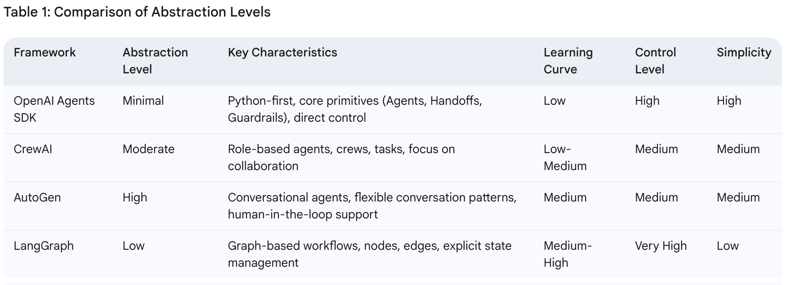

# Which Agentic Framework To Use To Get Started

**[OpenAI Agents SDK vs LangGraph vs Autogen vs CrewAI](https://composio.dev/blog/openai-agents-sdk-vs-langgraph-vs-autogen-vs-crewai/)**

The following chart clearly identifies why we are using OpenAI Agents SDK as our main framework for Agentic development:

[Abstraction and Power in AI Agent Frameworks: A Comparative Analysis of OpenAI Agents SDK, CrewAI, AutoGen, and LangGraph](https://g.co/gemini/share/e73d75492cf4)

Also listen to this discussion: 

[Listen: AI Agent Frameworks: OpenAI, CrewAI, AutoGen & LangGraph - Decoding the Power](https://g.co/gemini/share/5e4123e6bfeb)