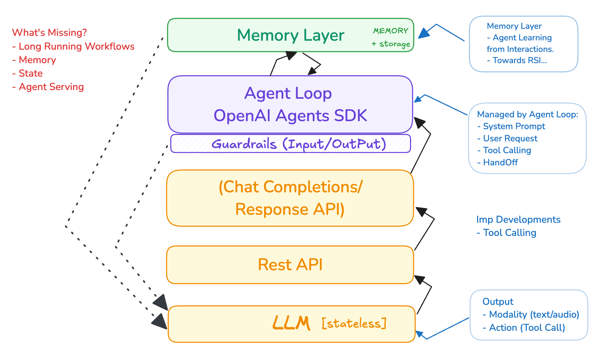
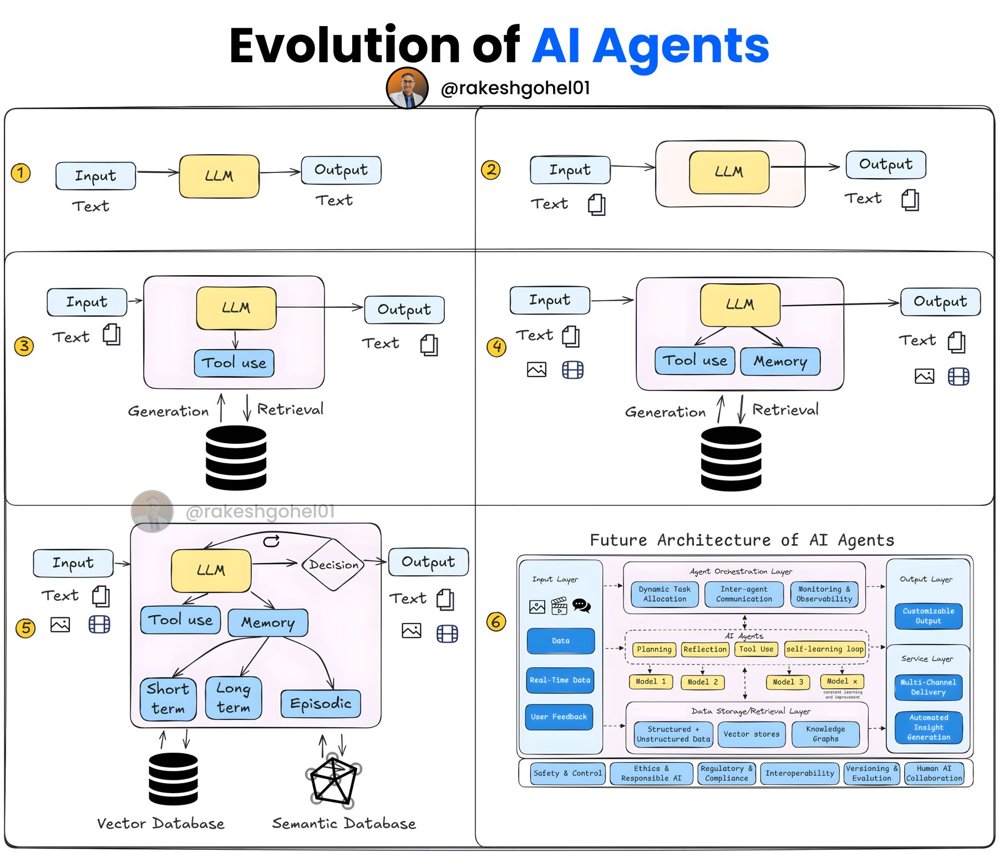

# From LLMs to Stateful Long Running Multi-Agent Systems

## From LLMs to Multi-Agent Systems

2025 is being considered the year of Agentic AI. It is during this year enterprises will start developing and deploying AI Agents for automating their workflows. It can thought of as the Evalution or next iteration of SaaS (Software As A Service). AI agents could indeed be seen as an evolution of SaaS, where instead of merely providing software tools for humans to use, the software itself (via agents) takes on tasks autonomously. However, this framing might oversimplify the complexity of agentic AI, which goes much beyond SaaS by incorporating reasoning, adaptability, and autonomy. Now the question is what features and capabilities these AI Agents will have?

### Definition of AI Agents:

> "AI agents are large language models (LLMs) that operate in an iterative loop, utilizing tools and environmental feedback (such as tool call results) to autonomously plan and execute actions toward a goal, often incorporating human checkpoints to ensure alignment and oversight."

Reference:

https://www.linkedin.com/posts/rakeshgohel01_how-did-the-agentic-ai-era-evolve-in-the-activity-7310276654218493953-8G4v

### Breakdown of the Definition

* **LLMs:** The core intelligence driving the agent is a large language model.
* **Iterative Loop:** Agents function through a continuous cycle of planning, acting, and observing (e.g., a "think-act-observe" process).
* **Tools:** They leverage external functions or APIs to interact with the world (e.g., search, fetch data, send messages).
* **Environmental Feedback:** Results from tools or external inputs guide the agent’s next steps.
* **Autonomous Planning and Execution:** Agents dynamically decide their actions without a fixed script, adapting to achieve objectives.
* **Human Checkpoints (Often):** Human intervention is frequently included for validation or critical decisions, balancing autonomy with control.

This definition emphasises that AI Agents are an LLM in a dynamic loop, leveraging tools and feedback to act autonomously, with humans stepping in as needed. It’s less about a fixed sequence (like workflows) and more about adaptive, goal-driven behaviour.

## The LLM APIs

LLM APIs have been a game-changer by providing easy, scalable access to advanced language capabilities, making agent development faster, cheaper, and more accessible. LLM APIs (e.g., OpenAI’s API, Anthropic’s API, Google’s Gemini API) give developers programmatic access to powerful language models.

These APIs allow agents to:

* Reason and generate text (e.g., answering questions, planning).
* Invoke tools (e.g., via function calling in OpenAI or Anthropic’s Claude).
* Process natural language inputs and produce structured outputs.

**Why It Matters:** Before LLM APIs, building an agent with natural language understanding and generation required training custom models—a resource-intensive task limited to well-funded organizations. APIs democratized access, letting developers integrate state-of-the-art LLMs into agents without needing to build the models themselves.

**Example:** An agent uses the OpenAI API to interpret "Book a flight" and call a `book_flight` tool, all via a simple HTTP request.

Initially different LLMs had different APIs, however recently it seems the industry has standardise on **OpenAI Chat Complition API**, also all major LLM providers have started supporting it. The industry has largely standardized on the OpenAI Chat Completion API as of 2025. Most major LLM providers either natively support it or offer compatibility layers, driven by developer demand, ecosystem effects, and the API’s practical design. While there were diverse APIs initially, the shift toward this standard has been rapid and widespread, making it the go-to interface for building AI agents across providers.

Recently, OpenAI has introduced the **Responses API**, which is a more advanced and flexible evolution of the Chat Completion API, and it is poised to play a significant role in the development of agentic AI systems.

### Responses API as a Superset of Chat Completion API

**Introduction:** OpenAI unveiled the Responses API in March, 2025, as a new developer tool designed to enhance AI agent capabilities. It builds on the foundation of the Chat Completion API, incorporating its core functionality while adding more advanced features.

**Superset Features:**

* It combines the simplicity of the Chat Completion API (e.g., handling conversational inputs and outputs) with additional capabilities previously found in the Assistants API, such as built-in tool support and state management.
* Key additions include native support for tools like web search, file search, and computer use (via the Computer-Using Agent, or CUA), which allow agents to interact with external systems directly within a single API call.
* Unlike the Chat Completion API, which primarily generates text responses, the Responses API enables multi-tool interactions and more complex workflows, making it a "superset" in terms of functionality.

### Role of Responsive API in Agentic AI Systems

**Agentic AI Definition:** Agentic AI refers to systems that act autonomously, reason through tasks, and interact with the world to achieve goals—moving beyond passive response generation to proactive execution.

**Why It Matters:** The Responses API is tailored for building such systems by:

* **Enabling Tool Use:** Agents can fetch real-time data (e.g., web search), process internal documents (e.g., file search), or automate tasks (e.g., via CUA), all critical for autonomous behavior.
* **Streamlining Development:** It simplifies the orchestration of agentic workflows, reducing the need for custom integrations that were previously required with the Chat Completion API.
* **Future-Proofing:** OpenAI plans to phase out the Assistants API by mid-2026, merging its features into the Responses API, signaling that this is their forward-looking foundation for agentic applications.

**Developer Tools:** Alongside the API, OpenAI released the open-source Agents SDK, which complements the Responses API by providing orchestration for multi-agent systems, further supporting agentic AI development.

**Performance:** The API leverages models like GPT-4o search (90% accuracy on SimpleQA) and supports dynamic interactions, making it ideal for agents that need to reason and act.

The Responses API, as a superset of the Chat Completion API, introduces advanced capabilities that are expected to drive the next wave of agentic AI systems. It’s a significant leap toward enabling AI that doesn’t just talk but does, aligning with the industry’s push for more functional, real-world applications.

The **Responses API, is poised to become a de facto standard for agentic AI systems**, much like the Chat Completion API did for conversational AI. While it’s too early to say definitively, the trajectory suggests that most major LLM providers will likely implement or support compatible versions of it for agentic AI.

While it’s not guaranteed (nothing is in tech until it happens), the Responses API has the ingredients—OpenAI’s track record, developer demand for agentic capabilities, and ecosystem momentum—to become the de facto standard for agentic AI, much like Chat Completion did for conversational AI. Expect most LLM providers to adopt or adapt to it over the next 12-18 months, especially as agentic systems take center stage in 2025 and beyond.

What makes AI Agents possible are not only the LLMs API but also its tool calling or function calling capabilities. This is the base functionality on which everything is built. Simply put LLMs are give a list of functions and details of their function signatures which they may call if they require additional information in thinking about the prompt and responding to it. It is obvious that the LLMs are on another server therefore they can't call these functions directly, however what they can do is send a response in which they instruct the client app to call the function on their behalf with the function parameters provided by the LLM. The client app calls the function with the specified parameters and once they receive the return value from the function it is passed back to the LLM, them the LLM constructs it final reply to the client app by incorporating the result of tool call. If there are multiple tools model can return multiple tool calls in a single response. This process is called the Agent loop.

The second functionality of LLMs which makes multiple agents possible is that you can specify a **system prompt** and a **user prompt** separately:

* **System Prompt:** Sets the LLM’s behavior, tone, or rules (e.g., "Be a cheerful chef"). Controlled by the developer, applies globally.
* **User Prompt:** The user’s specific request or question (e.g., "What’s for dinner?"). Drives the immediate response.

**In short:** System shapes how the LLM responds; user defines what it responds to.

**LLMs are stateless** therefore note that both the system prompt and user prompts will have to be sent to the LLM in every request. The user prompt will have to include the context including the previous list of request and responses for the LLMs to respond properly. This is called the short term memory of the agent/llm, short-term memory is typically embedded in the prompt as context. Also note that there is the limit to the size of the context/user prompt.

### Short-Term Memory

**What It Is:** Temporary context that the agent uses within a single conversation or session. It’s usually the recent history of interactions (e.g., the current chat).

**How It’s Included:** Often passed as part of the prompt (e.g., in the user or assistant messages), included in the context window of the LLM. This gives the model immediate access to what was just said or done.

**Example:** In a chat, the last few messages ("What’s the weather?" → "It’s sunny.") are included in the prompt to maintain coherence.

**Correct Part:** Yes, .

### Long-Term Memory

**What It Is:** Persistent information stored beyond the current session, like facts, user preferences, or past interactions, which the agent can recall when needed.

**How It’s Made Available:** Stored in an external database (e.g., vector store, key-value store) and retrieved via a retrieval mechanism (e.g., embeddings search). Optionally accessed via a tool if the agent explicitly calls a function to fetch it (e.g., `retrieve_user_history()`). Sometimes pre-loaded into the prompt if relevant, but this is less common due to context length limits.

**Example:** "User X likes spicy food" from a past chat, stored in a database, retrieved when planning a recipe.

**Note:** Long-term memory isn’t always a tool call—it’s more commonly a retrieval system integrated into the agent’s workflow, though a tool call could be one way to access it.

### Key Difference

* **Short-Term Memory:** Immediate, in-prompt context (e.g., recent messages), limited by the LLM’s context window.
* **Long-Term Memory:** Persistent, external storage (e.g., database), accessed as needed, not constrained by the session.

### Long-Term Memory in Agentic RAG

**What is Agentic RAG?:** It’s an evolution of RAG where an agent doesn’t just retrieve and generate passively but actively reasons, plans, and uses tools to fetch or process information. Long-term memory here refers to persistent knowledge (e.g., documents, past interactions) stored outside the immediate conversation.

**How Long-Term Memory Works:**

* Typically, it’s stored in a vector database or similar external storage (e.g., embeddings of documents or user history).
* The agent retrieves this memory to augment its responses, often as part of its reasoning process.

**Is It Always a Tool Call?:**

Not necessarily. In agentic RAG, long-term memory retrieval can be:

* **Implicit:** Built into the agent’s pipeline, where retrieval happens automatically (e.g., a retriever runs before the LLM processes the prompt) without the LLM explicitly calling a tool.
* **Explicit (Tool Call):** The LLM decides to invoke a tool (e.g., `search_memory` or `retrieve_context`) to fetch long-term memory, treating retrieval as an action in its reasoning loop.

In modern agentic RAG systems, it’s common for retrieval to be a tool call when the agent has control over when and what to retrieve, aligning with the agent’s ability to dynamically choose actions.

However, some implementations pre-fetch relevant long-term memory and inject it into the prompt without requiring the LLM to call a tool, especially in simpler RAG setups.

With more agentic designs, long-term memory retrieval has increasingly been treated as a tool or an explicit action the agent can take. This gives the LLM more control, allowing it to decide if and when to access memory, rather than always pre-loading it.

**Example:** An agent might call `retrieve_past_interactions` as a tool to fetch long-term memory only when relevant, instead of having it always injected.

To sum up, in modern agentic RAG, long-term memory is often implemented as a tool call to give the agent flexibility (e.g., "Should I check past data?"). But it’s not always a tool call—some systems still retrieve memory implicitly and inject it into the context. Previously in LangChain, retrieval was more commonly a built-in step rather than an explicit tool call, though the shift toward agentic designs has made tool calls more prevalent.

**[Model Context Protocol (MCP)](https://modelcontextprotocol.io/introduction)** standardizes tool calling. 

## Multi-Agent Systems

As we have pointed out System prompts are a key building block for defining individual agent roles in multi-agent AI systems, but the foundation also includes the framework, coordination, and tools that enable the system to operate as a whole.

### Role of System Prompts in Multi-Agent AI Systems

**What They Do:** In a multi-agent system, a system prompt typically defines the role, behavior, or rules for an individual agent. For example, "You are a researcher agent tasked with finding data" or "You are a coordinator agent that delegates tasks."

**Scope:** Each agent in the system might have its own system prompt, tailoring its personality, tone, or objectives to its specific function.

**Influence:** System prompts guide how each agent interprets user inputs and interacts with other agents, ensuring consistency within its designated role.

System prompts are a key building block for defining individual agent roles in multi-agent AI systems, but the foundation also includes the framework, coordination, and tools that enable the system to operate as a whole.

Another building block of multi-agent AI systems is **message passing between AI agents**. A single agent is basically an encapsulated interaction between the client and the LLM. The agent-to-agent communication is also done using tool calling, which is being called the **handoff**. Please note that tool calling as a "handoff" is common in agentic designs, but there are also other non-tool methods that can still "directly message" each other outside that paradigm. This could mean any of the these: memory, queues, events, etc.—where the system facilitates communication without the LLM explicitly invoking a tool.

Tool calling functionality not only provides a mechanism for AI agents to connect to the outside world and ask for information, but also take action using these tool calls. It captures the dual role of tool calling as both an input mechanism (fetching data) and an output mechanism (performing actions).

### Model Context Protocol (MCP): The Agentic AI Standard

Tool calling is a powerful feature that makes AI agents more than just chatbots, turning them into proactive, world-interacting entities! To do tool calling in a standardise way Model Context Protocol (MCP) has been introduced and being gaining adoption in the industry. MCP’s goal is to make tool calling more scalable and interoperable. Instead of developers building bespoke connectors for each tool or data source, MCP provides a single protocol that any compliant AI system can use, reducing complexity and maintenance overhead. It aims to replace fragmented, custom integrations with a universal interface, much like a "USB-C for AI," as some have described it. This allows agents to interact with systems like Google Drive, Slack, GitHub, or custom databases in a consistent way.

MCP uses a client-server architecture where:

* **MCP Servers** expose tools or data (e.g., a `get_weather` tool or a file system).
* **MCP Clients** (AI applications or Agents) connect to these servers, discover available tools, and invoke them via standardized calls (built on JSON-RPC). The LLM can then decide when and how to use these tools based on the task.

MCP allows an agent to call `list_tools` on an MCP server, receiving a list of available tools (e.g., `get_file`, `send_email`) along with their schemas (parameters, descriptions). This lets the agent decide at runtime which tools to use, without needing hardcoded knowledge of the tools beforehand. This dynamic discovery is a critical distinction between MCP and normal APIs. It’s what makes MCP "AI-native"—designed for LLMs to explore and utilize tools without predefined assumptions.

Another LLM Functionality that has enhanced Agentic workflows a lot is LLMs capability to output the **structured output**, thus allowing Agents to parse the output and take appropriate action.

LLMs increasingly rely on website information, but face a critical limitation: context windows are too small to handle most websites in their entirety. Converting complex HTML pages with navigation, ads, and JavaScript into LLM-friendly plain text is both difficult and imprecise. While websites serve both human readers and LLMs, the latter benefit from more concise, expert-level information gathered in a single, accessible location. We need a standard for this and **`/llms.txt`** is the upcoming standard, it is the frontrunner for standardizing LLM-friendly website content. The industry’s shift toward agentic AI and real-time data access only strengthens its relevance.

Alternatives like Anthropic’s Model Context Protocol (MCP) focus on tool calling, not content summarization, so they complement rather than compete with `/llms.txt`. Some argue for richer formats (e.g., JSON), but Markdown’s simplicity gives `/llms.txt` an edge for now.

## Design Patterns for Multi-Agent Systems

Anthropic, in its paper titled "Building Effective Agents", documents common design patterns for agentic AI systems. This paper is based on experience gained by working with dozens of teams across industries to build large language model (LLM)-based agents. Here’s a quick rundown to confirm:

### What Anthropic Documents

**Agentic Systems Definition:** Anthropic distinguishes between "workflows" (predefined, orchestrated systems) and "agents" (dynamically directed systems where LLMs control their processes and tool usage). This sets the stage for understanding design patterns.

**Common Design Patterns:** The paper outlines five key workflow patterns that are widely applicable to agentic AI:

* **Prompt Chaining:** Sequential LLM calls where each processes the output of the previous one (e.g., drafting then translating text).
* **Routing:** An LLM classifies an input and directs it to a specialized task or model (e.g., sending simple queries to a lightweight model).
* **Parallelization:** Multiple LLM calls run simultaneously, either for voting (diverse outputs) or sectioning (subtasks) (e.g., reviewing code in parallel).
* **Orchestrator-Workers:** A central LLM delegates tasks to worker LLMs and synthesizes results (e.g., coordinating research across sources).
* **Evaluator-Optimizer:** One LLM generates output, another evaluates it, iterating until satisfactory (e.g., refining code through feedback loops).

**Agent-Specific Patterns:** Beyond workflows, agents are described as LLMs operating in a loop with tools, using environmental feedback (e.g., tool call results) to plan and act autonomously, often with human checkpoints.

These design patterns can be orchestrated locally using Python for short-term multi-agent workflows, or in the cloud when long-running, stateful workflows are required for scalability and reliability. They are flexible enough to be implemented locally in Python for short-term, transient multi-agent workflows, or in the cloud for long-running, stateful ones needing robustness and scale. This matches the operational needs of each scenario perfectly!

These patterns are modular and implementation-agnostic, meaning they can be applied in various environments:

#### Short-Term Multi-Agent Workflows:

**Orchestrated Locally Using Python:** Correct. Short-term workflows—ephemeral tasks that don’t need persistence beyond a single session—can be orchestrated locally with Python (or another language). For example:

**Example:** A Python script using OpenAI Agents SDk or custom code to run a prompt chaining workflow (e.g., draft → edit → summarize) or an agent loop (e.g., research → write) in memory.

**Feasibility:** Local execution works because these tasks are lightweight, don’t require scalability, and can rely on in-memory state or local files.

**Tools:** Libraries like OpenAI’s Python SDK, can implement these patterns locally with minimal setup.

#### Long-Running Stateful Workflows:

**Orchestrated in the Cloud:** Long-running, stateful workflows—those requiring persistence across sessions, scalability, or reliability—typically need cloud infrastructure. For example:

**Example:** An agent tracking a multi-week project (e.g., orchestrator-workers pattern) needs to save state (e.g., task progress) in a cloud database, scale across users with serverless functions or containers, and ensure uptime with cloud redundancy.

**Why Cloud:** Cloud platforms (e.g., Cloud Native Kubernetes) offer persistent storage (e.g., CockroachDB and Postgres), distributed computing (e.g., Serverless Containers), and fault tolerance—essential for stateful, long-term operations.

**Tools:** Cloud-hosted solutions like Kubernetes, Serverless Containers, Kafka, etc. can manage these workflows.

## From Local Multi-Agent Systems To Statefull Long Running Multi-Agent Systems

Short-term multi-agent workflows can be managed with Python or other languages in a local environment, while long-term, stateful agentic workflows lean heavily on cloud infrastructure for robustness and scale. The distinction hinges on persistence, concurrency, and operational demands—cloud becomes essential as those needs grow.

### Short-Term Multi-Agent Workflows

**Orchestration with Python or Other Languages:**

Short-term multi-agent workflows—those that run briefly and don’t need to persist state beyond a single session—can indeed be orchestrated using Python. These workflows typically involve agents interacting in memory or via local resources, like a script coordinating a few agents to solve a task (e.g., planning a trip).

**How It Works:** Python libraries or even custom code can manage agent communication (e.g., via function calls, shared variables, or local message passing) without external dependencies. For example, a script might spin up a planner agent, a researcher agent, and a writer agent, all running in a single process.

**Limitations:** This approach works well for ephemeral, small-scale tasks but struggles with concurrency, persistence, or distributed execution.

### Long-Term Stateful Agentic Workflows

**Requirement of Cloud Infrastructure:**

Long-term, stateful agentic workflows—those that need to maintain state across sessions, handle complex interactions over time, or scale to many users/tasks—typically require cloud infrastructure for scalability and reliability.

**Why Cloud:**

* **State Persistence:** Cloud databases (e.g., PostgreSQL) or memory stores (e.g., Redis) can save agent states, conversation histories, or task progress, which isn’t practical in a local Python script over days or weeks.
* **Scalability:** Cloud platforms (e.g., Kubernetes) provide distributed computing resources to handle multiple agents, concurrent users, or heavy workloads—beyond what a single machine can manage.
* **Reliability:** Cloud services offer fault tolerance (e.g., auto-scaling, load balancing, cron jobs) and uptime guarantees, ensuring agents remain operational for long-running tasks (e.g., a customer support agent running 24/7).

## Subject: Analysis of Agentic AI Framework Design: Layered vs. Unified Approaches

### Introduction:

I am analyzing the current landscape of agentic AI frameworks. I propose that agentic systems can be categorized along two key dimensions:

#### Execution Style:

**Workflows**: Systems orchestrating LLMs and tools through predefined, often coded, paths.

**Agents**: Systems where LLMs dynamically plan, direct their own execution paths, and select tool usage to accomplish tasks.

#### Operational Timescale:

**Short-Term**: Tasks typically completed within a single session or short duration. State management and persistence are often less critical.

**Long-Term**: Tasks spanning extended periods (hours, days, months), requiring robust state management, persistence, error handling, and potentially asynchronous execution.

### Framework Examples & Analysis:

**OpenAI Agents SDK**: Appears to primarily target the Agent / Short-Term quadrant. Its design emphasizes ease of use for developers creating agentic behaviors within a single session, abstracting away complexities like state persistence (handling it implicitly for the session duration). This results in a lightweight and accessible framework for specific use cases.

### Layered Architecture

I hypothesize that a more optimal design paradigm for agentic frameworks would be a layered architecture:

**Layer 1 (Core Agentic Execution)**: A lightweight foundation focused purely on the core agentic loop (LLM planning, tool use) for Short-Term tasks. This layer would prioritize simplicity and ease of use, similar to the initial focus of the OpenAI Agents SDK.

**Layer 2 (Durability & Orchestration)**: Built on top of Layer 1, this layer would introduce capabilities essential for Long-Term operation. This includes robust state management, persistence, error handling, retries, monitoring, and potentially asynchronous task orchestration. Technologies like FastAPI, Docker Containers, Serverless Containers, Kafka, Kubernetes and Kubernetes CronJobs provide tools for the type of concerns this layer would address (durable execution).

---

### Our Guiding Principles for Crafting Agentic AI

When designing agentic AI, we focus on simplicity, empowerment, and versatility to create systems that are both powerful and approachable. Our philosophy centers on equipping users and developers with the tools to explore the universe freely, with minimal obstacles and maximum autonomy. Here’s how we bring this vision to life:

1. **Streamline with Minimal Abstractions**  
   - We grant direct access to the core strengths of our agents—their reasoning, tools, and outputs—without burying them under convoluted layers. By peeling back unnecessary complexity, we offer a clear and open interface for users and developers to engage with the AI’s full potential.  
   - **Why It Matters**: Transparency and customizability empower users to tailor the AI to their needs, whether they’re unraveling cosmic mysteries or diving into detailed analysis, free from restrictive frameworks.

2. **Provide Essential Building Blocks, Not Rigid Blueprints**  
   - We deliver only the foundational elements required to unlock the agent’s capabilities, avoiding prescriptive templates or overbearing workflows. Our systems serve as a flexible launchpad, not a fixed path, inviting users to design solutions that fit their vision.  
   - **Why It Matters**: Minimal structure cuts down on clutter, giving users the freedom to craft anything from a quick query to a complex multi-agent system, perfectly aligned with their goals.

3. **Champion Adaptability and Transparency**  
   - Our agents are built as agile, intuitive tools rather than rigid, all-in-one packages. We eliminate excess baggage to keep the system lean, making it simple to understand, troubleshoot, and enhance.  
   - **Why It Matters**: A lightweight, adaptable core fuels rapid experimentation and innovation, enabling users to push limits—whether integrating with tools like web searches or tackling scientific breakthroughs.

4. **Unlock Power Through Simplicity**  
   - We place trust in our users—whether developers or inquisitive explorers—by handing them the unfiltered capabilities of our agents. Think of it as a cosmic Swiss Army knife: straightforward, potent, and ready to be wielded creatively.  
   - **Why It Matters**: Simplicity magnifies impact. Users can iterate swiftly, adapt to diverse scenarios, and focus on their pursuits without battling an overly intricate system.

At its heart, our approach embodies a “less is more” ethos—delivering the raw strength of AI while sidestepping unnecessary constraints or coddling. It’s about offering a versatile, no-nonsense toolkit that users can master and mold to their will.

---

