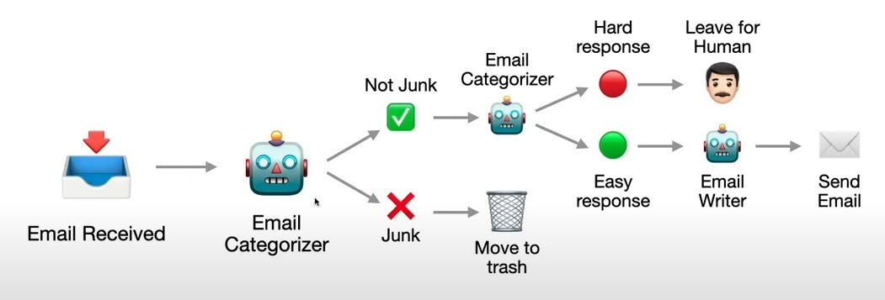

# Email Management Agent Architecture

Let’s design an **Email Agent**, using the architecture combining **event-driven architecture (EDA)**, **three-tier microservices architecture**, **stateless computing**, **scheduled computing (CronJobs)**, and **human-in-the-loop (HITL)**. I’ll first outline the requirements and then detail the implementation.

---

### Requirements for the Email Agent

#### Functional Requirements
1. **Email Monitoring and Filtering**:
   - Continuously check for new incoming emails from the user’s inbox.
   - Filter emails based on predefined rules (e.g., priority, sender, keywords) or AI-driven categorization (e.g., spam, urgent, casual).
   - Notify the user of filtered emails with suggested responses.

2. **Suggested Responses**:
   - Analyze email content and generate contextually appropriate response suggestions (e.g., using NLP or predefined templates).
   - Present suggestions to the user for approval via a notification or interface.

3. **Response Approval and Sending**:
   - Allow the user to approve, edit, or reject suggested responses.
   - Send the approved response as an email on behalf of the user.

4. **New Email Creation**:
   - Enable the user to compose a new email through the agent.
   - Check the email for accuracy (e.g., grammar, tone, clarity) and suggest corrections if needed.
   - Present the corrected version to the user for approval before sending.

#### Non-Functional Requirements
1. **Scalability**: Handle multiple users or high email volumes efficiently.
2. **Real-Time**: Process incoming emails and notify users promptly.
3. **Reliability**: Ensure no emails are missed and responses are sent accurately.
4. **Usability**: Provide an intuitive interface for approvals and email composition.
5. **Learning**: Improve suggestions over time based on user feedback.

#### User Stories
- As a user, I want to be notified of new emails with suggested replies so I can respond quickly.
- As a user, I want to approve or edit suggested replies before they’re sent to ensure accuracy.
- As a user, I want to compose new emails and have them checked for errors, with approval before sending.

---

### Implementation Using the Defined Architecture

#### Architecture Overview
- **Three-Tier**: Presentation (UI for user interaction), Business Logic (agent processing), Data (email storage and state).
- **EDA**: Events drive email checks, filtering, notifications, and approvals.
- **Stateless Computing**: Scalable email processing and HITL tasks.
- **CronJobs**: Periodic email polling (if real-time APIs aren’t available).
- **HITL**: User approves responses and corrections.

---

#### Components and Workflow

##### 1. Three-Tier Architecture
- **Presentation Layer**:
  - A web or mobile app where users:
    - View filtered emails and suggested responses.
    - Approve/edit/reject responses.
    - Compose new emails and review corrections.
  - Notifications (e.g., push alerts, email summaries) for incoming emails.
- **Business Logic Layer**:
  - **Email Monitoring Agent**: Checks for new emails, filters them, and generates suggestions.
  - **Response Generator**: Uses NLP (e.g., a model like GPT) to suggest replies.
  - **Email Composer Agent**: Analyzes new emails for accuracy and suggests corrections.
  - **HITL Coordinator**: Manages human approval workflows.
- **Data Layer**:
  - Stores:
    - Email metadata (e.g., sender, subject, timestamp).
    - Filtered categories and suggested responses.
    - User feedback and approved emails.
    - State of pending HITL tasks (e.g., awaiting approval).
  - Tools: Database (e.g., PostgreSQL), cache (e.g., Redis) for fast access.

##### 2. Event-Driven Architecture
- **Event Types**:
  - `NewEmailReceived`: Triggered when a new email arrives.
  - `EmailFiltered`: Email categorized with suggested response.
  - `HumanReviewRequired`: Sent when user approval is needed (for responses or corrections).
  - `HumanResponseReceived`: User approves/edits/rejects a suggestion.
  - `EmailSent`: Response or new email is sent.
- **Event Bus**: Use a message broker (e.g., RabbitMQ, Kafka) to route events between components.
- **Workflow**:
  1. `NewEmailReceived` → Email Monitoring Agent filters it → `EmailFiltered`.
  2. `EmailFiltered` → Response Generator suggests a reply → `HumanReviewRequired`.
  3. `HumanResponseReceived` → Email sent → `EmailSent`.

##### 3. Stateless Computing
- **Email Processor**: A stateless service (e.g., AWS Lambda) that:
  - Polls or reacts to `NewEmailReceived`, filters emails, and emits `EmailFiltered`.
  - Scales with email volume.
- **Response Generator**: Stateless function generating suggestions based on email content.
- **HITL Handler**: Stateless service presenting tasks to users and processing their responses.
- **Email Sender**: Stateless function sending approved emails via an SMTP API (e.g., SendGrid).

##### 4. Scheduled Computing (CronJobs)
- **Email Poller**: If real-time email APIs (e.g., IMAP with push) aren’t available, a CronJob runs every minute to check the inbox and emit `NewEmailReceived`.
- **Feedback Aggregator**: A daily CronJob collects user feedback (approved/rejected suggestions) to retrain the suggestion model.

##### 5. Human-in-the-Loop (HITL)
- **Incoming Email Response**:
  - After `EmailFiltered`, the Response Generator creates a suggestion.
  - HITL Handler emits `HumanReviewRequired`, pushing the email and suggestion to the UI.
  - User approves/edits via the UI → HITL Handler emits `HumanResponseReceived`.
- **New Email Composition**:
  - User composes an email in the UI → Email Composer Agent checks it → Suggests corrections → `HumanReviewRequired`.
  - User approves → `HumanResponseReceived` → Email sent.

---

#### Detailed Implementation

##### Step 1: Email Monitoring and Filtering
- **Tech**: Use an email API (e.g., Gmail API) or IMAP with a stateless poller.
- **Flow**:
  - CronJob or real-time listener detects new emails → `NewEmailReceived {emailId, content}`.
  - Email Processor (stateless) filters based on rules/ML (e.g., priority: urgent if from boss) → Stores in data layer → `EmailFiltered {emailId, category, suggestion}`.

##### Step 2: Suggested Responses
- **Tech**: NLP model (e.g., fine-tuned GPT) in a stateless function.
- **Flow**:
  - Consumes `EmailFiltered` → Analyzes content → Generates suggestion → Updates data layer → `HumanReviewRequired {emailId, suggestion}`.

##### Step 3: HITL for Response Approval
- **Tech**: Web app (Next.js/FastAPI) + HITL Handler (Lambda).
- **Flow**:
  - HITL Handler pushes `HumanReviewRequired` to UI/notification (e.g., "Reply to boss: 'Yes, I’ll handle it' - Approve/Reject").
  - User responds → HITL Handler emits `HumanResponseReceived {emailId, approvedText}`.
  - Email Sender (stateless) sends the email → `EmailSent`.

##### Step 4: New Email Creation and Correction
- **Tech**: UI form + Email Composer Agent (stateless).
- **Flow**:
  - User submits email in UI → Composer checks grammar/tone (e.g., Grammarly API, custom ML) → Suggests edits → `HumanReviewRequired {draftId, correctedText}`.
  - User approves → `HumanResponseReceived` → Email Sender sends it.

##### Step 5: Data Management
- **Schema**:
  - `Emails`: {id, sender, content, category, suggestion, status}
  - `HITL_Tasks`: {taskId, emailId/draftId, suggestion, status: pending/approved}
- **Storage**: PostgreSQL for persistence, Redis for pending HITL tasks.

##### Step 6: Learning Loop
- CronJob aggregates `HumanResponseReceived` data → Retrains NLP model weekly → Updates suggestion accuracy.

---

#### Example Workflow
1. **Incoming Email**:
   - Email: "Meeting at 3 PM?" from boss.
   - `NewEmailReceived` → Filtered as "urgent" → Suggestion: "Yes, I’ll be there."
   - `HumanReviewRequired` → User approves via UI → `HumanResponseReceived` → Email sent.
2. **New Email**:
   - User writes: "I cant make it."
   - Composer corrects: "I can’t make it." → `HumanReviewRequired` → User approves → Sent.

---

### Benefits
- **Real-Time**: EDA ensures quick email processing and notifications.
- **Scalable**: Stateless services handle multiple users/emails.
- **User Control**: HITL keeps humans in charge of final actions.
- **Structured**: Three-tier separates UI, logic, and data cleanly.

### Challenges
- **API Limits**: Email polling might hit rate limits—use webhooks if possible.
- **Suggestion Quality**: Requires a robust NLP model and user feedback loop.

This Email Agent leverages the architecture effectively, balancing automation with human oversight. 
