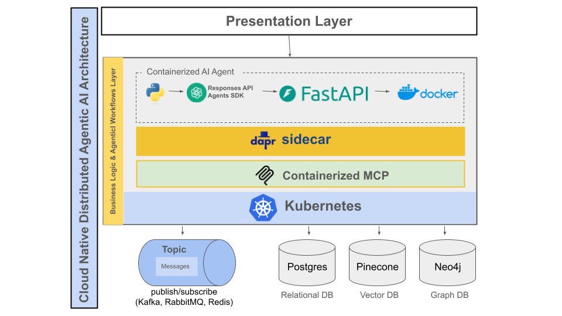

# From LLMs to Stateful Long Running Multi-Agent Systems

This document has been split into three separate set of articles, each tackling a unique question:

1. What are AI agents, and what features and functionalities can we anticipate they’ll have? What should be the Guiding Principles for Crafting Agentic AI?
2. What Architecture to use to for Multi-Agent Systems (AgentiaCloud)?
3. What technological components and infrastructure are needed to build and implement these Multi-Agent Systems (AgentiaCloud)? We will discuss in detail our AgentiaCloud technology stack.

Note: These questions are answered in topics 01, 02, and 03 in this directory.

## Agentic AI Development and Use Cases

In 2025, Agentic AI emerges as a global focal point. Leading tech giants such as OpenAI, Microsoft, Google, AWS, Oracle, DeepSeek, Anthropic, Alibaba, Baidu, Huawei, ByteDance, and others are driving this trend.

Insha Allah, we aim to revolutionize Pakistan and the world through Agentic AI, with an emphasis on creating specialized Vertical Agentic solutions.

We have developed detailed documentation outlining Multi-Agent Systems, including their architecture, which will enable us to build AI Agents on a global scale. Most notably, it highlights the key vertical sectors that our thousands of students will initially target:

Here’s a comprehensive list of all the agents we’ve explored, spanning various domains and showcasing the application of **event-driven architecture (EDA)**, **three-tier architecture**, **stateless computing**, **scheduled computing (CronJobs)**, **human-in-the-loop (HITL)**, and, in some cases, **LLM intelligence**. 

## Dapr Agentic Cloud Ascent (DACA) Design Pattern

Let's understand and learn about ""Dapr Agentic Cloud Ascent" (DACA)", our winning design pattern for developing and deploying planet scale multi-agent systems:

https://grok.com/share/bGVnYWN5_c41dc0f7-8fcb-4d31-bbc0-1414d0a4e294

## Agent Domains

Each agent addresses a unique use case within its domain:

1. **Email Agent** (Email Management Domain)
   - **Purpose**: Monitors incoming emails, filters them, suggests responses, and sends replies after user approval; also checks and corrects new emails composed by the user.
   - **Domain**: Personal Productivity/Communication.

2. **Supply Chain Optimization Agent** (Logistics Domain)
   - **Purpose**: Monitors inventory levels, optimizes delivery routes, and suggests actions; allows manual route adjustments with optimization.
   - **Domain**: Supply Chain/Logistics.

3. **Healthcare Patient Monitoring Agent** (Healthcare Domain)
   - **Purpose**: Monitors patient vitals, detects anomalies, suggests interventions, and notifies healthcare professionals; supports manual follow-up requests.
   - **Domain**: Healthcare/Telemedicine.

4. **Financial Trading Agent** (Finance Domain)
   - **Purpose**: Monitors market data, suggests trades based on strategies, notifies traders for approval; optimizes manual trade requests.
   - **Domain**: Financial Services/Trading.

5. **Personalized Learning Agent** (Education Domain)
   - **Purpose**: Monitors student progress, suggests personalized learning activities, notifies teachers/students; optimizes manual assignment requests.
   - **Domain**: Education/Teaching.

6. **Blood Bank ERP Agent** (Blood Bank Management Domain)
   - **Purpose**: Tracks blood units with barcodes, manages donor relationships, notifies donors of eligibility; supports manual staff requests. Adds inventory optimization, demand forecasting, donor scheduling, quality control, and reporting; includes LLM intelligence for donor engagement and insights.
   - **Domain**: Healthcare/Blood Bank Management..
   

7. **Shopping Cart and Inventory Management Agent** (E-commerce Domain)
   - **Purpose**: Manages shopping carts, tracks inventory, suggests restocking or pricing actions; supports manual inventory requests with dynamic pricing, fulfillment optimization, and recommendations.
   - **Domain**: E-commerce/Retail.

8. **Social Media Account Management Agent** (Social Media Domain)
   - **Purpose**: Monitors account activity, suggests posts/responses, notifies users; supports manual content schedules with engagement optimization and analytics.
   - **Domain**: Digital Marketing/Social Media.

9. **Customer Acquisition and Management Agent (LinkedIn)** (Sales Domain)
    - **Purpose**: Identifies prospects on LinkedIn, suggests outreach messages, notifies sales reps; manages relationships and supports manual sales requests with lead scoring and content sharing.
    - **Domain**: Customer Relationship Management (CRM)/Sales.

---

### Summary of Domains Covered
- **Communication**: Email Agent
- **Logistics**: Supply Chain Optimization Agent
- **Healthcare**: Healthcare Patient Monitoring Agent, Blood Bank ERP Agent
- **Finance**: Financial Trading Agent
- **Smart Home**: Smart Home Energy Management Agent
- **Education**: Personalized Learning Agent
- **E-commerce**: Shopping Cart and Inventory Management Agent
- **Social Media**: Social Media Account Management Agent
- **Sales/CRM**: Customer Acquisition and Management Agent (LinkedIn)

---

### Key Observations
- **Variety**: We’ve covered 10 distinct agents across 9 domains, with the Blood Bank ERP Agent having two versions to explore basic and enhanced features.
- **Automation**: Each agent leverages automation (e.g., scheduling, optimization, analytics) tailored to its domain.
- **LLM Integration**: Starting with the enhanced Blood Bank ERP Agent, we introduced LLM intelligence for content generation, insights, and user interaction, which became a recurring theme in later examples (e.g., Shopping Cart, Social Media, LinkedIn Sales).
- **HITL**: All agents incorporate human oversight for critical decisions, ensuring trust and control.

### Additional Potential Domains and Example Ideas (only covered in brief)

#### 1. Agriculture and Farming
- **Example**: **Smart Irrigation and Crop Monitoring Agent**
  - **Purpose**: Monitor soil moisture, weather data, and crop health; suggest irrigation schedules or pest control actions; notify farmers for approval.
  - **Automation**: Predict crop yield, automate water pump schedules, optimize fertilizer use.
  - **LLM Intelligence**: Generate farmer-friendly weather impact reports (e.g., "Rain expected, delay irrigation") or pest control advice.
  - **Unique Aspect**: Integration with IoT sensors (e.g., soil probes) and seasonal forecasting.

#### 2. Transportation and Logistics (Beyond Supply Chain)
- **Example**: **Public Transit Optimization Agent**
  - **Purpose**: Monitor bus/train schedules, passenger demand, and traffic; suggest route adjustments or additional vehicles; notify transit managers.
  - **Automation**: Dynamic rerouting, automated fare adjustments, predictive maintenance alerts for vehicles.
  - **LLM Intelligence**: Craft passenger announcements (e.g., "Delay due to congestion, next bus in 10 mins") or explain schedule changes to staff.
  - **Unique Aspect**: Real-time public interaction and crowd management.

#### 3. Environmental Monitoring
- **Example**: **Air Quality and Pollution Control Agent**
  - **Purpose**: Track air quality sensors, suggest mitigation actions (e.g., "Increase ventilation"), and notify authorities or citizens.
  - **Automation**: Predict pollution spikes, automate air purifier controls, generate compliance reports.
  - **LLM Intelligence**: Create public health advisories (e.g., "Avoid outdoor activity due to high PM2.5") or explain data trends to regulators.
  - **Unique Aspect**: Focus on public safety and regulatory compliance.

#### 4. Entertainment and Media
- **Example**: **Content Recommendation and Moderation Agent**
  - **Purpose**: Monitor user viewing habits, suggest personalized content, flag inappropriate uploads; notify moderators or users.
  - **Automation**: Auto-generate playlists, schedule content releases, predict viewer trends.
  - **LLM Intelligence**: Write engaging content descriptions (e.g., "Thrilling sci-fi adventure awaits!") or moderate comments with natural responses.
  - **Unique Aspect**: Balancing personalization with content safety.

#### 5. Human Resources (HR)
- **Example**: **Employee Onboarding and Engagement Agent**
  - **Purpose**: Monitor new hire progress, suggest training modules or check-ins, notify HR staff; allow manual requests for employee support.
  - **Automation**: Automate onboarding workflows, schedule performance reviews, predict turnover risk.
  - **LLM Intelligence**: Draft personalized welcome emails (e.g., "Welcome, Sarah! Here’s your first task") or explain training benefits to employees.
  - **Unique Aspect**: Focus on employee experience and retention.

#### 6. Real Estate
- **Example**: **Property Management and Tenant Support Agent**
  - **Purpose**: Monitor property conditions (e.g., maintenance needs), suggest repairs or rent adjustments, notify landlords/tenants.
  - **Automation**: Automate lease renewals, predict maintenance costs, optimize rental pricing.
  - **LLM Intelligence**: Generate tenant notifications (e.g., "Your AC repair is scheduled for tomorrow") or explain pricing changes to landlords.
  - **Unique Aspect**: Managing physical assets and tenant relationships.

#### 7. Gaming Industry
- **Example**: **In-Game Event and Player Support Agent**
  - **Purpose**: Monitor player activity, suggest in-game events or rewards, notify game admins; handle player support requests.
  - **Automation**: Balance game economy, schedule events, detect cheating patterns.
  - **LLM Intelligence**: Create dynamic quest descriptions (e.g., "Embark on a heroic journey!") or respond to player queries naturally.
  - **Unique Aspect**: Real-time game world interaction and player engagement.

#### 8. Legal and Compliance
- **Example**: **Contract Review and Compliance Agent**
  - **Purpose**: Monitor contract submissions, suggest revisions or compliance checks, notify legal staff; allow manual audit requests.
  - **Automation**: Auto-flag risky clauses, generate compliance reports, predict legal trends.
  - **LLM Intelligence**: Summarize contracts (e.g., "This clause limits liability to $10K") or draft revision suggestions.
  - **Unique Aspect**: Precision in legal language and regulatory adherence.

#### 9. Travel and Tourism
- **Example**: **Travel Itinerary and Booking Agent**
  - **Purpose**: Monitor flight/hotel availability, suggest itinerary adjustments, notify travelers; handle custom booking requests.
  - **Automation**: Optimize travel routes, automate booking confirmations, predict price drops.
  - **LLM Intelligence**: Craft personalized travel plans (e.g., "Enjoy a scenic day in Paris!") or explain delays to travelers.
  - **Unique Aspect**: Dynamic pricing and customer experience focus.

#### 10. Cybersecurity
- **Example**: **Threat Detection and Response Agent**
  - **Purpose**: Monitor network traffic, suggest security actions (e.g., block IP), notify IT staff; allow manual threat investigations.
  - **Automation**: Auto-isolate threats, predict attack patterns, generate incident reports.
  - **LLM Intelligence**: Explain threats to staff (e.g., "Phishing attempt detected from this email") or draft user alerts.
  - **Unique Aspect**: High-stakes real-time response and threat analysis.

#### 11. Fitness and Wellness
- **Example**: **Personal Fitness and Nutrition Agent**
  - **Purpose**: Monitor workout data (e.g., Fitbit), suggest exercise/nutrition plans, notify users/coaches; handle custom fitness goals.
  - **Automation**: Adjust plans based on progress, schedule workouts, predict fatigue.
  - **LLM Intelligence**: Create motivational messages (e.g., "Great job! Try this protein shake recipe") or explain workout benefits.
  - **Unique Aspect**: Personal health tracking and behavior encouragement.

#### 12. Government and Public Services
- **Example**: **Citizen Service and Permit Agent**
  - **Purpose**: Monitor permit applications, suggest approvals or follow-ups, notify staff/citizens; handle custom service requests.
  - **Automation**: Auto-process simple permits, predict service demand, generate public reports.
  - **LLM Intelligence**: Draft citizen responses (e.g., "Your permit is approved, here’s next steps") or explain delays.
  - **Unique Aspect**: Public sector efficiency and transparency.

#### 13. Manufacturing
- **Example**: **Production Line Optimization Agent**
  - **Purpose**: Monitor machine performance, suggest maintenance or production adjustments, notify supervisors; handle custom production requests.
  - **Automation**: Predict downtime, optimize output, automate supply orders.
  - **LLM Intelligence**: Explain machine issues (e.g., "Bearing wear detected, schedule repair") or draft production reports.
  - **Unique Aspect**: Industrial IoT and operational efficiency.

#### 14. Event Planning
- **Example**: **Event Coordination and Guest Management Agent**
  - **Purpose**: Monitor RSVPs and logistics, suggest vendor bookings or schedule changes, notify planners; handle custom event requests.
  - **Automation**: Auto-assign seats, predict attendance, optimize budgets.
  - **LLM Intelligence**: Write guest invitations (e.g., "Join us for a gala evening!") or explain changes to planners.
  - **Unique Aspect**: Coordination of people and resources in real-time.

#### 15. Charity and Non-Profit
- **Example**: **Donation and Volunteer Management Agent**
  - **Purpose**: Monitor donations/volunteer sign-ups, suggest campaigns or tasks, notify organizers; handle custom outreach requests.
  - **Automation**: Auto-thank donors, schedule volunteer shifts, predict fundraising trends.
  - **LLM Intelligence**: Craft donor thank-yous (e.g., "Your $50 helps feed 10 families!") or volunteer instructions.
  - **Unique Aspect**: Community engagement and resource allocation.

