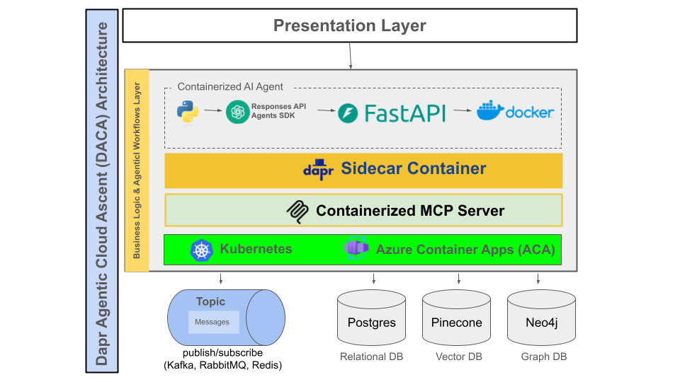

# AgentiaCloud: Simplified, Scalable AI for Prototyping and Production

**[Comprehensive Guide to Dapr Agentic Cloud Ascent (DACA) Design Pattern](https://github.com/panaversity/learn-agentic-ai/blob/main/comprehensive_guide_daca.md)**

Below is the deployment strategy for AI agents using the DACA design pattern, refined to address both prototyping and production phases. This strategy considers scalability, maintainability, vendor lock-in, and the distinct needs of short-term (session-based) and long-term (persistent) agents.

---

## Deployment Strategy for AI Agents

### Objective
Provide a clear, actionable deployment strategy for AI agents built with the DACA, enabling seamless progression from prototyping to production. The strategy ensures support for both short-term agents (active for minutes to hours) and long-term agents (persistent for weeks to months), while prioritizing scalability, maintainability, and minimizing vendor lock-in.

### Core Libraries
- **OpenAI Agents SDK**
- **Docker Containers**
- **CockroachDB**
- **CronJobs**
- **RabbitMQ**
- **MCP Server SDK**
- **Dapr**

### Target User
- **Agentic AI Developer and AgentOps Professionals**

---

## I. Prototyping Phase

### Goal
Enable rapid iteration, validation of agent capabilities, and user experience testing with minimal infrastructure overhead.

### Primary Platform
- **[Hugging Face Spaces](https://huggingface.co/docs/hub/en/spaces-sdks-docker)** (utilizing free-tier [Docker container deployments](https://www.docker.com/resources/what-container/)).

### Agent and MCP Focus
- Short-term and long-term agent workflow and state persistence. **[Model Context Protocol (MCP)](https://modelcontextprotocol.io/introduction)** servers for standardizing agentic tool calling, in stateless containers. 

### Recommended Approach
- **Three-Tier Deployment**  
  - **Why:** A single-tier setup (frontend and backend in one container) is simpler but risks architectural rework during the production transition. A three-tier approach aligns with production architecture, easing the shift and validating separation of concerns early.

### Architecture
- **Four Docker Containers on [Hugging Face Docker Spaces](https://huggingface.co/docs/hub/en/spaces-sdks-docker):**
  1. **Frontend Container:**
     - **Framework:** [Streamlit](https://streamlit.io/) or [Chainlit](https://chainlit.io/)  
     - **Functionality:** User interface, making API calls to the backend  
  2. **Backend API Container:**
     - **Framework:** [FastAPI](https://fastapi.tiangolo.com/)  
     - **Agent Logic:** OpenAI Agents SDK integrated within FastAPI endpoints  
     - **State Management:** [CockroachDB Serverless](https://www.cockroachlabs.com/lp/serverless/) for user session state (short-term memory) and initial long-term memory structures. [SQLModel](https://github.com/fastapi/sqlmodel) for database integration in Python.
     - **Agent Memory:** [LangMem](https://langchain-ai.github.io/langmem/) with CockroachDB Serverless Store
     - **Scheduling with CronJob** [Cron-Job.org](https://cron-job.org/en/) 
     - **Asynchronous Message Passing** [RabbitMQ](https://www.cloudamqp.com/plans.html#rmq)
     - **In Memory Datastore**: [Upstash Redis](https://upstash.com/pricing) 
     - **Design Principle:** Backend API is **stateless**, relying on external databases for persistence to simplify scaling and production transition
  3. - **[Model Context Protocol (MCP)](https://modelcontextprotocol.io/introduction)** Servers in stateless containers for standardizing agentic tool calling. 
  4. **Dapr Sidecar** Treat Dapr like nny Container. The daprio/daprd image is just a standard container. Optionally, you can use [Dapr Agents](https://dapr.github.io/dapr-agents/) and [Dapr Workflows](https://docs.dapr.io/developing-applications/building-blocks/workflow/workflow-overview/)

- **Alternative Single-Tier Deployment (Simpler Setup for Quick Start Only, if possible avoid it)**
  1.   **Architecture:** A single Hugging Face Spaces Docker container.
  2. **Components:**
    - **Frontend/UI:** Streamlit or Chainlit (integrated directly).
    - **Backend/Agent Logic:** OpenAI Agents SDK running within the same container. MCP servers running independently.
    - **State Management:** CockroachDB (Serverless) with SQLModel for storing user session state (short-term memory) and potentially initial long-term memory structures.
    - **Agent Memory:** [LangMem](https://langchain-ai.github.io/langmem/) with CockroachDB Serverless Store

---

## II. Production Phase: Cloud Native AI

### Goal
Deliver a scalable, reliable, and maintainable deployment capable of handling numerous concurrent agents and effectively managing persistent long-term agents.

### Transition Strategy
- Migrate the containerized, stateless backend API from prototyping to a managed serverless container platform.

### Primary Compute Platform
- **[Kubernetes](https://kubernetes.io/)**  
  - **Why:** Kubernetes, also known as K8s, is an open source system for automating deployment, scaling, and management of containerized applications. It is a Planet Scale solution. Designed on the same principles that allow Google to run billions of containers a week, Kubernetes can scale without increasing your operations team.
- **Darp on Kubernetes** [Deploy Dapr on a Kubernetes cluster](https://docs.dapr.io/operations/hosting/kubernetes/) (Open Source) Optionally, you can use [Dapr Agents](https://dapr.github.io/dapr-agents/) and [Dapr Workflows](https://docs.dapr.io/developing-applications/building-blocks/workflow/workflow-overview/)
- **MCP Servers on Kubernetes**
### Architecture
- **Event-Driven Architecture (EDA)**  
  - **Why:** Decouples services, enhances resilience, and supports asynchronous processing, ideal for agentic workflows, especially long-term agents.

### Event Handling & Processing
- **Event Bus:**  
  - **Primary:** Kafka on Kubernetes or RabbitMQ on Kubernetes for robust event streaming   
- **Event Triggering/Scheduling:**  
  - **Scheduled Tasks:** Kubernetes CronJobs 
- **Event Consumption:**  
  - **Preferred:** Pull-based approach using Kubernetes CronJobs to periodically pull events from Kafka on Kubernetes or Rabbit on Kubernetes
    - **Why:** Simpler to manage and sufficient for most use cases; avoids complexity of direct Kafka triggering unless ultra-low latency is critical
  - **Alternative Option (Push-based/Integrated):** Connect Kafka or RabbitMQ to trigger Containers directly upon event arrival. Evaluate based on latency requirements and complexity trade-offs.

### Alternative Compute Platforms
- Evaluate **Azure Container Apps**, **Google Cloud Run**, **AWS App Runner**, etc. for potential cost or integration benefits, though Kubernetes is recommended for this use case.

**Summary Table Across Providers**

   | Provider/Service            | Event-Driven Containers | Scheduled Containers |
   |-----------------------------|-------------------------|----------------------|
   | **AWS ECS**                 | Yes                     | Yes                  |
   | **AWS EKS**                 | Yes                     | Yes                  |
   | **AWS Fargate**             | Yes                     | Yes                  |
   | **AWS Lambda**              | Yes                     | Yes                  |
   | **AWS Batch**               | Indirectly              | Yes                  |
   | **Azure Container Apps**    | Yes                     | Yes                  |
   | **Azure Container Jobs**    | Yes                     | Yes                  |
   | **Azure AKS**               | Yes                     | Yes                  |
   | **Azure Functions**         | Yes                     | Yes                  |
   | **Azure ACI**               | Indirectly              | Indirectly           |
   | **GCP GKE**                 | Yes                     | Yes                  |
   | **GCP Cloud Run**           | Yes                     | Indirectly           |
   | **GCP Cloud Functions**     | Yes                     | Yes                  |
   | **GCP Cloud Scheduler**     | No                      | Yes                  |
   | **IBM IKS**                 | Yes                     | Yes                  |
   | **IBM Code Engine**         | Yes                     | Yes                  |
   | **OCI OKE**                 | Yes                     | Yes                  |
   | **OCI Functions**           | Yes                     | Yes                  |
   | **OCI Container Instances** | Indirectly              | Indirectly           |
   | **DO DOKS**                 | Yes                     | Yes                  |
   | **DO App Platform**         | Limited                 | Yes                  |

---

### The Ultimate Cloud Platform: Kubernetes
Deploy compute (stateless containers), Dapr, messaging (Kafka), and databases (Postgres) all on Kubernetes, but this will require a lot of DevOps expertise. However, the good news is given our production stack it will not be too difficult to do. 
---

## III. Agentic AI Stack (State Management & Knowledge)

### Core Principle
Externalize agent state and knowledge into specialized databases to support stateless compute and diverse memory/knowledge needs.

### Databases
- **Relational/Session State:**  
  - **CockroachDB Serverless** (Postgres-compatible) or Postgres on Kubernetes
  - **Use Case:** Structured data, user session state, short-term memory, and core agent state records  
  - **Why:** Serverless scalability, SQL interface, and potential to handle some flexible state data  
- **Vector/Semantic Memory:**  
  - **Qdrant Cloud** (Managed Vector DB)  
  - **Use Case:** Semantic search, retrieval-augmented generation (RAG), and long-term episodic/semantic memory  
- **Graph/Relational Knowledge:**  
  - **Neo4j Aura** (Managed Graph DB)  
  - **Use Case:** Complex relationship modeling, entity knowledge graphs, and conversation history analysis  
- **Document/Flexible State:**  
  - **MongoDB Atlas** (Managed NoSQL DB)  
  - **Use Case:** Unstructured or semi-structured data, configuration storage, or flexible agent state  
  - **In Memory Data Store**: Redis on Kubernetes
  - **Recommendation:** Assess necessity; consolidate with CockroachDB if possible to reduce complexity. Use Redis to improve performance.

### Database Consolidation
- Where feasible, leverage CockroachDB for both relational and flexible state data to minimize managed services and operational overhead. Use Redis to improve performance.

---

## IV. Key Considerations & Enhancements

- **Need for Standard Agent APIs**
  - Review this conversation to understand the need, usecases, and options for implementing [Standard Agent Protocol](https://github.com/langchain-ai/agent-protocol): https://grok.com/share/bGVnYWN5_35075b0c-861d-4c7c-8f2e-c278ecfcbede
https://github.com/langchain-ai/agent-protocol

- **Start FastAPI Development with Agent Protocol [Generated Stubs](https://github.com/langchain-ai/agent-protocol)**

- **Vendor Lock-in Mitigation:**  
  - Use containerization (Docker) and open standards (Kubernetes, Kafka, RabbitMQ, Postgres, MCP) for portability  
  - Implement abstraction layers (e.g., ORMs for databases) to ease provider switches, we will use SQLModel for this. 
  - Periodically review component portability (e.g., event bus, compute platform)  

- **Statelessness:**  
  - Ensure backend API remains stateless, with all state managed externally. Test state retrieval performance, especially for long-term agents  

- **Short-term vs. Long-term Agents:**  
  - **Short-term:** Handled by container compute instances triggered by API calls or events, using session data in CockroachDB  
  - **Long-term:** State persisted across databases (CockroachDB, Qdrant, Neo4j), with actions triggered by scheduled cron jobs or Kafka/RabbitMQ events  

- **Security:**  
  - Implement authentication, authorization, and encryption across all components.   

- **Monitoring & Logging:**  
  - Set up centralized monitoring (e.g., Prometheus, Grafana, Azure Monitor) and logging from the start  

- **Testing:**  
  - Include unit tests (agent logic), integration tests (API), and end-to-end tests (system-wide). Consider chaos engineering for EDA resilience  

- **CI/CD:**  
  - Automate deployments with a CI/CD pipeline (e.g., GitHub Actions)  

- **Cost Management:**  
  - Monitor costs for compute, databases, and event bus. Set budget alerts and use cloud cost-optimization tools  

---

## Conclusion
This deployment strategy ensures a smooth transition from prototyping to production, balancing scalability, maintainability, and flexibility. The three-tier prototyping approach on Hugging Face Spaces aligns with the production setup on Kubernetes, while the event-driven architecture with Kafka (or lighter alternatives like RabbitMQ) supports robust agent workflows. The database stack is optimized for diverse needs, with consolidation options to reduce complexity. Vendor lock-in is addressed through portable standards, and security, monitoring, and testing are prioritized. This approach effectively supports both short-term and long-term AI agents using the OpenAI Agents SDK.

### Serverless Alternative for both Prototyping and Production 

Those developer who have credit card and can register for the Azure free tier, have a option to use the serverless platform which are basically managed Kubernetes for both prototyping and production. Like [Azure Container Apps (ACA)](https://azure.microsoft.com/en-us/products/container-apps) (with [Dapr](https://learn.microsoft.com/en-us/azure/container-apps/dapr-overview) support) and [Jobs in Azure Container Apps](https://learn.microsoft.com/en-us/azure/container-apps/jobs?tabs=azure-cli). 

They can get started with the [free tier](https://azure.microsoft.com/en-us/pricing/free-services): The first 180,000 vCPU per second, 360,000 GiB/s, and 2 million requests each month are free.

**Real-World Example**

Imagine a FastAPI Service running on ACA:

With 0.5 vCPU and 1 GB RAM, it might handle 50-100 requests per minute comfortably, depending on the workload (e.g., database queries vs. static responses).

If traffic spikes, ACA’s autoscaling could spin up another 0.5 vCPU replica rather than over-provisioning a full vCPU, keeping costs down.

## What does this mean? "Consider chaos engineering for EDA resilience"

The phrase "Consider chaos engineering for EDA resilience" refers to a strategy for improving the reliability and robustness of systems built using **Event-Driven Architecture (EDA)** by applying **chaos engineering** principles.

Let’s break it down:

1. **Event-Driven Architecture (EDA)**:  
   EDA is a design pattern where systems communicate and operate by producing, detecting, and responding to events. An "event" is a significant change in state (e.g., a user placing an order, a sensor detecting a temperature change). In EDA, components are loosely coupled, meaning they don’t directly call each other but instead react to events asynchronously. This makes systems scalable and flexible but also introduces challenges like potential failures in event processing or delivery.

2. **Chaos Engineering**:  
   Chaos engineering is a discipline where you intentionally introduce controlled failures or disruptions into a system to test its resilience. The goal is to identify weaknesses (e.g., what happens if a server crashes or a network delays?) before they cause real-world problems. Think of it as "breaking things on purpose" to learn how to make them stronger.

3. **EDA Resilience**:  
   Resilience in this context means the ability of an EDA system to handle failures gracefully—whether it’s a lost event, a overwhelmed message queue, or a downstream service outage—and still keep functioning without catastrophic breakdowns.

4. **Putting It Together**:  
   "Consider chaos engineering for EDA resilience" suggests using chaos engineering techniques to test and strengthen an event-driven system. For example, you might simulate scenarios like:
   - Dropping events to see if the system recovers.
   - Overloading an event queue to check how it handles backpressure.
   - Shutting down a service to ensure other components adapt.

   By doing this, you uncover vulnerabilities (e.g., single points of failure, poor retry mechanisms) and improve the system’s ability to withstand real-world chaos.

In short, it’s a recommendation to proactively stress-test an event-driven system with controlled chaos to ensure it’s robust and reliable under unpredictable conditions. Does that clarify it for you?

