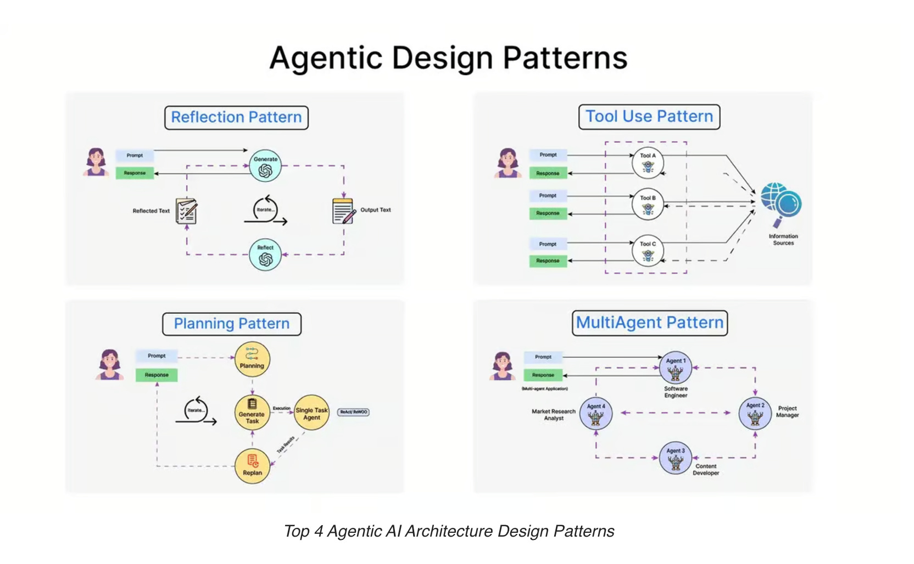
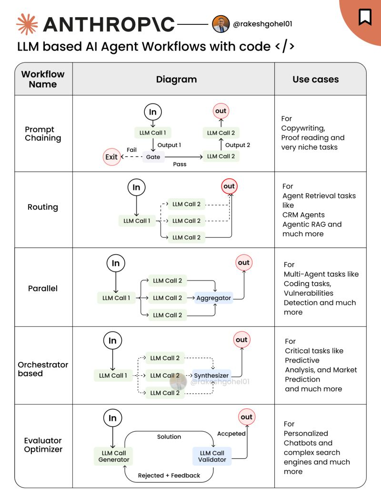
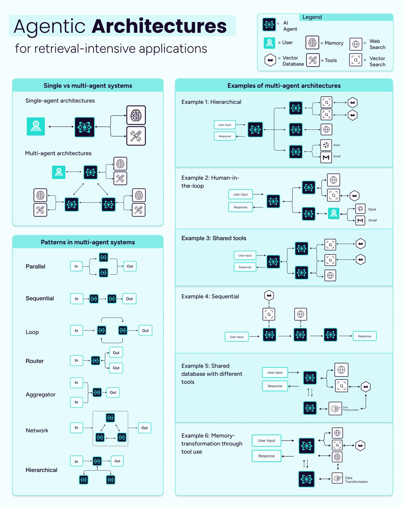

# Core Architecture and Anthrophic Design Patterns for Agentic AI Systems: A Visual Guide

The diagram illustrates four key agentic AI architecture design patterns, which are frameworks for designing AI systems that operate autonomously or semi-autonomously to achieve specific goals. These patterns are labeled as Reflection Pattern, Tool Use Pattern, Planning Pattern, and MultiAgent Pattern. Each pattern is depicted with a flowchart showing the interaction between a user, the AI agent, and various processes or components. Let’s break down each pattern in detail.

---

### 1. Reflection Pattern (Top Left)
**Overview**: The Reflection Pattern allows an AI agent to evaluate and improve its own output through a process of self-reflection. This is useful for tasks where the AI needs to refine its responses iteratively.

**Components and Flow**:
- **User**: The process starts with a user providing a prompt (e.g., a question or task) to the AI system.
- **Generate**: The AI, labeled as "Generate," produces an initial output text based on the prompt.
- **Reflect**: The generated output is then passed to a "Reflect" module. This module evaluates the output, likely checking for accuracy, coherence, or relevance.
- **Iterate**: If the output isn’t satisfactory, the Reflect module sends feedback to the Generate module, prompting it to iterate and produce a revised output. This loop continues until the output meets the desired quality.
- **Output Text**: Once the reflection process is complete, the final output text is sent back to the user as a response.

**Key Insight**: The Reflection Pattern emphasizes self-improvement within the AI. It’s like the AI double-checking its work, similar to how a human might revise a draft after reviewing it. This pattern is particularly useful for tasks requiring high accuracy, such as writing or problem-solving, where the AI can refine its answers over multiple iterations.

---

### 2. Tool Use Pattern (Top Right)
**Overview**: The Tool Use Pattern enables an AI agent to interact with external tools or information sources to enhance its capabilities and provide better responses.

**Components and Flow**:
- **User**: The user provides a prompt to the AI system.
- **Tool A and Tool B**: The AI has access to multiple external tools (labeled Tool A and Tool B). These could be APIs, databases, or other software tools (e.g., a calculator, a web scraper, or a search engine).
- **Information Sources**: The tools interact with external information sources (e.g., the internet, a knowledge base) to gather relevant data.
- **Prompt-Response Loop**: The AI sends prompts to the tools, which return responses. For example, if the user asks for the weather, the AI might query a weather API (Tool A) to fetch the data.
- **Response**: The AI processes the information from the tools and formulates a final response to the user.

**Key Insight**: This pattern highlights the AI’s ability to extend its knowledge and functionality by leveraging external resources. It’s particularly useful for tasks requiring real-time data or specialized functions that the AI model itself cannot perform, such as accessing live stock prices or performing complex calculations.

---

### 3. Planning Pattern (Bottom Left)
**Overview**: The Planning Pattern allows an AI agent to break down a complex task into smaller, manageable subtasks, plan their execution, and adjust the plan as needed.

**Components and Flow**:
- **User**: The user provides a prompt to the AI system.
- **Planning**: The AI enters a "Planning" phase, where it decomposes the task into smaller subtasks. For example, if the user asks the AI to "organize a trip," the AI might break it down into booking flights, reserving a hotel, and planning activities.
- **Generate Task**: The AI generates a list of subtasks based on the plan.
- **Execute Single Task**: Each subtask is executed individually. The AI may need to interact with external systems or tools to complete these tasks (e.g., querying a flight booking API).
- **Test**: After executing a subtask, the AI tests the result to ensure it aligns with the overall goal.
- **Replan**: If the test reveals issues (e.g., a flight is unavailable), the AI returns to the Planning phase to adjust the plan and generate new subtasks. This iteration continues until all subtasks are successfully completed.
- **Response**: Once the plan is fully executed, the AI delivers the final response to the user.

**Key Insight**: The Planning Pattern is ideal for complex, multi-step tasks that require strategic thinking and adaptability. It mimics how a human might approach a project by creating a to-do list, executing each item, and adjusting the plan if something goes wrong. This pattern is often used in applications like project management, logistics, or automated workflows.

---

### 4. MultiAgent Pattern (Bottom Right)
**Overview**: The MultiAgent Pattern involves multiple AI agents working collaboratively, each with a specialized role, to achieve a common goal. This mimics a team of human experts working together. It would be the most likely for workflows involving multiple steps, activities and outcomes in complex enterprise environments to enable superior outcomes.

**Components and Flow**:
- **User**: The user provides a prompt to the AI system.
- **Agent 1 (Software Engineer)**: The first agent, specialized as a Software Engineer, receives the prompt and begins working on its part of the task. For example, if the user asks to build a website, this agent might focus on coding the backend.
- **Agent 2 (Project Manager)**: The second agent, a Project Manager, coordinates the overall effort, ensuring that all agents are aligned and the project stays on track.
- **Agent 3 (Content Developer)**: The third agent, a Content Developer, handles content-related tasks, such as writing text or designing visuals for the website.
- **Agent 4 (Market Research Analyst)**: The fourth agent, a Market Research Analyst, gathers data to ensure the project meets market needs, such as researching user preferences for the website.
- **Collaboration**: The agents communicate with each other (shown by dashed arrows), sharing information and updates. For example, the Market Research Analyst might inform the Content Developer about target audience preferences, while the Project Manager ensures deadlines are met.
- **Response**: Once the agents complete their tasks and the project is finished, the final response (e.g., a fully built website) is delivered to the user.

**Key Insight**: The MultiAgent Pattern leverages specialization and collaboration, allowing each agent to focus on what it does best while working as a team. This is particularly effective for large-scale projects that require diverse skills, such as software development, marketing campaigns, or research initiatives. It also mirrors real-world teamwork, where different roles contribute to a shared goal.

---

### Overall Summary
The diagram presents four agentic AI design patterns, each tailored to different types of tasks:
- **Reflection Pattern**: Focuses on self-improvement through iterative refinement of output.
- **Tool Use Pattern**: Enhances AI capabilities by integrating external tools and information sources.
- **Planning Pattern**: Breaks down complex tasks into manageable subtasks, with iterative planning and execution.
- **MultiAgent Pattern**: Involves multiple specialized AI agents collaborating to achieve a common goal.

These patterns can be combined or used individually depending on the task at hand. For example, a MultiAgent system might incorporate the Tool Use Pattern to access external data or the Planning Pattern to manage its workflow. Together, they provide a robust framework for designing autonomous AI systems capable of handling a wide range of challenges.

## The Difference Between Core Patterns and Anthrophic Patterns

Reference: 

https://www.linkedin.com/feed/update/urn:li:activity:7315934306063855616/

To compare the core architecture patterns ("Top 4 Agentic AI Architecture Design Patterns") with the patterns defined by Anthropic in the document "[Building Effective Agents](https://www.anthropic.com/engineering/building-effective-agents)," we need to analyze both sets of patterns in terms of their purpose, structure, and application. The diagram focuses on four agentic AI patterns: Reflection, Tool Use, Planning, and MultiAgent. Anthropic, on the other hand, describes a broader range of patterns, starting with foundational building blocks, moving to workflows, and then discussing autonomous agents. Let’s break this down systematically.

---

### Overview of the Two Sets of Patterns

#### Core Architecture: Top 4 Agentic AI Architecture Design Patterns
The diagram presents four patterns specifically for agentic AI systems, which are AI systems capable of autonomous decision-making and task execution:
1. **Reflection Pattern**: The AI evaluates and refines its own output iteratively.
2. **Tool Use Pattern**: The AI leverages external tools or information sources to enhance its capabilities.
3. **Planning Pattern**: The AI breaks down a task into subtasks, plans their execution, and adjusts as needed.
4. **MultiAgent Pattern**: Multiple specialized AI agents collaborate to achieve a common goal.

These patterns are focused on how an AI agent operates autonomously or semi-autonomously, emphasizing dynamic decision-making and flexibility.

#### Anthropic: Building Effective Agents
Anthropic categorizes agentic systems into two broad types—**workflows** and **agents**—and provides a progression of patterns starting from a foundational building block:
- **Building Block: Augmented LLM**: An LLM enhanced with retrieval, tools, and memory, serving as the foundation for all agentic systems.
- **Workflows**: Predefined, structured processes where LLMs and tools are orchestrated through fixed code paths:
  1. **Prompt Chaining**: Decomposes a task into sequential steps, with each LLM call processing the output of the previous one.
  2. **Routing**: Classifies inputs and directs them to specialized tasks or models.
  3. **Parallelization**: Runs subtasks simultaneously, either by sectioning (independent subtasks) or voting (multiple attempts for the same task).
  4. **Orchestrator-Workers**: A central LLM dynamically delegates tasks to worker LLMs and synthesizes results.
  5. **Evaluator-Optimizer**: One LLM generates a response, while another evaluates and provides feedback in a loop.
- **Agents**: Autonomous systems where LLMs dynamically direct their own processes, using tools and environmental feedback in a loop to handle open-ended tasks.

Anthropic’s patterns cover both structured workflows (with predefined steps) and fully autonomous agents, providing a more comprehensive framework that includes both simpler and more complex implementations.

---

### Key Differences Between the Two Sets of Patterns

#### 1. Scope and Focus
- **Core (Top 4 Patterns)**: The diagram focuses exclusively on agentic AI systems, meaning it emphasizes patterns where the AI has some level of autonomy and dynamic decision-making. All four patterns (Reflection, Tool Use, Planning, MultiAgent) assume the AI is operating as an agent, directing its own processes to achieve a goal.
- **Anthropic**: [Anthropic Design Patterns](https://www.anthropic.com/engineering/building-effective-agents) takes a broader approach, distinguishing between **workflows** (structured, predefined processes) and **agents** (autonomous systems). The workflows (Prompt Chaining, Routing, Parallelization, Orchestrator-Workers, Evaluator-Optimizer) are more prescriptive and don’t necessarily require the AI to make dynamic decisions, while the "Agents" category aligns more closely with the diagram’s focus on autonomy.

**Example**:
- The diagram’s Planning Pattern involves an AI dynamically breaking down a task, executing subtasks, and replanning as needed—an autonomous process.
- Anthropic’s Prompt Chaining, on the other hand, involves a predefined sequence of steps (e.g., generating marketing copy, then translating it), which is a workflow, not an autonomous agent.

#### 2. Level of Autonomy
- **Core**: All four patterns assume a high level of autonomy. For instance:
  - In the Reflection Pattern, the AI autonomously evaluates and refines its output.
  - In the MultiAgent Pattern, multiple agents collaborate dynamically without predefined steps.
- **Anthropic**: Autonomy varies across the patterns:
  - Workflows like Prompt Chaining and Routing are not autonomous; they follow fixed, developer-defined paths.
  - The Orchestrator-Workers and Evaluator-Optimizer workflows introduce some dynamic decision-making (e.g., the orchestrator decides how to delegate tasks), but they are still more structured than fully autonomous agents.
  - Anthropic’s "Agents" category aligns with the diagram’s focus, as it describes fully autonomous systems that plan, use tools, and operate independently over multiple steps.

**Example**:
- The Core’s MultiAgent Pattern is similar to Anthropic’s description of autonomous agents, where multiple LLMs (or agents) collaborate dynamically. However, Anthropic’s Orchestrator-Workers workflow also involves multiple LLMs but in a more structured way, with a central LLM (the orchestrator) delegating tasks according to a predefined framework.

#### 3. Granularity and Specificity
- **Core**: The four patterns are high-level and abstract, focusing on broad strategies for agentic behavior. For example, the Tool Use Pattern doesn’t specify how tools are integrated or what types of tools are used—it’s a general concept.
- **Anthropic**: Anthropic provides more granular patterns, breaking down workflows into specific types (e.g., Prompt Chaining, Routing, Parallelization) and offering practical examples for each. Additionally, Anthropic starts with a foundational building block (Augmented LLM) and builds up to more complex systems, providing a clearer progression.

**Example**:
- The Core’s Tool Use Pattern is a single, broad concept that could encompass many of Anthropic’s workflows. For instance, Anthropic’s Orchestrator-Workers workflow might involve tool use (e.g., workers accessing external APIs), but it’s a more specific implementation of how tools are used within a structured framework.

#### 4. Pattern Overlap and Mapping
While the two sets of patterns have different focuses, there is some overlap. Let’s map the diagram’s patterns to Anthropic’s framework:

- **Reflection Pattern (Core)**:
  - **Anthropic Equivalent**: This aligns closely with Anthropic’s **Evaluator-Optimizer** workflow, where one LLM generates a response and another evaluates it, providing feedback in a loop. Both patterns focus on iterative refinement through self-evaluation.
  - **Difference**: The Reflection Pattern assumes the AI is autonomous and dynamically decides to reflect, whereas Evaluator-Optimizer is a structured workflow where the evaluation loop is predefined.

- **Tool Use Pattern (Core)**:
  - **Anthropic Equivalent**: This is a core capability of Anthropic’s **Augmented LLM** (the foundational building block), which includes tools as an augmentation. Tool use also appears across Anthropic’s workflows and agents, such as in Orchestrator-Workers (where workers might use tools) or autonomous agents (which use tools in a loop).
  - **Difference**: The Core treats Tool Use as a standalone pattern, while Anthropic integrates tool use as a fundamental feature across all patterns, not a distinct pattern on its own.

- **Planning Pattern (Core)**:
  - **Anthropic Equivalent**: This aligns with Anthropic’s **autonomous agents**, which are described as planning and operating independently over multiple steps. It also shares similarities with the **Orchestrator-Workers** workflow, where the orchestrator dynamically breaks down tasks and delegates them.
  - **Difference**: The Planning Pattern in the diagram is fully autonomous, with the AI replanning as needed. Anthropic’s Orchestrator-Workers is more structured, as the orchestrator follows a predefined framework for delegation, even if the subtasks are determined dynamically.

- **MultiAgent Pattern (Core)**:
  - **Anthropic Equivalent**: This is most similar to Anthropic’s **autonomous agents** when multiple agents collaborate, as seen in Anthropic’s coding agent example (Appendix 1). It also shares some similarities with the **Orchestrator-Workers** workflow, where multiple LLMs (workers) collaborate under a central orchestrator.
  - **Difference**: The MultiAgent Pattern in the diagram emphasizes equal collaboration among specialized agents (e.g., Software Engineer, Project Manager), with no central controller. Anthropic’s Orchestrator-Workers has a central LLM directing the workers, which is a more hierarchical structure.

#### Core Patterns Without Full Equivalents
The core patterns that do not have full equivalents in Anthropic’s patterns are:

- **Tool Use Pattern**: Tool use is a capability in Anthropic’s framework, not a distinct pattern.
- **Planning Pattern**: Lacks a full equivalent due to the absence of a structured planning-testing-replanning loop in Anthropic’s patterns.
- **MultiAgent Pattern**: Lacks a full equivalent due to the decentralized, role-based collaboration not being explicitly defined in Anthropic’s patterns.

The **Reflection Pattern is the only one with a full equivalent (Evaluator-Optimizer)**, as its core concept of iterative refinement through evaluation is directly mirrored in Anthropic’s framework.

#### 5. Practical Application and Examples
- **Core**: The diagram provides high-level, conceptual examples (e.g., a Software Engineer agent collaborating with a Market Research agent in the MultiAgent Pattern). It’s more abstract and doesn’t delve into specific use cases or implementation details.
- **Anthropic**: Anthropic offers detailed, practical examples for each pattern, such as:
  - Prompt Chaining for generating and translating marketing copy.
  - Routing for directing customer service queries to different models.
  - Parallelization for implementing guardrails or evaluating code vulnerabilities.
  - Autonomous agents for coding (e.g., solving GitHub issues in SWE-bench).
  Additionally, Anthropic’s Appendix 1 provides real-world applications like customer support and coding agents, showing how these patterns are applied in practice.

**Example**:
- The diagram’s MultiAgent Pattern might be used for a collaborative task like building a website, but it doesn’t specify how the agents interact or what tools they use.
- Anthropic’s coding agent example (Appendix 1) describes a similar multi-agent setup but provides more detail, such as how agents iterate on solutions using test results as feedback and integrate human review for oversight.

#### 6. Design Philosophy
- **Core**: The diagram assumes that agentic AI systems are the goal and focuses on patterns that enable autonomy and flexibility. It doesn’t discuss simpler, non-agentic solutions.
- **Anthropic**: Anthropic emphasizes simplicity and incremental complexity, advising developers to start with basic LLM calls and only add agentic systems when necessary. This philosophy is evident in their progression from the Augmented LLM to workflows to autonomous agents, and their recommendation to avoid unnecessary complexity (e.g., using frameworks only when needed).

**Example**:
- The diagram jumps straight to agentic patterns like Reflection and MultiAgent, assuming these are the desired solutions.
- Anthropic suggests starting with a single LLM call with retrieval and in-context examples, then moving to workflows like Prompt Chaining, and only using autonomous agents for open-ended tasks where simpler solutions fall short.

---

### Summary of Differences
| **Aspect**               | **Core (Top 4 Patterns)**                          | **Anthropic (Building Effective Agents)**            |
|--------------------------|------------------------------------------------------|-----------------------------------------------------|
| **Scope**                | Focuses on agentic AI systems with autonomous behavior. | Covers both workflows (structured) and agents (autonomous). |
| **Level of Autonomy**    | All patterns are autonomous, with dynamic decision-making. | Workflows are structured; only "Agents" are fully autonomous. |
| **Granularity**          | High-level, abstract patterns.                       | More granular, with specific workflows and examples. |
| **Pattern Overlap**      | Reflection → Evaluator-Optimizer Tool Use → Augmented LLM feature Planning → Autonomous Agents/Orchestrator-Workers MultiAgent → Autonomous Agents/Orchestrator-Workers | Anthropic’s patterns are more varied and include non-agentic workflows. |
| **Practical Examples**   | Conceptual examples (e.g., Software Engineer agent). | Detailed examples (e.g., coding agents, customer support). |
| **Design Philosophy**    | Assumes agentic systems are the goal.                | Emphasizes simplicity, starting with basic LLM calls. |

---

### Conclusion
The Core’s "Top 4 Agentic AI Architecture Design Patterns" focus on autonomous, agentic systems, presenting four high-level patterns (Reflection, Tool Use, Planning, MultiAgent) that emphasize dynamic decision-making and flexibility. Anthropic’s framework in "Building Effective Agents" is broader, covering both structured workflows (Prompt Chaining, Routing, Parallelization, Orchestrator-Workers, Evaluator-Optimizer) and autonomous agents, with a strong emphasis on starting simple and adding complexity only when needed.

The Core patterns align most closely with Anthropic’s "Agents" category and some workflows like Evaluator-Optimizer and Orchestrator-Workers, but Anthropic provides a more comprehensive and practical framework by including non-agentic workflows and detailed implementation advice. If you’re building an autonomous AI system, the Core patterns are directly relevant, but Anthropic’s document offers a more complete roadmap for deciding when and how to use agentic systems versus simpler solutions.

### Multi-agent Architectures

Reference:

https://www.linkedin.com/feed/update/urn:li:activity:7315932513737019394/ 

Let’s dive into the third set of patterns introduced in the LinkedIn post by Victoria Slocum, which are labeled as **Multi-Agent Architectures**. These architectures focus on how multiple AI agents can be organized to collaborate and solve complex tasks. We’ll describe each architecture, compare them to the **core patterns** (Reflection, Tool Use, Planning, MultiAgent) from the "Top 4 Agentic AI Architecture Design Patterns" diagram and the **Anthropic patterns** (Augmented LLM, Prompt Chaining, Routing, Parallelization, Orchestrator-Workers, Evaluator-Optimizer, and Autonomous Agents) from Anthropic’s "Building Effective Agents" document, and then identify which of these new architectures lack full equivalents in the core and Anthropic patterns.

---

### Description of the Multi-Agent Architectures (Victoria Slocum’s Post)

The LinkedIn post outlines six distinct **Multi-Agent Architectures**, along with additional patterns that can be combined with these architectures. Here’s a detailed breakdown:

#### 1. Hierarchical (Vertical) Architecture
- **Description**: A supervisor agent orchestrates multiple specialized agents, each handling a specific task. The supervisor acts as a central coordinator, delegating tasks to the appropriate agents.
- **Example**:
  - One agent retrieves information from internal data sources.
  - Another agent specializes in public information from web searches.
  - A third agent retrieves information from personal accounts (e.g., email, chat).
- **Key Features**:
  - Centralized control with a supervisor agent.
  - Specialized agents work under the supervisor’s direction.
  - Suitable for tasks requiring coordination across diverse data sources.

#### 2. Human-in-the-Loop Architecture
- **Description**: Incorporates human verification before proceeding to the next actions, particularly useful when handling sensitive information.
- **Key Features**:
  - Agents pause at critical points to seek human input or approval.
  - Ensures safety and accountability in high-stakes scenarios.
  - Balances autonomy with human oversight.

#### 3/5. Network (Horizontal) Architecture
- **Description**: Agents communicate directly with one another in a many-to-many fashion, forming a decentralized network without a strict hierarchical structure.
- **Key Features**:
  - Decentralized collaboration where agents interact as peers.
  - No central supervisor; agents self-organize to achieve the goal.
  - Flexible and resilient due to the lack of a single point of failure.

#### 4. Sequential Architecture
- **Description**: Agents process tasks in a sequence, where one agent’s output becomes the input for the next agent.
- **Example**:
  - First query agent retrieves information from a vector search.
  - Second query agent retrieves additional information from a web search based on the first agent’s findings.
  - Final generation agent creates a response using information from both query agents.
- **Key Features**:
  - Linear workflow with a clear order of operations.
  - Each agent builds on the previous agent’s output.
  - Suitable for tasks with a natural progression of steps.

#### 5. Data Transformation Architecture
- **Description**: Includes agents dedicated to transforming data, either at insert-time or by transforming existing collections.
- **Example**:
  - A transformation agent enriches data at insert-time or modifies existing data collections.
- **Key Features**:
  - Focuses on data preprocessing or enrichment.
  - Agents specialize in modifying data to make it more usable for downstream tasks.
  - Often used in data pipelines or knowledge management systems.

#### Additional Patterns (Can Be Combined with Architectures)
- **Loop Pattern**: Iterative cycles for continuous improvement, where agents repeat a process to refine results.
- **Parallel Pattern**: Multiple agents work simultaneously on different parts of a task to increase efficiency.
- **Router Pattern**: A central router determines which agents to invoke based on the task requirements.
- **Aggregator/Synthesizer Pattern**: Collects and synthesizes outputs from multiple agents to produce a unified result.

---

### Comparison to Core Patterns and Anthropic Patterns

Now, let’s compare these Multi-Agent Architectures to the core patterns (Reflection, Tool Use, Planning, MultiAgent) and Anthropic patterns (Augmented LLM, Prompt Chaining, Routing, Parallelization, Orchestrator-Workers, Evaluator-Optimizer, Autonomous Agents). We’ll focus on the structural and functional similarities and differences, as well as the level of autonomy and collaboration.

#### 1. Hierarchical (Vertical) Architecture
- **Comparison to Core Patterns**:
  - **Reflection**: No direct match. Hierarchical Architecture focuses on multi-agent coordination, not self-evaluation or iterative refinement.
  - **Tool Use**: Partial overlap. Specialized agents in the Hierarchical Architecture might use tools (e.g., to retrieve data from web searches), but tool use isn’t the primary focus.
  - **Planning**: Partial overlap. The supervisor agent might perform planning by deciding which agents to delegate tasks to, but there’s no explicit testing or replanning loop as in the Planning Pattern.
  - **MultiAgent**: Strong overlap. Both involve multiple agents collaborating, but Hierarchical Architecture has a centralized supervisor, whereas the MultiAgent Pattern in the core set is decentralized (e.g., Software Engineer and Project Manager agents collaborate as equals).
- **Comparison to Anthropic Patterns**:
  - **Augmented LLM**: Not a direct match, but the specialized agents could be built on augmented LLMs with tool access.
  - **Prompt Chaining**: No match. Prompt Chaining is a sequential, predefined workflow, not a multi-agent architecture.
  - **Routing**: Partial overlap. The supervisor agent acts like a router by delegating tasks to specialized agents, similar to Anthropic’s Routing workflow.
  - **Parallelization**: Partial overlap. The specialized agents might work in parallel, but this isn’t the primary focus.
  - **Orchestrator-Workers**: Strong overlap. This is the closest match, as Orchestrator-Workers involves a central LLM (orchestrator) delegating tasks to worker LLMs, mirroring the supervisor-specialized agent structure in Hierarchical Architecture.
  - **Evaluator-Optimizer**: No match. Evaluator-Optimizer focuses on iterative refinement, not multi-agent coordination.
  - **Autonomous Agents**: Partial overlap. The specialized agents could be autonomous, but the supervisor imposes a hierarchical structure, unlike the more general autonomy in Anthropic’s Autonomous Agents.
- **Summary**: Hierarchical Architecture aligns closely with the core MultiAgent Pattern (but with a centralized supervisor) and Anthropic’s Orchestrator-Workers (due to the orchestrator-worker dynamic). However, it lacks the decentralized collaboration of the core MultiAgent Pattern and the explicit focus on autonomy in Anthropic’s Autonomous Agents.

#### 2. Human-in-the-Loop Architecture
- **Comparison to Core Patterns**:
  - **Reflection**: No match. Human-in-the-Loop focuses on human oversight, not self-evaluation.
  - **Tool Use**: No direct match, though agents might use tools as part of their tasks.
  - **Planning**: No match. Human-in-the-Loop doesn’t involve dynamic task decomposition or replanning.
  - **MultiAgent**: Partial overlap. It could involve multiple agents, but the focus is on human intervention, not agent collaboration.
- **Comparison to Anthropic Patterns**:
  - **Augmented LLM**: Not a direct match, but agents could be built on augmented LLMs.
  - **Prompt Chaining, Routing, Parallelization, Orchestrator-Workers, Evaluator-Optimizer**: No match. These workflows don’t explicitly incorporate human oversight as a core component.
  - **Autonomous Agents**: Partial overlap. Anthropic’s Autonomous Agents can pause for human feedback at checkpoints, which aligns with the Human-in-the-Loop concept.
- **Summary**: Human-in-the-Loop Architecture is a unique pattern that emphasizes human oversight, which isn’t a primary focus of the core patterns. In Anthropic’s framework, Autonomous Agents mention pausing for human feedback, but this isn’t defined as a distinct architecture, making Human-in-the-Loop a distinct concept.

#### 3/5. Network (Horizontal) Architecture
- **Comparison to Core Patterns**:
  - **Reflection, Tool Use, Planning**: No direct match. Network Architecture focuses on decentralized multi-agent collaboration, not self-evaluation, tool usage, or planning.
  - **MultiAgent**: Strong overlap. The Network Architecture’s decentralized, many-to-many communication mirrors the core MultiAgent Pattern, where agents (e.g., Software Engineer, Project Manager) collaborate as equals without a central controller.
- **Comparison to Anthropic Patterns**:
  - **Augmented LLM, Prompt Chaining, Routing, Parallelization, Evaluator-Optimizer**: No match. These patterns don’t focus on decentralized multi-agent collaboration.
  - **Orchestrator-Workers**: No match. Orchestrator-Workers is centralized, with a single orchestrator directing workers, unlike the decentralized Network Architecture.
  - **Autonomous Agents**: Strong overlap. Anthropic’s Autonomous Agents can collaborate in a decentralized manner, as seen in their coding agent example where multiple agents work together to solve GitHub issues.
- **Summary**: Network Architecture aligns closely with the core MultiAgent Pattern due to its decentralized collaboration. It also aligns with Anthropic’s Autonomous Agents when they collaborate without a central controller, though Anthropic doesn’t define this as a distinct architecture.

#### 4. Sequential Architecture
- **Comparison to Core Patterns**:
  - **Reflection, Tool Use, MultiAgent**: No direct match. Sequential Architecture focuses on a linear workflow, not self-evaluation, tool usage, or decentralized collaboration.
  - **Planning**: Partial overlap. The sequential execution of tasks resembles the Planning Pattern’s execution phase, but Sequential Architecture lacks the dynamic task decomposition, testing, and replanning aspects.
- **Comparison to Anthropic Patterns**:
  - **Augmented LLM**: Not a direct match, but agents could be built on augmented LLMs.
  - **Prompt Chaining**: Strong overlap. Prompt Chaining involves a sequence of LLM calls where each processes the previous output, mirroring Sequential Architecture’s linear workflow.
  - **Routing, Parallelization, Orchestrator-Workers, Evaluator-Optimizer**: No match. These patterns don’t focus on sequential processing.
  - **Autonomous Agents**: No match. Autonomous Agents are more flexible and don’t necessarily follow a strict sequential structure.
- **Summary**: Sequential Architecture aligns closely with Anthropic’s Prompt Chaining due to its linear, sequential workflow. It has some overlap with the core Planning Pattern’s execution phase but lacks the full planning-testing-replanning loop.

#### 5. Data Transformation Architecture
- **Comparison to Core Patterns**:
  - **Reflection, Tool Use, Planning, MultiAgent**: No direct match. Data Transformation Architecture focuses on data preprocessing, which isn’t a primary focus of any core pattern.
- **Comparison to Anthropic Patterns**:
  - **Augmented LLM, Prompt Chaining, Routing, Parallelization, Orchestrator-Workers, Evaluator-Optimizer, Autonomous Agents**: No match. None of Anthropic’s patterns explicitly focus on data transformation as a core function.
- **Summary**: Data Transformation Architecture is a unique pattern that focuses on data preprocessing and enrichment, which isn’t directly addressed by the core or Anthropic patterns.

#### Additional Patterns (Loop, Parallel, Router, Aggregator/Synthesizer)
- **Loop Pattern**:
  - **Core Patterns**: Aligns with Reflection (iterative refinement) and Planning (replanning loop).
  - **Anthropic Patterns**: Aligns with Evaluator-Optimizer (feedback loop) and Autonomous Agents (iterative operation).
- **Parallel Pattern**:
  - **Core Patterns**: No direct match, though MultiAgent agents might work in parallel.
  - **Anthropic Patterns**: Aligns with Parallelization (running subtasks simultaneously).
- **Router Pattern**:
  - **Core Patterns**: No direct match.
  - **Anthropic Patterns**: Aligns with Routing (classifying and directing tasks).
- **Aggregator/Synthesizer Pattern**:
  - **Core Patterns**: No direct match.
  - **Anthropic Patterns**: Partial overlap with Orchestrator-Workers (synthesizing worker outputs) and Autonomous Agents (synthesizing results from collaboration).

---

### Which Multi-Agent Architectures Lack Full Equivalents?

Now, let’s identify which of the Multi-Agent Architectures (Hierarchical, Human-in-the-Loop, Network, Sequential, Data Transformation) lack full equivalents in the core and Anthropic patterns. A "full equivalent" means a pattern that matches the architecture’s structure, purpose, and level of autonomy.

#### 1. Hierarchical (Vertical) Architecture
- **Core Patterns**: Partial match with MultiAgent, but the centralized supervisor makes it distinct (MultiAgent is decentralized).
- **Anthropic Patterns**: Full match with Orchestrator-Workers, which has a central orchestrator delegating tasks to workers, mirroring the supervisor-specialized agent structure.
- **Conclusion**: Has a full equivalent in Anthropic’s Orchestrator-Workers but not in the core patterns due to the centralized structure.

#### 2. Human-in-the-Loop Architecture
- **Core Patterns**: No match. None of the core patterns (Reflection, Tool Use, Planning, MultiAgent) explicitly incorporate human oversight as a core component.
- **Anthropic Patterns**: Partial match with Autonomous Agents, which can pause for human feedback, but this isn’t defined as a distinct architecture.
- **Conclusion**: Lacks a full equivalent in both core and Anthropic patterns. Human-in-the-Loop is a unique architecture emphasizing human oversight, which isn’t a primary focus of the other frameworks.

#### 3/5. Network (Horizontal) Architecture
- **Core Patterns**: Full match with MultiAgent, as both involve decentralized, peer-to-peer collaboration among agents.
- **Anthropic Patterns**: Partial match with Autonomous Agents (when they collaborate decentrally), but Anthropic doesn’t define this as a distinct architecture.
- **Conclusion**: Has a full equivalent in the core MultiAgent Pattern but lacks a full equivalent in Anthropic’s patterns due to the lack of a specific decentralized architecture.

#### 4. Sequential Architecture
- **Core Patterns**: Partial match with Planning (execution phase), but lacks the full planning-testing-replanning loop.
- **Anthropic Patterns**: Full match with Prompt Chaining, which involves a sequential workflow where each LLM call processes the previous output.
- **Conclusion**: Has a full equivalent in Anthropic’s Prompt Chaining but not in the core patterns due to the lack of a sequential focus.

#### 5. Data Transformation Architecture
- **Core Patterns**: No match. None of the core patterns focus on data transformation.
- **Anthropic Patterns**: No match. None of Anthropic’s patterns explicitly address data transformation as a core function.
- **Conclusion**: Lacks a full equivalent in both core and Anthropic patterns. Data Transformation is a unique architecture focused on data preprocessing, which isn’t directly addressed by the other frameworks.

---

### Summary: Multi-Agent Architectures Without Full Equivalents

- **Hierarchical (Vertical) Architecture**:
  - Full equivalent in Anthropic’s Orchestrator-Workers.
  - No full equivalent in core patterns (MultiAgent is decentralized, not hierarchical).
- **Human-in-the-Loop Architecture**:
  - No full equivalent in core or Anthropic patterns.
- **Network (Horizontal) Architecture**:
  - Full equivalent in core MultiAgent Pattern.
  - No full equivalent in Anthropic patterns (Autonomous Agents collaborate but lack a specific decentralized architecture).
- **Sequential Architecture**:
  - Full equivalent in Anthropic’s Prompt Chaining.
  - No full equivalent in core patterns (Planning lacks the sequential focus).
- **Data Transformation Architecture**:
  - No full equivalent in core or Anthropic patterns.

**Architectures Without Full Equivalents in Both Core and Anthropic Patterns**:
- **Human-in-the-Loop Architecture**: Unique due to its focus on human oversight, which isn’t a primary component of the core or Anthropic patterns.
- **Data Transformation Architecture**: Unique due to its focus on data preprocessing, which isn’t directly addressed by the core or Anthropic patterns.

**Architectures Without Full Equivalents in Core Patterns**:
- **Hierarchical (Vertical) Architecture**: The centralized structure doesn’t fully match the decentralized MultiAgent Pattern.
- **Sequential Architecture**: The sequential focus doesn’t fully match any core pattern, though it partially aligns with Planning.

**Architectures Without Full Equivalents in Anthropic Patterns**:
- **Network (Horizontal) Architecture**: The decentralized structure isn’t specifically defined in Anthropic’s patterns, though Autonomous Agents can collaborate decentrally.

---

### Final Thoughts
The Multi-Agent Architectures from Victoria Slocum’s post provide a more granular and practical set of patterns for multi-agent systems, focusing on how agents are organized and interact. They complement the core patterns (which are more high-level and agentic) and Anthropic’s patterns (which include both workflows and agents). The **Human-in-the-Loop** and **Data Transformation** architectures stand out as unique, addressing specific needs (human oversight and data preprocessing) that aren’t fully captured by the core or Anthropic frameworks. This highlights the evolving nature of agentic AI design, where new patterns emerge to address practical challenges in multi-agent collaboration.

### Summary of Differences Table

Below is a **Summary of Differences Table** that compares the three sets of patterns: the **Core Patterns** (from the "Top 4 Agentic AI Architecture Design Patterns" diagram), the **Anthropic Patterns** (from Anthropic’s "Building Effective Agents" document), and the **Multi-Agent Architectures** (from Victoria Slocum’s LinkedIn post). The table focuses on key aspects such as scope, focus, level of autonomy, granularity, and unique features, as well as which patterns lack full equivalents in the other frameworks.

---

### Summary of Differences Table

| **Aspect**                | **Core Patterns (Diagram)**                                                                 | **Anthropic Patterns**                                                                 | **Multi-Agent Architectures (Victoria Slocum)**                                   |
|---------------------------|---------------------------------------------------------------------------------------------|---------------------------------------------------------------------------------------|-----------------------------------------------------------------------------------|
| **Source**                | "Top 4 Agentic AI Architecture Design Patterns" diagram                                     | Anthropic’s "Building Effective Agents" document                                      | LinkedIn post by Victoria Slocum                                                 |
| **Patterns Included**     | - Reflection - Tool Use - Planning - MultiAgent                                    | - Augmented LLM (building block) - Prompt Chaining - Routing - Parallelization - Orchestrator-Workers - Evaluator-Optimizer - Autonomous Agents | - Hierarchical (Vertical) - Human-in-the-Loop - Network (Horizontal) - Sequential - Data Transformation - Additional Patterns: Loop, Parallel, Router, Aggregator/Synthesizer |
| **Scope**                 | Focuses exclusively on agentic AI systems with autonomous behavior.                         | Covers both structured workflows and autonomous agents, with a broader range of applications. | Focuses on multi-agent collaboration, emphasizing different organizational structures for agents. |
| **Focus**                 | High-level strategies for autonomous AI agents (e.g., self-reflection, planning, collaboration). | Progression from simple LLM calls to complex workflows and autonomous agents, emphasizing simplicity and incremental complexity. | Practical architectures for multi-agent systems, focusing on how agents are organized and interact (e.g., hierarchical vs. decentralized). |
| **Level of Autonomy**     | All patterns are autonomous, with dynamic decision-making by the AI.                        | Varies: Workflows (e.g., Prompt Chaining, Routing) are structured; Autonomous Agents are fully autonomous. | Varies: Hierarchical and Sequential are more structured; Network and Human-in-the-Loop can be autonomous but often involve oversight (e.g., human intervention). |
| **Granularity**           | High-level and abstract, with conceptual examples (e.g., Software Engineer agent).          | More granular, with specific workflows and practical examples (e.g., coding agents, customer support). | Granular and practical, with specific architectures and examples (e.g., sequential agents for vector search and response generation). |
| **Unique Features**       | - Focus on autonomy in all patterns. - Planning Pattern’s structured loop (plan, execute, test, replan). | - Emphasis on simplicity and incremental complexity. - Includes non-agentic workflows (e.g., Prompt Chaining, Routing). | - Emphasis on multi-agent organizational structures (e.g., Hierarchical, Network). - Unique architectures like Human-in-the-Loop and Data Transformation. |
| **Patterns Without Full Equivalents in Core Patterns** | N/A (this is the baseline).                                                                 | - Prompt Chaining - Routing - Parallelization - Orchestrator-Workers | - Hierarchical (centralized structure doesn’t match decentralized MultiAgent) - Human-in-the-Loop - Sequential - Data Transformation |
| **Patterns Without Full Equivalents in Anthropic Patterns** | - Tool Use (not a distinct pattern in Anthropic, but a capability) - Planning (lacks structured loop) - MultiAgent (lacks specific decentralized architecture) | N/A (this is the baseline).                                                           | - Human-in-the-Loop (not a distinct architecture in Anthropic) - Network (lacks specific decentralized architecture) - Data Transformation (not addressed) |
| **Patterns Without Full Equivalents in Multi-Agent Architectures** | - Reflection - Tool Use - Planning                                                    | - Evaluator-Optimizer - Routing - Parallelization                               | N/A (this is the baseline).                                                      |
| **Practical Examples**    | Conceptual (e.g., Software Engineer and Project Manager agents collaborating).              | Detailed and practical (e.g., coding agents solving GitHub issues, customer support). | Practical with specific use cases (e.g., sequential agents for vector search, web search, and response generation). |
| **Design Philosophy**     | Assumes agentic systems are the goal, focusing on autonomy and flexibility.                | Start simple, add complexity only when needed; emphasizes transparency and maintainability. | Focuses on organizational structures for multi-agent systems, balancing autonomy and oversight (e.g., Human-in-the-Loop). |

---

### Key Observations from the Table

1. **Scope and Focus**:
   - The **Core Patterns** are narrowly focused on autonomous, agentic AI systems, emphasizing high-level strategies like self-reflection (Reflection), tool integration (Tool Use), task decomposition (Planning), and collaboration (MultiAgent).
   - **Anthropic Patterns** provide a broader framework, covering both structured workflows (e.g., Prompt Chaining, Routing) and autonomous agents, with a philosophy of starting simple and scaling complexity as needed.
   - **Multi-Agent Architectures** zoom in on multi-agent systems, offering practical architectures for how agents can be organized (e.g., Hierarchical, Network) and interact, with a mix of structured and autonomous designs.

2. **Level of Autonomy**:
   - Core Patterns are uniformly autonomous, assuming the AI can dynamically direct its processes.
   - Anthropic Patterns range from structured (e.g., Prompt Chaining) to fully autonomous (Autonomous Agents), offering flexibility for different use cases.
   - Multi-Agent Architectures vary in autonomy: Hierarchical and Sequential are more structured, while Network can be fully autonomous, and Human-in-the-Loop introduces human oversight.

3. **Granularity and Practicality**:
   - Core Patterns are abstract, providing high-level concepts with conceptual examples.
   - Anthropic Patterns are more granular, with specific workflows and detailed examples (e.g., coding agents, customer support).
   - Multi-Agent Architectures are also granular, focusing on specific organizational structures and providing practical examples (e.g., sequential agents for search and response generation).

4. **Unique Features and Gaps**:
   - **Core Patterns** lack equivalents for structured workflows like Anthropic’s Prompt Chaining and Routing, and they don’t fully match Multi-Agent Architectures like Hierarchical (due to its centralized structure) or Human-in-the-Loop.
   - **Anthropic Patterns** lack specific architectures for decentralized collaboration (Network) and data preprocessing (Data Transformation), as well as a distinct Human-in-the-Loop architecture.
   - **Multi-Agent Architectures** lack equivalents for single-agent patterns like Reflection (Core) and Evaluator-Optimizer (Anthropic), focusing instead on multi-agent collaboration.

5. **Design Philosophy**:
   - Core Patterns assume agentic systems are the goal, prioritizing autonomy.
   - Anthropic emphasizes simplicity, transparency, and incremental complexity, offering a roadmap for scaling from basic LLM calls to complex agents.
   - Multi-Agent Architectures focus on practical multi-agent organization, balancing autonomy with oversight (e.g., Human-in-the-Loop) and addressing specific needs like data transformation.

---

### Conclusion
The three approaches complement each other, with each offering unique perspectives on agentic AI design:
- **Core Patterns** provide a high-level, autonomous-focused framework for agentic AI.
- **Anthropic Patterns** offer a comprehensive roadmap, balancing structured workflows and autonomous agents with a focus on simplicity.
- **Multi-Agent Architectures** provide practical, multi-agent-specific structures, addressing organizational needs and introducing unique concepts like Human-in-the-Loop and Data Transformation.

The table highlights that each framework has patterns without full equivalents in the others, reflecting their different focuses: autonomy (Core), simplicity and breadth (Anthropic), and multi-agent organization (Multi-Agent Architectures). Together, they provide a rich set of tools for designing agentic AI systems tailored to various use cases.

---

