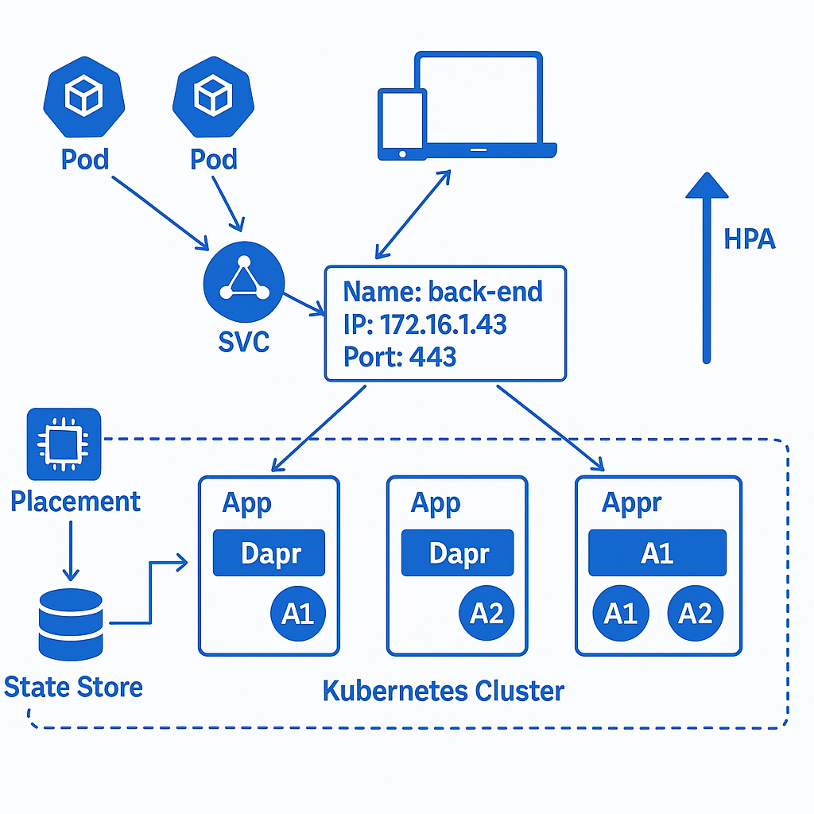

# Understanding Dapr: The Distributed Application Runtime

This tutorial will introduce you to Dapr, the Distributed Application Runtime. We will explore what Dapr is, its core principles and building blocks, the benefits it brings to developing and deploying microservices and distributed applications, and conceptually how it integrates with Helm for deployment and management on platforms like Kubernetes.

### What is Dapr? Enabling Developer Productivity in Distributed Systems

Developing distributed applications, especially microservices, presents significant challenges. Developers need to handle complexities such as state management, service-to-service communication (including retries and error handling), publish/subscribe messaging, secrets management, and more. These cross-cutting concerns often lead to boilerplate code within each service, increasing development time and complexity.

Dapr is an open-source project that aims to solve these challenges by providing a set of pre-built, language-agnostic building blocks that developers can use to easily build resilient, portable microservices. Dapr abstracts away the complexities of underlying infrastructure (like databases, message queues, secrets stores) and provides a consistent API for developers to interact with these capabilities.

Think of Dapr as a set of pluggable components that sit alongside your application code. Your application interacts with Dapr through standard protocols (like HTTP or gRPC), and Dapr then handles the communication with the chosen infrastructure component. This means your application code doesn't need to know the specifics of, say, a particular message queue; it just talks to the Dapr pub/sub building block, and Dapr handles the interaction with whichever message queue is configured (e.g., Kafka, RabbitMQ, Azure Service Bus, etc.).

### How Dapr Works: Sidecars and Building Blocks

Dapr achieves its goals through a **sidecar** architecture. When you deploy your application, a Dapr sidecar process is deployed alongside it, typically in the same pod in Kubernetes. Your application communicates with its local Dapr sidecar over a network protocol. The sidecar then interacts with the Dapr API and the configured infrastructure components on behalf of your application.

This sidecar pattern offers several advantages:

* **Language Agnostic:** Your application can be written in any programming language or framework, as long as it can communicate over standard protocols. The Dapr sidecar handles the interaction with the underlying infrastructure, regardless of your application's language.
* **Decoupling:** Your application code is decoupled from the specifics of the infrastructure. You can switch infrastructure components (e.g., change from one state store to another) with minimal or no changes to your application code, only needing to update Dapr's configuration.

Dapr provides a set of **building blocks**, each addressing a common challenge in distributed systems:

* **Service-to-Service Invocation:** Enables reliable and secure communication between services, including features like retries and distributed tracing.
* **State Management:** Provides a consistent API for managing state in various state stores (e.g., databases, caches), abstracting away the specifics of each store.
* **Publish & Subscribe:** Facilitates asynchronous messaging between services using various message brokers.
* **Bindings:** Allows your application to interact with external systems (like databases, message queues, SaaS services) through input and output bindings.
* **Actors:** Provides a framework for building stateful, single-threaded objects (actors) that simplify concurrent programming.
* **Secrets Management:** Offers a secure way for your application to retrieve secrets from configured secrets stores.
* **Distributed Tracing:** Enables tracing requests as they flow through multiple services.

Each building block has a well-defined API, and you can configure Dapr to use different concrete implementations (components) for each building block based on your needs and infrastructure.

### Advantages of Using Dapr

Adopting Dapr for your distributed applications brings several key advantages:

* **Increased Developer Productivity:** Developers can focus on business logic rather than reinventing solutions for common distributed systems challenges. The pre-built building blocks provide ready-to-use capabilities.
* **Portability:** Applications built with Dapr are portable across different infrastructure and cloud providers. You can run your Dapr-enabled application on Kubernetes, in a VM, or locally, switching underlying components without modifying code.
* **Resiliency:** Dapr's building blocks often include built-in resilience patterns like retries and circuit breakers for service-to-service communication.
* **Consistency:** Dapr provides a consistent API for various infrastructure components, simplifying development and reducing the learning curve for different technologies.
* **Pluggability:** You can easily swap out underlying components (e.g., change your state store from Redis to Cassandra) by simply updating Dapr's configuration, without changing your application code.
* **Observability:** Dapr integrates with distributed tracing and metrics systems, providing better visibility into the behavior of your distributed application.
* **Community and Ecosystem:** Dapr is an open-source project with a growing community and an expanding ecosystem of components and integrations.

### How Dapr Can Be Used with Helm

Helm and Dapr are complementary tools that work well together, particularly when deploying applications on Kubernetes.

* **Dapr Control Plane Deployment:** Dapr itself runs on your Kubernetes cluster and has a control plane that manages the Dapr sidecars and components. You can deploy the Dapr control plane onto your cluster using a pre-built Helm Chart provided by the Dapr community. This simplifies the installation and management of the Dapr infrastructure on Kubernetes.
* **Application Deployment with Dapr Sidecars:** When you deploy your Dapr-enabled application using a Helm Chart, you configure your application's Kubernetes deployment (often within the Chart's templates) to inject the Dapr sidecar. This is typically done by adding specific annotations to your deployment's pod template. When Kubernetes creates the pod for your application, the Dapr control plane sees these annotations and automatically injects the Dapr sidecar container into the pod.
* **Managing Dapr Components:** Dapr's building blocks are configured using YAML files that define which concrete component to use for each building block (e.g., specifying a Redis instance for state management or a Kafka broker for pub/sub). These component definitions can also be managed and deployed as part of your application's Helm Chart, ensuring that your application and its required Dapr components are deployed together.
* **Configuration Management:** Helm's templating and values file capabilities can be used to manage the configuration of both your application and its Dapr sidecar/components for different environments. You can define environment-specific values (like connection strings for state stores or message brokers) in your Helm Chart's values files, and these values will be used to configure Dapr when the Chart is deployed to a specific environment.

In essence, Helm provides the packaging and deployment mechanism for both the Dapr control plane and your Dapr-enabled applications, while Dapr provides the runtime and building blocks that simplify distributed system development. Using them together allows for streamlined, repeatable deployments of your microservices on Kubernetes with built-in capabilities for state management, pub/sub, service invocation, and more.

## Dapr Actors

The image reflects the Dapr Actor architecture:

- **Pods (dotted cluster box)** – each shows **two containers**:  
  **App** &rarr; **Dapr side-car** with its hosted **Actor instances (A1, A2, …)** inside.
- **Placement Service** directs traffic and stores actor maps in the **State Store**.
- The **Service (SVC)** still fronts the pods, while the **HPA arrow** reminds you those pods can scale and Dapr will rebalance actors automatically.

Now, let's explain and discuss the image in more detail and how Kubernetes handles Dapr actors:

Dapr (Distributed Application Runtime) actors are a programming model for building scalable, stateful microservices. In Kubernetes, Dapr integrates seamlessly to manage actors, leveraging Kubernetes' orchestration capabilities. Here's how it works:

1. **Dapr Sidecar Pattern**: Dapr runs as a sidecar container alongside your application containers in a pod. When using Dapr actors, the Dapr runtime (in the sidecar) handles actor lifecycle, messaging, and state management.

2. **Actor Placement Service**: Dapr's actor model relies on a placement service to manage actor instances. In Kubernetes, this placement service is deployed as a separate pod or set of pods. It keeps track of where actor instances are running and ensures they are distributed across the cluster for scalability and fault tolerance.

3. **Actor Hosting in Pods**: Actors are hosted within your application pods. When an actor is invoked, the Dapr sidecar in the pod handles the request, either activating a new actor instance or routing the request to an existing one. Kubernetes ensures the pods are running, and Dapr manages the actors within those pods.

4. **Scaling and Load Balancing**: Kubernetes' Horizontal Pod Autoscaler (HPA) can scale the number of pods based on workload. Dapr's placement service dynamically redistributes actors across the new pods, ensuring even distribution and efficient resource use.

5. **State Management**: Dapr actors often need to store state (e.g., variables or data). Dapr integrates with state stores (like Redis or CosmosDB) that can be deployed in Kubernetes as separate services. The Dapr sidecar in each pod communicates with the state store to persist and retrieve actor state.

6. **Fault Tolerance**: If a pod fails, Kubernetes reschedules it on another node. Dapr ensures that actor instances are reactivated in the new pod, and their state is restored from the state store, maintaining continuity.

7. **Communication**: In the image, the service (SVC) routes traffic to pods. Dapr actors communicate via HTTP/gRPC through the Dapr sidecar, which abstracts the complexity of actor-to-actor communication. Kubernetes services ensure that the Dapr sidecars can reach each other across pods.

In summary, Kubernetes provides the infrastructure (pods, services, scaling) to run Dapr, while Dapr manages the actor model, ensuring actors are distributed, stateful, and resilient within the Kubernetes environment.

Kubernetes typically allows multiple copies (replicas) of a container within pods for stateless applications, enabling scalability and load balancing. However, Dapr actors, being stateful, have a different behavior due to their design, but the limitation isn't exactly that they can "only have one copy of an instance at a time" in the way you might think. Let’s break this down:

1. **Dapr Actors and Stateful Nature**: Dapr actors are stateful entities, meaning each actor instance (identified by a unique actor ID) maintains its own state (e.g., data or variables). The Dapr actor model ensures that for a given actor type and actor ID, only one instance of that actor is active at a time across the entire cluster. This is to guarantee consistency—since the actor’s state is tied to its ID, having multiple active instances of the same actor ID would lead to state conflicts.

2. **Single Active Instance per Actor ID**: In Dapr, the actor runtime (via the placement service) ensures that for a specific actor ID (e.g., `UserActor:123`), there is only one active instance running in the cluster at any given time. This instance lives in a single pod, managed by a Dapr sidecar. If that pod fails, Kubernetes reschedules the pod, and Dapr reactivates the actor in the new pod, restoring its state from the state store. So, while there’s only one *active* instance of a specific actor ID, the actor can move between pods as needed.

3. **Multiple Actors of the Same Type**: While a specific actor instance (e.g., `UserActor:123`) can only be active in one place, you can have many instances of the same actor *type* (e.g., `UserActor:124`, `UserActor:125`, etc.) running concurrently across different pods. Dapr’s placement service distributes these actor instances across the cluster, allowing scalability. For example, if you have 1,000 users, you could have 1,000 `UserActor` instances, each with a unique ID, spread across multiple pods.

4. **Contrast with Stateless Containers**: In a typical Kubernetes setup (like the one in your image), a service might distribute traffic across multiple identical pods running stateless containers. For example, a web server container can have 10 replicas, and Kubernetes load-balances requests across them. But with Dapr actors, the stateful nature means requests for a specific actor ID are always routed to the single active instance of that actor, not load-balanced across multiple copies.

5. **Scaling with Dapr Actors**: While you can’t have multiple active copies of the same actor ID, you can scale the number of pods hosting actors. Dapr will distribute different actor instances across these pods. Kubernetes’ Horizontal Pod Autoscaler (HPA) can still be used to scale the number of pods based on workload, and Dapr ensures that actor instances are placed efficiently across those pods. This way, you achieve scalability for the overall application, even if individual actor instances are singleton-like.

6. **State Management and Consistency**: The single-instance-per-actor-ID rule ensures state consistency. Dapr persists an actor’s state to a state store (e.g., Redis), so even if the pod hosting the actor fails, the state can be reloaded when the actor is reactivated elsewhere. This avoids the need for multiple concurrent instances of the same actor ID, which would complicate state synchronization.

In summary, yes, Dapr actors ensure that only one instance of a specific actor ID is active at a time due to their stateful nature, but this doesn’t limit scalability. You can have many instances of the same actor type (with different IDs) running across multiple pods, and Kubernetes can still scale the number of pods to handle the overall workload. This design balances state consistency with the ability to scale stateful applications.

Let's clarify where a Dapr actor is created in a Kubernetes environment and how the Dapr sidecar plays a role.

1. **Actor Creation and the Dapr Sidecar**: Dapr actors are not created in separate pods. Instead, they are hosted within the existing application pods where the Dapr sidecar already resides. When you deploy an application with Dapr in Kubernetes, each pod typically contains:
   - Your application container (e.g., a microservice written in Node.js, Python, etc.).
   - A Dapr sidecar container (injected via annotations or Dapr’s operator).

   When a Dapr actor is activated (e.g., due to a request to a specific actor ID), the Dapr sidecar in one of these pods handles the creation and management of the actor instance. The actor itself is not a separate container or pod—it’s an in-memory object (or runtime instance) managed by the Dapr sidecar within the pod.

2. **How Dapr Decides Which Pod Hosts the Actor**:
   - **Dapr Placement Service**: Dapr uses a placement service (running as a separate pod in the cluster) to decide where to place an actor instance. When an actor is invoked for the first time (e.g., `UserActor:123`), the placement service determines which pod will host that actor instance based on a consistent hashing algorithm. This ensures that the same actor ID is always routed to the same pod (unless the pod fails and the actor needs to be relocated).
   - **Existing Pods**: The placement service selects from the pool of pods that are already running your application with the Dapr sidecar. For example, if you have 5 pods running your `back-end` service (as in your image), the placement service picks one of those pods to host the new actor instance. It does not create a new pod for the actor.
   - **Load Distribution**: The placement service aims to distribute actor instances evenly across available pods to balance the load. For instance, if you have 1,000 actor instances and 5 pods, Dapr might place roughly 200 actors per pod, depending on the workload and pod capacity.

3. **Does Dapr Create Separate Pods for Actors?**: No, Dapr does not create separate pods to activate actors. Actors are logical entities managed by the Dapr runtime within the sidecar of an existing pod. However:
   - If your application scales (e.g., Kubernetes adds more pods via the Horizontal Pod Autoscaler), Dapr’s placement service will redistribute actors across the new set of pods.
   - If a pod fails, Kubernetes reschedules the pod, and Dapr’s placement service ensures that any actors previously hosted in the failed pod are reactivated in another pod (restoring their state from the state store).

4. **Actor Lifecycle Within the Pod**:
   - When an actor is invoked, the Dapr sidecar in the chosen pod activates the actor by instantiating it in memory within the application container’s runtime (e.g., a .NET or Java runtime).
   - The sidecar handles all communication with the actor, including state management (saving/loading state to/from a state store) and timers/reminders for the actor.
   - If the actor is idle for a period (configurable in Dapr), the sidecar deactivates it to free up resources, but the actor can be reactivated later in the same or a different pod, as determined by the placement service.

5. **Relating to Your Image**: In your diagram, the `back-end` service routes traffic to multiple pods. If these pods are Dapr-enabled (i.e., each has a Dapr sidecar), then Dapr’s placement service will choose one of these pods to host a new actor instance when it’s invoked. For example, if a client requests `UserActor:123`, the placement service might decide that the actor should be activated in the first pod. Subsequent requests to `UserActor:123` will be routed to the same pod, while a different actor like `UserActor:124` might be placed in another pod.

In summary, Dapr actors are created and managed within the existing pods where the Dapr sidecar resides, not in separate pods. The placement service decides which pod hosts a given actor instance, ensuring efficient distribution across the cluster while leveraging Kubernetes’ orchestration for pod management.

If you have five replica pods and five million actors activated, with Dapr distributing them evenly, each pod would indeed host approximately one million actors in memory (5,000,000 ÷ 5 = 1,000,000). Whether a replica pod runs out of memory depends on several factors, including the memory footprint of each actor, the pod's resource limits, and how Dapr and Kubernetes manage the workload. Let’s break this down:

1. **Memory Footprint of Actors**:
   - Each Dapr actor is an in-memory object managed by the Dapr sidecar within the pod’s application container (e.g., a .NET, Java, or Node.js runtime). The memory usage per actor depends on:
     - The size of the actor’s state (e.g., variables, data structures).
     - The complexity of the actor’s logic (e.g., any in-memory computations or caching).
     - Overhead from the runtime environment (e.g., .NET’s CLR or Java’s JVM).
   - For example, if each actor holds a small amount of state (say, a few kilobytes), one million actors might consume a few gigabytes of memory per pod. But if each actor holds larger state (e.g., megabytes), the memory demand could quickly exceed the pod’s capacity.

2. **Pod Resource Limits in Kubernetes**:
   - Kubernetes allows you to set resource requests and limits for each pod in the pod’s specification (via `resources` in the YAML). 
   - If a pod exceeds its memory limit (e.g., 2Gi in this case), Kubernetes will terminate the pod (OOMKilled error) and reschedule it. With one million actors per pod, if their combined memory usage exceeds the pod’s limit, the pod will run out of memory and be killed.

3. **Dapr’s Actor Deactivation**:
   - Dapr has a built-in mechanism to mitigate memory pressure: actor deactivation. If an actor is idle for a configurable period (default is 1 minute, controlled by the `actorIdleTimeout` setting), Dapr deactivates it, removing it from memory. The actor’s state is persisted to the state store (e.g., Redis), and the actor can be reactivated later when needed.
   - However, if all one million actors in a pod are actively being used (i.e., no idle time), they will all remain in memory, increasing the risk of running out of memory.

4. **Scaling Pods to Distribute Load**:
   - If each pod is hosting too many actors and memory usage becomes a concern, you can scale the number of replica pods. For example, if you increase from 5 pods to 50 pods, the number of actors per pod drops to 100,000 (5,000,000 ÷ 50). This reduces the memory load per pod.
   - Kubernetes’ Horizontal Pod Autoscaler (HPA) can automatically scale the number of pods based on metrics like CPU or memory usage. Dapr’s placement service will then redistribute the actors across the new set of pods.

5. **Practical Example**:
   - Let’s say each actor consumes 10 KB of memory (a conservative estimate for small state). One million actors would then use:
     \[
     1,000,000 \times 10 \, \text{KB} = 10,000,000 \, \text{KB} \approx 10 \, \text{GB}
     \]
   - If each pod has a memory limit of 4 GB, it will run out of memory and be terminated by Kubernetes. You’d need to either:
     - Increase the memory limit per pod (e.g., to 12 GB, accounting for additional overhead).
     - Scale to more pods (e.g., 25 pods, so each pod hosts 200,000 actors, using ~2 GB).

6. **Monitoring and Tuning**:
   - To avoid memory issues, you should monitor pod memory usage (using tools like Prometheus or Kubernetes’ built-in metrics) and set appropriate resource requests/limits.
   - Tune Dapr’s `actorIdleTimeout` to deactivate idle actors more aggressively, reducing memory usage.
   - Consider partitioning your actors (e.g., using actor types or sharding strategies) to distribute the load more effectively.

7. **Relating to Your Setup**:
   - In your image, you have pods managed by a service. If these are the replica pods hosting actors, and you’re activating five million actors, memory management becomes critical. Without proper resource limits or scaling, a pod could indeed run out of memory with one million actors, especially if the actors’ state is large or they’re all active.

In summary, yes, a replica pod could run out of memory if the one million actors it hosts exceed its memory limit. To prevent this, you can scale the number of pods, set appropriate memory limits, tune Dapr’s deactivation settings, and monitor memory usage to ensure the cluster can handle the load.

Increasing the number of replica pods is a key strategy to distribute the load of Dapr actors and manage resource constraints like memory usage. Let me confirm and elaborate on how this works in the context of your scenario:

1. **Increasing Replica Pods**:
   - In Kubernetes, you can increase the number of replica pods for your application (e.g., the `back-end` service in your image) by adjusting the `replicas` field in your Deployment or ReplicaSet configuration. 
   - If you increase the replicas from 5 to 10, you’ll now have 10 pods available to host Dapr actors.

2. **Dapr’s Redistribution of Actors**:
   - When new pods are added, Dapr’s placement service (running as a separate pod in the cluster) automatically detects the change in the number of available pods.
   - The placement service then redistributes the actors across all pods to balance the load. For your example with 5 million actors:
     - With 5 pods: 1 million actors per pod (5,000,000 ÷ 5).
     - With 10 pods: 500,000 actors per pod (5,000,000 ÷ 10).
   - This redistribution reduces the memory load on each pod, making it less likely for any single pod to run out of memory.

3. **Automatic Scaling with HPA**:
   - You can also use Kubernetes’ Horizontal Pod Autoscaler (HPA) to automatically increase the number of pods based on resource usage (e.g., memory or CPU). 
   - In this setup, if the average memory usage across pods exceeds 70%, the HPA will increase the number of pods (up to 50), and Dapr will redistribute the actors accordingly.

4. **Impact on Memory**:
   - By increasing the number of pods, the number of actors per pod decreases, reducing the memory demand on each pod. For example, if each actor consumes 10 KB, 500,000 actors per pod (with 10 pods) would use:
     \[
     500,000 \times 10 \, \text{KB} = 5,000,000 \, \text{KB} \approx 5 \, \text{GB}
     \]
   - If the pod’s memory limit is 6 GB, it can now handle the load without running out of memory, compared to 10 GB with 1 million actors per pod.

5. **Relating to Your Image**:
   - Your diagram shows pods behind a service (`back-end`). If these pods are hosting Dapr actors, increasing the number of pods (e.g., from 5 to 10) would allow Dapr to spread the 5 million actors across more pods, reducing the memory pressure on each one.

In summary, increasing the number of replica pods allows more pods to host the actors, reducing the number of actors per pod and mitigating memory issues. Dapr’s placement service handles the redistribution, and Kubernetes’ scaling mechanisms (manual or via HPA) make this process seamless.
