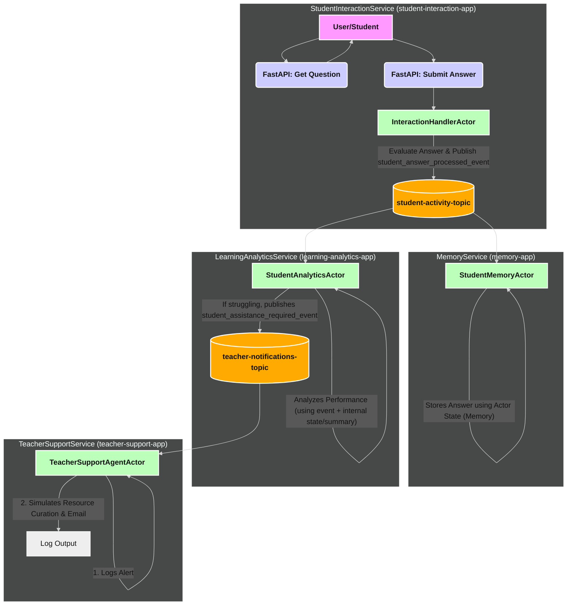

# Advanced Challenge Guide: Q&A Personalized Learning System

This guide provides the detailed step-by-step instructions for implementing the advanced challenge described in the main `readme.md` for the Pub/Sub module.

**Goal**: Build a multi-service DACA application simulating a personalized learning system where student Q&A interactions trigger analysis and potential teacher support, all orchestrated via Dapr pub/sub and actors.

**Scenario Overview**:

1.  `StudentInteractionService`: Presents questions, receives answers, publishes results.
2.  `MemoryService`: Subscribes to answers, stores history in `StudentMemoryActor` state.
3.  `LearningAnalyticsService`: Subscribes to answers, analyzes performance in `StudentAnalyticsActor`, publishes alerts if student struggles.
4.  `TeacherSupportService`: Subscribes to alerts, simulates teacher action in `TeacherSupportAgentActor`.

**System Overview**: This challenge involves creating four distinct microservices, each running in its own Kubernetes Pod (with a Dapr sidecar), and each hosting at least one primary Dapr Actor representing an AI agent function:

1.  **`StudentInteractionService`** (`student-interaction-app`):
    - **Pods**: 1 (+ Dapr sidecar)
    - **Primary Agent Actor**: `InteractionHandlerActor` (Handles incoming answers, publishes events).
    - **Role**: User-facing API and initial event publisher.
2.  **`MemoryService`** (`memory-app`):
    - **Pods**: 1 (+ Dapr sidecar)
    - **Primary Agent Actor**: `StudentMemoryActor` (Subscribes to answers, stores history in state).
    - **Role**: Persistent storage of student interaction history.
3.  **`LearningAnalyticsService`** (`learning-analytics-app`):
    - **Pods**: 1 (+ Dapr sidecar)
    - **Primary Agent Actor**: `StudentAnalyticsActor` (Subscribes to answers, analyzes for patterns, publishes alerts).
    - **Role**: Real-time analysis and identification of students needing assistance.
4.  **`TeacherSupportService`** (`teacher-support-app`):
    - **Pods**: 1 (+ Dapr sidecar)
    - **Primary Agent Actor**: `TeacherSupportAgentActor` (Subscribes to assistance alerts, simulates teacher response).
    - **Role**: Responding to alerts and simulating intervention.

**Total**: 4 AI Apps / 4 Application Pods / 4 Primary Agent Actor types.

**Mermaid Diagram:**

Good luck with the challenge!
