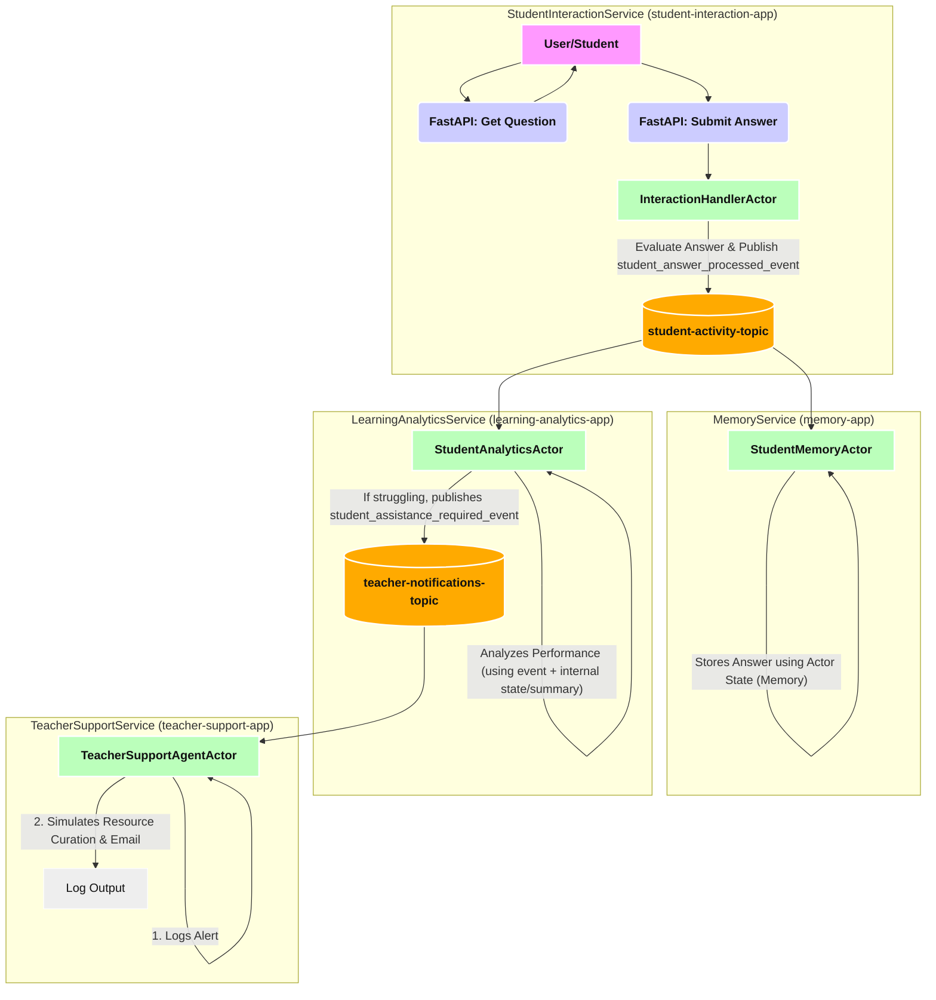

# Step 6.1: AI Actors with Publish/Subscribe - A Deep Dive for DACA Agents

Welcome to the first sub-step of "Event-Driven AI Actors." This guide focuses on enabling your AI Actors – designed with the Dapr Agentic Cloud Ascent (DACA) principles in mind – to communicate asynchronously using Dapr's Publish/Subscribe (Pub/Sub) building block. This pattern is crucial for building scalable, resilient, and decoupled AI agent systems that can handle complex tasks and interactions.

**Goal**: To understand and implement event-driven communication between Dapr Actors using the pub/sub pattern, enabling decoupled interaction suitable for complex AI agent systems.

## Learning Objectives

- **Explain** the role and benefits of pub/sub in distributed AI agent systems, particularly within the DACA framework.
- **Configure** a Dapr pub/sub component (e.g., Redis) for actor communication.
- **Implement** an AI Actor that publishes messages using the Dapr client.
- **Implement** the necessary FastAPI endpoint (using `@dapr_app.subscribe`) to receive pub/sub messages destined for an actor type.
- **Implement** an AI Actor method to process messages received via pub/sub (invoked from the FastAPI handler).
- **Articulate** the message flow: Publisher Actor -> Dapr Pub/Sub Broker -> Dapr Sidecar -> FastAPI Endpoint (`@dapr_app.subscribe`) -> Actor Proxy -> Subscriber Actor Method.
- **Verify** the end-to-end pub/sub flow using logging and testing within a Tilt-based environment.
- **Identify** common troubleshooting steps.

## Why Pub/Sub for DACA AI Agents? Conceptual Benefits

Using a publish/subscribe model is a cornerstone for building sophisticated AI agents aligned with DACA's core principles:

1.  **Decoupling & Modularity (DACA Principle: Simplicity & Open Core)**:

    - **Publishers** (e.g., an AI agent detecting a critical anomaly) don't need direct knowledge of **subscribers** (e.g., a notification agent, a logging agent, an AI agent tasked with root cause analysis).
    - **Subscribers** are equally unaware of the specific publishers.
    - This loose coupling allows you to evolve individual agent capabilities or introduce new specialized agents (subscribers) without altering existing ones. For instance, a `MarketAnalysisAgent` can publish "market_trend_detected" events, and various other agents (PortfolioManagerAgent, NewsAggregatorAgent) can subscribe and react based on their specialized roles. This supports DACA's vision of modular, interoperable agentic systems.

2.  **Scalability (DACA Principle: Scalability from Local to Planet-Scale)**:

    - You can independently scale the number of publisher agents (e.g., many sensor agents publishing data) and subscriber agents (e.g., multiple processing agents for different aspects of the data) based on the workload.
    - The underlying message broker (managed by Dapr) handles message distribution, allowing for high-throughput, many-to-many communication. This is vital for DACA's goal of handling potentially millions of concurrent agents.

3.  **Resilience & Fault Tolerance (DACA Principle: Resilience with Dapr)**:

    - If a subscriber AI agent is temporarily offline or fails, the message broker (depending on its configuration and Dapr component settings) can often retain messages. Once the agent recovers, it can process the queued messages, preventing data loss and ensuring eventual consistency.
    - The failure of one subscriber agent does not cascade to the publisher or other independent subscribers, enhancing overall system robustness.

4.  **Event-Driven Reactivity & Autonomy (DACA Core: AI-First)**:

    - AI agents become truly event-driven, reacting to significant occurrences ("events") within the digital or physical environment they monitor or interact with. An inventory management AI agent, for instance, can subscribe to "low_stock_alert" events published by a monitoring service and autonomously initiate a reordering process.
    - This enables proactive and reactive behaviors, moving beyond simple request-response interactions towards more autonomous operation.

5.  **Information Broadcasting & Targeted Consumption for Context-Awareness**:
    - An agent can broadcast contextual information (e.g., a `UserContextAgent` publishing "user_context_updated" events) to a topic. Other AI agents that require this specific context (e.g., `PersonalizationAgent`, `RecommendationAgent`) can subscribe, ensuring they operate with the latest relevant information.

## Key Dapr Pub/Sub Concepts for Actors - In Detail

Let's break down the Dapr concepts you'll be working with. For more, see the [Dapr Publish & Subscribe Overview](https://docs.dapr.io/developing-applications/building-blocks/pubsub/pubsub-overview/).

- **Message Broker (`spec.type` in component YAML):**

  - Dapr abstracts the message broker. Your choice (Redis, RabbitMQ, Kafka, etc.) is a configuration detail. [See supported pub/sub components](https://docs.dapr.io/reference/components-reference/supported-pubsub/).
  - In your `pubsub.yaml` (likely in `00_lab_starter_code/components/`), `spec.type: pubsub.redis` uses Redis.
  - **For your lab**: Ensure this YAML is correctly referenced by your `Tiltfile`.

- **Pub/Sub Component Name (`metadata.name` in component YAML):**

  - The logical name for your pub/sub setup (e.g., "daca-pubsub"). Used in code and subscription files.
  - **For your lab**: Ensure consistency for `PUBSUB_NAME` in `main.py`, `metadata.name` in `daca-pubsub.yaml`, and `spec.pubsubname` in `pubsub_subscription.yaml`.

- **Topic (`spec.topic` in subscription YAML & `topic_name` in publish call):**

  - A named channel (e.g., "agent-news", "task-updates").
  - **For your lab**: `PUBSUB_TOPIC` in `main.py` used for publishing should match `spec.topic` in `pubsub_subscription.yaml`.

- **Publishing (`dapr_client.publish_event()`):**

  - Your `PublisherActor` uses `DaprClient` to send messages. See [How to: Publish a message](https://docs.dapr.io/developing-applications/building-blocks/pubsub/howto-publish-subscribe/#publish-a-message).
  - `data` should be JSON-serializable.
  - **For your lab**: `PublisherActor.publish_message` will use this.

- **Declarative Subscription (`pubsub_subscription.yaml`):**

  - Defines actor subscriptions. See [How to: Subscribe to topics](https://docs.dapr.io/developing-applications/building-blocks/pubsub/howto-publish-subscribe/#subscribe-to-a-topic) and [Declarative Subscriptions](https://docs.dapr.io/developing-applications/building-blocks/pubsub/howto-publish-subscribe/#declarative-subscriptions).
  - `apiVersion: dapr.io/v2alpha1`, `kind: Subscription`.
  - `spec.routes.default: /ActorType/ActorMethodName`: Crucial for routing messages to the correct actor method.
  - `scopes`: Limits which `app-id` can use this. [Scope pub/sub topic access](https://docs.dapr.io/developing-applications/building-blocks/pubsub/howto-scope-topic-access/).
  - **For your lab**: `pubsub_subscription.yaml` routes to `/SubscriberActor/ReceiveAgentNews`.

- **CloudEvents:**
  - Dapr wraps messages in the CloudEvents v1.0 format. This provides standardized event metadata. Your actor method typically gets the `data` payload directly. [Learn about CloudEvents in Dapr](https://docs.dapr.io/developing-applications/building-blocks/pubsub/pubsub-cloudevents/).

## Understanding Pub/Sub Delivery to Actors via FastAPI

A key point to understand with the Dapr Python SDK and the FastAPI extension (`dapr-ext-fastapi`) is how messages get from the pub/sub topic to your actor method:

1.  **Dapr Sidecar**: Receives the message from the configured message broker (e.g., Redis) for the subscribed topic.
2.  **Subscription Routing**: Looks at the `subscription.yaml`. The `routes.default: /SubscriberActor/ReceiveAgentNews` tells the sidecar to deliver the message by making an HTTP `POST` request to the path `/SubscriberActor/ReceiveAgentNews` on your application's port (e.g., port 8000).
3.  **FastAPI Application**: Your FastAPI application needs an endpoint listening for `POST` requests on `/SubscriberActor/ReceiveAgentNews`. Without this, Dapr's request results in a `404 Not Found`.
4.  **`@dapr_app.subscribe` Decorator**: This convenient decorator (`from dapr.ext.fastapi import DaprApp`) is used to automatically create the required `POST` endpoint in your FastAPI application. It decorates a standard `async def` function.
5.  **Handler Function**: The decorated function (e.g., `receive_agent_news_handler` in the lab code) receives the incoming HTTP POST request from the Dapr sidecar, containing the message (often wrapped in a CloudEvent envelope).
6.  **Bridging to the Actor**: Inside this handler function, _you_ explicitly create an `ActorProxy` for the target actor type and ID (e.g., `SubscriberActor`, potentially using a specific ID or deriving one).
7.  **Actor Method Invocation**: You then use the proxy to call the actual actor method (e.g., `await proxy.ReceiveAgentNews(payload)`), passing the relevant data from the pub/sub message. This proxy call goes through the standard Dapr actor invocation mechanism (via sidecars and placement service) to reach the correct actor instance.
8.  **Actor Logic Executes**: Finally, the `ReceiveAgentNews` method within your `SubscriberActor` class executes.

**Why not direct delivery?** While conceptually simpler, the current Python SDK relies on this HTTP-based delivery mechanism for pub/sub, using the `@dapr_app.subscribe` handler as the bridge into your application code, from which you then interact with the actor system via proxies.

## Primary Lab: Single Application Pub/Sub with Actors

This lab demonstrates the fundamental pub/sub flow implemented in the `hello_pubsub_lab` directory. We use a `PublisherActor` to send messages and a `SubscriberActor` to receive them, using the `@dapr_app.subscribe` handler as the bridge.

### 0. Setup Code

Use the [00_lab_starter_code](https://github.com/panaversity/learn-agentic-ai/tree/main/04_daca_agent_native_dev/05_agent_actors/00_lab_starter_code).

### 1. Verify/Set Up Dapr Components

Your main components directory (e.g., `/components/`) should contain:

- **A Pub/Sub Component (e.g., `pubsub.yaml` from starter code):**

  - **File Location**: `05_agent_actors/components/daca-pubsub.yaml` (or `pubsub.yaml`)
  - **Content Example (ensure `metadata.name` is what you'll use, e.g., `daca-pubsub`):**
    ```yaml
    apiVersion: dapr.io/v1alpha1
    kind: Component
    metadata:
      name: daca-pubsub # This name is critical
      namespace: default # Or your target namespace
    spec:
      type: pubsub.redis
      version: v1
      metadata:
        - name: redisHost
          value: redis-master.default.svc.cluster.local:6379 # For K8s (Tilt)
        - name: redisPassword
          value: ""
      # For actors, this pubsub component can also be used for actor state reminders if needed
      # but it's distinct from the actor state store component itself.
    ```
  - **Action**: Verify this file exists and `redisHost` points to your Redis instance (Tilt deploys one in K8s).

- **Actor Subscription Configuration (e.g., `subscription.yaml`):**
  - **File Location**: `/components/subscription.yaml`
  - **Content**:
    ```yaml
    apiVersion: dapr.io/v2alpha1
    kind: Subscription
    metadata:
      name: agent-news-actor-subscription # Descriptive name for the K8s resource
    spec:
      topic: agent-news # The topic our SubscriberActor will listen to
      pubsubname: daca-pubsub # MUST MATCH the 'metadata.name' of your pub/sub component
      routes:
        default: /SubscriberActor/ReceiveAgentNews # Route to SubscriberActor's method
      scopes:
        - pubsub-app # IMPORTANT: App-ID of the Dapr application running the SubscriberActor
    ```
  - **Action**: Create or verify this file. Ensure `pubsubname` and `scopes` are correct.

### 2. Implement Actors and FastAPI App

Create/Update the Python application for this lab:

- **File Location**: `main.py`
- **Content Structure**:

```python
import logging
import json
from fastapi import FastAPI, HTTPException, Body
from pydantic import BaseModel
from typing import Any # Corrected typing import

from dapr.ext.fastapi import DaprActor, DaprApp # This is the extension
from dapr.actor import Actor, ActorInterface, ActorProxy, ActorId, actormethod
from dapr.clients import DaprClient

# 1. Configure Logging
logging.basicConfig(level=logging.INFO)

# 2. Define Constants
APP_ID = "pubsub-app"
PUBSUB_NAME = "daca-pubsub" # Ensure this matches your pubsub.yaml component name
PUBSUB_TOPIC = "agent-news" # Ensure this matches your subscription.yaml topic

# 3. Initialize FastAPI
app = FastAPI(title="PubSubActorService", description="Dapr Pub/Sub with Actors Example - Primary Lab")
dapr_app = DaprApp(app)


# 4. Data Models
class AgentMessage(BaseModel):
    message_id: str
    content: str
    source_agent: str

# 5. Actor Interfaces
class IPublisherActor(ActorInterface):
    @actormethod(name="PublishMessage")
    async def publish_message(self, data: dict[str, Any]) -> None: # Use dict from typing
        pass

class ISubscriberActor(ActorInterface):
    @actormethod(name="ReceiveAgentNews")
    async def receive_agent_news(self, data: dict[str, Any]) -> None: # Use dict from typing
        pass

# 6. Actor Implementations
# Note: No decorator like @actor_extension.actor_type here
class PublisherActor(Actor, IPublisherActor):
    def __init__(self, ctx, actor_id): # Standard actor constructor
        super().__init__(ctx, actor_id)

    async def _on_activate(self) -> None:
        logging.info(f"PublisherActor {self.id.id} activated.")

    async def publish_message(self, data: dict[str, Any]) -> None:
        actor_id = self.id.id
        logging.info(f"PublisherActor {actor_id}: Publishing message: {data} to topic '{PUBSUB_TOPIC}' via pubsub '{PUBSUB_NAME}'")
        try:
            # It's often better to create DaprClient instances when needed or manage them carefully
            # For actors, self.dapr_client is also available if you need to make calls from an actor to Dapr APIs
            # Make Actor Id part of the data
            data["actor_id"] = actor_id
            with DaprClient() as d_client: # Renamed to avoid conflict if self.dapr_client is used
                d_client.publish_event(
                    pubsub_name=PUBSUB_NAME,
                    topic_name=PUBSUB_TOPIC,
                    data=json.dumps(data),
                    data_content_type='application/json',
                )
            logging.info(f"PublisherActor {actor_id}: Message successfully published.")
        except Exception as e:
            logging.error(f"PublisherActor {actor_id}: Error publishing message: {e}")
            raise

class SubscriberActor(Actor, ISubscriberActor):
    def __init__(self, ctx, actor_id): # Standard actor constructor
        super().__init__(ctx, actor_id)

    async def _on_activate(self) -> None:
        logging.info(f"SubscriberActor {self.id.id} activated. Ready to receive messages on topic '{PUBSUB_TOPIC}'.")

    async def receive_agent_news(self, data: dict[str, Any]) -> None:
        logging.info(f"SubscriberActor {self.id.id}: Received message on topic '{PUBSUB_TOPIC}': {data}")
        # Add any processing logic here

# 7. Initialize DaprActor extension AFTER FastAPI app is created
#    AND AFTER actor classes are defined.
actor_extension = DaprActor(app)

# 8. Register Actors with the DaprActor extension
@app.on_event("startup")
async def startup_event():
    await actor_extension.register_actor(PublisherActor)
    await actor_extension.register_actor(SubscriberActor)
    logging.info("Registered PublisherActor and SubscriberActor.")

# 9. FastAPI Endpoint to Trigger Publisher
@app.post("/publish/{publisher_actor_id}")
async def trigger_publish_message(
    publisher_actor_id: str,
    message: AgentMessage = Body(...)
):
    logging.info(f"API: Received request for PublisherActor {publisher_actor_id} to publish: {message.content}")
    try:
        # DaprClient for proxy creation should be managed correctly,
        # it's often fine to create it on-demand for one-off calls.
        proxy = ActorProxy.create("PublisherActor", ActorId(publisher_actor_id), IPublisherActor)
        await proxy.PublishMessage(message.model_dump())
        return {"status": "Message publishing initiated", "actor_id": publisher_actor_id, "message_content": message.content}
    except Exception as e:
        logging.error(f"API: Error invoking PublisherActor {publisher_actor_id}: {e}")
        raise HTTPException(status_code=500, detail=str(e))

# 10. Health Check
@app.get("/health")
async def health_check():
    return {"status": "OK", "app_id": APP_ID}


@dapr_app.subscribe(pubsub="daca-pubsub", topic="agent-news", route="/SubscriberActor/ReceiveAgentNews")
async def receive_agent_news(data: dict):
    """Receive agent news from pub/sub."""
    logging.info(f"\n\n->[SUBSCRIPTION] Received Agent News: {data}\n\n")
    event_data = data.get("data", "{}")
    actor_id = event_data.get("actor_id", "unknown")
    logging.info(f"Received event: Actor {actor_id} ")
    proxy = ActorProxy.create("SubscriberActor", ActorId(actor_id), ISubscriberActor)
    await proxy.ReceiveAgentNews(data)

    return {"status": "SUCCESS"}
```

- **Action**: Create/update `main.py` with the content above. Pay close attention to the constant names and ensure they align with your YAML files.

### 3. Configure Kubernetes Manifests

- **`deployment.yaml`**:
- Defines the Kubernetes Deployment for your `pubsub-app`.
- **Crucial Dapr Annotations**:

```yaml
apiVersion: apps/v1
kind: Deployment
metadata:
  name: pubsub-app
  namespace: default # Explicit for clarity or Omit and specify via kubectl -n default
spec:
  replicas: 1 # Increase to 2-3 for production
  selector:
    matchLabels:
      app: pubsub-app
  template:
    metadata:
      labels:
        app: pubsub-app
      annotations:
        dapr.io/enabled: "true"
        dapr.io/app-id: "pubsub-app"
        dapr.io/app-port: "8000"
        dapr.io/log-level: "info"
    spec:
      containers:
        - name: app
          image: pubsub-lab-app # CORRECTED: Match the Tiltfile ref
          imagePullPolicy: IfNotPresent
          ports:
            - containerPort: 8000
```

- **`service.yaml`**:
  - Defines a Kubernetes Service to expose your `pubsub-app` deployment internally or externally.
- **Action**: Create or adapt these YAMLs, ensuring the `dapr.io/app-id` is "pubsub-app".

```yaml
apiVersion: v1
kind: Service
metadata:
  name: pubsub-app
  namespace: default # Explicit for clarity
  labels:
    app: pubsub-app
spec:
  selector:
    app: pubsub-app
  ports:
    - protocol: TCP
      port: 80
      targetPort: 8000
      appProtocol: http
  type: ClusterIP
```

- **Update `Tiltfile` (likely `05_agent_actors/00_lab_starter_code/Tiltfile` or a lab-specific one):**
  - **Image Build**: Add/modify a `nerdctl_build` (or `docker_build`) block to build the image for this lab's Dockerfile, tagging it appropriately (e.g., `pubsub-lab-app`).
    ```python
    # In Tiltfile
    nerdctl_build(
        ref='pubsub-lab-app',
        context='.',
        dockerfile='Dockerfile',
        live_update=[
            sync('.', '/code'),
        ]
    )
    ```

### 4. Testing with Tilt

- **Navigate** to the directory containing your main `Tiltfile`.
- **Run**: `tilt up`
- **Observe**: Tilt UI and logs. Look for actor registration.
- **Trigger**: `POST` to `http://localhost:<your_forwarded_port>/publish/testPublisher` with JSON body:
  ```json
  {
    "message_id": "test-01",
    "content": "Hello DACA PubSub!",
    "source_agent": "manual-test"
  }
  ```
- **Verify Logs**: Confirm logs from FastAPI, PublisherActor, the `@dapr_app.subscribe` handler, and SubscriberActor.

---

## Advanced Challenge: Q&A Personalized Learning System

Ready for a more complex scenario? This challenge involves building a multi-service system demonstrating decoupled AI agents collaborating via pub/sub.

**Scenario**: A student interacts with a Q&A system. Their answers are stored by a Memory agent, analyzed by an Analytics agent, and if they struggle, a Teacher Support agent is notified.

**Services Involved**:

1.  **`StudentInteractionService`**: Handles Q&A API, publishes student answers.
2.  **`MemoryService`**: Subscribes to answers, stores interaction history in actor state.
3.  **`LearningAnalyticsService`**: Subscribes to answers, analyzes performance, publishes assistance requests if needed.
4.  **`TeacherSupportService`**: Subscribes to assistance requests, simulates teacher actions.

**High-Level Flow (Mermaid Diagram):**



**Implementation Guide**:
A detailed step-by-step guide for implementing this advanced challenge, including directory structure, code examples for each service, component definitions, Kubernetes manifests, and Tiltfile configuration, can be found in the accompanying file: **`challenge.readme.md`**.

This approach allows you to tackle a more complex, multi-service DACA scenario after mastering the fundamentals in the primary lab.

---

## Troubleshooting / Common Pitfalls

- **Component Name Mismatch**: `PUBSUB_NAME` in code vs. `metadata.name` in `daca-pubsub.yaml` vs. `spec.pubsubname` in `pubsub_subscription.yaml`. They MUST all match.
- **Topic Name Mismatch**: `PUBSUB_TOPIC` in code vs. `spec.topic` in `pubsub_subscription.yaml`.
- **App-ID Scope**: If `scopes` is used in `pubsub_subscription.yaml`, the `dapr.io/app-id` annotation in your K8s deployment (and `APP_ID` in `main.py` if used for consistency) MUST match one of the listed scopes.
- **Route Path Incorrect**: `spec.routes.default` in `pubsub_subscription.yaml` must correctly point to `/ActorTypeName/MethodName`. Case-sensitive.
- **Tilt Not Finding Components/Applying Config**: Check Tilt logs. Ensure `k8s_yaml` paths in `Tiltfile` correctly point to your component and subscription YAMLs.
- **Redis Not Reachable/Configured**: If `redisHost` in `daca-pubsub.yaml` is incorrect or Redis isn't running. Check Dapr sidecar logs via Tilt.
- **Serialization Issues**: Ensure data being published is JSON serializable.

## Expected Outcome (Reiteration for DACA)

This lab provides a foundational understanding of how Dapr pub/sub enables asynchronous, event-driven communication, a critical pattern for building the kind of sophisticated, scalable, and resilient AI agent ecosystems envisioned by the DACA design pattern.

## Further Reading & Dapr Documentation

- [Dapr Publish & Subscribe Building Block Overview](https://docs.dapr.io/developing-applications/building-blocks/pubsub/pubsub-overview/)
- [How-To: Publish a Message and Subscribe to a Topic](https://docs.dapr.io/developing-applications/building-blocks/pubsub/howto-publish-subscribe/)
- [Supported Pub/Sub Components](https://docs.dapr.io/reference/components-reference/supported-pubsub/)
- [Declarative vs. Programmatic Subscriptions](https://docs.dapr.io/developing-applications/building-blocks/pubsub/howto-publish-subscribe/#declarative-and-programmatic-subscriptions)
- [Using CloudEvents with Dapr Pub/Sub](https://docs.dapr.io/developing-applications/building-blocks/pubsub/pubsub-cloudevents/)
- [Dapr Python SDK - Pub/Sub Examples](https://github.com/dapr/python-sdk/tree/master/examples/pubsub)
- [Dapr Actors Overview](https://docs.dapr.io/developing-applications/building-blocks/actors/actors-overview/) (to understand how pub/sub fits into the actor model)
