# Dapr Service Invocation Lab: Caller & Callee

**Goal**: This lab demonstrates how to use Dapr\'s service invocation building block to enable communication between microservices. We will create two Python services, a `caller-service` and a `callee-service`, where the former calls an endpoint on the latter through Dapr. We will also explore basic resiliency with Dapr\'s retry policies.

**Scenario Overview**:

1.  `callee-service`: A simple FastAPI application that exposes an HTTP endpoint (e.g., `/greet`).
2.  `caller-service`: A Python script (or simple FastAPI app) that uses Dapr to discover and call the `/greet` endpoint on the `callee-service`.
3.  Dapr Sidecars: Each service will have a Dapr sidecar, which handles the actual service discovery and invocation.
4.  Resiliency: We\'ll introduce a scenario where the `callee-service` might temporarily fail, and demonstrate Dapr\'s ability to retry the call.

**System Diagram**:

```mermaid
%%{init: {\'theme\': \'dark\', \'themeVariables\': { \'darkMode\': true, \'primaryColor\': \'#333\', \'primaryTextColor\': \'#fff\', \'primaryBorderColor\': \'#555\', \'lineColor\': \'#d3d3d3\', \'textColor\': \'#111\' }}}%%
graph LR
    subgraph Caller Application ["caller-service (caller-app)"]
        direction LR
        A[Python Script] -->|HTTP request via DaprClient or direct Dapr API| B(Dapr Sidecar for Caller)
    end

    subgraph Callee Application ["callee-service (callee-app)"]
        direction LR
        C(Dapr Sidecar for Callee) -->|Forwards request to app| D[FastAPI Endpoint /greet]
    end

    B -->|Network: Dapr invokes callee-app via its Dapr sidecar| C

    classDef app fill:#ccf,stroke:#fff,stroke-width:2px,color:#111,font-weight:bold;
    classDef sidecar fill:#bfb,stroke:#fff,stroke-width:2px,color:#111,font-weight:bold;
    class A,D app;
    class B,C sidecar;
```



---

## Prerequisites

- Docker installed and running.
- Dapr CLI installed. (Follow Dapr installation guide: [https://docs.dapr.io/getting-started/install-dapr-cli/](https://docs.dapr.io/getting-started/install-dapr-cli/))
- Dapr initialized in self-hosted mode (`dapr init`).
- Python 3.8+ installed.
- `uv` installed (`pip install uv`).
- Tilt installed (Optional, but recommended for easy running: [https://tilt.dev/](https://tilt.dev/))
- Basic understanding of FastAPI and Docker.

---

## Implementation Steps

### 1. Directory Structure Setup

Navigate to the `05_agent_actors/06_event_driven_actors/02_service_invocation/` directory (or your chosen lab directory) and create the following structure:

```bash
mkdir -p callee_service/kubernetes
mkdir -p caller_service/kubernetes
mkdir -p components
```

### 2. Implement `callee-service`

This service will expose an endpoint that returns a greeting.

- **File**: `callee_service/main.py`

  ```python
  import logging
  from fastapi import FastAPI, HTTPException
  import uvicorn
  import os

  logging.basicConfig(level=logging.INFO)
  logger = logging.getLogger(__name__)

  APP_ID = "callee-app"
  app = FastAPI(title="CalleeService")

  # Counter to simulate temporary failures for retry demonstration
  fail_count = 0
  MAX_FAILS_BEFORE_SUCCESS = 2 # Will fail the first 2 times it\'s called

  @app.get("/greet/{name}")
  async def greet(name: str):
      global fail_count
      logger.info(f"Greet endpoint called with name: {name}. Current fail_count: {fail_count}")

      if os.getenv("SIMULATE_FAILURE") == "true" and fail_count < MAX_FAILS_BEFORE_SUCCESS:
          fail_count += 1
          logger.warning(f"Simulating failure #{fail_count} for greet endpoint.")
          raise HTTPException(status_code=500, detail=f"Simulated temporary error from callee-service (attempt {fail_count})")

      # Reset fail_count after successful processing or if not simulating failure
      fail_count = 0
      message = f"Hello, {name} from {APP_ID}!"
      logger.info(f"Successfully processed greet request. Responding with: {message}")
      return {"message": message}

  if __name__ == "__main__":
      port = int(os.getenv("APP_PORT", "8001"))
      logger.info(f"Starting CalleeService on port {port}")
      uvicorn.run(app, host="0.0.0.0", port=port)
  ```

- **File**: `callee_service/pyproject.toml`

  ```toml
  [project]
  name = "callee_service"
  version = "0.1.0"
  description = "Dapr Callee Service for Service Invocation Lab"
  authors = [{ name = "Your Name", email = "you@example.com" }]
  dependencies = [
      "fastapi>=0.100.0",
      "uvicorn[standard]>=0.20.0",
      "dapr>=1.10.0", # Dapr SDK (though not strictly used for basic receiving here, good practice)
      "python-dotenv>=0.21.0"
  ]
  requires-python = ">=3.8"

  [build-system]
  requires = ["hatchling"]
  build-backend = "hatchling.build"

  [tool.hatch.metadata]
  allow-direct-references = true
  ```

- **File**: `callee_service/Dockerfile`

  ```dockerfile
  FROM python:3.10-slim

  WORKDIR /app

  # Install uv
  RUN pip install uv

  COPY pyproject.toml .
  # Install dependencies using uv
  RUN uv pip install --system --no-cache --no-deps -r <(uv pip freeze --no-deps) .

  COPY . .

  # Expose the app port, Dapr will connect to this.
  # The actual port can be overridden by APP_PORT env var.
  EXPOSE 8001
  # Dapr sidecar gRPC and HTTP ports (for reference, Dapr sets these up)
  # EXPOSE 50001
  # EXPOSE 3501

  # Default command, can be overridden. APP_PORT is used by main.py
  CMD ["uvicorn", "main:app", "--host", "0.0.0.0", "--port", "8001"]
  ```

- **File**: `callee_service/.dockerignore`
  ```
  __pycache__/
  *.pyc
  *.pyo
  *.pyd
  .Python
  env/
  venv/
  .env
  .pytest_cache
  .hypothesis/
  ```

### 3. Implement `caller-service`

This service will call the `callee-service`.

- **File**: `caller_service/main.py`

  ```python
  import logging
  import os
  import time
  import httpx # Using httpx for async requests

  logging.basicConfig(level=logging.INFO)
  logger = logging.getLogger(__name__)

  DAPR_HTTP_PORT = os.getenv("DAPR_HTTP_PORT", "3500")
  CALLEE_APP_ID = "callee-app" # The Dapr app ID of the service to call
  INVOKE_URL_TEMPLATE = f"http://localhost:{DAPR_HTTP_PORT}/v1.0/invoke/{CALLEE_APP_ID}/method/greet"

  async def call_callee_greet(name_to_greet: str):
      url = f"{INVOKE_URL_TEMPLATE}/{name_to_greet}"
      logger.info(f"Attempting to call: {url}")
      try:
          async with httpx.AsyncClient() as client:
              response = await client.get(url)
              response.raise_for_status() # Raise an exception for HTTP error codes
              result = response.json()
              logger.info(f"Successfully called callee-service. Response: {result}")
              return result
      except httpx.HTTPStatusError as e:
          logger.error(f"HTTP error calling callee-service: {e.status_code} - {e.response.text}")
          return {"error": str(e), "details": e.response.text if e.response else "No response body"}
      except httpx.RequestError as e:
          logger.error(f"Request error calling callee-service: {e}")
          return {"error": str(e)}
      except Exception as e:
          logger.error(f"An unexpected error occurred: {e}")
          return {"error": str(e)}

  async def main():
      # Example: Call the service once
      name = "Dapr User"
      response = await call_callee_greet(name)
      print(f"Response from callee: {response}")

      # Example: Call in a loop with a delay for testing retries if SIMULATE_FAILURE is on
      # Make sure to set SIMULATE_FAILURE="true" as an env var for the callee-app
      # if os.getenv("TEST_RETRY") == "true":
      #     logger.info("TEST_RETRY is true. Will call callee-service multiple times.")
      #     for i in range(5):
      #         logger.info(f"Retry test, attempt {i+1}")
      #         response = await call_callee_greet(f"RetryTester_{i+1}")
      #         print(f"Attempt {i+1} response: {response}")
      #         time.sleep(2) # Wait before next call

  if __name__ == "__main__":
      import asyncio
      # For simplicity, running directly. In a real app, this might be part of a FastAPI endpoint.
      # To test retry, you might want to run this script after starting the callee-service with SIMULATE_FAILURE=true
      # For example, from the command line:
      # DAPR_HTTP_PORT=3500 python caller_service/main.py (if callee-service is already running via dapr run)

      # To run as a simple script that calls and exits:
      asyncio.run(main())

      # To run as a FastAPI app for continuous calls (uncomment below and adjust main.py)
      # import uvicorn
      # from fastapi import FastAPI
      # app = FastAPI(title="CallerService")
      # @app.get("/call-greet/{name}")
      # async def trigger_call(name: str):
      #     return await call_callee_greet(name)
      # port = int(os.getenv("APP_PORT", "8002"))
      # uvicorn.run(app, host="0.0.0.0", port=port)
  ```

  _Note: For this lab, we\'ll run `caller_service/main.py` as a script. You can adapt it to be a FastAPI service if needed._

- **File**: `caller_service/pyproject.toml`

  ```toml
  [project]
  name = "caller_service"
  version = "0.1.0"
  description = "Dapr Caller Service for Service Invocation Lab"
  authors = [{ name = "Your Name", email = "you@example.com" }]
  dependencies = [
      "httpx>=0.24.0", # For making HTTP requests
      "python-dotenv>=0.21.0"
      # "fastapi>=0.100.0", # Uncomment if making it a FastAPI app
      # "uvicorn[standard]>=0.20.0", # Uncomment if making it a FastAPI app
      # "dapr>=1.10.0" # Dapr SDK, useful for more complex scenarios
  ]
  requires-python = ">=3.8"

  [build-system]
  requires = ["hatchling"]
  build-backend = "hatchling.build"

  [tool.hatch.metadata]
  allow-direct-references = true
  ```

- **File**: `caller_service/Dockerfile` (Only needed if you plan to run caller as a long-running service with Dapr, not strictly for a simple script execution but good for completeness)

  ```dockerfile
  FROM python:3.10-slim

  WORKDIR /app

  RUN pip install uv
  COPY pyproject.toml .
  RUN uv pip install --system --no-cache --no-deps -r <(uv pip freeze --no-deps) .

  COPY . .

  # If running as a script that Dapr launches and then exits:
  CMD ["python", "main.py"]

  # If adapting main.py to be a FastAPI service:
  # EXPOSE 8002
  # CMD ["uvicorn", "main:app", "--host", "0.0.0.0", "--port", "8002"]
  ```

- **File**: `caller_service/.dockerignore` (Same as `callee_service/.dockerignore`)

### 4. Dapr Multi-App Run Configuration

This file tells Dapr how to run both your applications together.

- **File**: `dapr.yaml` (create this in the root of `02_service_invocation` or adjust paths)
  ```yaml
  version: 1
  apps:
    - appID: callee-app
      appDirPath: ./callee_service/
      appPort: 8001 # The port your callee FastAPI app runs on
      command: ["uvicorn", "main:app", "--host", "0.0.0.0", "--port", "8001"]
      # To enable failure simulation for retry testing:
      # env:
      #   SIMULATE_FAILURE: "true"
    - appID: caller-app
      appDirPath: ./caller_service/
      # No appPort needed if it\'s just a script that Dapr runs
      # If caller_service/main.py is a FastAPI app, define appPort and adjust command
      command: ["python", "main.py"]
      # For caller-app to know where Dapr is, Dapr injects DAPR_HTTP_PORT, DAPR_GRPC_PORT
      # dependsOn: # Optional: ensure callee-app starts first, though Dapr handles discovery
      #   - callee-app
  # Optional: Define resources path if resiliency.yaml is outside ./components
  # common:
  #   resourcesPath: ./components
  ```
  _Ensure `appDirPath` points correctly to your service directories relative to where you run `dapr run -f dapr.yaml`._

### 5. Dapr Resiliency Configuration (for Retries)

Let\'s define a simple retry policy. Dapr automatically picks up `resiliency.yaml` from the default components path (`./components` or `~/.dapr/components`) or from the `resourcesPath` specified in `dapr run`.

- **File**: `components/resiliency.yaml`

  ```yaml
  apiVersion: dapr.io/v1alpha1
  kind: Resiliency
  metadata:
    name: myresiliency # Can be any name
  scopes:# Optional:
    Apply to specific apps
    # - caller-app # Apply this policy to the caller-app when it makes outbound calls
    # - callee-app # Apply this policy if callee-app makes calls to other services

  spec:
    policies:
      retries:
        # Example: A simple constant backoff retry policy
        myRetryPolicy: # Name of the policy
          policy: constant
          duration: 5s # Wait 5 seconds between retries
          maxRetries: 3 # Attempt up to 3 retries

    targets:
      apps:
        # Apply myRetryPolicy to calls made from ANY app to callee-app
        # More specific: apply when caller-app calls callee-app
        callee-app: # Target appID being called
          retry: myRetryPolicy
          # You can also define timeouts and circuit breakers here
          # timeout: 5s
          # circuitBreaker: myCircuitBreakerPolicy
  ```

  _Note: For service invocation, the resiliency policy is typically applied on the **caller** side for outgoing calls, or more broadly to any call targeting a specific `appID`._
  *To make this effective, the `caller-app` would need to be the one initiating the calls to `callee-app` using Dapr service invocation. The example `resiliency.yaml` above is configured to apply `myRetryPolicy` when *any* Dapr-enabled app tries to invoke `callee-app`.*
  *If you scope `resiliency.yaml` to `caller-app`, it applies to *all* outbound calls from `caller-app`.*

### 6. Configure `Tiltfile` (Optional, for easy running)

Create a `Tiltfile` in the root of `02_service_invocation` directory (or your main project Tiltfile).

- **File**: `Tiltfile` (example snippet, adapt to your project structure)

  ```python
  # Assuming Tiltfile is in 05_agent_actors/06_event_driven_actors/02_service_invocation/
  # Adjust paths if your Tiltfile is elsewhere

  # Build callee-service image
  nerdctl_build(
      ref=\'callee-service-app\',
      context=\'./callee_service\',
      dockerfile_contents=read_file(\'./callee_service/Dockerfile\')
  )

  # Build caller-service image (if you run it as a long-running containerized app)
  # For this lab, we might run caller_service/main.py directly via dapr.yaml command
  # so this build might not be strictly necessary if not deploying to k8s via Tilt.
  # nerdctl_build(
  #     ref=\'caller-service-app\',
  #     context=\'./caller_service\',
  #     dockerfile_contents=read_file(\'./caller_service/Dockerfile\')
  # )

  # Dapr multi-app run.
  # Dapr components like resiliency.yaml are usually loaded from default paths
  # or specified via --resources-path in dapr run command, which dapr.yaml can\'t directly set.
  # Ensure your resiliency.yaml is in ./components or ~/.dapr/components.
  # Alternatively, you can load it as a k8s_yaml if running in Kubernetes mode with Tilt.
  # For local Dapr CLI, dapr run -f dapr.yaml --resources-path ./components might be needed.
  # Tilt\'s local_resource or `custom_build` with `dapr run` could manage this.

  # For local dapr run with Tilt:
  # This approach uses Tilt to manage the Dapr multi-app process.
  local_resource(
      name=\'dapr-services\',
      cmd=\'dapr run -f ./dapr.yaml --resources-path ./components\', # Ensure components dir exists here
      # serve_cmd=\'dapr run -f ./dapr.yaml --resources-path ./components\',
      # deps helps Tilt know when to restart this local_resource
      deps=[\'./callee_service/main.py\', \'./caller_service/main.py\', \'./dapr.yaml\', \'./components/resiliency.yaml\']
  )

  # If you were deploying to Kubernetes with Tilt:
  # k8s_yaml([\'./components/resiliency.yaml\']) # If it\'s a K8s custom resource
  # k8s_resource(
  # \'callee-app-deployment\', # Assuming you create k8s deployment YAMLs
  # new_name=\'callee-app\',
  # port_forwards=[\'8001:8001\'], # App port
  # extra_pod_selectors=[{\'dapr.io/app-id\': \'callee-app\'}]
  # )
  # k8s_resource(
  # \'caller-app-deployment\',
  # new_name=\'caller-app\',
  # port_forwards=[\'8002:8002\'], # If caller is also a service
  # extra_pod_selectors=[{\'dapr.io/app-id\': \'caller-app\'}]
  # )
  ```

  _Note on Tilt & Dapr CLI: Tilt\'s `local_resource` is good for managing the `dapr run -f ...` command. Ensure the paths in `dapr.yaml` (`appDirPath`) and `Tiltfile` (`context`, `deps`) are correct relative to where `tilt up` is executed._

---

## Testing the Setup

### Method 1: Using Dapr CLI directly (without Tilt)

1.  **Ensure `resiliency.yaml` is in the right place**:
    Copy or move `components/resiliency.yaml` to your default Dapr components folder (usually `~/.dapr/components` on Linux/macOS or `%USERPROFILE%\\.dapr\\components` on Windows) OR ensure you use `--resources-path` with `dapr run`.
    For this lab, it\'s easier to use `--resources-path`. Create a `components` directory in the same directory as `dapr.yaml` and place `resiliency.yaml` there.

2.  **Navigate to the directory containing `dapr.yaml`**.

    ```bash
    cd 05_agent_actors/06_event_driven_actors/02_service_invocation
    # or wherever your dapr.yaml and service folders are relative to
    ```

3.  **Run the Dapr applications**:

    ```bash
    # This command assumes dapr.yaml, callee_service, caller_service, and components
    # directories are correctly structured relative to the execution path.
    dapr run -f ./dapr.yaml --resources-path ./components
    ```

4.  **Observe the output**:

    - You should see logs from Dapr starting up both `callee-app` and `caller-app`.
    - The `caller-app` (our `caller_service/main.py` script) will attempt to call the `callee-app`.
    - `callee-app` will log the incoming request to `/greet`.

5.  **Test Retry (Simulating Failures)**:
    - Stop the current `dapr run` (Ctrl+C).
    - Modify `dapr.yaml` to set `SIMULATE_FAILURE: "true"` for `callee-app`:
      ```yaml
      # ... inside dapr.yaml, for callee-app
      apps:
        - appID: callee-app
          appDirPath: ./callee_service/
          appPort: 8001
          command:
            ["uvicorn", "main:app", "--host", "0.0.0.0", "--port", "8001"]
          env:
            SIMULATE_FAILURE: "true" # <--- ADD THIS
      # ...
      ```
    - Re-run `dapr run -f ./dapr.yaml --resources-path ./components`.
    - Observe the logs. You should see `callee-service` logging "Simulating failure..." for the first couple of calls.
    - The `caller-service` logs should show initial failures (if it prints detailed errors) followed by a success due to Dapr\'s retry policy defined in `resiliency.yaml`. Dapr sidecar logs for `caller-app` will show the retries happening.

### Method 2: Using Tilt

1.  **Ensure your `Tiltfile` is correctly configured** as described in Step 6. Make sure paths are correct.
2.  **Navigate to the directory containing your `Tiltfile`**.
3.  **Run Tilt**:
    ```bash
    tilt up
    ```
4.  **Observe the Tilt UI** (usually at `http://localhost:10350`):
    - You\'ll see resources for `dapr-services` (or individual services if using K8s mode).
    - Check the logs for `callee-app` and `caller-app` (or the combined log from `local_resource`).
5.  **Test Retry with Tilt**:
    - To simulate failures, you would typically update the `dapr.yaml` (as in Method 1) or set the `SIMULATE_FAILURE` environment variable for the `callee-app` in a way Tilt can pick up (e.g., if building a K8s deployment, update env vars there).
    - If using `local_resource` with `dapr run`, modifying `dapr.yaml` and saving it should trigger Tilt to restart the `dapr-services` resource.

---

## Key Dapr Concepts Covered

- **Service Invocation**: Calling another service (`callee-app`) by its Dapr `appID` without needing to know its IP address or port. Dapr handles the discovery and routing.
  - Invocation URL: `http://localhost:<dapr-http-port>/v1.0/invoke/<TARGET_APP_ID>/method/<METHOD_NAME>`
- **Dapr Sidecars**: Each application runs with a Dapr sidecar (`daprd`). The sidecar enables Dapr building blocks like service invocation, state management, pub/sub, etc.
- **`appID`**: A unique identifier for your application within the Dapr environment.
- **Dapr Multi-App Run (`dapr.yaml`)**: A convenient way to define and run multiple Dapr applications locally for development and testing.
- **Resiliency (`resiliency.yaml`)**: Configuration for Dapr\'s resiliency features, such as automatic retries, timeouts, and circuit breakers. We demonstrated a simple retry policy.
  - **Retries**: If a call from `caller-app` to `callee-app` fails (e.g., `callee-app` returns a 5xx error or is temporarily unavailable), Dapr can automatically retry the call based on the defined policy.

---

## How Dapr Service Invocation Works (Simplified)

1.  Your `caller-service` wants to call the `/greet` method on `callee-service`.
2.  Instead of calling `callee-service` directly, it makes an HTTP GET request to its _own_ Dapr sidecar:
    `http://localhost:3500/v1.0/invoke/callee-app/method/greet/DaprUser`
    (Assuming `DAPR_HTTP_PORT` for `caller-service` is 3500, and `callee-app` is the target `appID`).
3.  The `caller-service`'s Dapr sidecar receives this request.
4.  It uses Dapr's name resolution (e.g., mDNS locally, Kubernetes DNS in a cluster) to find the location (IP/port) of the `callee-app`'s Dapr sidecar.
5.  The `caller-service`'s sidecar then forwards the request to the `callee-app`'s sidecar.
6.  The `callee-app`'s Dapr sidecar receives the request and forwards it to the actual `/greet/DaprUser` endpoint on the `callee-service` application (e.g., `http://localhost:8001/greet/DaprUser`).
7.  The response from `callee-service` goes back through the Dapr sidecars to the `caller-service`.

If retries are configured and the call from `caller-service`'s sidecar to `callee-app`'s sidecar (or the subsequent call to the `callee-app` itself) fails with a retryable error, the `caller-service`'s sidecar will handle the retry logic.

---

## Further Exploration

- **gRPC Invocation**: Try converting the services to use gRPC for communication via Dapr.
- **Dapr SDK**: Use the Dapr Python SDK in `caller-service` to make the invocation call instead of raw `httpx`.
  ```python
  # from dapr.clients import DaprClient
  # async with DaprClient() as d:
  #     response = await d.invoke_method_async(
  #         app_id=\'callee-app\',
  #         method_name=\'greet\',
  #         data=None, # Or pass data if it were a POST
  #         http_verb=\'GET\', # For GET, often method_name includes path params
  #         http_querystring=((\'name\', \'DaprUserFromSDK\'),) # if it was a query param
  #     )
  # For path params, you might need to structure method_name or use POST
  # Often, invoke_method is simpler with POST/PUT and a body.
  # For GET with path params, direct HTTP call to Dapr sidecar is common.
  ```
- **More Complex Resiliency**: Explore timeout policies and circuit breakers in `resiliency.yaml`.
- **Distributed Tracing**: Observe how Dapr automatically provides traces for service invocation calls in a tracing backend like Zipkin (if configured).
- **Secure Invocation with mTLS**: Understand that Dapr can automatically encrypt traffic between sidecars using mTLS, securing your service-to-service communication. This is on by default in Kubernetes.
- **Actor Invocation**: While this lab focuses on direct service-to-service invocation, Dapr Actors can also invoke methods on other actors or services.

This lab provides a foundational understanding of Dapr service invocation. It\'s a powerful building block for creating robust and scalable microservice applications.
