# [Dapr Service Invocation](https://docs.dapr.io/developing-applications/building-blocks/service-invocation/service-invocation-overview/) Lab: From Basic Call to Resilient Agent Communication

**Goal**: This lab demonstrates how to use Dapr\'s service invocation building block to enable communication between AI Agents. We will create two Python services, a `caller-service` and a `callee-service`, where the former calls an endpoint on the latter through Dapr. We will also explore basic resiliency with Dapr\'s retry policies.


**Scenario Overview**:

**Phase 1: Basic Service Invocation**
1.  `callee-service`: A simple FastAPI application that exposes an HTTP endpoint (e.g., `/greet`) to return a greeting.
2.  `caller-service`: A Python FastAPI application that uses Dapr to discover and call the `/greet` endpoint on the `callee-service`.
3.  Dapr Sidecars: Each service will have a Dapr sidecar, which handles the actual service discovery and invocation.

**Phase 2: Adding Resiliency**
1.  Introduce simulated, temporary failures in the `callee-service`.
2.  Configure Dapr with a resiliency policy to automatically retry failed calls from the `caller-service` to the `callee-service`.

**System Diagram**:

```mermaid
%%{init: {'theme': 'dark', 'themeVariables': { 'darkMode': true, 'primaryColor': '#333', 'primaryTextColor': '#fff', 'primaryBorderColor': '#555', 'lineColor': '#d3d3d3', 'textColor': '#111' }}}%%
graph LR
    subgraph Caller Application ["caller-service (caller-app)"]
        direction LR
        A[Python App/FastAPI] -->|HTTP request via Dapr API| B(Dapr Sidecar for Caller)
    end

    subgraph Callee Application ["callee-service (callee-app)"]
        direction LR
        C(Dapr Sidecar for Callee) -->|Forwards request to app| D[FastAPI Endpoint /greet]
    end

    B -->|Network: Dapr invokes callee-app via its Dapr sidecar| C

    classDef app fill:#ccf,stroke:#fff,stroke-width:2px,color:#111,font-weight:bold;
    classDef sidecar fill:#bfb,stroke:#fff,stroke-width:2px,color:#111,font-weight:bold;
    class A,D app;
    class B,C sidecar;
```


---

## Implementation Steps

### Lab 1

Lab1 is our starter code. Clone and run
```bash
tilt up
```

Here we have 2 microservices/ai-apps. One Calls the other and other returns a Greeting Message.

- `callee-service`: This service will expose an endpoint that returns a greeting. It fails for 2 times and then returns it.

- `caller-service`: This service will call the `callee-service` using Dapr SDK. The new code that invokes service invocation is:

- **File**: `caller_service/main.py`

```python
    with DaprClient() as client:
        response = await client.invoke_method_async(
            app_id=CALLEE_APP_ID,
            method_name=f"greet/{name_to_greet}?simulate_failure=True",
            data={},
        )
```

Try it out and understand how it works

### Lab 2: Dapr Resiliency Configuration (for Retries)

Let\'s define a simple retry policy. Dapr automatically picks up `resiliency.yaml`.

- **File**: `components/resiliency.yaml`

  ```yaml
  apiVersion: dapr.io/v1alpha1
  kind: Resiliency
  metadata:
    name: myresiliency # Can be any name
  scopes:# Optional:
    Apply to specific apps
    # - caller-app # Apply this policy to the caller-app when it makes outbound calls
    # - callee-app # Apply this policy if callee-app makes calls to other services

  spec:
    policies:
      retries:
        # Example: A simple constant backoff retry policy
        myRetryPolicy: # Name of the policy
          policy: constant
          duration: 5s # Wait 5 seconds between retries
          maxRetries: 3 # Attempt up to 3 retries

    targets:
      apps:
        # Apply myRetryPolicy to calls made from ANY app to callee-app
        # More specific: apply when caller-app calls callee-app
        callee-app: # Target appID being called
          retry: myRetryPolicy
          # You can also define timeouts and circuit breakers here
          # timeout: 5s
          # circuitBreaker: myCircuitBreakerPolicy
  ```

  _Note: For service invocation, the resiliency policy is typically applied on the **caller** side for outgoing calls, or more broadly to any call targeting a specific `appID`._
  *To make this effective, the `caller-app` would need to be the one initiating the calls to `callee-app` using Dapr service invocation. The example `resiliency.yaml` above is configured to apply `myRetryPolicy` when *any* Dapr-enabled app tries to invoke `callee-app`.*
  *If you scope `resiliency.yaml` to `caller-app`, it applies to *all* outbound calls from `caller-app`.*

### Testing the Setup Using Tilt

1.  **Ensure your `Tiltfile` is correctly configured** as described in Step 6. Make sure paths are correct.
2.  **Navigate to the directory containing your `Tiltfile`**.
3.  **Run Tilt**:
    ```bash
    tilt up
    ```
4.  **Observe the Tilt UI** (usually at `http://localhost:10350`):
    - You\'ll see resources for `dapr-services` (or individual services if using K8s mode).
    - Check the logs for `callee-app` and `caller-app` (or the combined log from `local_resource`).
5.  **Test Retry with Tilt**:
    - To simulate failures, you would typically update the `dapr.yaml` (as in Method 1) or set the `SIMULATE_FAILURE` environment variable for the `callee-app` in a way Tilt can pick up (e.g., if building a K8s deployment, update env vars there).
    - If using `local_resource` with `dapr run`, modifying `dapr.yaml` and saving it should trigger Tilt to restart the `dapr-services` resource.

---

## How Dapr Service Invocation Works (Simplified)

1.  Your `caller-service` wants to call the `/greet` method on `callee-service`.
2.  Instead of calling `callee-service` directly, it makes an HTTP GET request to its _own_ Dapr sidecar using Dapr SDK:
    `http://localhost:3500/v1.0/invoke/callee-app/method/greet/DaprUser`
3.  The `caller-service`'s Dapr sidecar receives this request.
4.  It uses Dapr's name resolution (e.g., mDNS locally, Kubernetes DNS in a cluster) to find the location (IP/port) of the `callee-app`'s Dapr sidecar.
5.  The `caller-service`'s sidecar then forwards the request to the `callee-app`'s sidecar.
6.  The `callee-app`'s Dapr sidecar receives the request and forwards it to the actual `/greet/DaprUser` endpoint on the `callee-service` application (e.g., `http://localhost:8001/greet/DaprUser`).
7.  The response from `callee-service` goes back through the Dapr sidecars to the `caller-service`.

If retries are configured and the call from `caller-service`'s sidecar to `callee-app`'s sidecar (or the subsequent call to the `callee-app` itself) fails with a retryable error, the `caller-service`'s sidecar will handle the retry logic.

---

## Further Exploration

- **More Complex Resiliency**: Explore timeout policies and circuit breakers in `resiliency.yaml`.
- **Secure Invocation with mTLS**: Understand that Dapr can automatically encrypt traffic between sidecars using mTLS, securing your service-to-service communication. This is on by default in Kubernetes.
- **Actor Invocation**: While this lab focuses on direct service-to-service invocation, Dapr Actors can also invoke methods on other actors or services.

This lab provides a foundational understanding of Dapr service invocation. It\'s a powerful building block for creating robust and scalable microservice applications.

# Important Reading Resources
- https://docs.dapr.io/operations/resiliency/resiliency-overview/
- https://docs.dapr.io/developing-applications/building-blocks/service-invocation/service-invocation-overview/
- https://docs.dapr.io/concepts/security-concept/#sidecar-to-sidecar-communication