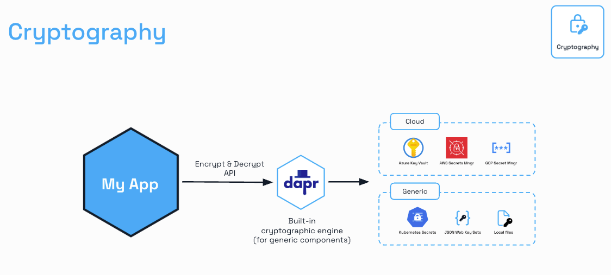

# Step 1: [Cryptography API](https://docs.dapr.io/developing-applications/building-blocks/cryptography/) - Safe Encryption and Decryption in your AI Apps

In this step, you’ll secure the `ChatAgent` actor’s conversation history from `02_chat_actor/` by using Dapr’s Cryptography API to encrypt and decrypt message content. This protects user data privacy at the application level, aligning with DACA’s focus on secure, privacy-conscious AI agents. You must have completed `02_chat_actor/` to proceed, as the hands-on part builds on its `ChatAgent` implementation.

## Why Use Dapr's Cryptography API?

Applications frequently need to use cryptography to protect sensitive data, ensure compliance with regulations (like GDPR or HIPAA), and enhance overall security. However, implementing cryptography correctly is challenging. Developers often face difficulties in:

  * **Choosing appropriate algorithms and options:** Selecting an algorithm that is both secure and suitable for the use case can be complex.
  * **Managing and protecting keys:** Securely storing, distributing, and rotating cryptographic keys is a critical and often difficult task. Improper key management can undermine the entire security posture.
  * **Limiting access to raw key material:** Ensuring that application code itself doesn't have direct access to raw keys is a best practice for minimizing attack surfaces.
  * **Operational complexities:** Managing cryptographic operations and keys across different environments and teams can be operationally burdensome.

Dapr's Cryptography API building block addresses these challenges by providing a consistent and secure way to perform cryptographic operations. It allows your application to:

  * **Perform cryptographic operations safely:** Dapr guides towards safe algorithms and practices, abstracting away some of the complexities.
  * **Keep keys outside the application:** Keys are managed by Dapr components (like secret stores or external key vaults), and operations are performed in the Dapr sidecar or within a connected key vault, without exposing raw key material directly to your application code.
  * **Achieve better separation of concerns:** By using external vaults or Dapr-managed components, responsibilities for key management can be separated from application development.
  * **Simplify key management and rotation:** Keys can be managed and rotated in the configured store or vault, often without requiring application restarts or developer involvement for the rotation itself (though re-encryption logic might be needed in the app).

For DACA agents, which handle potentially sensitive data like conversation histories, Dapr’s Cryptography API is invaluable. It enables the encryption of specific data fields (e.g., message content) *before* they are stored (e.g., in Redis). This application-level encryption provides granular control and ensures confidentiality. Unlike Dapr's state store encryption (which encrypts the entire state at an infrastructure level), the Cryptography API allows for selective encryption, fitting well with least privilege practices.



For example, a DACA agent storing chat messages can encrypt message content to comply with privacy laws. This ensures compliance and builds trust, especially in regulated environments (e.g., healthcare under HIPAA).

### Learning Objectives

  * Understand the challenges Dapr's Cryptography API solves.
  * Configure Dapr’s Cryptography API with a secret store for secure key management.
  * Update `ChatAgent` to encrypt/decrypt message content using HTTP API calls to the Dapr sidecar.
  * Verify encrypted data in Redis using `HGETALL`.
  * Understand the Cryptography API’s role in achieving DACA’s security and privacy goals.

## Cryptographic Components & Key Management

Dapr's Cryptography API relies on cryptographic components:

1.  **Components interacting with external key vaults:** These components (e.g., for Azure Key Vault) allow Dapr to orchestrate cryptographic operations that are performed *within* the external vault. Dapr itself doesn't see the private keys in this model.
2.  **Components using Dapr’s own cryptographic engine:** These components (often with `.dapr.` in their type name, like the one we'll use with Kubernetes secrets) perform cryptographic operations *within the Dapr sidecar*. Keys are sourced from configured Dapr secret stores (e.g., local files, Kubernetes secrets, HashiCorp Vault). While Dapr (the sidecar) knows the keys in this model, they are still not exposed to your application.

In this lab, we use a Kubernetes secret store, meaning Dapr's cryptographic engine in the sidecar will perform the operations using a key retrieved from that secret store.

  * **Secret Store for Keys**: Encryption keys are defined in a Dapr secret store component (e.g., `components/secretstore.yaml` pointing to Kubernetes secrets). This prevents plaintext keys in application configuration or code.
  * **Key Requirements**: Keys must be compatible with the chosen algorithm (e.g., a 32-byte key for AES-256, which is common in schemes like Dapr Crypto Scheme v1). Keys should be generated securely (e.g., using `openssl`).
  * **Key Referencing**: In API calls to `/encrypt` or `/decrypt`, keys are referenced by their name in the secret store (e.g., `secretstore://encryption-key?key=key`), not by their actual value.
  * **Security**: This design ensures keys remain confined to the Dapr sidecar or the external key vault, reducing the risk if the application itself is compromised.

## [Hands-On Cryptography](https://docs.dapr.io/developing-applications/building-blocks/cryptography/howto-cryptography/) with Dapr Virtual Actor

### Lab Starter Code

### 0. Setup
This lab requires you to complete `02_chat_actor/` first. Use the code from `00_lab_starter_code/` at [GitHub: learn-agentic-ai/04_daca_agent_native_dev/05_agent_actors/00_lab_starter_code](https://github.com/panaversity/learn-agentic-ai/tree/main/04_daca_agent_native_dev/05_agent_actors/00_lab_starter_code) as your starter code.

Ensure Rancher Desktop has sufficient resources (at least 3GB memory, 2 CPUs):
- Open Rancher Desktop > Preferences > Virtual Machine > Hardware.
- Set Memory: 3GB, CPUs: 2. Increase to 4GB/4 CPUs if pods crash.

### 1. Configure Dapr Components
Keep `pubsub.yaml` and `subscription.yaml` from `02_chat_actor/`. Configure a secret store for the Cryptography API.

**File**: `components/crypto.yaml`
```yaml
apiVersion: dapr.io/v1alpha1
kind: Component
metadata:
  name: secretstore # <--- IMPORTANT: This name MUST match CRYPTO_COMPONENT_NAME in main.py
  namespace: default # <--- Ensure this matches your application's namespace
spec:
  type: crypto.dapr.kubernetes.secrets # <--- This is the Kubernetes Secrets Crypto Provider type
  version: v1
  metadata:
    - name: defaultNamespace
      value: "default"
      secretKeyRef:
        name: encryption-key
        key: key
```

Create a Kubernetes Secret with a secure 32-byte key:
```bash
openssl rand 32 | base64
```

Store the secret in **kubernetes/encryption-secret.yaml**

```yaml
# kubernetes/encryption-secret.yaml
apiVersion: v1
kind: Secret
metadata:
  name: encryption-key
  namespace: default
type: Opaque
stringData: # <-- Using 'stringData'
  key: <YOUR_GENERATED_KEY> 
```

Create kubernetes/srr_role.yaml file
```yaml
apiVersion: rbac.authorization.k8s.io/v1
kind: Role
metadata:
  name: secret-reader # This should match the existing Role name to update it
  namespace: default
  labels: # Preserving labels that might have been set
    app.kubernetes.io/component: rbac
    app.kubernetes.io/managed-by: tilt 
    app.kubernetes.io/name: dapr
    app.kubernetes.io/part-of: dapr
    app.kubernetes.io/version: "1.15.4" # Use the Dapr version you are running
rules:
- apiGroups: [""] # Core API group
  resources: ["secrets"]
  verbs: ["get", "list", "watch"] # Added "list" and "watch"

```

Apply new secret components by updating Tiltfile:

```bash
load('ext://helm_remote', 'helm_remote') # helm extension -> Dapr Helm Chart
load('ext://nerdctl', 'nerdctl_build') # nerdctl extension -> Docker Build

update_settings(k8s_upsert_timeout_secs=900) # Increase apply timeout for Helm deployments

# 1. Build the FastAPI image using nerdctl
nerdctl_build(
    ref='daca-ai-app',
    context='.',
    dockerfile='Dockerfile',
    live_update=[
        sync('.', '/code'),
    ]
)

# 2. Deploy Dapr
helm_remote(
    chart='dapr',
    repo_url='https://dapr.github.io/helm-charts/',
    repo_name='dapr',
    version='1.15',
    release_name='dapr',
    namespace='dapr-system',
    create_namespace=True,
    set=['global.mtls.enabled=false', 'global.ha.enabled=false', 'dapr_scheduler.ha=true', 'dapr_placement.ha=true']
)

helm_remote(
    chart='dapr-dashboard',
    repo_url='https://dapr.github.io/helm-charts/',
    repo_name='dapr',
    release_name='dapr-dashboard',
    namespace='dapr-system',
)


k8s_resource(
    'dapr-dashboard',
    port_forwards=[port_forward(local_port=8080, container_port=8080, name='dapr-dashboard-ui')],
    labels=['dapr-ui']
)

helm_remote(
    chart='redis',
    repo_url='https://charts.bitnami.com/bitnami',
    repo_name='bitnami',
    release_name='redis',
    namespace='default',
    set=['auth.enabled=false']
)

k8s_yaml(['./components/statestore.yaml', './components/pubsub.yaml'])

k8s_yaml(['./components/subscriptions.yaml'])

k8s_yaml(['./kubernetes/encryption-secret.yaml'])

k8s_yaml(['./components/crypto.yaml'])


# Above Dapr setup is Completed
k8s_yaml(['kubernetes/deployment.yaml', 'kubernetes/service.yaml'])

k8s_yaml(['kubernetes/srr_role.yaml'], allow_duplicates=True)


k8s_resource(
    'daca-ai-app',
    port_forwards='8000:8000',
)
```


### 2. Update Dapr Actor Code
Update `main.py` to encrypt message content before storing in Redis and decrypt when retrieving, using the Cryptography API’s HTTP endpoints.

**File**: `main.py`
```python
import logging
import json

from fastapi import FastAPI
from dapr.clients import DaprClient
from dapr.clients.grpc._crypto import EncryptOptions, DecryptOptions

# Configure logging
logging.basicConfig(level=logging.INFO)

app = FastAPI(title="ChatAgentService",
              description="DACA Step 1: Cryptography API with SDK")

# Constants for Dapr Cryptography
CRYPTO_COMPONENT_NAME = "secretstore"
CRYPTO_KEY_NAME = "encryption-key"

options = EncryptOptions(
    component_name=CRYPTO_COMPONENT_NAME,
    key_name=CRYPTO_KEY_NAME,
    key_wrap_algorithm='AES',
)

decrypt_options = DecryptOptions(
    component_name=CRYPTO_COMPONENT_NAME,
    key_name=CRYPTO_KEY_NAME
)


@app.post("/encrypt")
async def encrypt_value(data: dict):
    """Encrypt a value using DaprClient."""
    with DaprClient() as dapr_client:
        encrypt_resp = dapr_client.encrypt(json.dumps(data), options)
        return {"encrypted": encrypt_resp.read()}

# Test route that decrypts any value


@app.post("/decrypt")
async def decrypt_value(data: str):
    """Decrypt a value using DaprClient."""
    with DaprClient() as dapr_client:
        decrypt_resp = dapr_client.decrypt(data, decrypt_options)
        return {"decrypted": decrypt_resp.read()}

```

### 3. Start Application
```bash
tilt up
```

### 4. Test the App
Test endpoints:
```bash
curl -X POST http://localhost:8000/chat/user1 -H "Content-Type: application/json" -d '{"role": "user", "content": "Hi there"}'
curl http://localhost:8000/chat/user1/history
```

Check Redis for encrypted data:
```bash
kubectl exec -it $(kubectl get pods -n default | grep redis | awk '{print $1}') -- redis-cli
KEYS *
TYPE daca-ai-app||ChatAgent||user1||history-user1
HGETALL daca-ai-app||ChatAgent||user1||history-user1
```

**Expected Output**:
- POST: `{"response": {"role": "assistant", "content": "Got your message: Hi there"}}`
- GET: `{"history": [{"role": "user", "content": "Hi there"}, {"role": "assistant", "content": "Got your message: Hi there"}]}`
- Redis:
```bash
127.0.0.1:6379> KEYS *
1) "daca-ai-app||ChatAgent||user1||history-user1"
2) "user-chat"
127.0.0.1:6379> TYPE daca-ai-app||ChatAgent||user1||history-user1
hash
127.0.0.1:6379> HGETALL daca-ai-app||ChatAgent||user1||history-user1
1) "data"
2) "[{\"role\":\"user\",\"content\":\"<base64-encoded-ciphertext>\"},{\"role\":\"assistant\",\"content\":\"<base64-encoded-ciphertext>\"}]"
3) "version"
4) "<number>"
```
The `content` fields in the `data` value should contain base64-encoded ciphertext (e.g., `"SGk...=="`), confirming encryption.

For comparison, redeploy `02_chat_actor/` (without Cryptography API) and check Redis:
```bash
HGETALL daca-ai-app||ChatAgent||user1||history-user1
1) "data"
2) "[{\"role\":\"user\",\"content\":\"Hi there\"},{\"role\":\"assistant\",\"content\":\"Got your message: Hi there\"}]"
3) "version"
4) "<number>"
```
The `content` fields should show plaintext JSON.

### 5. Understand the Setup
- **Code Changes**: `main.py` encrypts/decrypts message content using Dapr’s Cryptography API, calling `/encrypt` and `/decrypt` endpoints.
- **Secret Store**: `secretstore.yaml` accesses Kubernetes secrets for the encryption key.
- **State Store**: `statestore.yaml` configures Redis without infrastructure-level encryption, as the Cryptography API handles encryption.
- **Functionality**: Preserves `process_message`, `get_conversation_history`, and pub/sub, with encrypted content.

## Key Takeaways
- The Cryptography API secures specific data fields without exposing raw key material to the application.
- Differs from state encryption, which encrypts all state transparently but requires complex infrastructure.
- Uses a secret store for secure key management, supporting DACA’s security needs.
- Ensures DACA agents meet privacy and compliance requirements through application-level encryption.

## Troubleshooting
- **Plaintext in Redis**:
  - Verify `main.py` includes `/encrypt` and `/decrypt` calls.
  - Ensure `secretstore.yaml` is applied: `kubectl get components.dapr.io secretstore -n default`.
  - Check secret exists: `kubectl get secret encryption-key -n default`.
  - Verify secret content: `kubectl get secret encryption-key -o jsonpath='{.data.key}' | base64 -d`. Should be a 44-character base64 string (32 bytes).
  - Check sidecar logs for API errors: `kubectl logs <daca-ai-app-pod-name> -c daprd -n default`.
- **Pod Status `1/2`**:
  - Check sidecar logs: `kubectl logs <daca-ai-app-pod-name> -c daprd -n default`. Look for errors like `failed to fetch secret`.
  - Verify Dapr sidecar is running: `kubectl describe pod <daca-ai-app-pod-name> -n default`.
  - Increase Rancher Desktop resources: Preferences > Virtual Machine > Memory: 4GB, CPUs: 4.
- **API Call Failures**:
  - Ensure Dapr sidecar is accessible at `localhost:3500`: `curl http://localhost:3500/v1.0/healthz` (from within the pod).
  - Check secretstore configuration: `kubectl describe component secretstore -n default`.
- **State or Actor Errors**:
  - Confirm Redis connectivity: `kubectl get pods -n default | grep redis`.
  - Verify Redis service: `kubectl get svc redis-master -n default`.
  - Ensure Dapr annotations in `kubernetes/deployment.yaml`:
    ```yaml
    annotations:
      dapr.io/enabled: "true"
      dapr.io/app-id: "daca-ai-app"
      dapr.io/app-port: "8000"
    ```

## Next Steps
- Proceed to `02_serialization/` to optimize state storage with Protocol Buffers.
- In `11_actor_security/`, explore advanced Cryptography API use cases and state encryption.
- Experiment with key rotation by updating the `encryption-key` secret.

## Resources
- [Dapr Cryptography API](https://docs.dapr.io/developing-applications/building-blocks/cryptography/)
- [Dapr Secret Stores](https://docs.dapr.io/developing-applications/building-blocks/secrets/secrets-overview/)
- [Kubernetes Secrets](https://kubernetes.io/docs/concepts/configuration/secret/)
- [Labs Starter Code](https://github.com/panaversity/learn-agentic-ai/tree/main/04_daca_agent_native_dev/05_agent_actors/00_lab_starter_code)