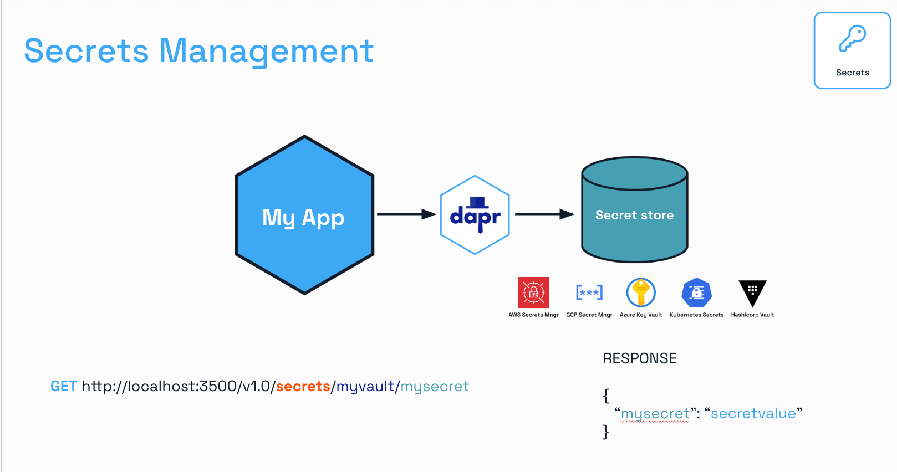

# Step 1: [State Encryption](https://docs.dapr.io/developing-applications/building-blocks/state-management/howto-encrypt-state/)

!! NEEDS FIXING - Encryption not working as expected

In this step, you’ll secure the actor’s conversation history from by enabling Dapr’s state encryption for Redis.

This protects user data privacy without modifying actor code, aligning with DACA’s focus on secure, privacy-conscious AI agents. You must have completed `02_chat_actor/` to proceed, as the hands on part builds on its `ChatAgent` implementation.

## Why State Encryption?

DACA agents, like `ChatAgent`, store sensitive data (e.g., conversation history) in state stores. Dapr’s state encryption ensures this data is encrypted at rest, preventing unauthorized access if the store (Redis) is compromised. The state encryption is infrastructure-level, transparently securing all state for a configured store. This step uses state encryption for its simplicity and no-code approach, ideal for protecting actor state in conversational AI.

Dapr secures **application state** (data stored by an application) when it is **at rest** (not actively being processed or transmitted). Below is a breakdown of the meaning:

1. **Encrypt Application State at Rest**:

   - **Application state** refers to data an application stores, such as user settings, session data, or database records.
   - **At rest** means the data is stored (e.g., on disk, in a database, or in memory when not in use).
   - Encryption ensures this stored data is protected by converting it into an unreadable format (ciphertext) that can only be decrypted with the correct key.
   - This is critical for **enterprise workloads** (large-scale business applications) or **regulated environments** (industries like finance or healthcare with strict compliance requirements, e.g., GDPR, HIPAA).

2. **Provide Stronger Security**:

   - Encrypting data at rest prevents unauthorized access if the storage medium is compromised (e.g., stolen drives, hacked servers).
   - It adds a layer of protection for sensitive data, ensuring compliance with security standards and reducing the risk of data breaches.

3. **Dapr Offers Automatic Client-Side Encryption**:

   - **Dapr** automates the encryption process on the **client side** (within the application or client device) before the data is sent to storage.
   - **Client-side encryption** means the data is encrypted before it leaves the application, ensuring that even the storage system (e.g., database or cloud provider) only sees encrypted data.
   - This automation simplifies development, as developers don’t need to manually implement encryption logic.

4. **Based on AES in Galois/Counter Mode (GCM)**:

   - The encryption uses the **Advanced Encryption Standard (AES)**, a widely trusted symmetric encryption algorithm.
   - **Galois/Counter Mode (GCM)** is a mode of operation for AES that provides both:
     - **Confidentiality**: Encrypts data to keep it secret.
     - **Authentication**: Generates an authentication tag to verify data integrity and authenticity (ensuring it hasn’t been tampered with).
   - GCM is efficient, supports parallel processing, and is ideal for high-performance applications.

5. **Supporting Keys of 128, 192, and 256-Bits**:
   - AES in GCM mode supports three key sizes: **128-bit**, **192-bit**, and **256-bit**.
   - Larger keys provide stronger security:
     - 128-bit: Secure for most applications.
     - 192-bit and 256-bit: Used for highly sensitive data or environments requiring stronger protection (e.g., government or military).
   - The choice of key size balances security needs with performance (larger keys require more computational power).

### Practical Meaning:

- Dapr’s feature allows developers to easily encrypt sensitive application data before storing it, using the robust **AES-GCM** algorithm.
- This is particularly valuable for:
  - **Enterprise workloads**: Large-scale systems handling sensitive business data.
  - **Regulated environments**: Industries with legal requirements for data protection.
- By automating client-side encryption, Dapr ensures that data remains secure even if the storage system is compromised, and it simplifies compliance with security regulations.

### Example Scenario:

A healthcare application built with Dapr stores patient records. To comply with HIPAA, the records must be encrypted at rest. Dapr automatically encrypts the data using AES-256 in GCM mode before saving it to a database. Even if an attacker accesses the database, they can only see encrypted data, and the authentication tag ensures the data hasn’t been altered.

## Key Concepts

### How Dapr State Encryption Works

Dapr’s state encryption uses **AES-256 in Galois/Counter Mode (GCM)**, a secure, authenticated encryption standard. It operates client-side within the Dapr sidecar:

- **Encryption**: Before saving state to the store (e.g., Redis), Dapr encrypts the data using a symmetric key.
- **Decryption**: When retrieving state, Dapr decrypts the data transparently.
- **Integration**: Applied via state store configuration (`statestore.yaml`), requiring no application code changes.
- **State Store Support**: Works with all Dapr state stores (e.g., Redis, PostgreSQL), ensuring consistency.

This approach secures all actor state (e.g., `ChatAgent`’s history) without modifying the actor’s logic, making it ideal for DACA agents handling sensitive data.

### Key Management

Encryption keys are stored in a Dapr secret store (e.g., Kubernetes secrets) to prevent plaintext exposure:

- **Secret Store**: A Dapr component (`secretstore.yaml`) retrieves keys securely.
- **Key Requirements**: Must be 32 bytes for AES-256, generated securely (e.g., via `openssl`).
- **No Plaintext Keys**: Keys are referenced via `secretKeyRef` in `statestore.yaml`, never hardcoded.
- **Security**: Limits key access to the Dapr sidecar, reducing risk if the application is compromised.

### Key Rotation

Dapr supports **primary and secondary encryption keys** for seamless key rotation:

- **Primary Key**: Used to encrypt new or updated state.
- **Secondary Key**: Decrypts state encrypted with an older key during rotation.
- **Process**: Update `primaryEncryptionKey` to a new secret; move the old key to `secondaryEncryptionKey`. Dapr tries the primary key first, then the secondary if decryption fails.
- **Re-Encryption**: Old data is re-encrypted with the primary key only when updated by the application.
- **Implication**: Retain the secondary key until all old data is re-encrypted to avoid data loss.

This ensures production systems can rotate keys without downtime, a critical DACA requirement.

## Hands-On Dapr Virtual Actor

### Lab Starter Code

This lab concept requires you to comple `02_chat_actor/` first.

Use the code from `00_lab_starter_code/` at [GitHub: learn-agentic-ai/04_daca_agent_native_dev/05_agent_actors/00_lab_starter_code](https://github.com/panaversity/learn-agentic-ai/tree/main/04_daca_agent_native_dev/05_agent_actors/00_lab_starter_code) as your starter code.

### 1. Configure Dapr Components

Keep `pubsub.yaml` and `subscription.yaml` from `00_lab_starter_code/`. Add a secret store and update the state store for encryption.

We will configure a [Dapr Secret Store](https://docs.dapr.io/developing-applications/building-blocks/secrets/secrets-overview/). It can use Kubernetes Secret or any other Vault.



By default, Dapr enables a built-in Kubernetes secret store in Kubernetes mode, deployed via the Helm defaults. If you are using another secret store, you can disable (not configure) the Dapr Kubernetes secret store by adding the annotation dapr.io/disable-builtin-k8s-secret-store: "true" to the deployment.yaml file.

**File**: `components/secretstore.yaml`

```yaml
apiVersion: dapr.io/v1alpha1
kind: Component
metadata:
  name: secretstore
  namespace: default
spec:
  type: secretstores.kubernetes
  version: v1
  metadata: []
```

**File**: `components/statestore.yaml`

```yaml
apiVersion: dapr.io/v1alpha1
kind: Component
metadata:
  name: statestore
  namespace: default
spec:
  type: state.redis
  version: v1
  metadata:
    - name: redisHost
      value: redis-master.default.svc.cluster.local:6379
    - name: redisPassword
      value: ""
    - name: actorStateStore
      value: "true"
    - name: primaryEncryptionKey
      secretKeyRef:
        name: encryption-key # This name must match the metadata.name of the Secret below
        key: key # This key must match the key name in the Secret's data section
```

**File:** `kubernetes/encryption-secret.yaml`

1. Secure Key Generation for Dapr's primaryEncryptionKey:

```bash
  openssl rand 16 | hexdump -v -e '/1 "%02x"'
```

2. Create Kubernetes secret file and store it

```yaml
# kubernetes/encryption-secret.yaml
apiVersion: v1
kind: Secret
metadata:
  name: encryption-key # This name is referenced by the statestore.yaml secretKeyRef
  namespace: default
type: Opaque
stringData: # <-- Using 'stringData'
  key: <YOUR_GENERATED_KEY> # <-- Put the raw hex string here
```

We can apply components directly BUT instead let's update our Tilefile:

- After applying k8s_yaml(['./components/subscriptions.yaml']) we can furst apply kubernetes secrets yaml file and then dapr secret file. Here's the relevant part

```python
k8s_yaml(['./components/subscriptions.yaml'])

# New Encryption Secret
k8s_yaml(['./kubernetes/encryption-secret.yaml'])

# New Secret Store
k8s_yaml(['./components/secretstore.yaml'])

# Above Dapr setup is Completed

# 1. Build the FastAPI image using nerdctl
nerdctl_build(
    ref='daca-ai-app',
    context='.',
    dockerfile='Dockerfile',
    live_update=[
        sync('.', '/code'),
    ]
)
```

### 2. Add Basic Dapr Actor Code

Setup main.py with a basic actor like we did in step 1 or 2.

```python
import logging
import json
from fastapi import FastAPI, HTTPException
from pydantic import BaseModel
from dapr.ext.fastapi import DaprActor
from dapr.actor import Actor, ActorInterface, ActorProxy, ActorId, actormethod
from dapr.clients import DaprClient

# Configure logging
logging.basicConfig(level=logging.INFO)

app = FastAPI(title="ChatAgentService", description="DACA Step 2: Chat Actor")

# Add Dapr Actor Extension
actor = DaprActor(app)

class Message(BaseModel):
    role: str
    content: str

# Define the actor interface
class ChatAgentInterface(ActorInterface):
    @actormethod(name="ProcessMessage")
    async def process_message(self, user_input: Message) -> Message | None:
        pass

    @actormethod(name="GetConversationHistory")
    async def get_conversation_history(self) -> list[dict] | None:
        pass

# Implement the actor
class ChatAgent(Actor, ChatAgentInterface):
    def __init__(self, ctx, actor_id):
        super().__init__(ctx, actor_id)
        self._history_key = f"history-{actor_id.id}"
        self._actor_id = actor_id

    async def _on_activate(self) -> None:
        """Initialize state on actor activation."""
        logging.info(f"Activating actor for {self._history_key}")
        try:
            history = await self._state_manager.get_state(self._history_key)
            if history is None:
                logging.info(f"State not found for {self._history_key}, initializing")
                await self._state_manager.set_state(self._history_key, [])
            else:
                logging.info(f"State found for {self._history_key}: {history}")
        except Exception as e:
            logging.warning(f"Non-critical error in _on_activate: {e}")
            await self._state_manager.set_state(self._history_key, [])

    async def process_message(self, user_input: Message) -> Message:
        """Process a user message and append to history."""
        try:
            logging.info(f"Processing message for {self._history_key}: {user_input}")
            user_input = Message.model_validate(user_input)
            # Load history
            history = await self._state_manager.get_state(self._history_key)
            current_history = history if isinstance(history, list) else []

            # Append user message
            current_history.append({"role": "user", "content": user_input.content})

            # Generate response (static for simplicity)
            # CHALLENGE: Make the response dynamic by calling an LLM (e.g., via an API like Gemini)
            response = Message(role="assistant", content=f"Got your message: {user_input.content}")

            # Append assistant response
            current_history.append(response.model_dump())
            if len(current_history) > 5:  # Limit to last 5 exchanges
                current_history = current_history[-5:]

            # Save updated history
            await self._state_manager.set_state(self._history_key, current_history)
            logging.info(f"Processed message for {self._history_key}: {user_input.content}")

            # Publish event
            await self._publish_conversation_event(user_input, response)

            return response.model_dump()
        except Exception as e:
            logging.error(f"Error processing message for {self._history_key}: {e}")
            raise

    async def _publish_conversation_event(self, user_input: Message, response: Message) -> None:
        """Publish a ConversationUpdated event to the user-chat topic."""
        event_data = {
            "actor_id": self._actor_id.id,
            "history_key": self._history_key,
            "actor_type": "ChatAgent",
            "event_type": "ConversationUpdated",
            "input": user_input.model_dump(),
            "output": response.model_dump()
        }
        with DaprClient() as client:
            try:
                client.publish_event(
                    pubsub_name="daca-pubsub",
                    topic_name="user-chat",
                    data=json.dumps(event_data)
                )
                logging.info(f"Published event for {self._history_key}: {event_data}")
            except Exception as e:
                logging.error(f"Failed to publish event: {e}")

    async def get_conversation_history(self) -> list[dict]:
        """Retrieve conversation history."""
        try:
            history = await self._state_manager.get_state(self._history_key)
            return history if isinstance(history, list) else []
        except Exception as e:
            logging.error(f"Error getting history for {self._history_key}: {e}")
            return []

# Register the actor
@app.on_event("startup")
async def startup():
    await actor.register_actor(ChatAgent)
    logging.info(f"Registered actor: {ChatAgent.__name__}")

# FastAPI endpoints to invoke the actor
@app.post("/chat/{actor_id}")
async def process_message(actor_id: str, data: Message):
    """Process a user message for the actor."""
    if not data.content or not isinstance(data.content, str):
        raise HTTPException(status_code=400, detail="Invalid or missing 'content' field")
    proxy = ActorProxy.create("ChatAgent", ActorId(actor_id), ChatAgentInterface)
    response = await proxy.ProcessMessage(data.model_dump())
    return {"response": response}

@app.get("/chat/{actor_id}/history")
async def get_conversation_history(actor_id: str):
    """Retrieve the actor's conversation history."""
    proxy = ActorProxy.create("ChatAgent", ActorId(actor_id), ChatAgentInterface)
    history = await proxy.GetConversationHistory()
    return {"history": history}

# Subscription endpoint for pub/sub events
@app.post("/subscribe")
async def subscribe_message(data: dict):
    """Handle events from the user-chat topic."""
    try:
        logging.info(f"\n\n->[SUBSCRIPTION] Received event: {data}\n\n")
        event_data_raw = data.get("data", "{}")
        event_data = json.loads(event_data_raw)
        user_id = event_data.get("actor_id", "unknown")
        input_message = event_data.get("input", {}).get("content", "no message")
        output_message = event_data.get("output", {}).get("content", "no response")
        logging.info(f"Received event: User {user_id} sent '{input_message}', got '{output_message}'")
        return {"status": "Event processed"}
    except json.JSONDecodeError as e:
        logging.error(f"Failed to decode event data: {e}")
        return {"status": "Invalid event data format"}
```

### 3. Start Application

```
tilt up
```

### 4. Test the App

Test endpoints:

```bash
curl -X POST http://localhost:8000/chat/user1 -H "Content-Type: application/json" -d '{"role": "user", "content": "Hi there"}'
curl http://localhost:8000/chat/user1/history
```

Check Redis for encrypted data:

```bash
kubectl exec -it $(kubectl get pods -n default | grep redis | awk '{print $1}') -- redis-cli
KEYS *
TYPE daca-ai-app||ChatAgent||user1||history-user1
HGETALL daca-ai-app||ChatAgent||user1||history-user1
```

**Expected Output**:

- POST: `{"response": {"role": "assistant", "content": "Got your message: Hi there"}}`
- GET: `{"history": [{"role": "user", "content": "Hi there"}, {"role": "assistant", "content": "Got your message: Hi there"}]}`
- Redis

```bash
127.0.0.1:6379> KEYS *
1) "daca-ai-app||ChatAgent||user1||history-user1"
2) "user-chat"
127.0.0.1:6379> TYPE daca-ai-app||ChatAgent||user1||history-user1
hash
127.0.0.1:6379> HGETALL daca-ai-app||ChatAgent||user1||history-user1
1) "data"
2) "[{\"role\":\"user\",\"content\":\"Hi there\"},{\"role\":\"assistant\",\"content\":\"Got your message: Hi there\"}]"
3) "version"
4) "2"
```

For comparison, redeploy `02_chat_actor/` (without encryption) and check Redis for plain JSON.

### 5. Understand the Setup

- **No Code Changes**: `main.py` is unchanged; encryption is infrastructure-level.
- **Secret Store**: `secretstore.yaml` accesses Kubernetes secrets.
- **State Store**: `statestore.yaml` enables encryption via `primaryEncryptionKey`.
- **Functionality**: Preserves `process_message`, `get_conversation_history`, and pub/sub.

### State Encryption vs. Cryptography API

Dapr offers two encryption mechanisms:

- **State Encryption** (this step):
  - **Scope**: Encrypts all state for a configured store (e.g., Redis).
  - **Approach**: Infrastructure-level, handled by Dapr sidecar via component configuration.
  - **Use Case**: Secure entire actor state (e.g., conversation history) transparently.
  - **Advantages**: No code changes, simple setup, consistent encryption.
  - **Limitations**: Less granular; encrypts all state, not specific fields.
- **Cryptography API** (covered in `11_actor_security/`):
  - **Scope**: Encrypts specific data (e.g., messages, fields) via explicit API calls.
  - **Approach**: Application-level, requires code to call `dapr.crypto.encrypt/decrypt`.
  - **Use Case**: Encrypt pub/sub messages or selected state fields.
  - **Advantages**: Granular control, supports key vaults (e.g., Azure Key Vault).
  - **Limitations**: Requires code changes, more complex setup.

State encryption is chosen here for its simplicity and alignment with securing `ChatAgent`’s entire state, while the Cryptography API is deferred for advanced use cases.

## Key Takeaways

- State encryption secures actor state transparently, requiring only component configuration.
- Differs from the Cryptography API, which needs explicit code for granular encryption.
- Supports key rotation for production security.
- Ensures DACA agents meet privacy and compliance needs.

## Next Steps

- Proceed to `02_serialization/` to optimize state storage with Protocol Buffers.
- Explore key rotation by adding `secondaryEncryptionKey` to `statestore.yaml`.
- In `11_actor_security/`, learn the Cryptography API for application-level encryption.

## Resources

- [Dapr State Encryption](https://docs.dapr.io/developing-applications/building-blocks/state-management/howto-encrypt-state/)
- [Dapr Secret Stores](https://docs.dapr.io/developing-applications/building-blocks/secrets/secrets-overview/)
- [Dapr Cryptography API](https://docs.dapr.io/developing-applications/building-blocks/cryptography/howto-cryptography/)
- [Kubernetes Secrets](https://kubernetes.io/docs/concepts/configuration/secret/)
- [Labs Starter Code](https://github.com/panaversity/learn-agentic-ai/tree/main/04_daca_agent_native_dev/05_agent_actors/00_lab_starter_code)
