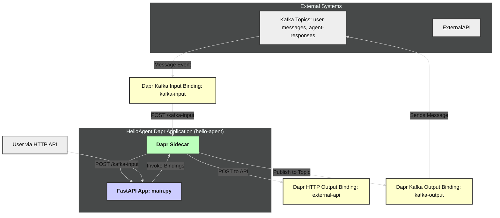

### Lab 3.4: Kafka Integration for Asynchronous Messaging (Input & Output)

This lab extends the cron-agent-lab FastAPI app from Labs 3.1 and 3.2 to:

- Kafka Input Binding: Consume messages from the user-messages topic, triggering the app to process them as user inputs.
- Kafka Output Binding: Publish responses to the agent-responses topic.
- Preserve Existing Functionality: Maintain the Cron input binding (Lab 3.1) and HTTP output binding (Lab 3.2).

**Lab Scenario Overview**:

1.  **Kafka Input**: Messages sent to a Kafka topic (`user-messages`) will trigger the agent to process the payload as a user message.
2.  **Kafka Output**: After processing, the agent publishes the response to agent-responses (e.g., {"actor_id": "user123", "input": {...}, "output": {...}}).

**Learning Objectives**:
- Configure Dapr Kafka input and output bindings.
- Enhance the ChatAgent to process Kafka messages and publish responses.
- Deploy and test Kafka bindings in a Kubernetes environment with Strimzi Kafka.
- Ensure idempotent message handling and robust error management.
- Understand Kafka’s role in asynchronous, event-driven agent workflows.



#### Step 0: Get `02_hello_output_lab` as Lab Starter Code & Install Dependencies

This setup uses the Apache Kafka in KRaft mode. For now we will setup manually to understand each detail. Later you can automate by extending your code Tiltfile.

##### Step 1: Setup Kafka

- Create Namespace

```bash
kubectl create namespace kafka
```
---

- **Create Kafka Configuration**

Create a ConfigMap for Kafka’s server.properties, adapted from the Docker guide’s KRaft setup:

File: **kafka-config.yaml**
```bash
# File: kafka-config.yaml
apiVersion: v1
kind: ConfigMap
metadata:
  name: kafka-config
  namespace: kafka
data:
  server.properties: |
    process.roles=broker,controller
    node.id=1
    controller.quorum.voters=1@localhost:9093
    listeners=PLAINTEXT://:9092,CONTROLLER://:9093
    advertised.listeners=PLAINTEXT://kafka-0.kafka-headless.kafka.svc.cluster.local:9092
    listener.security.protocol.map=PLAINTEXT:PLAINTEXT,CONTROLLER:PLAINTEXT
    inter.broker.listener.name=PLAINTEXT
    num.partitions=1
    default.replication.factor=1
    offsets.topic.replication.factor=1
    transaction.state.log.replication.factor=1
    transaction.state.log.min.isr=1
    min.insync.replicas=1
    group.initial.rebalance.delay.ms=0
    log.dirs=/opt/kafka/data
    metadata.log.dir=/opt/kafka/metadata
```

Key Settings:
- process.roles=broker,controller: Single node handles both roles (KRaft).
- controller.quorum.voters=1@localhost:9093: KRaft controller quorum.
- advertised.listeners: Uses pod DNS for client connections.
- Single replica for topics, matching lab requirements.

- **Create Persistent Storage**

Create a PersistentVolumeClaim for Kafka data and metadata:

```yaml
# File: kafka-pvc.yaml
# File: kafka-pvc.yaml
apiVersion: v1
kind: PersistentVolumeClaim
metadata:
  name: kafka-data
  namespace: kafka
spec:
  accessModes:
    - ReadWriteOnce
  resources:
    requests:
      storage: 20Gi
  storageClassName: local-path
```

```bash
kubectl apply -f kafka-pvc.yaml
```

```bash
kubectl get pvc -n kafka
```
---

- **Create Kafka StatefulSet:**

Create a StatefulSet to run Kafka with the apache/kafka:3.7.0 image:

```yaml
# File: kafka-statefulset.yaml
apiVersion: apps/v1
kind: StatefulSet
metadata:
  name: kafka
  namespace: kafka
spec:
  serviceName: kafka-headless
  replicas: 1
  selector:
    matchLabels:
      app: kafka
  template:
    metadata:
      labels:
        app: kafka
    spec:
      containers:
      - name: kafka
        image: apache/kafka:3.7.0
        ports:
        - containerPort: 9092
          name: plaintext
        - containerPort: 9093
          name: controller
        env:
        - name: KAFKA_PROCESS_ROLES
          value: "broker,controller"
        - name: KAFKA_NODE_ID
          value: "1"
        - name: KAFKA_CONTROLLER_QUORUM_VOTERS
          value: "1@localhost:9093"
        - name: KAFKA_LISTENERS
          value: "PLAINTEXT://:9092,CONTROLLER://:9093"
        - name: KAFKA_ADVERTISED_LISTENERS
          value: "PLAINTEXT://kafka-0.kafka-headless.kafka.svc.cluster.local:9092"
        - name: KAFKA_LISTENER_SECURITY_PROTOCOL_MAP
          value: "PLAINTEXT:PLAINTEXT,CONTROLLER:PLAINTEXT"
        - name: KAFKA_INTER_BROKER_LISTENER_NAME
          value: "PLAINTEXT"
        volumeMounts:
        - name: config
          mountPath: /opt/kafka/config/kraft/server.properties
          subPath: server.properties
        - name: data
          mountPath: /opt/kafka/data
        - name: metadata
          mountPath: /opt/kafka/metadata
        resources:
          requests:
            cpu: "500m"
            memory: "1Gi"
          limits:
            cpu: "1"
            memory: "2Gi"
      volumes:
      - name: config
        configMap:
          name: kafka-config
      - name: data
        persistentVolumeClaim:
          claimName: kafka-data
      - name: metadata
        emptyDir: {}  # Metadata can be ephemeral for single-node
```

- **Kafka Kafka Services**

Create a headless service for internal pod communication:

```yaml
# File: kafka-service.yaml
apiVersion: v1
kind: Service
metadata:
  name: kafka-headless
  namespace: kafka
spec:
  clusterIP: None
  selector:
    app: kafka
  ports:
  - port: 9092
    name: plaintext
    targetPort: 9092
  - port: 9093
    name: controller
    targetPort: 9093
```

- **Kafka Client Services**

Create a client-facing service:

```yaml
# File: kafka-bootstrap.yaml
apiVersion: v1
kind: Service
metadata:
  name: kafka-bootstrap
  namespace: kafka
spec:
  selector:
    app: kafka
  ports:
  - port: 9092
    name: plaintext
    targetPort: 9092
```

```bash
kubectl apply -f kafka-bootstrap.yaml
```

```bash
kubectl get pods -n kafka
NAME      READY   STATUS              RESTARTS   AGE
kafka-0   0/1     ContainerCreating   0          5m37s
```

##### Step 3: [Deploy Kafka Cluster with KRaft](https://github.com/strimzi/strimzi-kafka-operator/blob/0.46.0/examples/kafka/kafka-single-node.yaml)
Create a Kubernetes custom resource to deploy a single-broker Kafka cluster in KRaft mode, configured to be accessible at `kafka.default.svc.cluster.local:9092`.

**File**: `kubernetes/kafka-kraft.yaml`
```yaml
# File: kafka-kraft.yaml
apiVersion: kafka.strimzi.io/v1beta2
kind: KafkaNodePool
metadata:
  name: dual-role
  namespace: default
  labels:
    strimzi.io/cluster: kafka
spec:
  replicas: 1
  roles:
    - controller
    - broker
  storage:
    type: jbod
    volumes:
      - id: 0
        type: persistent-claim
        size: 20Gi  # Reduced from 100Gi for local cluster
        deleteClaim: false
        kraftMetadata: shared
  resources:
    requests:
      cpu: "500m"
      memory: "1Gi"
    limits:
      cpu: "1"
      memory: "2Gi"
---
apiVersion: kafka.strimzi.io/v1beta2
kind: Kafka
metadata:
  name: kafka
  namespace: default
  annotations:
    strimzi.io/node-pools: enabled
    strimzi.io/kraft: enabled
spec:
  kafka:
    version: 4.0.0
    metadataVersion: 4.0-IV3
    listeners:
      - name: plain
        port: 9092
        type: internal
        tls: false
    config:
      offsets.topic.replication.factor: 1
      transaction.state.log.replication.factor: 1
      transaction.state.log.min.isr: 1
      default.replication.factor: 1
      min.insync.replicas: 1
      group.initial.rebalance.delay.ms: 0
    logging:
      type: inline
      loggers:
        rootLogger.level: INFO
    resources:
      requests:
        cpu: "500m"
        memory: "1Gi"
      limits:
        cpu: "1"
        memory: "2Gi"
  entityOperator:
    topicOperator: {}
```

Apply the Kafka cluster:

```bash
kubectl apply -f kafka-kraft.yaml
```

Verify the Kafka service:
```bash
kubectl get svc -n default
```

Output:
```bash
NAME                    TYPE        CLUSTER-IP     EXTERNAL-IP   PORT(S)                               AGE
kafka-kafka-bootstrap   ClusterIP   10.43.179.43   <none>        9091/TCP,9092/TCP                     10s
kafka-kafka-brokers     ClusterIP   None           <none>        9090/TCP,9091/TCP,8443/TCP,9092/TCP   9s
kubernetes              ClusterIP   10.43.0.1      <none>        443/TCP                               3m27s
```

The service `kafka-plaintext` will be available at `kafka.default.svc.cluster.local:9092`.


##### Step 4: Create `user-messages` Topic
Create the `user-messages` topic required for your lab’s Kafka input binding.

**File**: `user-messages-topic.yaml`
```yaml
apiVersion: kafka.strimzi.io/v1beta2
kind: KafkaTopic
metadata:
  name: user-messages
  namespace: default
  labels:
    strimzi.io/cluster: kafka
spec:
  partitions: 1
  replicas: 1
  config:
    retention.ms: 604800000 # 7 days
```

Apply the topic:

```bash
kubectl apply -f user-messages-topic.yaml
```

Verify the topic:

```bash
kubectl get kafkatopic user-messages -n default
```

---

##### Step 5: Test Kafka Connectivity
Test the Kafka setup by producing and consuming a message on the `user-messages` topic.

Run a temporary Kafka client pod:

```bash
kubectl run kafka-client --rm -i --tty --image=apache/kafka:3.7.0 --namespace default --command -- bash
```

Produce a test message:

```bash
echo '{"user_id": "test", "content": "Hello"}' | /opt/kafka/bin/kafka-console-producer.sh --topic user-messages --bootstrap-server kafka.default.svc.cluster.local:9092
```

Consume the message:

```bash
/opt/kafka/bin/kafka-console-consumer.sh --topic user-messages --from-beginning --bootstrap-server kafka.default.svc.cluster.local:9092
```

If the message appears, Kafka is ready for your ChatAgent’s input binding.

---

##### Step 6: Configure Dapr Kafka Binding

Create two Kafka binding components: one for input (user-messages) and one for output (agent-responses). They should exist in your lab’s `components/` directory:

**File**: `components/kafka-input-binding.yaml`
```yaml
# File: components/kafka-input-binding.yaml
apiVersion: dapr.io/v1alpha1
kind: Component
metadata:
  name: kafka-binding
  namespace: default
spec:
  type: bindings.kafka
  version: v1
  metadata:
  - name: brokers
    value: "kafka.default.svc.cluster.local:9092"
  - name: topics
    value: "user-messages"
  - name: consumerGroup
    value: "chat-agent-group"
  - name: authRequired
    value: "false"
  - name: direction
    value: "input"
```

**File**: `components/kafka-output-binding.yaml`

```yaml
# File: components/kafka-output-binding.yaml
apiVersion: dapr.io/v1alpha1
kind: Component
metadata:
  name: kafka-output
  namespace: default
spec:
  type: bindings.kafka
  version: v1
  metadata:
  - name: brokers
    value: "kafka.default.svc.cluster.local:9092"
  - name: topic
    value: "agent-responses"
  - name: authRequired
    value: "false"
  - name: direction
    value: "output"
```

Apply bindings by updating in Tiltfile

```python
k8s_yaml(['./components/statestore.yaml'])
k8s_yaml(['./components/cron-binding.yaml'])
k8s_yaml(['./components/http-binding.yaml'])
k8s_yaml(['./components/kafka-input-binding.yaml'])
k8s_yaml(['./components/kafka-output-binding.yaml'])
```
---

This Kafka setup is now ready!

---


##### Step 7: Update the Code (`main.py`)

Modify your existing `main.py` from Step 2 to:

1.  **Add a new endpoint to handle Kafka input binding events**: This endpoint **must** match the `metadata.name` of the Kafka binding component. If your `kafka-binding.yaml` has `metadata.name: kafka-binding`, then the endpoint must be `@app.post(\"/kafka-binding\")`.
2.  **Modify `ChatAgent.process_message`**: After processing a message and publishing an event, add a call to a new method `_send_sms_notification`.
3.  **Implement `_send_sms_notification`**: This method will use `DaprClient().invoke_binding()` to call the `twilio-binding`.

**File**: `main.py` (showing key additions/modifications to your Step 2 code)

```python
import logging
import json
from fastapi import FastAPI, HTTPException, Request # Added Request
from pydantic import BaseModel # Assuming Message model is defined as in previous step
from dapr.ext.fastapi import DaprActor
from dapr.actor import Actor, ActorInterface, ActorProxy, ActorId, actormethod
from dapr.clients import DaprClient

# Configure logging
logging.basicConfig(level=logging.INFO)

app = FastAPI(title="ChatAgentService", description="DACA Step 8: Bindings")

# Add Dapr Actor Extension
actor = DaprActor(app)

class Message(BaseModel):
    role: str
    content: str

# Define the actor interface
class ChatAgentInterface(ActorInterface):
    @actormethod(name="ProcessMessage")
    async def process_message(self, user_input: dict) -> dict | None:
        pass

    @actormethod(name="GetConversationHistory")
    async def get_conversation_history(self) -> list[dict] | None:
        pass

# Implement the actor
class ChatAgent(Actor, ChatAgentInterface):
    def __init__(self, ctx, actor_id):
        super().__init__(ctx, actor_id)
        self._history_key = f"history-{actor_id.id}"
        self._actor_id = actor_id
        # Ensure DaprClient is available or instantiate as needed

    async def _on_activate(self) -> None:
        """Initialize state on actor activation."""
        logging.info(f"Activating actor for {self._history_key}")
        try:
            history = await self._state_manager.get_state(self._history_key)
            if history is None:
                logging.info(f"State not found for {self._history_key}, initializing")
                await self._state_manager.set_state(self._history_key, [])
            else:
                logging.info(f"State found for {self._history_key}") # Removed history print for brevity
        except Exception as e:
            logging.warning(f"Non-critical error in _on_activate: {e}")
            await self._state_manager.set_state(self._history_key, [])

    async def process_message(self, user_input: dict) -> dict:
        """Process a user message and append to history."""
        try:
            logging.info(f"Processing message for {self._actor_id.id}: {user_input['content']}")
            history = await self._state_manager.get_state(self._history_key)
            current_history = history if isinstance(history, list) else []

            # Append user message
            current_history.append(user_input)

            # Generate response
            response_content = f"Got your message: {user_input['content']}"
            response = {"role": "assistant", "content": response_content}

            # Append assistant response
            current_history.append(response)
            if len(current_history) > 10: # Example: keep last 5 exchanges (10 messages)
                current_history = current_history[-10:]

            # Save updated history
            await self._state_manager.set_state(self._history_key, current_history)
            logging.info(f"Processed message for {self._actor_id.id}: {user_input['content']}")

            # Publish event
            await self._publish_conversation_event(user_input, response)

            # Send SMS notification via Twilio output binding
            await self._send_sms_notification(user_input, response)

            return response
        except Exception as e:
            logging.error(f"Error processing message for {self._actor_id.id}: {e}")
            raise

    async def _publish_conversation_event(self, user_input: dict, response: dict) -> None:
        """Publish a ConversationUpdated event to the user-chat topic."""
        event_data = {
            "actor_id": self._actor_id.id,
            "input": user_input,
            "output": response
        }
        try:
            with DaprClient() as client:
                client.publish_event(
                    pubsub_name="daca-pubsub",
                    topic_name="user-chat", # Or your configured topic
                    data=json.dumps(event_data)
                )
            logging.info(f"Published ConversationUpdated event for {self._actor_id.id}")
        except Exception as e:
            logging.error(f"Failed to publish event for {self._actor_id.id}: {e}")

    # <<< NEW: Method to send SMS via Twilio output binding >>>
    async def _send_sms_notification(self, user_input: dict, response: dict) -> None:
        # IMPORTANT: Replace with a dynamic recipient number in a real application!
        # This could come from user profile, configuration, or the incoming message context.
        recipient_phone_number = "+15551234567" # <<< REPLACE WITH YOUR TEST RECIPIENT NUMBER

        sms_body = f"Update for {self._actor_id.id}: User said '{user_input['content']}'. Agent replied: '{response['content']}'."
        # Truncate if too long for SMS
        if len(sms_body) > 160:
            sms_body = sms_body[:157] + "..."

        sms_payload = {
            # "toNumber": recipient_phone_number, # Standard Twilio binding field
            # "body": sms_body
            # The Dapr Twilio binding expects data to be a JSON string that will be parsed by the component.
            # It typically looks for fields like 'Message', or uses the whole data as the body if it's a simple string.
            # For Twilio SMS, the `data` field in `invoke_binding` should be a JSON string containing the SMS details.
            # The component will then map these to Twilio API parameters.
            # Let's construct the data as expected by the Twilio binding, which typically includes `Message` for the body and uses `metadata` for `toNumber`.
        }

        # The Dapr Python SDK for invoke_binding: data is the body, metadata can pass binding-specific fields.
        # For Twilio SMS binding, metadata is often used for 'toNumber'.
        metadata_for_twilio = {
            "toNumber": recipient_phone_number
        }

        try:
            with DaprClient() as client:
                logging.info(f"Attempting to send SMS to {recipient_phone_number} via twilio-binding for {self._actor_id.id}")
                client.invoke_binding(
                    binding_name="twilio-binding", # Matches component metadata.name
                    operation="create",          # Standard operation for sending SMS
                    data=sms_body,               # The message body as a string
                    binding_metadata=metadata_for_twilio # Pass toNumber in metadata
                )
            logging.info(f"Sent SMS notification for {self._actor_id.id} to {recipient_phone_number}")
        except Exception as e:
            logging.error(f"Failed to send SMS for {self._actor_id.id}: {e}")

    async def get_conversation_history(self) -> list[dict]:
        """Retrieve conversation history."""
        try:
            history = await self._state_manager.get_state(self._history_key)
            return history if isinstance(history, list) else []
        except Exception as e:
            logging.error(f"Error getting history for {self._history_key}: {e}")
            return []

# Register the actor
@app.on_event("startup")
async def startup():
    await actor.register_actor(ChatAgent)
    logging.info(f"Registered actor: {ChatAgent.__name__}")

# FastAPI endpoints to invoke the actor
@app.post("/chat/{actor_id}")
async def process_message(actor_id: str, data: Message):
    """Process a user message for the actor."""
    if not data.content or not isinstance(data.content, str):
        raise HTTPException(status_code=400, detail="Invalid or missing 'content' field")
    message_dict = data.model_dump()
    proxy = ActorProxy.create("ChatAgent", ActorId(actor_id), ChatAgentInterface)
    response = await proxy.ProcessMessage(message_dict)
    return {"response": response}

@app.get("/chat/{actor_id}/history")
async def get_conversation_history(actor_id: str):
    """Retrieve the actor's conversation history."""
    proxy = ActorProxy.create("ChatAgent", ActorId(actor_id), ChatAgentInterface)
    history = await proxy.GetConversationHistory()
    return {"history": history}

# <<< NEW: Endpoint for Kafka Input Binding >>>
# This endpoint path MUST match the `metadata.name` of your Kafka binding component.
@app.post("/kafka-binding") # Assuming your kafka-binding.yaml has metadata.name: kafka-binding
async def handle_kafka_message(request: Request):
    try:
        # Dapr sends the event data as the request body.
        # The content type might vary; Kafka binding usually sends it as raw bytes or JSON string.
        event_data = await request.json() # Assuming Kafka message is JSON
        logging.info(f"[KAFKA-BINDING] Received event: {event_data}")

        # --- Adapt this message extraction logic based on your Kafka message structure ---
        # Example: Expecting a JSON message like: { "actor_id": "user123", "payload": {"role": "user", "content": "Hello from Kafka"}}
        actor_id_from_message = event_data.get("actor_id")
        message_payload = event_data.get("payload") # This is the actual message for the actor

        if not actor_id_from_message or not message_payload or not isinstance(message_payload, dict):
            logging.error(f"[KAFKA-BINDING] Invalid message structure: {event_data}")
            # Return 200 OK to Dapr to acknowledge receipt and prevent retries for malformed messages we can't process.
            # Dapr considers non-2xx as failure and might retry.
            return {"status": "error", "detail": "Invalid message structure from Kafka"}

        if "role" not in message_payload or "content" not in message_payload:
            logging.error(f"[KAFKA-BINDING] Missing 'role' or 'content' in message payload: {message_payload}")
            return {"status": "error", "detail": "Missing role/content in Kafka message payload"}
        # --- End of message extraction logic ---

        logging.info(f"[KAFKA-BINDING] Processing message for actor_id: {actor_id_from_message}")
        proxy = ActorProxy.create("ChatAgent", ActorId(actor_id_from_message), ChatAgentInterface)
        actor_response = await proxy.ProcessMessage(message_payload) # Pass the extracted payload to the actor

        logging.info(f"[KAFKA-BINDING] Message processed for {actor_id_from_message}, response: {actor_response}")
        # Return 200 OK to Dapr to acknowledge successful processing.
        return {"status": "Kafka message processed by actor", "actor_id": actor_id_from_message, "actor_response": actor_response}

    except json.JSONDecodeError as je:
        raw_body = await request.body()
        logging.error(f"[KAFKA-BINDING] JSONDecodeError: {je}. Raw body: {raw_body.decode(errors='replace')}")
        return {"status": "error", "detail": "Invalid JSON in Kafka message"} # Ack to Dapr
    except Exception as e:
        logging.error(f"[KAFKA-BINDING] Error processing Kafka message: {e}")
        # Depending on the error, you might want Dapr to retry or not.
        # For critical, unrecoverable errors for this message, return 200 to prevent Dapr retries.
        # For transient issues where a retry might help, raise HTTPException(status_code=500) or let it propagate.
        # For this lab, we'll acknowledge to avoid indefinite Dapr retries on persistent errors.
        return {"status": "error", "detail": f"Internal error processing Kafka message: {str(e)}"} # Ack to Dapr

# ... (Keep existing /subscribe endpoint for Dapr pub/sub, if you had one) ...

# Ensure uvicorn.run is present for local testing if you use it, but for K8s deployment it's not strictly needed in main.py
# if __name__ == "__main__":
#     uvicorn.run(app, host="0.0.0.0", port=8000) # Port your app runs on directly

```

**Key changes in `main.py`**:

- Imported `Request` from FastAPI.
- Added the `@app.post("/kafka-binding")` endpoint. **Crucially, this path must match `metadata.name` in `kafka-binding.yaml`**.
- The Kafka handler extracts `actor_id` and the actual `message` (payload) from the Kafka event data. _You will need to ensure the messages you produce to Kafka have this structure (e.g., a JSON object with `actor_id` and `payload` keys)._
- Modified `ChatAgent.process_message` to call `self._send_sms_notification`.
- Implemented `_send_sms_notification` using `DaprClient().invoke_binding()` to interact with `twilio-binding`. Pay close attention to how `data` (the SMS body) and `binding_metadata` (for `toNumber`) are used, as this is specific to how the Dapr Twilio binding component works.
- **Important for Twilio**: The `recipient_phone_number` in `_send_sms_notification` is hardcoded. **You MUST change `+15551234567` to a real phone number you can receive SMS on for testing.**

##### Step 8: Build and Deploy (or Update) your Application

If you are using Docker and Kubernetes (as implied by previous DACA steps):

1.  Re-build your Docker image for the `ChatAgent` application with the updated `main.py`.
    ```bash
    # Example: If your Dockerfile is in the current directory
    docker build -t your-repo/chat-agent-bindings:latest .
    docker push your-repo/chat-agent-bindings:latest
    ```
2.  Update your Kubernetes deployment YAML (`kubernetes/deployment.yaml` or similar) to use the new image tag.
3.  Apply the new Dapr component YAMLs and the updated deployment:
    ```bash
    kubectl apply -f components/kafka-binding.yaml
    kubectl apply -f components/twilio-binding.yaml
    kubectl apply -f components/secretstore.yaml # If new
    kubectl apply -f kubernetes/deployment.yaml # Or use kubectl set image ... if only image changed
    ```

If running locally with `dapr run` for quick testing (less ideal for full binding tests with Kafka in K8s, but possible if Kafka is accessible from local machine):

```bash
# dapr run --app-id chat-agent --app-port <your_app_port> --dapr-http-port <dapr_http_port> --components-path ./components python main.py
```

##### Step 9: Test the Application

1.  **Port-forward** your `chat-agent` service if running in Kubernetes:

    ```bash
    kubectl port-forward svc/chat-agent-service 8000:80 # Assuming service is named chat-agent-service and app listens on 80 (or whatever your app_port is for dapr run)
    # Adjust local and container ports as needed. If app runs on 8000 internally:
    # kubectl port-forward svc/chat-agent-service 8080:8000
    ```

    Use `8080` (or your chosen local port) for `curl` commands if you port-forwarded like above.

2.  **Test Kafka Input Binding**:

    - Create a simple Python script (`produce_kafka_message.py`) in your project directory to send a message to your Kafka topic. Make sure its structure matches what `handle_kafka_message` in `main.py` expects (e.g., `{\"actor_id\": \"kafkaUser1\", \"payload\": {\"role\": \"user\", \"content\": \"Hello from Kafka binding!\"}}`).

      **File**: `produce_kafka_message.py`

      ```python
      import json
      from confluent_kafka import Producer

      # Kafka broker configuration - REPLACE with your Kafka broker(s)
      conf = {'bootstrap.servers': 'kafka.default.svc.cluster.local:9092'} # Or your external Kafka endpoint
      producer = Producer(conf)

      topic = 'user-messages' # Must match topic in kafka-binding.yaml
      message_to_send = {
          "actor_id": "kafkaUser1",
          "payload": {
              "role": "user",
              "content": "Hello to ChatAgent via Kafka Binding!"
          }
      }

      def delivery_report(err, msg):
          if err is not None:
              print(f"Message delivery failed for {msg.key()}: {err}")
          else:
              print(f"Message {msg.key()} delivered to {msg.topic()} [{msg.partition()}] at offset {msg.offset()}")

      try:
          producer.produce(
              topic,
              key=message_to_send["actor_id"].encode('utf-8'),
              value=json.dumps(message_to_send).encode('utf-8'),
              callback=delivery_report
          )
          producer.poll(0) # Trigger delivery report callbacks
      except BufferError:
          print(f"Local producer queue is full ({len(producer)} messages awaiting delivery): try again")

      producer.flush() # Wait for all messages to be delivered
      print(f"Sent message to Kafka topic {topic}: {message_to_send}")
      ```

    - Run the producer script (ensure it can connect to Kafka from where you run it):
      ```bash
      python produce_kafka_message.py
      ```
    - **Check Logs**: View the logs of your `chat-agent` pod/application:
      ```bash
      kubectl logs -l app=chat-agent -c chat-agent --tail=100 -f # Adjust selector as needed
      # Or if using dapr run: check the console output.
      ```
      You should see logs from `handle_kafka_message` indicating the message was received and processed, and then logs from `_send_sms_notification` showing an SMS attempt.
    - **Verify History & SMS**:
      ```bash
      curl http://localhost:8080/chat/kafkaUser1/history
      ```
      Check the recipient phone for the SMS.

3.  **Test Twilio Output Binding (via direct API call to agent)**:
    - Send a message using the existing `/chat/{actor_id}` endpoint. This will also trigger the SMS notification.
      ```bash
      curl -X POST http://localhost:8080/chat/directUser1 \
        -H "Content-Type: application/json" \
        -d '{\"role\": \"user\", \"content\": \"Testing Twilio output via direct call\"}'
      ```
    - **Check Logs & SMS**: Verify in logs that `_send_sms_notification` was called. Check the recipient phone for the SMS.
    - **Verify History**:
      ```bash
      curl http://localhost:8080/chat/directUser1/history
      ```


---

---


### Lab 3.5: Twilio Output Binding for SMS Notifications

Content for this lab will be added in Stage 5.

### Lab 3.6: Conceptual: Agent-to-Agent (A2A) Style Communication with HTTP Bindings

Content for this lab will be added in Stage 6.

---
