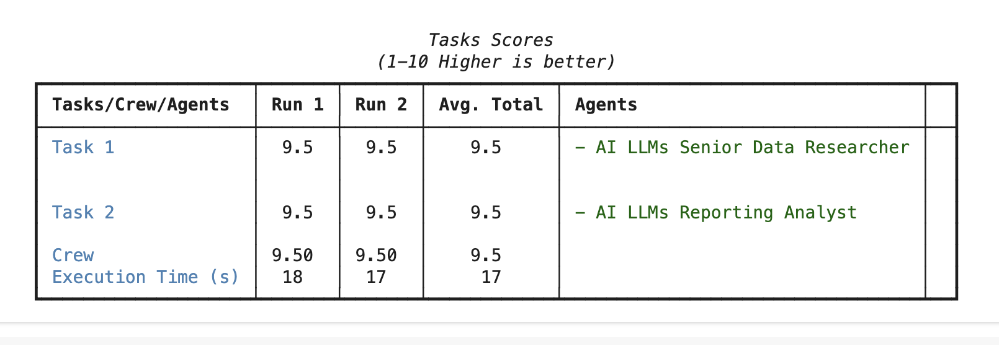

https://docs.crewai.com/concepts/testing
* youtube video link: https://youtu.be/DpQw0DP7dE8?t=2265
# Change code in `src/pr1/main.py` in `test()` and `train()` functions
#### FROM
```python
inputs = {
        'topic': 'AI LLMs',
    }
```
### To
```python
inputs = {
        'topic': 'AI LLMs',
        'current_year': str(datetime.now().year)
    }
```

1. run terminal command `crewai test --n_iterations 2 --model gpt-4o-mini`
2. or run terminal command `crewai test --n_iterations 2 --model gemini/gemini-2.0-flash`




