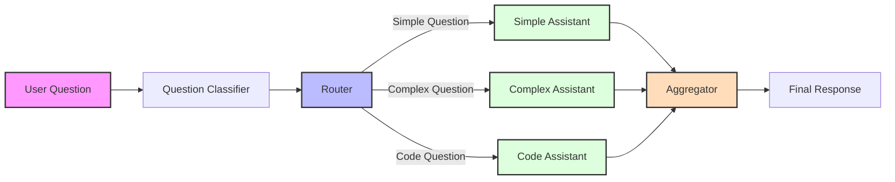

# Assistant Selector - Router Pattern Implementation

## Objective

This project demonstrates the Router Pattern in LangGraph by implementing an intelligent assistant selector that routes questions to different specialized assistants based on the question type.

1. Understand how to implement the Router Pattern using LangGraph
2. Create a system that classifies questions and routes them to appropriate specialized assistants
3. Handle different types of questions (simple, complex, and code-related) effectively



## How It Works

The system uses three main components:

1. **Question Classifier**: Analyzes incoming questions and classifies them as:
   - Simple questions
   - Complex questions
   - Code-related questions

2. **Specialized Assistants**: Different assistants optimized for:
   - Quick, factual responses (Simple Assistant)
   - Detailed explanations (Complex Assistant)
   - Code analysis and debugging (Code Assistant)

3. **Router**: Routes the question to the appropriate assistant based on classification

## Installation

1. **Clone the Repository**
   ```bash
   git clone <repository-url>
   ```

2. **Setup Environment**
   ```bash
   cd assistant_selector
   cp .env.example .env
   # Add your API keys to .env
   ```

3. **Install Dependencies**
   ```bash
   uv sync
   ```

## Usage

Run the assistant selector:

After setting up environment run the following commands

```bash
uv run invoke
```

```bash
uv run stream
```

## Example Interactions

```python
# Simple question
Input: "What is the capital of France?"
Output: Routed to Simple Assistant -> "Paris is the capital of France."

# Complex question
Input: "Explain how quantum computing works."
Output: Routed to Complex Assistant -> [Detailed explanation...]

# Code question
Input: "How do I implement a binary search tree in Python?"
Output: Routed to Code Assistant -> [Code example with explanation...]
```

## Project Structure

```
assistant_selector/
├── models/
│   ├── question_classifier.py
│   └── assistants.py
├── router/
│   └── router.py
├── main.py
└── README.md
```
