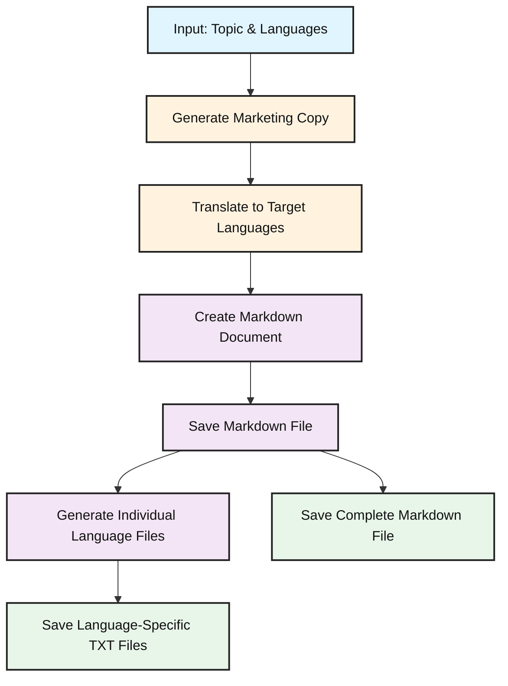

# Multi Lingual Marketing Copy Generator

This project implements Antropic Prompt Chaining Workflow

## Workflow



### Sample OutPut

```bash
uv run invoke

✨ Marketing Copy Generation Complete!

Generated Translations:

English:
Unlock your language potential with our AI-powered platform! We personalize
your learning journey, adapting to your pace and style for faster fluency.
Experience immersive lessons, real-time feedback, and intelligent practice
that makes mastering a new language not just effective, but enjoyable.

Spanish:
Here are a few options, with slightly different nuances, to translate the
marketing copy into Spanish while maintaining the tone and impact:

**Option 1 (More Emphatic):**

> ¡Desbloquea tu potencial lingüístico con nuestra plataforma impulsada por
IA! Personalizamos tu viaje de aprendizaje, adaptándonos a tu ritmo y estilo
para una fluidez más rápida. Experimenta lecciones inmersivas,
retroalimentación en tiempo real y práctica inteligente que hace que dominar
un nuevo idioma no solo sea efectivo, sino también ¡divertido!

**Option 2 (Slightly More Formal):**

> Libera tu potencial lingüístico con nuestra plataforma impulsada por
inteligencia artificial. Personalizamos tu proceso de aprendizaje,
adaptándonos a tu ritmo y estilo para lograr una fluidez más rápida. Disfruta
de lecciones inmersivas, retroalimentación instantánea y práctica inteligente
que hacen que dominar un nuevo idioma sea no solo efectivo, sino también
agradable.

**Option 3 (Focus on the Experience):**

> ¡Descubre tu potencial lingüístico con nuestra plataforma impulsada por IA!
Te ofrecemos una experiencia de aprendizaje personalizada, que se adapta a tu
ritmo y estilo para que alcances la fluidez más rápido. Sumérgete en lecciones
envolventes, recibe retroalimentación en tiempo real y practica de forma
inteligente. Aprender un nuevo idioma nunca fue tan efectivo... ¡ni tan
divertido!

**Explanation of Choices and Key Considerations:**

*   **"Unlock"**:  I used variations of "Desbloquear" (Unlock), "Liberar"
(Release), and "Descubrir" (Discover) to find the best fit for the overall
tone.  "Desbloquear" is a direct translation and works well. "Liberar" feels a
bit more aspirational, and "Descubrir" focuses on the journey of learning.
*   **"AI-powered"**:  "Impulsada por IA" or "Impulsada por inteligencia
artificial" are both accurate. I prefer "IA" for brevity and a modern feel,
but "inteligencia artificial" is more descriptive.
*   **"Personalize"**: "Personalizamos" is a direct and effective translation.
*   **"Learning journey" / "Proceso de aprendizaje"**: I chose "viaje de
aprendizaje" in some options and "proceso de aprendizaje" in others. "Viaje"
(journey) is more evocative and aligns with the marketing focus.
*   **"Faster fluency"**: "Fluidez más rápida" is the standard translation and
works well.
*   **"Immersive lessons"**: "Lecciones inmersivas" or "Lecciones envolventes"
both convey the feeling of being fully engaged.  "Envolventes" might be
slightly more evocative.
*   **"Real-time feedback"**: "Retroalimentación en tiempo real" is a common
and easily understood translation. "Retroalimentación instantánea" is also a
good option.
*   **"Intelligent practice"**: "Práctica inteligente" is a direct and
effective translation.
*   **"Enjoyable"**: "Divertido" (fun) or "Agradable" (pleasant) both work.
"Divertido" is a stronger, more engaging word, especially in marketing copy.
*   **Exclamation points**: I've strategically used exclamation points to
emphasize the benefits and excitement, but be careful not to overuse them.

**Recommendation:**

I personally prefer **Option 3** as it focuses on the user's experience and
has a slightly more playful tone. However, all options are good and the best
choice depends on the specific brand voice and target audience.  Consider A/B
testing to see which resonates best with your Spanish-speaking audience.

French:
Here are a few options for the translation, with slightly different nuances to
best capture the original's intent.  I've aimed for a balance of accuracy,
marketing appeal, and natural-sounding French:

**Option 1 (Focus on Personalization and Efficiency):**

> Libérez votre potentiel linguistique grâce à notre plateforme propulsée par
l'IA ! Nous personnalisons votre parcours d'apprentissage, en nous adaptant à
votre rythme et à votre style pour une maîtrise plus rapide. Profitez de
leçons immersives, d'un feedback en temps réel et d'exercices intelligents qui
rendent l'apprentissage d'une nouvelle langue non seulement efficace, mais
aussi agréable.

**Why this works:**

*   "Libérez votre potentiel linguistique" is a strong and evocative opening.
*   "Propulsée par l'IA" is a clear and modern translation of "AI-powered."
*   "Parcours d'apprentissage" is a common and natural way to say "learning
journey."
*   "Maîtrise plus rapide" emphasizes speed and efficiency.
*   "Feedback en temps réel" is a standard and understood phrase.
*   "Exercices intelligents" highlights the platform's smart features.
*   The final clause maintains the dual focus on effectiveness and enjoyment.

**Option 2 (Emphasis on Immersive Experience and Mastery):**

> Révélez votre potentiel linguistique avec notre plateforme intelligente
basée sur l'IA ! Nous personnalisons votre apprentissage en nous adaptant à
votre rythme et à votre style, pour une immersion totale et une maîtrise
rapide. Plongez dans des leçons immersives, bénéficiez d'un feedback
instantané et profitez d'une pratique intelligente qui transforme
l'apprentissage d'une langue en une expérience aussi efficace que plaisante.

**Why this works:**

*   "Révélez votre potentiel linguistique" is another strong opening, slightly
different in nuance.
*   "Plateforme intelligente basée sur l'IA" is another way to phrase the AI
aspect.
*   "Immersion totale" emphasizes the immersive quality.
*   "Feedback instantané" is a slightly more direct translation of "real-time
feedback."
*   "Transforme l'apprentissage d'une langue en une expérience aussi efficace
que plaisante" offers a slightly more sophisticated phrasing for the final
clause.
*   "Plongez dans des leçons immersives" uses a more active verb, inviting the
user to engage.

**Option 3 (More concise and direct):**

> Débloquez votre potentiel linguistique avec notre plateforme IA !
Apprentissage personnalisé, adapté à votre rythme et à votre style, pour une
maîtrise rapide. Profitez de leçons immersives, d'un feedback en temps réel et
d'une pratique intelligente : apprenez une langue efficacement et avec plaisir
!

**Why this works:**

*   This option is more concise and direct.
*   It uses a more colloquial and active tone.
*   It may appeal to a younger or more tech-savvy audience.

**Key Considerations When Choosing:**

*   **Target Audience:**  Consider who you are trying to reach.  Option 2
might appeal to a more sophisticated audience, while Option 3 might be better
for a younger audience.
*   **Brand Voice:**  Which option best reflects your company's overall tone
and style?
*   **Specific Emphasis:** Do you want to emphasize personalization,
immersion, or speed?

I recommend having a native French speaker review the chosen option to ensure
it perfectly aligns with your marketing goals. Good luck!

Mandarin Chinese:
Here are a few options for the translation, with slight variations in tone and
emphasis. Choose the one that best suits your target audience and brand:

**Option 1 (Focus on empowerment and enjoyment):**

释放你的语言潜能，尽在我们的AI驱动平台！我们为您量身定制学习旅程，适应您的节奏
和风格，助您更快流利掌握新语言。沉浸式课程、实时反馈和智能练习，让学习新语言不
仅高效，更充满乐趣！

*   **Explanation:** This version emphasizes the power and fun aspects of
learning.  It uses more direct and active verbs.

**Option 2 (Focus on personalization and effectiveness):**

借助我们的人工智能平台，开启您的语言学习之旅！我们提供个性化学习方案，根据您的
进度和学习方式进行调整，助您更快掌握流利外语。体验沉浸式课程，获得实时反馈，更
有智能练习，让语言学习不仅效果显著，而且轻松愉快。

*   **Explanation:** This version focuses on the personalized aspect and the
effectiveness of the platform. It uses slightly more formal language.

**Option 3 (Slightly more concise and modern):**

用我们的AI智能平台，激发你的语言天赋！个性化定制学习，匹配你的节奏和方式，加速
语言流利度。沉浸式互动课程，实时反馈，智能练习，让学外语高效又有趣！

*   **Explanation:** This version is shorter and uses more contemporary
language. It might appeal to a younger audience.

**Vocabulary Breakdown:**

*   **Unlock your language potential:** 释放你的语言潜能 (Shìfàng nǐ de yǔyán
qiánnéng) / 激发你的语言天赋 (Jīfā nǐ de yǔyán tiānfù)
*   **AI-powered platform:** AI驱动平台 (AI qūdòng píngtái) / 人工智能平台
(Réngōng zhìnéng píngtái) / AI智能平台 (AI zhìnéng píngtái)
*   **Personalize your learning journey:** 为您量身定制学习旅程 (Wèi nín
liángshēn dìngzhì xuéxí lǚchéng) / 提供个性化学习方案 (Tígōng gèxìnghuà xuéxí
fāng'àn) / 个性化定制学习 (Gèxìnghuà dìngzhì xuéxí)
*   **Adapting to your pace and style:** 适应您的节奏和风格 (Shìyìng nín de
jiézòu hé fēnggé) / 根据您的进度和学习方式进行调整 (Gēnjù nín de jìndù hé
xuéxí fāngshì jìnxíng tiáozhěng) / 匹配你的节奏和方式 (Pǐpèi nǐ de jiézòu hé
fāngshì)
*   **Faster fluency:** 更快流利掌握新语言 (Gèng kuài liúlì zhǎngwò xīn yǔyán)
/ 加速语言流利度 (Jiāsù yǔyán liúlì dù) / 助您更快掌握流利外语 (Zhù nín gèng
kuài zhǎngwò liúlì wàiyǔ)
*   **Immersive lessons:** 沉浸式课程 (Chénjìnshì kèchéng) / 沉浸式互动课程
(Chénjìnshì hùdòng kèchéng)
*   **Real-time feedback:** 实时反馈 (Shíshí fǎnkuì)
*   **Intelligent practice:** 智能练习 (Zhìnéng liànxí)
*   **Effective:** 高效 (Gāoxiào) / 效果显著 (Xiàoguǒ xiǎnzhù)
*   **Enjoyable:** 充满乐趣 (Chōngmǎn lèqù) / 轻松愉快 (Qīngsōng yúkuài) /
有趣 (Yǒuqù)
*   **Mastering a new language:** 掌握新语言 (Zhǎngwò xīn yǔyán) / 学外语 (Xué
wàiyǔ)

**Key Considerations when choosing:**

*   **Target Audience:** Who are you trying to reach?  Younger audiences might
respond better to Option 3.
*   **Brand Voice:** Is your brand more formal or informal?  Option 2 is more
formal.
*   **Emphasis:** What is the most important aspect of your platform that you
want to highlight?

I recommend testing different versions to see which performs best with your
target audience. Good luck!

Japanese:
Okay, here's a translation of the marketing copy, aiming for a natural,
impactful, and engaging tone in Japanese:

**Option 1 (More Concise and Energetic):**

> AI搭載のプラットフォームで、あなたの語学力を解き放て！
あなただけの学習プランで、無理なく、楽しく、最速で語学が身につきます。没入感あ
ふれるレッスン、リアルタイムのフィードバック、そしてインテリジェントな練習で、
語学学習を効果的に、そしてエキサイティングに。

**Option 2 (Slightly More Detailed):**

>
AIの力を活用した当社のプラットフォームで、眠っている語学の可能性を最大限に引き
出しましょう！
あなたのペースや学習スタイルに合わせて最適化された、パーソナライズされた学習体
験を提供。無理なく上達できます。
没入型のレッスン、リアルタイムのフィードバック、そして知的な練習機能で、語学の
習得を効果的に、そして何よりも楽しくします。

**Breakdown of Key Choices and Why:**

*   **"Unlock your language potential":**
    *   Option 1: "あなたの語学力を解き放て！" (Anata no gogakuryoku o
tokihanate!) - This is a more direct and punchy translation, using "解き放つ"
(tokihanatsu - to unleash, liberate) which conveys a sense of unlocking
potential.
    *   Option 2: "眠っている語学の可能性を最大限に引き出しましょう！"
(Nemutte iru gogaku no kanousei o saidai gen ni hikidashimashou!) - This is
slightly more literal, translating "sleeping potential" and "draw out to the
maximum." It's a bit more polite.

*   **"AI-powered platform":**
    *   "AI搭載のプラットフォーム" (AI tousai no purattofoomu) - This is the
standard and effective way to say "AI-powered platform" in Japanese.

*   **"We personalize your learning journey, adapting to your pace and style
for faster fluency.":**
    *   Option 1:
"あなただけの学習プランで、無理なく、楽しく、最速で語学が身につきます。"
(Anata dake no gakushuu puran de, muri naku, tanoshiku, saisoku de gogaku ga
mi ni tsukimasu.) - This is a concise and appealing way to say it.
"あなただけの" (anata dake no) means "only yours," emphasizing
personalization. "無理なく" (muri naku) means "without strain," "楽しく"
(tanoshiku) means "enjoyably," and "最速で" (saisoku de) means "at the
fastest." "語学が身につきます" (gogaku ga mi ni tsukimasu) means "you will
acquire language skills."
    *   Option 2:
"あなたのペースや学習スタイルに合わせて最適化された、パーソナライズされた学習
体験を提供。無理なく上達できます。" (Anata no peesu ya gakushuu sutairu ni
awasete saitekika sareta, paasonaraizu sareta gakushuu taiken o teikyou. Muri
naku joutatsu dekimasu.) - This is a more detailed translation. It uses
"最適化された" (saitekika sareta - optimized) and "パーソナライズされた"
(paasonaraizu sareta - personalized). "無理なく上達できます" (muri naku
joutatsu dekimasu) means "you can improve without strain."

*   **"Experience immersive lessons, real-time feedback, and intelligent
practice that makes mastering a new language not just effective, but
enjoyable.":**
    *   Option 1:
"没入感あふれるレッスン、リアルタイムのフィードバック、そしてインテリジェント
な練習で、語学学習を効果的に、そしてエキサイティングに。" (Bottsunyuukan
afureru ressun, riaru taimu no fiidobakku, soshite interijento na renshuu de,
gogaku gakushuu o kouka teki ni, soshite ekisaitingu ni.) - This is a more
dynamic approach. "没入感あふれる" (bottsunyuukan afureru) means "immersive,"
"エキサイティングに" (ekisaitingu ni) translates to "excitingly"
    *   Option 2:
"没入型のレッスン、リアルタイムのフィードバック、そして知的な練習機能で、語学
の習得を効果的に、そして何よりも楽しくします。" (Bottsunyu gata no ressun,
riaru taimu no fiidobakku, soshite chiteki na renshuu kinou de, gogaku no
shuutoku o kouka teki ni, soshite nani yori mo tanoshiku shimasu.) - This is a
slightly more formal and detailed version. "没入型の" (bottsunyu gata no)
means "immersive type." "知的な練習機能" (chiteki na renshuu kinou) means
"intelligent practice functions." "何よりも楽しくします" (nani yori mo
tanoshiku shimasu) means "makes it more enjoyable than anything else."

**Which Option to Choose?**

*   **Option 1** is better if you want a shorter, punchier, and more energetic
feel. It's more likely to grab attention quickly.
*   **Option 2** is better if you want a slightly more detailed and polite
tone, emphasizing the benefits and features more explicitly.

I've tried to balance accuracy with a natural and engaging tone. Consider your
target audience and brand voice when making the final choice.  Good luck!

Generated Markdown Preview:
┏━━━━━━━━━━━━━━━━━━━━━━━━━━━━━━━━━━━━━━━━━━━━━━━━━━━━━━━━━━━━━━━━━━━━━━━━━━━━┓
┃           Marketing Copy: AI-Powered Language Learning Platform            ┃
┗━━━━━━━━━━━━━━━━━━━━━━━━━━━━━━━━━━━━━━━━━━━━━━━━━━━━━━━━━━━━━━━━━━━━━━━━━━━━┛

Generated marketing copy in multiple languages:


                                   English

Unlock your language potential with our AI-powered platform! We personalize
your learning journey, adapting to your pace and style for faster fluency.
Experience immersive lessons, real-time feedback, and intelligent practice
that makes mastering a new language not just effective, but enjoyable.

──────────────────────────────────────────────────────────────────────────────

                                   Spanish

Here are a few options, with slightly different nuances, to translate the
marketing copy into Spanish while maintaining the tone and impact:

Option 1 (More Emphatic):

▌ ¡Desbloquea tu potencial lingüístico con nuestra plataforma impulsada por
▌ IA! Personalizamos tu viaje de aprendizaje, adaptándonos a tu ritmo y
▌ estilo para una fluidez más rápida. Experimenta lecciones inmersivas,
▌ retroalimentación en tiempo real y práctica inteligente que hace que
▌ dominar un nuevo idioma no solo sea efectivo, sino también ¡divertido!

Option 2 (Slightly More Formal):

▌ Libera tu potencial lingüístico con nuestra plataforma impulsada por
▌ inteligencia artificial. Personalizamos tu proceso de aprendizaje,
▌ adaptándonos a tu ritmo y estilo para lograr una fluidez más rápida.
▌ Disfruta de lecciones inmersivas, retroalimentación instantánea y práctica
▌ inteligente que hacen que dominar un nuevo idioma sea no solo efectivo,
▌ sino también agradable.

Option 3 (Focus on the Experience):

▌ ¡Descubre tu potencial lingüístico con nuestra plataforma impulsada por
▌ IA!  Te ofrecemos una experiencia de aprendizaje personalizada, que se
▌ adapta a tu ritmo y estilo para que alcances la fluidez más rápido.
▌ Sumérgete en lecciones envolventes, recibe retroalimentación en tiempo
▌ real y practica de forma inteligente. Aprender un nuevo idioma nunca fue
▌ tan efectivo... ¡ni tan divertido!

Explanation of Choices and Key Considerations:

 • "Unlock":  I used variations of "Desbloquear" (Unlock), "Liberar"
   (Release), and "Descubrir" (Discover) to find the best fit for the overall
   tone.  "Desbloquear" is a direct translation and works well. "Liberar"
   feels a bit more aspirational, and "Descubrir" focuses on the journey of
   learning.
 • "AI-powered":  "Impulsada por IA" or "Impulsada por inteligencia
   artificial" are both accurate. I prefer "IA" for brevity and a modern feel,
   but "inteligencia artificial" is more descriptive.
 • "Personalize": "Personalizamos" is a direct and effective translation.
 • "Learning journey" / "Proceso de aprendizaje": I chose "viaje de
   aprendizaje" in some options and "proceso de aprendizaje" in others.
   "Viaje" (journey) is more evocative and aligns with the marketing focus.
 • "Faster fluency": "Fluidez más rápida" is the standard translation and
   works well.
 • "Immersive lessons": "Lecciones inmersivas" or "Lecciones envolventes" both
   convey the feeling of being fully engaged.  "Envolventes" might be slightly
   more evocative.
 • "Real-time feedback": "Retroalimentación en tiempo real" is a common and
   easily understood translation. "Retroalimentación instantánea" is also a
   good option.
 • "Intelligent practice": "Práctica inteligente" is a direct and effective
   translation.
 • "Enjoyable": "Divertido" (fun) or "Agradable" (pleasant) both work.
   "Divertido" is a stronger, more engaging word, especially in marketing
   copy.
 • Exclamation points: I've strategically used exclamation points to emphasize
   the benefits and excitement, but be careful not to overuse them.

Recommendation:

I personally prefer Option 3 as it focuses on the user's experience and has a
slightly more playful tone. However, all options are good and the best choice
depends on the specific brand voice and target audience.  Consider A/B testing
to see which resonates best with your Spanish-speaking audience.

──────────────────────────────────────────────────────────────────────────────

                                    French

Here are a few options for the translation, with slightly different nuances to
best capture the original's intent.  I've aimed for a balance of accuracy,
marketing appeal, and natural-sounding French:

Option 1 (Focus on Personalization and Efficiency):

▌ Libérez votre potentiel linguistique grâce à notre plateforme propulsée
▌ par l'IA ! Nous personnalisons votre parcours d'apprentissage, en nous
▌ adaptant à votre rythme et à votre style pour une maîtrise plus rapide.
▌ Profitez de leçons immersives, d'un feedback en temps réel et d'exercices
▌ intelligents qui rendent l'apprentissage d'une nouvelle langue non
▌ seulement efficace, mais aussi agréable.

Why this works:

 • "Libérez votre potentiel linguistique" is a strong and evocative opening.
 • "Propulsée par l'IA" is a clear and modern translation of "AI-powered."
 • "Parcours d'apprentissage" is a common and natural way to say "learning
   journey."
 • "Maîtrise plus rapide" emphasizes speed and efficiency.
 • "Feedback en temps réel" is a standard and understood phrase.
 • "Exercices intelligents" highlights the platform's smart features.
 • The final clause maintains the dual focus on effectiveness and enjoyment.

Option 2 (Emphasis on Immersive Experience and Mastery):

▌ Révélez votre potentiel linguistique avec notre plateforme intelligente
▌ basée sur l'IA ! Nous personnalisons votre apprentissage en nous adaptant
▌ à votre rythme et à votre style, pour une immersion totale et une maîtrise
▌ rapide. Plongez dans des leçons immersives, bénéficiez d'un feedback
▌ instantané et profitez d'une pratique intelligente qui transforme
▌ l'apprentissage d'une langue en une expérience aussi efficace que
▌ plaisante.

Why this works:

 • "Révélez votre potentiel linguistique" is another strong opening, slightly
   different in nuance.
 • "Plateforme intelligente basée sur l'IA" is another way to phrase the AI
   aspect.
 • "Immersion totale" emphasizes the immersive quality.
 • "Feedback instantané" is a slightly more direct translation of "real-time
   feedback."
 • "Transforme l'apprentissage d'une langue en une expérience aussi efficace
   que plaisante" offers a slightly more sophisticated phrasing for the final
   clause.
 • "Plongez dans des leçons immersives" uses a more active verb, inviting the
   user to engage.

Option 3 (More concise and direct):

▌ Débloquez votre potentiel linguistique avec notre plateforme IA !
▌ Apprentissage personnalisé, adapté à votre rythme et à votre style, pour
▌ une maîtrise rapide. Profitez de leçons immersives, d'un feedback en temps
▌ réel et d'une pratique intelligente : apprenez une langue efficacement et
▌ avec plaisir !

Why this works:

 • This option is more concise and direct.
 • It uses a more colloquial and active tone.
 • It may appeal to a younger or more tech-savvy audience.

Key Considerations When Choosing:

 • Target Audience:  Consider who you are trying to reach.  Option 2 might
   appeal to a more sophisticated audience, while Option 3 might be better for
   a younger audience.
 • Brand Voice:  Which option best reflects your company's overall tone and
   style?
 • Specific Emphasis: Do you want to emphasize personalization, immersion, or
   speed?

I recommend having a native French speaker review the chosen option to ensure
it perfectly aligns with your marketing goals. Good luck!

──────────────────────────────────────────────────────────────────────────────

                               Mandarin Chinese

Here are a few options for the translation, with slight variations in tone and
emphasis. Choose the one that best suits your target audience and brand:

Option 1 (Focus on empowerment and enjoyment):

释放你的语言潜能，尽在我们的AI驱动平台！我们为您量身定制学习旅程，适应您的节奏
和风格，助您更快流利掌握新语言。沉浸式课程、实时反馈和智能练习，让学习新语言不
仅高效，更充满乐趣！

 • Explanation: This version emphasizes the power and fun aspects of learning.
   It uses more direct and active verbs.

Option 2 (Focus on personalization and effectiveness):

借助我们的人工智能平台，开启您的语言学习之旅！我们提供个性化学习方案，根据您的
进度和学习方式进行调整，助您更快掌握流利外语。体验沉浸式课程，获得实时反馈，更
有智能练习，让语言学习不仅效果显著，而且轻松愉快。

 • Explanation: This version focuses on the personalized aspect and the
   effectiveness of the platform. It uses slightly more formal language.

Option 3 (Slightly more concise and modern):

用我们的AI智能平台，激发你的语言天赋！个性化定制学习，匹配你的节奏和方式，加速
语言流利度。沉浸式互动课程，实时反馈，智能练习，让学外语高效又有趣！

 • Explanation: This version is shorter and uses more contemporary language.
   It might appeal to a younger audience.

Vocabulary Breakdown:

 • Unlock your language potential: 释放你的语言潜能 (Shìfàng nǐ de yǔyán
   qiánnéng) / 激发你的语言天赋 (Jīfā nǐ de yǔyán tiānfù)
 • AI-powered platform: AI驱动平台 (AI qūdòng píngtái) / 人工智能平台 (Réngōng
   zhìnéng píngtái) / AI智能平台 (AI zhìnéng píngtái)
 • Personalize your learning journey: 为您量身定制学习旅程 (Wèi nín liángshēn
   dìngzhì xuéxí lǚchéng) / 提供个性化学习方案 (Tígōng gèxìnghuà xuéxí
   fāng'àn) / 个性化定制学习 (Gèxìnghuà dìngzhì xuéxí)
 • Adapting to your pace and style: 适应您的节奏和风格 (Shìyìng nín de jiézòu
   hé fēnggé) / 根据您的进度和学习方式进行调整 (Gēnjù nín de jìndù hé xuéxí
   fāngshì jìnxíng tiáozhěng) / 匹配你的节奏和方式 (Pǐpèi nǐ de jiézòu hé
   fāngshì)
 • Faster fluency: 更快流利掌握新语言 (Gèng kuài liúlì zhǎngwò xīn yǔyán) /
   加速语言流利度 (Jiāsù yǔyán liúlì dù) / 助您更快掌握流利外语 (Zhù nín gèng
   kuài zhǎngwò liúlì wàiyǔ)
 • Immersive lessons: 沉浸式课程 (Chénjìnshì kèchéng) / 沉浸式互动课程
   (Chénjìnshì hùdòng kèchéng)
 • Real-time feedback: 实时反馈 (Shíshí fǎnkuì)
 • Intelligent practice: 智能练习 (Zhìnéng liànxí)
 • Effective: 高效 (Gāoxiào) / 效果显著 (Xiàoguǒ xiǎnzhù)
 • Enjoyable: 充满乐趣 (Chōngmǎn lèqù) / 轻松愉快 (Qīngsōng yúkuài) / 有趣
   (Yǒuqù)
 • Mastering a new language: 掌握新语言 (Zhǎngwò xīn yǔyán) / 学外语 (Xué
   wàiyǔ)

Key Considerations when choosing:

 • Target Audience: Who are you trying to reach?  Younger audiences might
   respond better to Option 3.
 • Brand Voice: Is your brand more formal or informal?  Option 2 is more
   formal.
 • Emphasis: What is the most important aspect of your platform that you want
   to highlight?

I recommend testing different versions to see which performs best with your
target audience. Good luck!

──────────────────────────────────────────────────────────────────────────────

                                   Japanese

Okay, here's a translation of the marketing copy, aiming for a natural,
impactful, and engaging tone in Japanese:

Option 1 (More Concise and Energetic):

▌ AI搭載のプラットフォームで、あなたの語学力を解き放て！
▌ あなただけの学習プランで、無理なく、楽しく、最速で語学が身につきます。没入
▌ 感あふれるレッスン、リアルタイムのフィードバック、そしてインテリジェントな
▌ 練習で、語学学習を効果的に、そしてエキサイティングに。

Option 2 (Slightly More Detailed):

▌ AIの力を活用した当社のプラットフォームで、眠っている語学の可能性を最大限に
▌ 引き出しましょう！
▌ あなたのペースや学習スタイルに合わせて最適化された、パーソナライズされた学
▌ 習体験を提供。無理なく上達できます。
▌ 没入型のレッスン、リアルタイムのフィードバック、そして知的な練習機能で、語
▌ 学の習得を効果的に、そして何よりも楽しくします。

Breakdown of Key Choices and Why:

 • "Unlock your language potential":
    • Option 1: "あなたの語学力を解き放て！" (Anata no gogakuryoku o
      tokihanate!) - This is a more direct and punchy translation, using
      "解き放つ" (tokihanatsu - to unleash, liberate) which conveys a sense of
      unlocking potential.
    • Option 2: "眠っている語学の可能性を最大限に引き出しましょう！" (Nemutte
      iru gogaku no kanousei o saidai gen ni hikidashimashou!) - This is
      slightly more literal, translating "sleeping potential" and "draw out to
      the maximum." It's a bit more polite.
 • "AI-powered platform":
    • "AI搭載のプラットフォーム" (AI tousai no purattofoomu) - This is the
      standard and effective way to say "AI-powered platform" in Japanese.
 • "We personalize your learning journey, adapting to your pace and style for
   faster fluency.":
    • Option 1:
      "あなただけの学習プランで、無理なく、楽しく、最速で語学が身につきます。"
      (Anata dake no gakushuu puran de, muri naku, tanoshiku, saisoku de
      gogaku ga mi ni tsukimasu.) - This is a concise and appealing way to say
      it. "あなただけの" (anata dake no) means "only yours," emphasizing
      personalization. "無理なく" (muri naku) means "without strain," "楽しく"
      (tanoshiku) means "enjoyably," and "最速で" (saisoku de) means "at the
      fastest." "語学が身につきます" (gogaku ga mi ni tsukimasu) means "you
      will acquire language skills."
    • Option 2:
      "あなたのペースや学習スタイルに合わせて最適化された、パーソナライズされ
      た学習体験を提供。無理なく上達できます。" (Anata no peesu ya gakushuu
      sutairu ni awasete saitekika sareta, paasonaraizu sareta gakushuu taiken
      o teikyou. Muri naku joutatsu dekimasu.) - This is a more detailed
      translation. It uses "最適化された" (saitekika sareta - optimized) and
      "パーソナライズされた" (paasonaraizu sareta - personalized).
      "無理なく上達できます" (muri naku joutatsu dekimasu) means "you can
      improve without strain."
 • "Experience immersive lessons, real-time feedback, and intelligent practice
   that makes mastering a new language not just effective, but enjoyable.":
    • Option 1:
      "没入感あふれるレッスン、リアルタイムのフィードバック、そしてインテリジ
      ェントな練習で、語学学習を効果的に、そしてエキサイティングに。"
      (Bottsunyuukan afureru ressun, riaru taimu no fiidobakku, soshite
      interijento na renshuu de, gogaku gakushuu o kouka teki ni, soshite
      ekisaitingu ni.) - This is a more dynamic approach. "没入感あふれる"
      (bottsunyuukan afureru) means "immersive," "エキサイティングに"
      (ekisaitingu ni) translates to "excitingly"
    • Option 2:
      "没入型のレッスン、リアルタイムのフィードバック、そして知的な練習機能で
      、語学の習得を効果的に、そして何よりも楽しくします。" (Bottsunyu gata no
      ressun, riaru taimu no fiidobakku, soshite chiteki na renshuu kinou de,
      gogaku no shuutoku o kouka teki ni, soshite nani yori mo tanoshiku
      shimasu.) - This is a slightly more formal and detailed version.
      "没入型の" (bottsunyu gata no) means "immersive type." "知的な練習機能"
      (chiteki na renshuu kinou) means "intelligent practice functions."
      "何よりも楽しくします" (nani yori mo tanoshiku shimasu) means "makes it
      more enjoyable than anything else."

Which Option to Choose?

 • Option 1 is better if you want a shorter, punchier, and more energetic
   feel. It's more likely to grab attention quickly.
 • Option 2 is better if you want a slightly more detailed and polite tone,
   emphasizing the benefits and features more explicitly.

I've tried to balance accuracy with a natural and engaging tone. Consider your
target audience and brand voice when making the final choice.  Good luck!

──────────────────────────────────────────────────────────────────────────────

Generated Files:
📄 Markdown File: output/marketing_copy.md

Individual Language Files:
📄 English: output/marketing_copy_English.txt
📄 Spanish: output/marketing_copy_Spanish.txt
📄 French: output/marketing_copy_French.txt
📄 Mandarin Chinese: output/marketing_copy_Mandarin Chinese.txt
📄 Japanese: output/marketing_copy_Japanese.txt
```

## Run project

After setting up environment run the following commands

```bash
uv run invoke
```

```bash
uv run stream
```

You can either clone this project or take the sample code from workflow.py and create your own project.

## How to Run Locally

### Prerequisites

- Python 3.10 or higher
- API Key from Google AI Studio
- [uv] (our preferred command-line runner)

### Installation

1. **Clone the Repository**

   Open your terminal and run:

   ```bash
   git clone https://github.com/panaverisity/learn-agentic-ai.git
   ```

2.1 **Navigate to the Project Directory**

```bash
cd /learn-agentic-ai/12a_langgraph_functional_api/01_poem_flow/poem_flow
```

2.2 **Navigate to the Project Directory**
Rename .env.example to .env and add GOOGLE_API_KEY. Optionally you can setup the LangChain Variables for tracing in langsmith.

3. **Install Required Packages**

   ```bash
   uv sync
   ```

### Running the Workflow with Python

You can run the workflow directly by executing the **fun_fact.py** file:

```bash
uv run invoke
```

```bash
uv run stream
```

## Code Overview

Below is the complete code used in this project. **Note:** The code is included exactly as it is, without any changes.

```python
%%capture --no-stderr
%pip install --quiet -U langgraph langchain_openai langchain_google_genai

import os
from random import randint
from dotenv import load_dotenv, find_dotenv
from langgraph.func import entrypoint, task
from langchain_google_genai import ChatGoogleGenerativeAI

# Load environment variables
_: bool = load_dotenv(find_dotenv())

# Initialize the AI Model (Poem Generation)
model = ChatGoogleGenerativeAI(model="gemini-2.0-flash-exp")

@task
def generate_sentence_count() -> int:
    """Generate a random sentence count for the poem."""
    return randint(1, 5)

@task
def generate_poem(sentence_count: int) -> str:
    """Generate a poem based on the sentence count using the AI model."""
    prompt = f"Write a beautiful and engaging poem about CrewAI with exactly {sentence_count} sentences."
    response = model.invoke(prompt)
    return response.content.strip()

@task
def save_poem(poem: str) -> str:
    """Save the poem to a file in a correct directory to avoid path errors."""
    output_dir = "output"
    os.makedirs(output_dir, exist_ok=True)  # Ensure the directory exists
    file_path = os.path.join(output_dir, "poem.txt")

    with open(file_path, "w", encoding="utf-8") as f:
        f.write(poem)

    return f"Poem saved successfully at {file_path}"

@entrypoint()
def run_workflow(input: str | None):
    """Workflow to generate and save a poem."""
    sentence_count = generate_sentence_count().result()
    poem = generate_poem(sentence_count).result()
    save_status = save_poem(poem).result()

    return {"sentence_count": sentence_count, "poem": poem, "status": save_status}

def stream():
    for event in run_workflow.stream(input=""):
        print(event)

stream()

```

### Expected Output

When you run the code, you might see something like:

```
{'generate_sentence_count': 4}
{'generate_poem': "In realms of code, where agents brightly gleam, CrewAI orchestrates a collaborative dream,\nTasks unfold with purpose, roles defined with grace, a symphony of intellect, finding its place.\nFrom research deep to creation's vibrant art, ideas converge, each playing its vital part.\nA testament to teamwork, where AI's brilliance shines, transforming challenges into solutions, in elegant designs."}
{'save_poem': 'Poem saved successfully at output/poem.txt'}
{'run_workflow': {'sentence_count': 4, 'poem': "In realms of code, where agents brightly gleam, CrewAI orchestrates a collaborative dream,\nTasks unfold with purpose, roles defined with grace, a symphony of intellect, finding its place.\nFrom research deep to creation's vibrant art, ideas converge, each playing its vital part.\nA testament to teamwork, where AI's brilliance shines, transforming challenges into solutions, in elegant designs.", 'status': 'Poem saved successfully at output/poem.txt'}}
```

---
