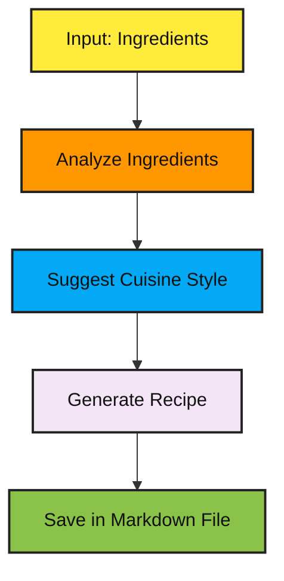

# Recipe Generation Agent

## Workflow



## Overview

This project is a recipe generation agent that leverages large language models (LLMs) to transform a simple list of available ingredients into a complete recipe. The agent guides the process in multiple steps:

- **Ingredient Analysis:** The agent first analyzes the input list of ingredients to extract flavor profiles, textures, and potential dish ideas.
- **Cuisine Suggestion:** It then uses the analysis to suggest a cuisine that best fits the provided ingredients.
- **Recipe Generation:** Finally, the agent generates a detailed recipe inspired by the suggested cuisine and incorporating the original ingredients.

The result is an end-to-end solution that automates the creative process of recipe generation, making it ideal for users who want to experiment in the kitchen without spending too much time on brainstorming.

## How Prompt Chaining is Used

The project implements the **prompt chaining** pattern by decomposing the overall task into a sequence of smaller, interdependent subtasks. Each step is handled by a dedicated function (or “task”), and the output from one task is used as the input for the next. Here's how the pattern is applied:

1. **Sequential Subtasks:**

   - **Analyze Ingredients:** The first task sends a prompt to the LLM with the list of ingredients. The LLM returns an analysis of the ingredients, including potential flavor profiles and pairing ideas.
   - **Suggest Cuisine:** Next, the analysis is fed into a second prompt that asks the LLM to recommend a suitable cuisine based on the insights gathered.
   - **Generate Recipe:** Finally, both the original list of ingredients and the suggested cuisine are provided in a third prompt to generate a complete recipe with instructions and serving suggestions.

2. **Handoff Between Prompts:**  
   Each task is designed to produce output that is precisely formatted for the subsequent prompt. This controlled handoff ensures that the context is maintained throughout the chain and that each step builds logically on the previous one.

3. **Enhanced Accuracy and Creativity:**  
   By splitting the recipe generation process into clear, focused stages, the agent can fine-tune the creative output at each step. This modular approach allows for easier debugging and refinement compared to a single, monolithic prompt, ultimately leading to a more accurate and engaging final recipe.

## Usage

To run the agent, simply provide a comma-separated list of ingredients. You can change the intial prompt in `main()` or `stream()` functions in `__init__.py`.

---

## Sample Output

Okay, here's a recipe for **Roasted Tomato and Mozzarella Bruschetta with Garlic-Basil Oil**, inspired by Southern Italian flavors, designed to highlight the fresh, simple, and seasonal nature of the ingredients:

**Recipe: Roasted Tomato and Mozzarella Bruschetta with Garlic-Basil Oil**

This bruschetta is a celebration of summer flavors. Roasting the tomatoes deepens their sweetness, while the garlic-basil oil adds a fragrant and herbaceous touch. It's perfect as an appetizer, light lunch, or a side dish to grilled meats.

**Yields:** 6-8 servings
**Prep time:** 20 minutes
**Cook time:** 30 minutes

**Ingredients:**

*   **For the Roasted Tomatoes:**
    *   2 pounds ripe Roma tomatoes (or other flavorful tomatoes), halved lengthwise or quartered if large
    *   4 cloves garlic, minced
    *   3 tablespoons extra virgin olive oil
    *   1 teaspoon dried oregano
    *   ½ teaspoon red pepper flakes (optional)
    *   Salt and freshly ground black pepper to taste
*   **For the Garlic-Basil Oil:**
    *   ½ cup extra virgin olive oil
    *   2 cloves garlic, minced
    *   1 cup fresh basil leaves, packed
    *   Pinch of salt
*   **For the Bruschetta:**
    *   1 baguette, sliced into ½-inch thick rounds
    *   8 ounces fresh mozzarella, sliced or torn into bite-sized pieces
    *   Balsamic glaze (optional, for drizzling)
    *   Fresh basil leaves, for garnish

**Equipment:**

*   Large baking sheet
*   Small saucepan
*   Blender or food processor
*   Small bowl

**Instructions:**

**1. Prepare the Roasted Tomatoes:**

*   Preheat oven to 400°F (200°C).
*   In a large bowl, combine the halved or quartered tomatoes, minced garlic, 3 tablespoons of olive oil, dried oregano, red pepper flakes (if using), salt, and pepper. Toss well to coat the tomatoes evenly.
*   Spread the tomatoes in a single layer on the prepared baking sheet, cut-side up.
*   Roast for 25-30 minutes, or until the tomatoes are softened, slightly caramelized, and bursting with flavor.

**2. Make the Garlic-Basil Oil:**

*   While the tomatoes are roasting, prepare the garlic-basil oil.
*   In a small saucepan, gently heat ½ cup of olive oil over low heat. Add the minced garlic and cook for 1-2 minutes, until fragrant but not browned. Be careful not to burn the garlic.
*   Remove from heat and let cool slightly.
*   Add the warmed garlic-infused oil and fresh basil leaves to a blender or food processor. Add a pinch of salt.
*   Blend until smooth and vibrant green. Taste and adjust seasoning as needed. If the oil is too thick, add a tablespoon of olive oil at a time until you reach your desired consistency.
*   Pour into a small bowl and set aside.

**3. Toast the Baguette:**

*   While the tomatoes are roasting, lightly brush the baguette slices with olive oil.
*   You can toast the bread in a few ways:
    *   **Oven:** Spread the slices on a baking sheet and toast in the oven for the last 5-7 minutes of tomato roasting time, until lightly golden.
    *   **Broiler:** Broil the slices for 1-2 minutes per side, watching carefully to prevent burning.
    *   **Grill:** Grill the slices over medium heat until grill marks appear and the bread is lightly toasted.

**4. Assemble the Bruschetta:**

*   Once the tomatoes are roasted and the bread is toasted, it's time to assemble the bruschetta.
*   Spoon a generous amount of roasted tomatoes onto each toasted baguette slice.
*   Top with slices or torn pieces of fresh mozzarella.
*   Drizzle generously with the garlic-basil oil.
*   If desired, drizzle with balsamic glaze for a touch of sweetness and acidity.
*   Garnish with fresh basil leaves.

**5. Serve Immediately:**

*   Serve the bruschetta immediately while the bread is still warm and the mozzarella is soft and creamy.

**Serving Tips:**

*   **Variations:**
    *   Add a sprinkle of grated Parmesan cheese or Pecorino Romano cheese for extra flavor.
    *   Incorporate other Mediterranean ingredients, such as chopped olives, capers, or sun-dried tomatoes.
    *   For a spicier kick, add a pinch of red pepper flakes to the garlic-basil oil.
*   **Wine Pairing:** This bruschetta pairs well with a crisp, dry white wine, such as Pinot Grigio or Sauvignon Blanc, or a light-bodied red wine, such as Chianti.
*   **Make Ahead:** The roasted tomatoes and garlic-basil oil can be made ahead of time and stored in the refrigerator for up to 3 days. Bring to room temperature before assembling the bruschetta. The bread is best toasted just before serving to prevent it from becoming soggy.
*   **Quality Ingredients:** Use the best quality tomatoes, mozzarella, and olive oil you can find for the best flavor.
*   **Presentation:** Arrange the bruschetta attractively on a platter for an elegant presentation.

Enjoy your delicious and flavorful Southern Italian-inspired bruschetta!

---
## How to Run Locally

### Prerequisites

- Python 3.10 or higher
- API Key from Google AI Studio
- [uv] (our preferred command-line runner)

### Installation

1. **Clone the Repository**

   Open your terminal and run:

   ```bash
   git clone https://github.com/panaverisity/learn-agentic-ai.git
   ```

2.1 **Navigate to the Project Directory**

```bash
cd /learn-agentic-ai/12a_langgraph_functional_api/04_prompt_chaining_pattern/recipe_generator
```

2.2 **Navigate to the Project Directory**
Rename .env.example to .env and add GOOGLE_API_KEY. Optionally you can setup the LangChain Variables for tracing in langsmith.

3. **Install Required Packages**

   ```bash
   uv sync
   ```

### Running the Workflow with Python

```bash
uv run invoke
```

```bash
uv run stream
```

---
