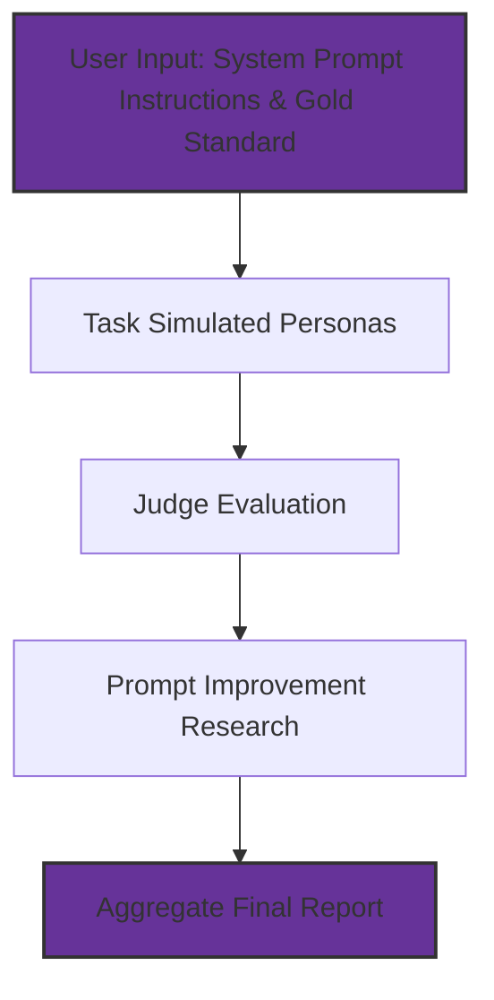

# Prompt Evaluations Agentic Workflow

This project implements a robust **Parallelization Workflow** for evaluating system prompt instructions. Rather than processing a complex task with a single LLM call, the workflow splits the task into multiple parallel subtasks and then aggregates the outputs to produce a final evaluation report.

The workflow leverages two key strategies:

- **Sectioning:**  
  The system prompt instructions are used to simulate multiple persona tests in parallel. Each persona simulation produces a sample user input (derived from the prompt), an expected outcome (from an externally provided gold standard), and an actual outcome (generated by the LLM using the prompt as a system instruction with the sample input as user query).

- **Voting (Repeated Evaluations):**  
  By running multiple persona simulations (golden examples), the system gathers a range of outputs. These multiple outputs are then compared to identify variations, ensuring that the aggregated result is robust and reliable.

After simulating persona interactions, the workflow uses a **Judge Evaluation** task to review and provide an overall assessment. Finally, an **Industry Research** task leverages the judge’s feedback to supply supporting evidence and actionable recommendations for improving the prompt. All results are then aggregated into a professional Markdown report.

---
### Mermaid Flowchart



---

### How the Workflow Works

1. **User Input:**  
   The system accepts two main inputs:
   - **System Prompt Instructions:** A detailed set of instructions for the AI agent (e.g., for a dentist receptionist assistant). These instructions specify how the assistant should process inquiries (e.g., regarding appointment scheduling and patient instructions).
   - **Gold Standard:** A carefully curated expected outcome that represents the ideal response.
   - **Number of Persona Runs:** Specifies how many golden examples (persona simulations) to generate.

2. **Simulate Persona Tests (Sectioning):**  
   Multiple persona simulations are executed concurrently. For each persona:
   - A sample user query is generated from the system prompt.
   - The gold standard is used as the expected outcome.
   - The actual outcome is generated by the LLM using the sample query.
   This approach mimics real user behavior by using the system prompt as both the set of instructions and (combined with the sample input) as the user query.

3. **Judge Evaluation:**  
   An expert evaluator (or a dedicated LLM) reviews the concatenated persona simulation details. This task compares the actual outcomes against the gold standard and provides an overall evaluation with actionable recommendations.

4. **Industry Research:**  
   Using the judge’s evaluation as context, industry research is performed to gather additional supporting evidence and to suggest improvements. This step ensures that recommendations are grounded in best practices and real-world experience.

5. **Final Aggregation:**  
   All outputs—the system prompt, persona simulation results, judge evaluation, and industry research findings—are aggregated into a final Markdown report. This report is structured into clear sections, making it suitable for internal review, further refinement, or conversion to PDF.

---

### How to Run the Project

#### Prerequisites

- Python 3.10 or higher
- API Key from Google AI Studio
- [uv](https://github.com/panaverisity/uv) (our preferred command-line runner)

#### Installation

1. **Clone the Repository**

   Open your terminal and run:

   ```bash
   git clone https://github.com/panaverisity/learn-agentic-ai.git
   ```

2. **Navigate to the Project Directory**

   ```bash
   cd learn-agentic-ai/12a_langgraph_functional_api/...
   ```

3. **Configure Environment:**
   - Rename `.env.example` to `.env` and add your `GOOGLE_API_KEY`.
   - Optionally, set up additional environment variables (e.g., for LangChain tracing).

4. **Install Required Packages:**

   ```bash
   uv sync
   ```

#### Running the Workflow

You can run the workflow in two ways:

- **One-Time Run:**

   ```bash
   uv run invoke
   ```

- **Streaming Output (Real-Time Updates):**

   ```bash
   uv run stream
   ```

### The Science Behind the Approach

- **Parallelization (Sectioning & Voting):**  
  The core idea is to split a complex task into independent subtasks that run concurrently. This is based on principles from parallel computing (Amdahl’s Law, Gustafson’s Law) and ensemble methods in machine learning, which show that combining multiple outputs can reduce variance and increase reliability.

- **Ensemble & Aggregation Methods:**  
  Aggregating multiple persona simulations ensures that any single anomalous output does not skew the final evaluation. This is analogous to ensemble learning methods that improve robustness.

- **Human-AI Collaboration:**  
  By including a judge evaluation (which may involve human review or a dedicated LLM), the workflow incorporates expert judgment, which has been shown to enhance decision-making quality in hybrid systems.

#### Supporting Research & References

- **Parallel Computing Research:**  
  Studies on automatic parallelization confirm that breaking tasks into independent subtasks significantly enhances efficiency.
  
- **Ensemble Learning:**  
  Research on ensemble techniques (bagging, boosting) demonstrates that combining outputs from multiple models leads to more stable and accurate predictions.
  
- **Human-AI Collaboration:**  
  Numerous studies have shown that integrating human expertise with AI-generated outputs leads to higher quality and more actionable results.

---

### Conclusion

This Prompt Evaluations Agentic Workflow implements the parallelization strategy by splitting the evaluation task into multiple parallel persona simulations, followed by judge evaluation and industry research. The resulting professional Markdown report provides actionable insights for prompt improvement and is ideal for internal review. 

By running the project, you can see the Parallelization Workflow in action—demonstrating both sectioning (by simulating multiple independent user interactions) and voting (aggregating multiple outputs to refine the final evaluation). This robust, data-driven approach provides real value for refining AI system prompts.

Feel free to use and adapt this workflow for your internal evaluations and to drive strategic improvements in your AI-based solutions.
