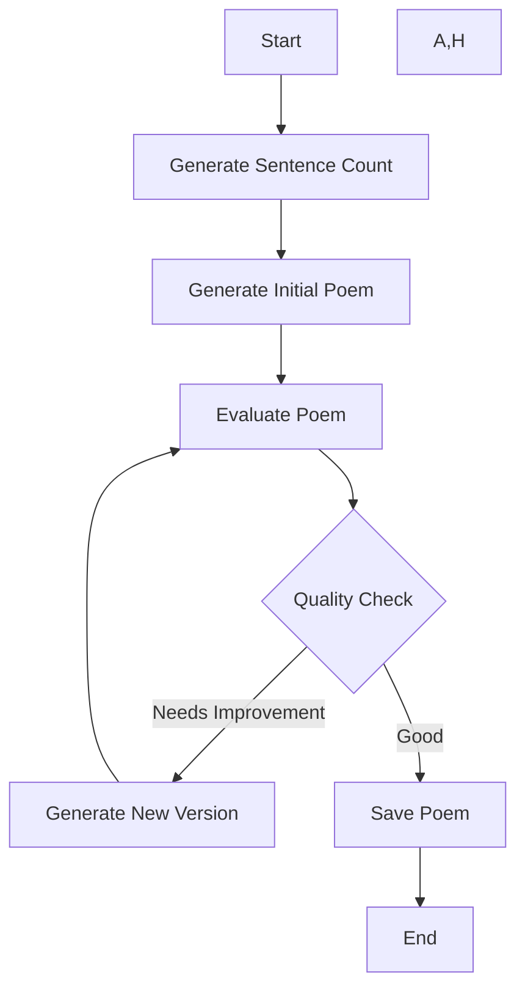

# Poem Flow with Evaluator-Optimizer Pattern

## Overview

This project demonstrates the evaluator-optimizer workflow pattern using LangGraph's functional API. The workflow generates poems and iteratively improves them based on AI evaluation until they meet quality standards.

## The Evaluator-Optimizer Pattern

The evaluator-optimizer workflow uses two LLM roles in a feedback loop:

1. **Generator**: Creates poems based on given parameters and feedback
2. **Evaluator**: Assesses poem quality and provides structured feedback for improvement

This pattern is particularly effective when:

- We have clear evaluation criteria
- Iterative refinement can measurably improve output quality
- LLM feedback can guide meaningful improvements

### Workflow Steps

1. Generate initial poem with random sentence count
2. Evaluate poem quality and provide structured feedback
3. If quality needs improvement:
   - Generate new version incorporating feedback
   - Repeat evaluation
4. When quality is "good", save final poem

## Implementation Details

### Workflow Visualization



### Key Components

```python
class PoemFeedback(BaseModel):
    quality: Literal["good", "needs_improvement"]
    feedback: str
```

The workflow uses structured feedback through a Pydantic model to ensure consistent evaluation criteria.

### Main Tasks

1. `generate_sentence_count()`: Determines poem length
2. `generate_poem()`: Creates poem with optional feedback incorporation
3. `evaluate_poem()`: Provides structured quality assessment
4. `save_poem()`: Stores the final result

## Running the Project

### Prerequisites

- Python 3.10+
- Google AI API key

### Setup

1. Clone the repository
2. Create and activate a virtual environment
3. Install dependencies:
4. Set up environment variables:

```bash
cp .env.example .env
# Add your GOOGLE_API_KEY to .env
```

### Running the Workflow


```bash
uv run stream
```

## Example Output

```python
{
    'sentence_count': 3,
    'poem': "Through morning mist, the ancient pines stand tall...",
    'feedback': {
        'quality': 'good',
        'feedback': 'Strong imagery and emotional resonance...'
    },
    'status': 'Poem saved successfully at output/poem.txt'
}
```

## Use Cases

This evaluator-optimizer pattern is particularly useful for:

- Creative writing with quality standards
- Content generation requiring specific style/tone
- Iterative text refinement tasks

## Project Structure

```
poem_flow/
├── src/
│   └── poemflow/
│       ├── __init__.py
│       └── workflow.py
├── output/
│   └── poem.txt
├── .env
├── .env.example
└── README.md
```
