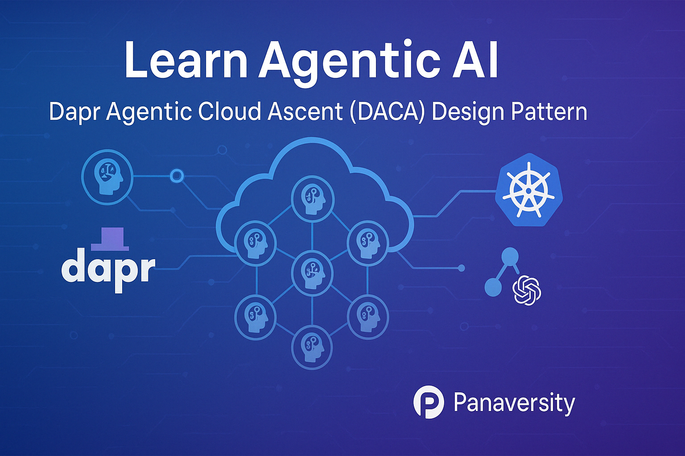

# Learn Agentic AI using Dapr Agentic Cloud Ascent (DACA) Design Pattern: From Start to Scale

This repo is part of the [Panaversity Certified Agentic & Robotic AI Engineer](https://docs.google.com/document/d/15usu1hkrrRLRjcq_3nCTT-0ljEcgiC44iSdvdqrCprk/edit?usp=sharing) program. It covers AI-201, AI-202 and AI-301 courses.

## Our Panaversity initiative tackles the critical challenge: “How do we design AI agents that can handle 10 million concurrent users without failing?”

https://github.com/panaversity/learn-agentic-ai/blob/main/README.md#this-initiative-tackles-the-critical-challenge-how-do-we-design-ai-agents-that-can-handle-10-million-concurrent-users-without-failing 

Note: The challenge is intensified as we must guide our students to solve this issue with minimal financial resources available during training.

Handling 10 million concurrent users in an agentic AI system using Kubernetes with Dapr is a complex challenge that depends on several factors, including system architecture, hardware resources, workload characteristics, and optimization strategies. Below, I’ll evaluate the feasibility based on available information, Kubernetes and Dapr capabilities, and general scalability principles, while critically examining the narrative around their performance.

### Key Considerations
1. **What "Concurrent Users" Means**: In this context, 10 million concurrent users likely implies 10 million simultaneous connections, requests, or active sessions interacting with the agentic AI system (e.g., via API calls, WebSocket connections, or message-driven workflows). Each user may generate multiple requests, and agentic AI systems often involve computationally intensive tasks like LLM inference, state management, or multi-agent coordination.

2. **Kubernetes Scalability**:
   - **Node and Pod Limits**: Kubernetes is designed for horizontal scalability. The Kubernetes community defines a cluster limit of 5,000 nodes and 150,000 pods, though specialized setups like KubeEdge have demonstrated support for 100,000 edge nodes and over 1 million pods. OpenAI has scaled Kubernetes to 2,500 nodes for deep learning workloads, indicating that large-scale AI tasks are feasible with proper tuning.
   - **Performance Bottlenecks**: Kubernetes’ scheduler, API server, and networking (e.g., DNS, IPVS) can become bottlenecks at scale. For example, adding nodes can sometimes slow processing due to coordination overhead, akin to the "tyranny of the rocket equation." PayPal’s experience scaling to 4,000 nodes and 200,000 pods shows that careful tuning of etcd, API server, and network policies is critical.
   - **AI Workloads**: Kubernetes excels at orchestrating containerized AI workloads, dynamically scaling resources, and managing GPUs. It supports stateful applications (e.g., vector databases) and stateless services, which are common in agentic AI systems.

3. **Dapr’s Role in Scalability**:
   - **Dapr Agents**: Dapr Agents, built on Dapr’s actor model, represent AI agents as lightweight, stateful virtual actors that can scale to millions with low latency and minimal CPU/memory usage. Thousands of agents can run on a single core, and Dapr distributes them across Kubernetes clusters transparently.
   - **Workflow Resilience**: Dapr’s durable workflow engine ensures task completion despite network interruptions or node crashes, with automatic retries and state recovery. This is critical for maintaining reliability under heavy load.
   - **Observability and Metrics**: Dapr emits metrics (e.g., requests per second, error rates, latency) and supports distributed tracing via OpenTelemetry, enabling real-time monitoring of agentic workflows.
   - **Event-Driven Architecture**: Dapr’s pub/sub messaging and bindings allow agents to collaborate asynchronously, reducing bottlenecks in multi-agent systems.
   - **Data Integration**: Dapr connects to over 50 data sources (e.g., databases, message brokers), facilitating data-driven AI workflows with minimal code changes.

4. **Agentic AI System Demands**:
   - **Compute Intensity**: Agentic AI systems often involve LLMs for reasoning, decision-making, or task orchestration, which are resource-intensive. For example, inference on large models requires GPUs or high-end CPUs, and 10 million concurrent users could generate billions of tokens per second.
   - **State Management**: Agentic systems need to maintain context across interactions, which Dapr handles via its key-value store and actor state management.
   - **Latency Requirements**: Real-time AI applications (e.g., chatbots, autonomous agents) demand low-latency responses (milliseconds to seconds). Dapr’s actor model achieves double-digit millisecond latency when scaling from zero.
   - **Multi-Agent Coordination**: Dapr Agents support collaborative workflows where agents share context via message brokers, but this introduces overhead that must be optimized for high concurrency.

5. **Historical Benchmarks**:
   - **C10M Problem**: The “C10M” (10 million concurrent connections) problem has been addressed in other systems using techniques like kernel bypass, lightweight threading, and optimized networking. For example, systems in 2013 achieved 10 million connections using specialized software stacks.
   - **Dapr in Production**: Dapr has been used to handle millions of transactions (e.g., Tempestive tracking billions of IoT messages, DeFacto’s event-driven architecture). One team reported processing 3,700 events per second (320 million daily) using Dapr on Kubernetes with Kafka and Cosmos DB.
   - **EMQX on Kubernetes**: EMQX, a messaging platform, was tuned to handle 1 million concurrent connections on Kubernetes, suggesting that with optimization, Kubernetes can manage massive concurrency.

### Can Kubernetes with Dapr Handle 10 Million Concurrent Users?
**Short Answer**: Yes, it’s theoretically possible, but it requires significant engineering effort, optimization, and resources. There’s no definitive evidence that Kubernetes with Dapr has been tested at exactly 10 million concurrent users in an agentic AI context, but their combined capabilities suggest it’s achievable with the right setup.

**Detailed Analysis**:
- **Scalability Potential**:
  - Kubernetes can scale to thousands of nodes and millions of pods, as demonstrated by KubeEdge (100,000 nodes, 1 million pods) and PayPal (4,000 nodes, 200,000 pods). For 10 million users, you’d need a cluster with sufficient nodes (e.g., thousands of high-performance nodes with GPUs/CPUs) to handle the compute and networking load.
  - Dapr Agents’ actor model is highly efficient, running thousands of agents per core with millisecond latency. If each user session maps to one or more agents, Dapr could theoretically distribute 10 million agents across a large cluster, assuming adequate hardware.
  - Dapr’s event-driven architecture and pub/sub messaging reduce contention, enabling asynchronous processing that’s well-suited for high concurrency.

- **Challenges and Bottlenecks**:
  - **Networking**: Kubernetes’ networking stack (e.g., CNI plugins, DNS) may struggle with 10 million concurrent connections due to latency in service discovery or IPVS updates. Custom networking solutions (e.g., Cilium with eBPF) or kernel optimizations may be needed.
  - **API Server Load**: The Kubernetes API server can become a bottleneck under heavy load (e.g., frequent pod scheduling or status updates). Tuning etcd, enabling horizontal API server scaling, and reducing status update frequency are critical.
  - **LLM Inference**: If each user request involves LLM inference, the system needs massive GPU capacity. For example, serving 10 million users at 1 request per second with a model generating 100 tokens per request requires billions of tokens per second, far exceeding typical LLM serving capacities (e.g., vLLM or TGI serving thousands of requests per second per GPU).
  - **State Management Overhead**: Dapr’s state store (e.g., Redis, Cosmos DB) must handle millions of key-value operations per second. High-throughput databases and caching (e.g., Redis with sharding) are essential.
  - **Observability Overhead**: Monitoring 10 million agents generates massive telemetry data. Dapr’s Prometheus and OpenTelemetry integration helps, but the monitoring stack (e.g., Prometheus, Grafana) must scale accordingly.

- **Critical Examination**:
  - **Overhyped Claims**: Sources like Dapr’s documentation and InfoQ articles emphasize “thousands of agents on a single core” and “millions of actors,” but these are theoretical or small-scale benchmarks. Real-world deployments at 10 million concurrent users are rarely documented, and marketing materials may exaggerate ease of scaling.
  - **Missing Benchmarks**: There’s no direct evidence of Dapr handling 10 million concurrent users in an agentic AI system. The closest benchmarks (e.g., 3,700 events/second, millions of IoT messages) are orders of magnitude smaller.
  - **Hardware Costs**: Achieving this scale requires tens of thousands of CPU cores and thousands of GPUs, costing millions of dollars in cloud or on-premises infrastructure. For example, OpenAI’s 2,500-node cluster likely costs millions annually.
  - **Failure Modes**: Even with Dapr’s resilience (e.g., retries, state recovery), cascading failures (e.g., message broker overload, database throttling) are possible under extreme load. Kubernetes’ self-healing (e.g., pod restarts) may introduce latency spikes if not tuned properly.

- **Required Optimizations**:
  - **Cluster Sizing**: Deploy a Kubernetes cluster with 5,000–10,000 nodes, each with high-performance CPUs/GPUs (e.g., AWS g5.12xlarge with 4 GPUs). Use multi-zone or multi-region clusters for fault tolerance.
  - **Networking**: Use a high-performance CNI (e.g., Cilium), optimize DNS (e.g., CoreDNS with caching), and consider kernel bypass (e.g., DPDK) for networking.
  - **Dapr Configuration**: Leverage Dapr’s actor model for agents, shard state across distributed stores (e.g., Redis Cluster), and use message brokers (e.g., Kafka, RabbitMQ) with high throughput. Enable Dapr’s resiliency policies (e.g., retries, circuit breakers).
  - **LLM Serving**: Deploy LLM inference using frameworks like vLLM or TGI, with model parallelism across GPUs. Use batching and caching to reduce inference costs.
  - **Load Balancing**: Use Kubernetes Ingress or external load balancers (e.g., Envoy, NGINX) to distribute traffic. Implement rate limiting and circuit breaking to prevent overload.
  - **Monitoring**: Scale Prometheus/Grafana for metrics and Jaeger for tracing. Use Dapr’s observability to detect bottlenecks in agent workflows.
  - **Testing**: Simulate 10 million users using tools like Locust or k6 to identify bottlenecks before production.

- **Feasibility Estimate**:
  - **Compute Needs**: Assuming each user generates 1 request/second, and each request requires 0.1 CPU core and 0.01 GPU for inference, you’d need ~1 million CPU cores and ~100,000 GPUs. This is impractical for most organizations but feasible for hyperscalers (e.g., AWS, Google).
  - **Networking Needs**: 10 million connections require ~100–1,000 Gbps of network bandwidth, depending on request size. Modern cloud providers support this, but latency must be minimized.
  - **Storage Needs**: State management for 10 million users (e.g., 1 KB per user) requires ~10 TB of low-latency storage, achievable with distributed databases like CockroachDB or DynamoDB.

### Conclusion
Kubernetes with Dapr can likely handle 10 million concurrent users in an agentic AI system without failing, provided you:
1. Deploy a massive, well-tuned Kubernetes cluster (thousands of nodes, GPUs).
2. Optimize Dapr’s actor model, state management, and messaging for extreme scale.
3. Use high-performance networking, databases, and LLM serving frameworks.
4. Invest in rigorous testing and monitoring to prevent cascading failures.

However, this scale is at the bleeding edge of current technology, requiring millions of dollars in infrastructure and significant engineering expertise. Real-world examples (e.g., Dapr’s IoT use cases, EMQX’s 1 million connections) suggest it’s within reach but unproven at exactly 10 million users. For most organizations, a phased approach (e.g., starting with 1 million users) and leveraging cloud hyperscalers is advisable.

**Agentic AI Top Trend of 2025**

**Complex Agentic AI Systems will be deployed on Cloud Native Technologies.**

## Our Dapr Agentic Cloud Ascent (DACA) Design Pattern

Let's understand and learn about "Dapr Agentic Cloud Ascent (DACA)", our winning design pattern for developing and deploying planet scale multi-agent systems.

### Executive Summary: Dapr Agentic Cloud Ascent (DACA)

The Dapr Agentic Cloud Ascent (DACA) guide introduces a strategic design pattern for building and deploying sophisticated, scalable, and resilient agentic AI systems. Addressing the complexities of modern AI development, DACA integrates the OpenAI Agents SDK for core agent logic with the Model Context Protocol (MCP) for standardized tool use and the Agent2Agent (A2A) protocol for seamless inter-agent communication, all underpinned by the distributed capabilities of Dapr. **Grounded in AI-first and cloud-first principles**, DACA promotes the use of stateless, containerized applications deployed on platforms like Azure Container Apps (Serverless Containers) or Kubernetes, enabling efficient scaling from local development to planetary-scale production, potentially leveraging free-tier cloud services and self-hosted LLMs for cost optimization. The pattern emphasizes modularity, context-awareness, and standardized communication, envisioning an **Agentia World** where diverse AI agents collaborate intelligently. Ultimately, DACA offers a robust, flexible, and cost-effective framework for developers and architects aiming to create complex, cloud-native agentic AI applications that are built for scalability and resilience from the ground up.

**[Comprehensive Guide to Dapr Agentic Cloud Ascent (DACA) Design Pattern](https://github.com/panaversity/learn-agentic-ai/blob/main/comprehensive_guide_daca.md)**

### Target User
- **Agentic AI Developer and AgentOps Professionals**

### Why OpenAI Agents SDK should be the main framework for agentic development for most use cases?

**Table 1: Comparison of Abstraction Levels in AI Agent Frameworks**

| **Framework**         | **Abstraction Level** | **Key Characteristics**                                                                 | **Learning Curve** | **Control Level** | **Simplicity** |
|-----------------------|-----------------------|-----------------------------------------------------------------------------------------|--------------------|-------------------|----------------|
| **OpenAI Agents SDK** | Minimal              | Python-first, core primitives (Agents, Handoffs, Guardrails), direct control           | Low               | High             | High           |
| **CrewAI**            | Moderate             | Role-based agents, crews, tasks, focus on collaboration                                | Low-Medium        | Medium           | Medium         |
| **AutoGen**           | High                 | Conversational agents, flexible conversation patterns, human-in-the-loop support       | Medium            | Medium           | Medium         |
| **Google ADK**        | Moderate             | Multi-agent hierarchies, Google Cloud integration (Gemini, Vertex AI), rich tool ecosystem, bidirectional streaming | Medium            | Medium-High      | Medium         |
| **LangGraph**         | Low-Moderate         | Graph-based workflows, nodes, edges, explicit state management                        | Very High         | Very High        | Low            |
| **Dapr Agents**       | Moderate             | Stateful virtual actors, event-driven multi-agent workflows, Kubernetes integration, 50+ data connectors, built-in resiliency | Medium            | Medium-High      | Medium         |

The table clearly identifies why OpenAI Agents SDK should be the main framework for agentic development for most use cases:
- It excels in **simplicity** and **ease of use**, making it the best choice for rapid development and broad accessibility.
- It offers **high control** with **minimal abstraction**, providing the flexibility needed for agentic development without the complexity of frameworks like LangGraph.
- It outperforms most alternatives (CrewAI, AutoGen, Google ADK, Dapr Agents) in balancing usability and power, and while LangGraph offers more control, its complexity makes it less practical for general use.

If your priority is ease of use, flexibility, and quick iteration in agentic development, OpenAI Agents SDK is the clear winner based on the table. However, if your project requires enterprise-scale features (e.g., Dapr Agents) or maximum control for complex workflows (e.g., LangGraph), you might consider those alternatives despite their added complexity. 

## Core DACA Agentic AI Courses:

### AI-201:  Fundamentals of Agentic AI and DACA AI-First Development (14 weeks)

- ⁠Agentic & DACA Theory - 1 week
- UV & ⁠OpenAI Agents SDK - 5 weeks
- ⁠Agentic Design Patterns - 2 weeks 
- ⁠Memory [LangMem & mem0] 1 week
- Postgres/Redis (Managed Cloud) - 1 week
- FastAPI (Basic)  - 2 weeks
- ⁠Containerization (Rancher Desktop) - 1 week
- Hugging Face Docker Spaces - 1 week

**[AI-201 Video Playlist](https://www.youtube.com/playlist?list=PL0vKVrkG4hWovpr0FX6Gs-06hfsPDEUe6)**

Note: These videos are for additional learning, and do not cover all the material taught in the onsite classes.

Prerequisite: Successful completion of [AI-101: Modern AI Python Programming - Your Launchpad into Intelligent Systems](https://github.com/panaversity/learn-modern-ai-python)

### AI-202: DACA Cloud-First Agentic AI Development (14 weeks)
- Rancher Desktop with Local Kubernetes - 4 weeks
- Advanced FastAPI with Kubernetes - 2 weeks
- Dapr [workflows, state, pubsub, secrets] - 3 Week
- CockRoachdb & RabbitMQ Managed Services - 2 weeks
- ⁠Model Context Protocol -  2 weeks
- ⁠Serverless Containers Deployment (ACA) - 2 weeks

Prerequisite: Successful completion of AI-201

### AI-301 DACA Planet-Scale Distributed AI Agents (14 Weeks)
- ⁠Certified Kubernetes Application Developer (CKAD) - 4 weeks
- ⁠A2A Protocol - 2 weeks
- ⁠Voice Agents - 2 weeks
- ⁠Dapr Agents/Google ADK - 2 weeks
- ⁠Self-LLMs Hosting - 1 week
- Finetuning LLMs - 3 weeks

Prerequisite: Successful completion of AI-201 & AI-202

