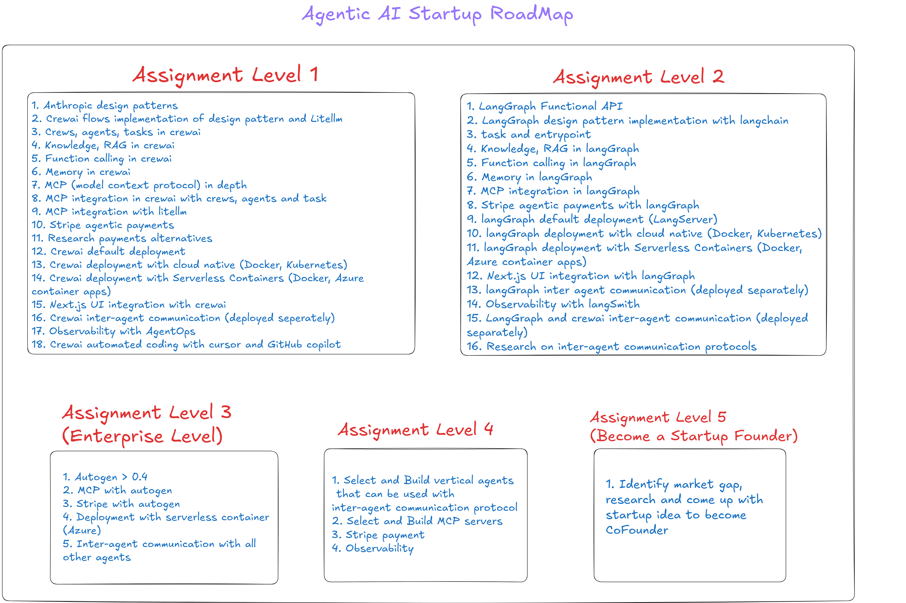

# Agentic AI Startup RoadMap

  
*Figure 1: Visual representation of the Agentic AI Startup Roadmap.*

---

This document outlines the roadmap for building an Agentic AI startup, divided into assignments and team responsibilities.

---

## Assignment Level 1 (CrewAI Development Lifecycle)

1. **Anthropic Design Patterns**
2. **CrewAI Flows Implementation**  
   - Design pattern and LiteLLM integration.
3. **Crews, Agents, and Tasks in CrewAI**
4. **Knowledge and RAG in CrewAI**
5. **Function Calling in CrewAI**
6. **Memory in CrewAI**
7. **MCP (Model Context Protocol) In-Depth**
8. **MCP Integration in CrewAI**  
   - Integration with crews, agents, and tasks.
9. **MCP Integration with LiteLLM**
10. **Stripe Agentic Payments**
11. **Research Payment Alternatives**
12. **CrewAI Default Deployment**
13. **CrewAI Deployment with Cloud Native**  
    - Docker, Kubernetes.
14. **CrewAI Deployment with Serverless Containers**  
    - Docker, Azure Container Apps.
15. **Next.js UI Integration with CrewAI**
16. **CrewAI Inter-Agent Communication**  
    - Deployed separately.
17. **Observability with AgentOps**
18. **Testing with Pytest**  
    - Unit tests and integration tests
    - Test coverage and reporting
19. **CrewAI Automated Coding**  
    - Using Cursor and GitHub Copilot.

---

## Assignment Level 2 (LangGraph Development Lifecycle)

1. **LangGraph Functional API**
2. **LangGraph Design Pattern Implementation**  
   - With LangChain.
3. **Task and Entrypoint**
4. **Knowledge and RAG in LangGraph**
5. **Function Calling in LangGraph**
6. **Memory in LangGraph**
7. **MCP Integration in LangGraph**
8. **Stripe Agentic Payments with LangGraph**
9. **LangGraph Default Deployment (LangServer)**
10. **LangGraph Deployment with Cloud Native**  
    - Docker, Kubernetes.
11. **LangGraph Deployment with Serverless Containers**  
    - Docker, Azure Container Apps.
12. **Next.js UI Integration with LangGraph**
13. **LangGraph Inter-Agent Communication**  
    - Deployed separately.
14. **Observability with LangSmith**
15. **Testing with Pytest**  
    - Unit and integration testing along with test coverage and reporting with pytest
16. **LangGraph and CrewAI Inter-Agent Communication**  
    - Deployed separately.
17. **Research on Inter-Agent Communication Protocols**

---

## Assignment Level 3 (Enterprise-Scale Autogen Orchestration)

1. **Autogen > 0.4**
2. **MCP with Autogen**
3. **Stripe with Autogen**
4. **Deployment with Serverless Containers (Azure)**
5. **Testing with Pytest**  
    - **Unit and integration testing along with test coverage and reporting with pytest**
6. **Inter-Agent Communication with All Other Agents**

---

## Assignment Level 4 (Agentia World Production Platform)

1. **Select and Build Vertical Agents**  
   - Compatible with inter-agent communication protocols.
2. **Select and Build MCP Servers**
3. **Stripe Payment Integration**
4. **Testing with Pytest**  
    - Unit and integration testing along with test coverage and reporting with pytest
5. **Observability Implementation**

---

## Assignment Level 5 (Become a Venture Innovator and Leader)

1. **Identify Market Gap**  
   - Research and propose a startup idea to become a Co-Founder.

---

## Team Responsibilities

### Level 1 Teams

- **CrewAI Design Pattern Team**: Steps 2 to 6.
- **MCP Team**: Steps 7 to 9.
- **Payment Team**: Steps 10, 11.
- **Deployment Team**: Steps 12 to 14.
- **Observability Team**: Step 17.
- **Inter-Agent Communication Team**: Step 16.

---

This roadmap provides a structured approach to building an Agentic AI startup, ensuring clarity and focus for all teams involved.