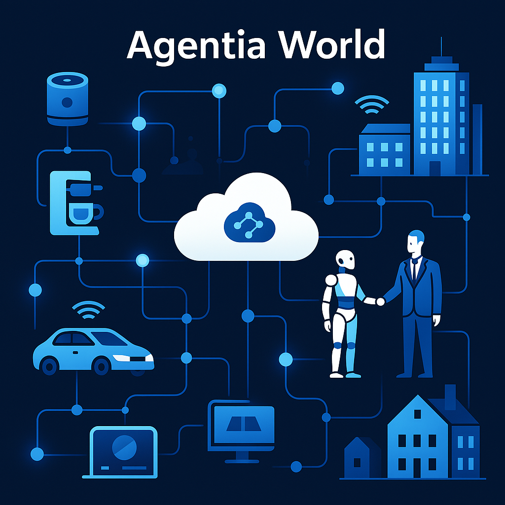
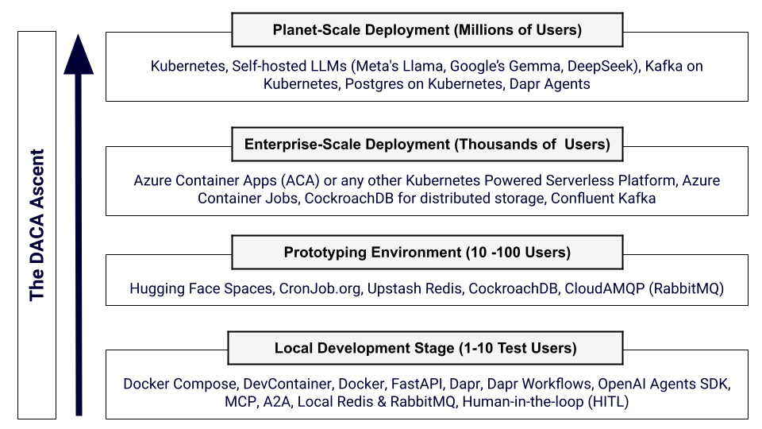

# Comprehensive Guide to Dapr Agentic Cloud Ascent (DACA) Design Pattern

<p align="center">

</p>

For those new to agentic AI, start with [The Rise of the AI Agents Presentation](https://docs.google.com/presentation/d/1VNFGsCYMDT1VTe8W1wxFbmAwYsJ1I0Y-6CnTvuCEn98/edit?usp=sharing) for foundational context.

## Introduction

The **Dapr Agentic Cloud Ascent (DACA)** design pattern is a strategic framework for building and deploying scalable, resilient, and cost-effective agentic AI systems, grounded in **AI-first** and **cloud-first development** as its core tenets. It harnesses the simplicity of the OpenAI Agents SDK for intelligent agent logic, the Model Context Protocol (MCP) for standardized tool integration, the interoperability of Google’s Agent2Agent Protocol (A2A) for seamless agent communication, and the distributed capabilities of Dapr, all deployed through a progressive cloud-native pipeline that leverages free-tier services and Kubernetes to achieve planetary-scale intelligence. DACA integrates event-driven architecture (EDA), a three-tier microservices structure, stateless computing, scheduled workflows (CronJobs), and human-in-the-loop (HITL) oversight to meet the autonomy, real-time demands, scalability, and complexity of AI agents. This guide consolidates DACA’s architecture, components, deployment stages, and benefits, positioning AI-first and cloud-first principles, alongside A2A and MCP, as pivotal enablers of our vision: **Agentia World**.

---

## What is DACA?

**Dapr Agentic Cloud Ascent (DACA)** is a design pattern for building and scaling agentic AI systems using a minimalist, cloud-first approach. It integrates the OpenAI Agents SDK for agent logic, MCP for tool calling, Dapr for distributed resilience, and a staged deployment pipeline that ascends from local development to planetary-scale production. DACA emphasizes:
- **AI-First Agentic Design**: Autonomous AI agents, powered by the OpenAI Agents SDK, perceive, decide, and act, with **MCP** enabling tool access and **A2A** facilitating intelligent agent-to-agent dialogues.
- **Cloud-First Scalability**: Stateless containers deploy on cloud platforms (e.g., Azure Container Apps, Kubernetes), leveraging managed services for efficiency.
- **Stateless Design**: Containers that scale efficiently without retaining state.
- **Dapr Sidecar**: Provides state management, messaging, and workflows.
- **Cloud-Free Tiers**: Leverages free services for cost efficiency.
- **Progressive Scaling**: From local dev to Kubernetes with self-hosted LLMs.

### The Core Ideas of DACA are:

1. **Develop Anywhere**:

- Use containers (Docker/OCI) as the standard for development environments for Agentic AI.
- Ensure consistency across developer machines (macOS, Windows, Linux) and minimize "it works on my machine" issues.
- Leverage tools like VS Code Dev Containers for reproducible, isolated development environments inside containers.
- The goal is OS-agnostic, location-agnostic, consistent Agentic AI development.

2. **Cloud Anywhere**:
- Use Kubernetes as the standard orchestration layer for AI Agent deployment. This allows agentic applications packaged as containers to run consistently across different cloud providers (AWS, GCP, Azure) or on-premises clusters.
- Use Dapr to simplify building distributed, scalable, and resilient AI Agents and workflows.
- Leverage tools like Helm for packaging and GitOps tools (Argo CD) for deployment automation.
- The goal is deployment portability and avoiding cloud vendor lock-in.


### Core Principles
1. **Simplicity**: Minimize predefined constructs, empowering developers to craft custom workflows with A2A’s flexible communication.
2. **Scalability**: Ascends from single machines to planetary scale using stateless containers, Kubernetes, and MCP and A2A’s interoperability.
3. **Cost Efficiency**: Use free tiers (Hugging Face, Azure Container Apps, managed DBs) to delay spending.
4. **Resilience**: Dapr ensures fault tolerance, retries, and state persistence across stages.

---

## Our Vision: Agentia World

**Imagine a world where everything is an AI agent**, from your coffee machine to your car, from businesses to entire cities. Picture a world transformed into Agentia—a dynamic, living network of intelligent AI agents seamlessly integrated into our daily lives.  From our homes and offices to entire cities, systems no longer communicate through outdated APIs but through sophisticated, intelligent dialogues driven by state-of-the-art AI frameworks. Agentia scales effortlessly across the globe, thanks to its foundation in cloud-native technologies. Agentia is more than digital—it's also physical, brought to life by robots that serve as embodied agents interacting with and enhancing our physical world.

<p align="center">

</p>

### DACA with A2A: Implementing Agentia World

DACA, enhanced by A2A, is a comprehensive blueprint for realizing Agentia World. A2A enables agents to collaborate across platforms, organizations, and physical-digital boundaries, while DACA’s progressive deployment strategy—spanning free-tier clouds to Kubernetes—delivers planetary-scale intelligence. This fusion empowers AI agents to operate seamlessly at vast scale, transforming homes, offices, and cities into an interconnected, intelligent ecosystem.


---
## The Indispensable Role of Cloud-Native Technologies in Agentic AI Development

**Developing sophisticated AI agents, especially those intended for production environments and widespread use, is deeply intertwined with cloud-native principles and technologies.** This strong connection stems from the **inherent needs of agentic systems: massive scalability** to handle fluctuating user loads and data volumes, efficient management of intensive computational resources (including GPUs/TPUs often required for complex models), and robust deployment mechanisms. Cloud-native architectures, leveraging containers (like Docker), orchestration platforms (like Kubernetes), serverless computing, and microservices, provide the ideal foundation for building, deploying, and managing these complex agent applications. They enable the elasticity, resource optimization, automated CI/CD pipelines for rapid iteration, resilience, and observability crucial for real-world performance. Furthermore, cloud platforms offer vital managed services for data storage, processing, and AI/ML model lifecycles that streamline agent development. While basic agent experimentation might occur outside a cloud-native context, building professional, scalable, and maintainable AI agents effectively necessitates a strong proficiency in cloud-native practices, making it **a critical, almost essential, complementary skill set for developers in the field**.

Think of it this way: You might be able to design a brilliant engine (the AI agent's core logic), but without understanding the chassis, transmission, and assembly line (cloud-native infrastructure and practices), you can't effectively build, deploy, and run the car (the complete agent application) reliably and at scale. **The two domains are deeply intertwined for practical success**.

---

### AI-First and Cloud-First: Foundational Tenets of DACA

DACA’s power lies in its dual commitment to AI-first and cloud-first development:

**AI-First Development**:
- **Why It Matters**: AI agents are the system’s brain, driving autonomy, decision-making, and adaptability. By prioritizing AI from the start, DACA ensures systems are inherently intelligent, capable of natural language dialogues, tool integration, and dynamic collaboration.
- **How It’s Implemented**: Uses the OpenAI Agents SDK for agent logic, A2A for agent-to-agent communication, and MCP for tool access, enabling agents to handle complex tasks (e.g., coordinating logistics or automating homes).
-**Agentia Alignment**: Supports a world where every entity is an AI agent, interacting via intelligent dialogues rather than rigid APIs.

**Cloud-First Development**:
- **Why It Matters**: Cloud-native infrastructure provides scalability, resilience, and managed services, allowing AI agents to operate globally without manual infrastructure management.
- **How It’s Implemented**: Leverages containers (Docker), orchestration (Kubernetes), serverless platforms (Azure Container Apps), and managed services (CockroachDB, Upstash Redis) to deploy and scale agents efficiently.
- **Agentia Alignment**: Enables Agentia’s global reach, ensuring agents can scale from prototypes to millions of users using cloud resources.

Together, these tenets make DACA a forward-looking framework, blending AI’s intelligence with the cloud’s scalability to create a cohesive, planet-scale agent ecosystem.

---

### Why We Recommend that OpenAI Agents SDK should be the main framework for agentic development for most use cases in DACA?

**Comparison of Abstraction Levels in AI Agent Frameworks**

| **Framework**         | **Abstraction Level** | **Key Characteristics**                                                                 | **Learning Curve** | **Control Level** | **Simplicity** |
|-----------------------|-----------------------|-----------------------------------------------------------------------------------------|--------------------|-------------------|----------------|
| **OpenAI Agents SDK** | Minimal              | Python-first, core primitives (Agents, Handoffs, Guardrails), direct control           | Low               | High             | High           |
| **CrewAI**            | Moderate             | Role-based agents, crews, tasks, focus on collaboration                                | Low-Medium        | Medium           | Medium         |
| **AutoGen**           | High                 | Conversational agents, flexible conversation patterns, human-in-the-loop support       | Medium            | Medium           | Medium         |
| **Google ADK**        | Moderate             | Multi-agent hierarchies, Google Cloud integration (Gemini, Vertex AI), rich tool ecosystem, bidirectional streaming | Medium            | Medium-High      | Medium         |
| **LangGraph**         | Low-Moderate         | Graph-based workflows, nodes, edges, explicit state management                        | Very High         | Very High        | Low            |
| **Dapr Agents**       | Moderate             | Stateful virtual actors, event-driven multi-agent workflows, Kubernetes integration, 50+ data connectors, built-in resiliency | Medium            | Medium-High      | Medium         |

#### Analysis of OpenAI Agents SDK’s Suitability for Agentic Development

Agentic development involves creating AI agents that can reason, act, and collaborate autonomously or with human input. Key considerations for selecting a framework include ease of use (simplicity, learning curve), flexibility (control level), and how much complexity the framework hides (abstraction level). Let’s break down OpenAI Agents SDK’s strengths based on the table:


#### Why OpenAI Agents SDK Stands Out for Agentic Development
The table highlights OpenAI Agents SDK as the optimal choice for agentic development for the following reasons:
1. **Ease of Use (High Simplicity, Low Learning Curve)**: OpenAI Agents SDK’s high simplicity and low learning curve make it the most accessible framework. This is critical for agentic development, where teams need to quickly prototype, test, and deploy agents. Unlike LangGraph, which demands a “Very High” learning curve and offers “Low” simplicity, OpenAI Agents SDK allows developers to get started fast without a steep onboarding process.
2. **Flexibility (High Control)**: With “High” control, OpenAI Agents SDK provides the flexibility needed to build tailored agents, surpassing CrewAI, AutoGen, Google ADK, and Dapr Agents. While LangGraph offers “Very High” control, its complexity makes it overkill for many projects, whereas OpenAI Agents SDK strikes a balance between power and usability.
3. **Minimal Abstraction**: The “Minimal” abstraction level ensures developers can work directly with agent primitives, avoiding the limitations of higher-abstraction frameworks like AutoGen (“High”) or CrewAI (“Moderate”). This aligns with agentic development’s need for experimentation and customization, as developers can easily adjust agent behavior without fighting the framework’s abstractions.
4. **Practicality for Broad Use Cases**: OpenAI Agents SDK’s combination of simplicity, control, and minimal abstraction makes it versatile for a wide range of agentic development scenarios, from simple single-agent tasks to more complex multi-agent systems. Frameworks like Google ADK and Dapr Agents, while powerful, introduce ecosystem-specific complexities (e.g., Google Cloud, distributed systems) that may not be necessary for all projects [previous analysis].

#### Potential Drawbacks of OpenAI Agents SDK
While the table strongly supports OpenAI Agents SDK, there are potential considerations:
- **Scalability and Ecosystem Features**: Google ADK and Dapr Agents offer advanced features like bidirectional streaming, Kubernetes integration, and 50+ data connectors, which are valuable for enterprise-scale agentic systems. OpenAI Agents SDK, while simpler, may lack such built-in scalability features, requiring more manual effort for large-scale deployments.
- **Maximum Control**: LangGraph’s “Very High” control might be preferable for highly complex, custom workflows where fine-grained control is non-negotiable, despite its complexity.

#### Comparison to Alternatives
- **CrewAI**: Better for collaborative, role-based agent systems but lacks the control and simplicity of OpenAI Agents SDK.
- **AutoGen**: Suited for conversational agents with human-in-the-loop support, but its “High” abstraction reduces control.
- **Google ADK**: Strong for Google Cloud integration and multi-agent systems, but its “Medium” simplicity and learning curve make it less accessible.
- **LangGraph**: Ideal for developers needing maximum control and willing to invest in a steep learning curve, but impractical for most due to “Low” simplicity and “Very High” learning curve.
- **Dapr Agents**: Excellent for distributed, scalable systems, but its distributed system concepts add complexity not present in OpenAI Agents SDK.

### Conclusion: Why OpenAI Agents SDK Should Be Used?
The table clearly identifies why OpenAI Agents SDK should be the main framework for agentic development for most use cases:
- It excels in **simplicity** and **ease of use**, making it the best choice for rapid development and broad accessibility.
- It offers **high control** with **minimal abstraction**, providing the flexibility needed for agentic development without the complexity of frameworks like LangGraph.
- It outperforms most alternatives (CrewAI, AutoGen, Google ADK, Dapr Agents) in balancing usability and power, and while LangGraph offers more control, its complexity makes it less practical for general use.

If your priority is ease of use, flexibility, and quick iteration in agentic development, OpenAI Agents SDK is the clear winner based on the table. However, if your project requires enterprise-scale features (e.g., Dapr Agents) or maximum control for complex workflows (e.g., LangGraph), you might consider those alternatives despite their added complexity. 

---

## DACA Architecture Overview

The DACA architecture is a layered, event-driven, stateless system that integrates human-in-the-loop (HITL) capabilities. It’s built on a **three-tier microservices architecture**, enhanced by Dapr, and supports both real-time and scheduled agentic workflows.

### Architecture Diagram Breakdown
<p align="center">

</p>

The provided architecture diagram illustrates the DACA framework:
- **Presentation Layer**: Next.js, Streamlit, or Chainlit for user interaction.
- **Business Logic Layer**:
  - **Containerized AI Agent**: OpenAI Agents SDK in stateless Docker containers, using FastAPI for RESTful interfaces and A2A for agent-to-agent communication.
  - **Containerized MCP Servers**: MCP Servers running in a stateless Docker containers being called by AI Agents via tool calling.
  - **Dapr Sidecar Container**: Handles state, messaging, and workflows.
  - **A2A Integration**: Agents expose capabilities via A2A Agent Cards and communicate via A2A endpoints.
- **Infrastructure Layer**:
  - **Deployment Platforms**: Kubernetes or Azure Container Apps (ACA) for scaling.
  - **Messaging**: Kafka, RabbitMQ, Redis for asynchronous events, with A2A for direct agent dialogues.
  - **Databases**: Postgres (Relational), Pinecone (Vector DB), Neo4j (Graph DB) for data persistence.

### Key Architectural Components
1. **Event-Driven Architecture (EDA)**:
   - **Purpose**: Drives real-time agent behavior through events (e.g., "UserInputReceived," "TaskCompleted").
   - **Implementation**: Producers (agents) emit events to an event bus (Kafka, RabbitMQ, Redis); consumers (other agents, HITL services) react asynchronously. A2A enhances EDA with direct, secure agent dialogues.
   - **Why It Fits**: Enables reactive, loosely coupled agent interactions—ideal for autonomy and scalability.

2. **Three-Tier Microservices Architecture**:
   - **Presentation Tier**: User interfaces (Next.js, Streamlit, Chainlit) for interacting with agents or HITL dashboards.
   - **Application Tier**: Stateless FastAPI services with OpenAI Agents SDK and A2A endpoints, supported by Dapr sidecars. It also includes stateless MCP Servers. 
   - **Data Tier**: Managed databases (CockroachDB, Upstash Redis) and specialized stores (Pinecone, Neo4j) for state and knowledge.

3. **Stateless Computing**:
   - **Purpose**: Containers (agents, APIs, MCP and A2A servers) are stateless, scaling horizontally without session data.
   - **Implementation**: State is offloaded to Dapr-managed stores (e.g., Redis, CockroachDB).
   - **Why It Fits**: Enhances scalability—any container instance can handle any request, simplifying load balancing.

4. **Scheduled Computing (CronJobs)**:
   - **Purpose**: Handles periodic tasks (e.g., model retraining, batch HITL reviews).
   - **Implementation**: Kubernetes CronJobs, cron-job.org (prototyping), or in-process schedulers (APScheduler, python-crontab).
   - **Why It Fits**: Supports proactive agent behaviors alongside reactive EDA.

5. **Human-in-the-Loop (HITL)**:
   - **Purpose**: Integrates human oversight for critical decisions, edge cases, or learning.
   - **Implementation**:
     - Agents emit HITL events (e.g., "HumanReviewRequired") when confidence is low.
     - Stateless HITL workers route tasks to a dashboard (presentation layer).
     - Humans approve/reject via UI, triggering "HumanDecisionMade" events to resume workflows.
     - CronJobs aggregate feedback for batch reviews or model updates.
   - **Why It Fits**: Ensures accountability while maintaining autonomy.

---

## DACA Framework Constructs
DACA’s minimalist stack balances simplicity and power, enabling any agentic workflow. Here are the core components:

1. **LLM APIs**:
   - **Choice**: OpenAI Chat Completion (industry standard), Responses API. Prototyping can use Google Gemini (free tier).
   - **Purpose**: Powers agent reasoning and task execution with robust, agent-friendly features (e.g., function calling).

2. **Lightweight Agents and MCP Servers**:

   - **Choice**: OpenAI Agents SDK for modular, task-specific agents with guardrails, tool integration, and handoffs. MCP Servers for standardized Tool calling.
   - **Purpose**: Minimizes resource use while enabling scalable, collaborative workflows.

<p align="center">

</p>

3. **REST APIs**:
   - **Choice**: FastAPI for high-performance, asynchronous communication.
   - **Purpose**: Facilitates stateless, real-time interactions between users, agents, and crews.

4. **Stateless Serverless Docker Containers**:
   - **Choice**: Docker for packaging agents, APIs, and MCP servers.
   - **Purpose**: Ensures portability, scalability, and efficient resource use across environments.

5. **Asynchronous Message Passing**:

   - **Choice**: RabbitMQ (prototyping, free tier via CloudAMQP), Kafka (production on Kubernetes).
   - **Purpose**: Decouples components and agents for resilience and event-driven workflows.

<p align="center">

</p>

6. **Scheduled Container Invocation**:
   - **Choice**:
     - Local: python-crontab (Linux/Mac), APScheduler (Windows), Schedule (in-process).
     - Prototyping: cron-job.org (free).
     - Production: Kubernetes CronJobs.
   - **Purpose**: Supports batch processing and periodic tasks (e.g., pulling messages, retraining models).

7. **Relational Managed Database Services**:
   - **Choice**: CockroachDB Serverless (free tier, distributed SQL), Postgres (production on Kubernetes).
   - **Purpose**: Stores agent states, user data, and logs with ACID compliance. SQLModel (ORM) abstracts provider switches.

8. **In-Memory Data Store**:
   - **Choice**: Upstash Redis (free tier, serverless).
   - **Purpose**: High-performance caching, session storage, and message brokering.

9. **A2A Protocol**: Standardizes agent-to-agent communication with Agent Cards and HTTP endpoints.

10. **Distributed Application Runtime (Dapr)**:

    - **Purpose**: Simplifies distributed systems with standardized building blocks (state, pub/sub, workflows).
    - **Implementation**: Runs as a sidecar container, managing state (Redis, CockroachDB), messaging (RabbitMQ, Kafka), and workflows.
    - **Optional**: Dapr Agents and Dapr Workflows for advanced orchestration.
    - **Why It Matters**: Ensures resilience, abstracts infra complexity, and future-proofs the system.


<p align="center">

</p>

---
### A2A in DACA: Enabling Agentia World
A2A, launched by Google with over 50 partners, is integral to DACA. It uses HTTP, SSE, and JSON-RPC to enable secure, modality-agnostic (text, audio, video) agent communication. Key A2A features in DACA include:

- **Agent Cards**: JSON files (/.well-known/agent.json) advertise capabilities, enabling discovery.
- **Task Management**: Agents initiate and process tasks with real-time feedback via A2A endpoints.
- **Interoperability**: Connects agents across platforms, supporting Agentia’s vision of a global network.
- **Security**: Enterprise-grade authentication ensures trust in cross-domain dialogues.

<p align="center">

</p>

A2A enables interaction between a "client" agent and a "remote" agent. The client agent creates and sends tasks, while the remote agent executes them to deliver accurate information or perform the appropriate action. This process relies on several essential features:

- **Capability discovery**: Agents can share their skills through a JSON-based “Agent Card,” enabling the client agent to select the most suitable remote agent for a task and connect via A2A.
- **Task management**: The client and remote agents focus on completing tasks to meet user needs. Tasks, defined by the protocol, follow a lifecycle—some are finished quickly, while others, especially prolonged ones, require ongoing communication to keep both agents aligned on progress. The result of a task is called an “artifact.”
- **Collaboration**: Agents exchange messages to share context, responses, artifacts, or user guidance.
- **User experience negotiation**: Messages contain “parts,” fully developed content pieces like generated images, each with a defined content type. This allows the agents to agree on the proper format and adapt to the user’s interface preferences, such as support for iframes, videos, web forms, and other elements.

<p align="center">

</p>

---

## DACA Deployment Stages: The Ascent

DACA’s “ascent” refers to its progressive deployment pipeline, scaling from local development to planetary-scale production while optimizing cost and complexity.



### 1. Local Development: Open-Source Stack

<p align="center">

</p>

- **Goal**: Rapid iteration with production-like features.
- **Setup**:
  - **Docker Compose (or Rancher Desktop with Lens)**: Runs the agent app, Dapr sidecar, A2A endpoints and local services.
    ```yaml
    version: "3.8"
    services:
      agent-app:
        build: .
        ports:
          - "8080:8080"
        environment:
          - OPENAI_API_KEY=sk-...
        depends_on:
          - dapr-sidecar
      dapr-sidecar:
        image: daprio/daprd:latest
        command: ["./daprd", "-app-id", "agent-app", "-app-port", "8080"]
        depends_on:
          - redis
      redis:
        image: redis:latest
    ```
  - **LLM APIs**: OpenAI Chat Completion, Google Gemini (free tier).
  - **Agents and MCP Servers**: OpenAI Agents SDK with MCP Servers and with A2A integration.
  - **REST APIs**: FastAPI.
  - **Messaging**: Local RabbitMQ container.
  - **Scheduling**: python-crontab, APScheduler, or Schedule or Dapr Scheduler.
  - **Database**: Local Postgres container, SQLModel ORM.
  - **In-Memory Store**: Local Redis container, redis-py or Redis OM Python.
  - **Dev Tools**: VS Code Dev Containers for containerized development.
- **Scalability**: Single machine (1-10 req/s with OpenAI).
- **Cost**: Free, using open-source tools.

### 2. Prototyping: Free Deployment

<p align="center">

</p>

- **Goal**: Test and validate with minimal cost.
- **Setup**:
  - **Containers**: Deploy to Hugging Face Docker Spaces (free hosting, CI/CD). Both FastAPI, MCP Server, and A2A endpoints in containers.
  - **LLM APIs**: Google Gemini (free tier), Responses API.
  - **Messaging**: CloudAMQP RabbitMQ (free tier: 1M messages/month, 20 connections).
  - **Scheduling**: cron-job.org (free online scheduler).
  - **Database**: CockroachDB Serverless (free tier: 10 GiB, 50M RU/month).
  - **In-Memory Store**: Upstash Redis (free tier: 10,000 commands/day, 256 MB).
  - **Dapr**: Sidecar container alongside the app.
- **Scalability**: Limited by free tiers (10s-100s of users, 5-20 req/s).
- **Cost**: Fully free, but watch free tier limits (e.g., Upstash’s 7 req/min cap).

### 3. Medium Enterprise Scale: Azure Container Apps (ACA)

#### Classification of the Spectrum of Managed Services


1. **Fully Managed Services**:
   - **Google Cloud Run**: Provides the highest level of abstraction and management, completely handling infrastructure for stateless containers.
   - **Azure Container Apps**: Offers serverless scaling and deep integration with Azure, simplifying container management.
   - **GKE Autopilot**: Automates most of the Kubernetes management tasks, focusing on application deployment and scalability.

2. **Semi-Managed Services**:
   - **AWS Karpenter**: While it automates scaling and integrates with AWS services, it still requires some management and configuration of the Kubernetes environment.

3. **Self-Managed Services**:
   - **Native Kubernetes**: Provides full control and flexibility, but requires significant management effort, including setup, scaling, updates, and maintenance.

Choosing the right Kubernetes-powered platform depends on your needs for management and control. Fully managed services like Google Cloud Run, Azure Container Apps (ACA), and GKE Autopilot offer ease of use and scalability, ideal for teams focusing on application development without worrying about infrastructure. Semi-managed services like AWS Karpenter offer a balance, with some automation while allowing for more customization. Native Kubernetes provides maximum control and customization at the cost of increased management overhead. We have chossen Azure Container Apps (AKA) because it offers a perfect balance, with native Dapr support.

#### Azure Container Apps (ACA)

<p align="center">

</p>

- **Goal**: Scale to thousands of users with cost efficiency.
- **Setup**:
  - **Containers**: Deploy containers (FastAPI and MCP Servers) to ACA with Dapr support (via KEDA).
    ```yaml
    apiVersion: containerapps.azure.com/v1
    kind: ContainerApp
    metadata:
      name: agent-app
    spec:
      containers:
        - name: agent-app
          image: your-registry/agent-app:latest
          env:
            - name: OPENAI_API_KEY
              value: "sk-..."
      dapr:
        enabled: true
        appId: agent-app
        appPort: 8080
    ```
  - **Scaling**: ACA’s free tier (180,000 vCPU-s, 360,000 GiB-s/month) supports ~1-2 always-on containers, auto-scales on HTTP traffic or KEDA triggers.
  - **LLM APIs**: OpenAI Chat Completion, Responses API.
  - **Messaging**: CloudAMQP RabbitMQ (paid tier if needed).
  - **Scheduling**: ACA Jobs for scheduled tasks.
  - **Database**: CockroachDB Serverless (scale to paid tier if needed).
  - **In-Memory Store**: Upstash Redis (scale to paid tier if needed).
- **Scalability**: Thousands of users (e.g., 10,000 req/min), capped by OpenAI API limits (10,000 RPM = 166 req/s). Using Google Gemini will more economical. 
- **Cost**: Free tier covers light traffic; paid tier ~$0.02/vCPU-s beyond that.

### 4. Planet-Scale: Kubernetes with Self-Hosted LLMs

<p align="center">

</p>
<p align="center">

</p>

- **Goal**: Achieve planetary scale with no API limits.
- **Setup**:
  - **Containers**: Kubernetes cluster (e.g., on Oracle Cloud’s free VMs: 2 AMD VMs or 4 Arm VMs). Both FastAPIs and MCP containers.
  - **LLM APIs**: Self-hosted LLMs (e.g., LLaMA, Mistral) with OpenAI-compatible APIs (via vLLM or llama.cpp).
  - **Messaging**: Kafka on Kubernetes (high-throughput, multi-broker).
  - **Scheduling**: Kubernetes CronJobs.
  - **Database**: Postgres on Kubernetes.
  - **In-Memory Store**: Redis on Kubernetes.
  - **Dapr**: Deployed on Kubernetes for cluster-wide resilience.
- **Training**: Use Oracle Cloud’s free tier to train devs on Kubernetes DevOps, ensuring skills for any cloud (AWS, GCP, Azure).
- **Scalability**: Millions of users (e.g., 10,000 req/s on 10 nodes with GPUs), limited by cluster size.
- **Cost**: Compute-focused ($1-2/hour/node), no API fees.

### Training Developers for DACA Production Deployment

To equip developers with Kubernetes DevOps skills for production deployment, we may leverage **Oracle Cloud Infrastructure (OCI)**, which offers a "free forever" tier which Offers 2 AMD VMs (1/8 OCPU, 1 GB RAM each) or up to 4 Arm-based VMs (24 GB RAM total). [These VMs are used to deploy our own Kubernetes cluster](https://github.com/nce/oci-free-cloud-k8s), providing a hands-on environment to learn cluster management, scaling, and deployment. Once developers master these skills, they can confidently deploy our agentic workflows to any cloud Kubernetes platform (e.g., AWS, GCP, Azure), ensuring portability and flexibility. This training bridges the gap between prototyping and production, empowering developers to handle real-world deployments.

References:

https://www.ronilsonalves.com/articles/how-to-deploy-a-free-kubernetes-cluster-with-oracle-cloud-always-free-tier 

https://medium.com/@Phoenixforge/a-weekend-project-with-k3s-and-oracle-cloud-free-tier-99eda1aa49a0

---

## Why DACA Excels for Agentic AI
DACA’s combination of EDA, three-tier microservices, stateless computing, scheduled computing, and HITL makes it ideal for agentic AI systems:

### Advantages
1. **Scalability**:
   - Stateless containers and Dapr enable horizontal scaling from 1 to millions of requests.
   - ACA and Kubernetes handle medium-to-planetary scale with ease.
2. **Resilience**:
   - Dapr ensures retries, state persistence, and fault tolerance.
   - HITL adds human oversight for critical decisions.
3. **Cost Efficiency**:
   - Free tiers (HF Spaces, ACA, CockroachDB, Upstash, CloudAMQP) delay spending.
   - Local LLMs in production eliminate API costs.
4. **Flexibility**:
   - EDA and CronJobs support both reactive and proactive agent behaviors.
   - Three-tier structure separates concerns, easing maintenance.
5. **Consistency**:
   - Unified stack across local, prototype, and production—only deployment changes.
6. **Interoperability**: A2A connects agents across Agentia World.

### Potential Downsides
1. **Complexity**:
   - Dapr, EDA, A2A, and Kubernetes add learning curves—overkill for simple agents.
   - Transition from OpenAI to local LLMs requires testing.
2. **Free Tier Limits**:
   - Prototyping caps (e.g., Upstash’s 10,000 commands/day) may force early scaling to paid tiers.
3. **Latency**:
   - Managed services add 20-100ms latency vs. local containers, impacting tight dev loops.

### When to Use DACA
- **Best For**:
  - Distributed, autonomous multi-agent systems (e.g., robotics, simulations).
  - Scalable AI services (e.g., chatbots, recommendation engines).
  - Workflows needing both real-time (EDA) and scheduled (CronJobs) actions.
- **Not Ideal For**:
  - Simple, single-agent apps where a monolithic setup suffices.
  - Resource-constrained environments unable to handle Dapr’s overhead.


---

## DACA Real-World Examples

DACA’s flexibility makes it applicable to a wide range of agentic AI systems, from content moderation to healthcare, e-commerce, and IoT. Below are four examples showcasing how DACA can be implemented across different domains, following its progressive deployment stages (local → prototyping → medium scale → planet-scale) and leveraging its core components (EDA, three-tier architecture, stateless computing, CronJobs, HITL).

### Example 1: Content Moderation Agent
**Scenario**: A social media platform needs an agentic AI system to moderate user-generated content (e.g., posts, comments) for inappropriate material.

- **Local Development**:
  - Build the moderation agent using the OpenAI Agents SDK in a Docker container, with a Dapr sidecar for state management (local Redis) and messaging (local RabbitMQ).
  - Test the agent locally with Docker Compose, simulating posts and flagging content based on predefined rules (e.g., profanity detection).
  - Use FastAPI to expose a REST endpoint for submitting posts and retrieving moderation results.
- **Prototyping**:
  - Deploy to Hugging Face Docker Spaces (free tier) for public testing.
  - Use CloudAMQP (RabbitMQ free tier) for event-driven flagging (e.g., "PostFlagged" events) and Upstash Redis for caching moderation rules.
  - Schedule nightly rule updates with cron-job.org to fetch new keywords from a mock external source.
- **Medium Scale (ACA)**:
  - Move to Azure Container Apps (ACA) to handle thousands of posts/hour.
  - Store moderation logs in CockroachDB Serverless, scaling to paid tier if needed.
  - Use HITL: Low-confidence flags (e.g., <90% confidence) trigger "HumanReviewRequired" events, routed to a Chainlit dashboard for moderators to approve/reject.
- **Planet-Scale (Kubernetes)**:
  - Deploy on Kubernetes with a self-hosted LLM (e.g., Mistral via vLLM or Meta Llama 3) to process millions of posts/day, avoiding OpenAI API limits.
  - Use Kafka for high-throughput messaging and Kubernetes CronJobs for nightly model retraining with human feedback.
  - HITL feedback improves the agent over time, reducing false positives.
- **DACA Benefits**:
  - EDA ensures real-time flagging, stateless containers scale with traffic, and HITL maintains accuracy.

### Example 2: Healthcare Diagnosis Assistant
**Scenario**: A telemedicine platform uses an agentic AI system to assist doctors by providing preliminary diagnoses based on patient symptoms, with human oversight for final decisions.

- **Local Development**:
  - Develop the diagnosis agent with OpenAI Agents SDK, running in a Docker container with a Dapr sidecar.
  - Use a local Postgres container to store patient data (symptoms, history) and Redis for caching medical knowledge graphs.
  - Test locally with Docker Compose, simulating patient inputs (e.g., "fever, cough") and generating diagnosis suggestions (e.g., "Possible flu, 80% confidence").
- **Prototyping**:
  - Deploy to Hugging Face Docker Spaces for free testing with a small user base (e.g., 100 patients/day).
  - Use CockroachDB Serverless (free tier) for patient data persistence and Upstash Redis for caching.
  - Emit "DiagnosisGenerated" events via CloudAMQP RabbitMQ, triggering notifications to doctors for review.
- **Medium Scale (ACA)**:
  - Scale to ACA to handle thousands of patients/day, auto-scaling on HTTP traffic.
  - Use HITL: Diagnoses with <90% confidence trigger "HumanReviewRequired" events, sent to a Streamlit dashboard where doctors confirm or adjust the diagnosis.
  - Store doctor feedback in CockroachDB to track accuracy and improve the agent.
- **Planet-Scale (Kubernetes)**:
  - Deploy on Kubernetes with a self-hosted LLM (e.g., Google Gemma, or OpenAI upcoming Open Source Model) to process millions of diagnoses/day.
  - Use Kafka for event streaming (e.g., "DiagnosisGenerated," "DoctorFeedbackReceived") and Neo4j (Graph DB) to store medical knowledge graphs for faster inference.
  - Kubernetes CronJobs run weekly to retrain the LLM with doctor feedback, improving diagnostic accuracy.
- **DACA Benefits**:
  - HITL ensures patient safety, EDA enables real-time doctor notifications, and stateless containers scale with patient volume.

### Example 3: E-Commerce Recommendation Engine
**Scenario**: An e-commerce platform employs an agentic AI system to recommend products to users based on browsing history, with scheduled updates to recommendation models.

- **Local Development**:
  - Build the recommendation agent using OpenAI Agents SDK in a Docker container, with Dapr for state (Redis) and messaging (RabbitMQ).
  - Use a local Postgres container to store user browsing history and product catalogs.
  - Test with Docker Compose, simulating user actions (e.g., "viewed electronics") and generating recommendations (e.g., "suggest laptops").
- **Prototyping**:
  - Deploy to Hugging Face Docker Spaces for free testing with early users.
  - Use CockroachDB Serverless to store user data and Upstash Redis to cache recommendations for low-latency access.
  - Emit "UserAction" events (e.g., "ProductViewed") via CloudAMQP RabbitMQ, triggering the agent to update recommendations in real-time.
- **Medium Scale (ACA)**:
  - Scale to ACA to handle thousands of users/hour, auto-scaling on user traffic.
  - Use Pinecone (Vector DB) to store product embeddings for faster similarity searches in recommendations.
  - Schedule daily model updates with ACA Jobs, pulling user behavior data to refine recommendations.
- **Planet-Scale (Kubernetes)**:
  - Deploy on Kubernetes with a self-hosted LLM to process millions of users/day.
  - Use Kafka for high-throughput event streaming (e.g., "UserAction," "RecommendationGenerated") and Redis on Kubernetes for caching.
  - Kubernetes CronJobs run nightly to retrain the recommendation model with user feedback, ensuring relevance.
- **DACA Benefits**:
  - EDA drives real-time recommendations, CronJobs keep models fresh, and stateless containers handle peak shopping traffic (e.g., Black Friday).

### Example 4: IoT Smart Home Automation
**Scenario**: A smart home system uses agentic AI to automate devices (e.g., lights, thermostat) based on sensor data, with human overrides for critical actions.

- **Local Development**:
  - Develop the automation agent with OpenAI Agents SDK in a Docker container, using Dapr for state (Redis) and messaging (RabbitMQ).
  - Simulate sensor data (e.g., "temperature 28°C") in a local Postgres container, testing actions like "turn on AC."
  - Use FastAPI to expose endpoints for manual overrides (e.g., "turn off lights").
- **Prototyping**:
  - Deploy to Hugging Face Docker Spaces for free testing with a small number of homes.
  - Use CockroachDB Serverless to store device states and Upstash Redis to cache sensor readings.
  - Emit "SensorTriggered" events (e.g., "MotionDetected") via CloudAMQP RabbitMQ, prompting the agent to act (e.g., "turn on lights").
- **Medium Scale (ACA)**:
  - Scale to ACA to manage thousands of homes, auto-scaling on sensor event volume.
  - Use HITL: High-impact actions (e.g., "unlock door") trigger "HumanApprovalRequired" events, sent to a Next.js dashboard for homeowner approval.
  - Store event logs in CockroachDB for auditing.
- **Planet-Scale (Kubernetes)**:
  - Deploy on Kubernetes with a self-hosted LLM to handle millions of homes/day.
  - Use Kafka for event streaming (e.g., "SensorTriggered," "ActionTaken") and Neo4j to store device relationships (e.g., "thermostat controls bedroom").
  - Kubernetes CronJobs run hourly to analyze usage patterns and optimize automation rules (e.g., "turn off lights if no motion for 30 minutes").
- **DACA Benefits**:
  - EDA ensures real-time device control, HITL adds safety for critical actions, and stateless containers scale with IoT device growth.

---

## Why These Examples Work with DACA
Each example leverages DACA’s core strengths:
- **Event-Driven Architecture (EDA)**: Enables real-time reactivity (e.g., flagging posts, responding to sensor data, updating recommendations).
- **Three-Tier Microservices**: Separates concerns (UI for users/doctors, agent logic, data storage), easing maintenance and scaling.
- **Stateless Computing**: Allows agents to scale horizontally (e.g., handling millions of users or devices).
- **Scheduled Computing (CronJobs)**: Supports proactive tasks (e.g., retraining models, optimizing rules).
- **Human-in-the-Loop (HITL)**: Ensures accountability in critical scenarios (e.g., medical diagnoses, door unlocks).
- **Progressive Scaling**: Ascends from local testing to planet-scale deployment, using free tiers to minimize early costs.

---

## Conclusion
DACA, built on AI-first and cloud-first principles, is a transformative design pattern for Agentia World. By centering AI agents with OpenAI’s SDK, enabling dialogues via A2A, integrating tools with MCP, and scaling through cloud-native Dapr and Kubernetes, DACA creates a global, intelligent network of digital and physical agents, redefining how we live and work.

---

## Appendix I: Cost Estimates for a Basic Kubernetes Cluster:

https://grok.com/share/bGVnYWN5_1bb223b7-26d5-4e9e-bdbc-4aab3b78d1c3

Civo Kubernetes is the best option, they also give $250 credit for signup (Free 1-2 months of service):

2 “Small” nodes ($20/month) + $10 Load Balancer = $30/month.

https://www.civo.com/pricing

---

## Appendix II: DACA a Design Patter or Framework?

The **Dapr Agentic Cloud Ascent (DACA)** is best classified as a **design pattern**, though it has elements that might make it feel framework-like in certain contexts. Let’s break this down to clarify its nature and why it fits the design pattern label, while also addressing the nuances that might lead to confusion.

---

### DACA as a Design Pattern
A **design pattern** is a reusable solution to a commonly occurring problem in software design. It provides a high-level blueprint or strategy for structuring systems, without dictating specific implementations or tools. DACA fits this definition perfectly:

1. **Problem It Solves**:
   - DACA addresses the challenge of building and scaling **agentic AI systems**—autonomous, goal-driven AI agents that need to operate at varying scales (from local development to planetary-scale production) while remaining cost-efficient, resilient, and maintainable.
   - It tackles specific sub-problems: managing state in a stateless system, enabling real-time and scheduled agent behaviors, integrating human oversight (HITL), and progressively scaling across deployment environments.

2. **High-Level Blueprint**:
   - DACA outlines a **strategy** for structuring agentic AI systems using:
     - **Event-Driven Architecture (EDA)** for real-time reactivity.
     - **Three-Tier Microservices Architecture** for modularity.
     - **Stateless Computing** for scalability.
     - **Scheduled Computing (CronJobs)** for proactive tasks.
     - **Dapr Sidecar** for distributed resilience (state, messaging, workflows).
     - **Progressive Deployment** (local → prototyping → medium scale → planet-scale).
   - It doesn’t mandate specific tools but suggests a stack (e.g., OpenAI Agents SDK, FastAPI, Dapr, CockroachDB) as a reference implementation.

3. **Reusability Across Contexts**:
   - DACA is abstract enough to apply to various agentic AI use cases—content moderation, customer support, robotics, etc.—as long as the system needs autonomy, scalability, and distributed coordination.
   - You can adapt DACA’s principles to different tech stacks (e.g., swap OpenAI for a local LLM, RabbitMQ for Kafka, ACA for AWS Fargate) while preserving its core structure.

4. **Focus on Structure, Not Code**:
   - DACA describes *how* to architect the system (e.g., stateless containers with Dapr sidecars, event-driven workflows, HITL integration) rather than providing a library or runtime environment. It’s a pattern for organizing components, not a pre-built solution.

---

### Why DACA Might Feel Like a Framework
A **framework** is a more concrete, reusable set of libraries, tools, or runtime environments that provides a scaffold for building applications. It often includes pre-built components, APIs, and conventions that developers must follow. DACA has some framework-like traits, which might cause confusion:

1. **Specific Tool Recommendations**:
   - DACA suggests a detailed stack: OpenAI Agents SDK, Dapr, FastAPI, CockroachDB, Upstash Redis, CloudAMQP, Kubernetes, etc. This specificity can make it feel like a framework, as it provides a ready-to-use toolkit.
   - However, these tools are *recommendations*, not requirements. You can swap them out (e.g., use AWS Lambda instead of ACA, Postgres instead of CockroachDB) while still following the DACA pattern.

2. **Dapr’s Role**:
   - Dapr itself is a runtime framework that provides building blocks (state management, pub/sub, workflows) for distributed systems. Since DACA heavily relies on Dapr, it inherits some framework-like characteristics—e.g., Dapr’s sidecar container, component configurations, and APIs.
   - But DACA isn’t Dapr—it uses Dapr as a component within its broader design pattern. DACA’s scope extends beyond Dapr to include the entire architecture (EDA, three-tier, statelessness, deployment stages).

3. **Unified Stack Across Stages**:
   - DACA’s consistent stack (same tools from local to production, differing only in deployment) feels framework-like, as it provides a cohesive development experience. For example, the use of Docker Compose locally, Hugging Face Spaces for prototyping, and ACA/Kubernetes for production follows a structured pipeline.
   - However, this is a *strategy* for deployment, not a framework’s runtime enforcement. You could deploy DACA on entirely different platforms (e.g., GCP Cloud Run) and still adhere to the pattern.

---

### Key Differences: Design Pattern vs. Framework
To solidify DACA’s classification, let’s compare the two concepts directly:

| **Aspect**            | **Design Pattern (DACA)**                              | **Framework**                                      |
|-----------------------|-------------------------------------------------------|---------------------------------------------------|
| **Level of Abstraction** | High-level blueprint—describes *how* to structure a system. | Concrete implementation—provides *what* to use (libraries, APIs). |
| **Flexibility**       | Tool-agnostic; you can swap components (e.g., Kafka for RabbitMQ). | Often tied to specific tools or conventions (e.g., Django’s ORM). |
| **Scope**             | Focuses on architecture and strategy (e.g., EDA, statelessness). | Provides runtime environment and pre-built components. |
| **Usage**             | Guides design decisions; you implement the details.   | Scaffolds your app; you fill in the gaps within its structure. |
| **Examples**          | MVC, Singleton, DACA.                                 | Django, Spring, Dapr (as a runtime).             |

- **DACA as a Pattern**: It’s a high-level strategy for agentic AI systems, focusing on architecture (three-tier, EDA), principles (statelessness, HITL), and deployment stages (local to planet-scale). It doesn’t provide a runtime or library—you build the system following its guidance.
- **Not a Framework**: DACA doesn’t offer a pre-built runtime, APIs, or enforced conventions. While it suggests tools (e.g., Dapr, FastAPI), these are optional, and the pattern’s core is about *how* to structure the system, not *what* to use.

---

### Comparison to Other Patterns/Frameworks
To further clarify:

- **Comparison to MVC (Design Pattern)**:
  - Like DACA, MVC (Model-View-Controller) is a design pattern—it describes how to separate concerns in an app (data, UI, logic) but doesn’t dictate tools. DACA similarly separates concerns (presentation, business logic, data) while adding agentic AI-specific elements (EDA, HITL, Dapr).
  - DACA is more specialized, focusing on agentic AI and distributed systems, but it shares the same high-level, tool-agnostic nature.

- **Comparison to Dapr (Framework)**:
  - Dapr is a runtime framework—it provides concrete building blocks (e.g., state management APIs, pub/sub components) that you integrate into your app.
  - DACA uses Dapr as a component but goes beyond it, defining the overall architecture, deployment strategy, and agentic AI principles. DACA could theoretically use another distributed runtime (e.g., Akka) and still be DACA.

- **Comparison to LangGraph (Framework with Pattern Elements)**:
  - LangGraph (from LangChain) is a framework—it provides a library (`langgraph`) for building stateful agent workflows, with APIs for defining graphs, nodes, and edges.
  - LangGraph also embodies a design pattern (stateful graph-based orchestration), but its primary role is as a framework with a concrete implementation.
  - DACA, in contrast, doesn’t provide a library or runtime—it’s purely a pattern, though it suggests frameworks like Dapr and OpenAI Agents SDK as part of its reference implementation.

---

### Why DACA Feels Framework-Like in Practice
In your specific implementation, DACA might feel like a framework because:
- **Detailed Reference Stack**: The comprehensive stack (OpenAI Agents SDK, Dapr, FastAPI, CockroachDB, etc.) and deployment pipeline (Docker Compose → HF Spaces → ACA → Kubernetes) provide a ready-to-use blueprint, much like a framework’s scaffold.
- **Dapr’s Framework Nature**: Dapr’s sidecar and components (e.g., `state.redis`, `pubsub.rabbitmq`) give a framework-like experience within DACA’s architecture.
- **Unified Workflow**: The consistent tooling across stages (local, prototype, production) mimics a framework’s cohesive development experience.

However, these are implementation details of the pattern, not the pattern itself. DACA’s core is the *strategy*—the combination of EDA, three-tier architecture, statelessness, scheduled computing, HITL, and progressive scaling—not the specific tools or runtime.

---

### Final Classification
**DACA is a design pattern**, not a framework. It’s a reusable, high-level strategy for building and scaling agentic AI systems, focusing on architecture, principles, and deployment stages. While it suggests a specific stack and leverages frameworks like Dapr, it remains tool-agnostic at its core—you can adapt it to different technologies while preserving its essence.

### Why It Matters
Classifying DACA as a design pattern highlights its flexibility and reusability:
- You can apply DACA to new projects, swapping out components (e.g., using AWS Lambda instead of ACA, or LangGraph instead of OpenAI Agents SDK) while following the same architectural principles.
- It positions DACA as a conceptual tool for the broader AI community, not a rigid framework tied to specific libraries or runtimes.

---

## Appendix III: A2A vs MCP?

https://www.linkedin.com/posts/avi-chawla_agent2agent-protocol-by-google-explained-activity-7316034375899402241-5A3o/

---
