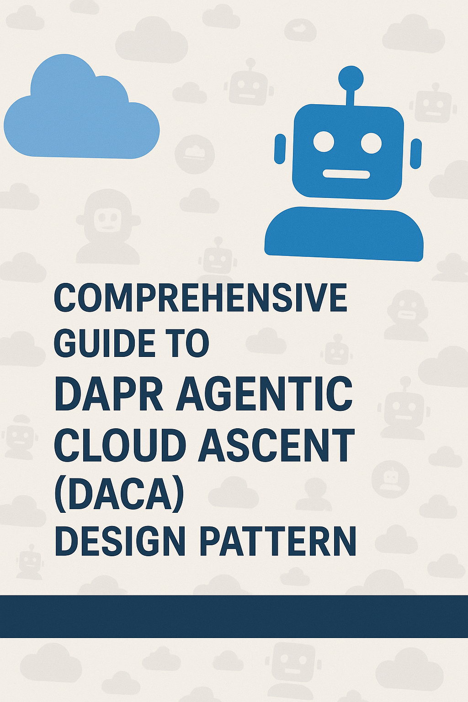
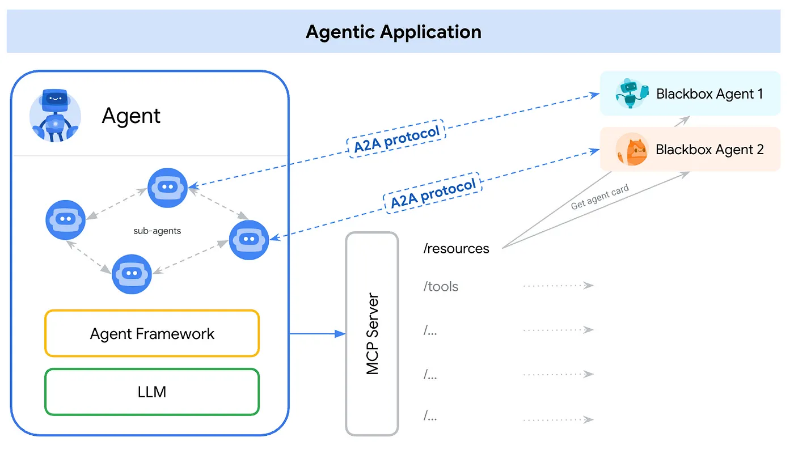
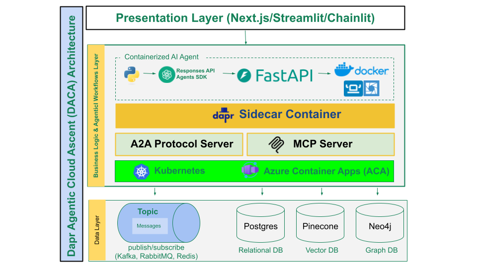
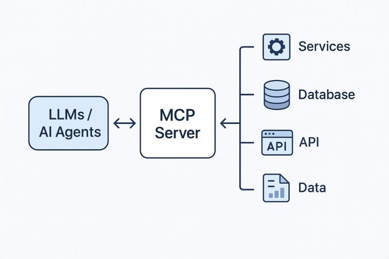
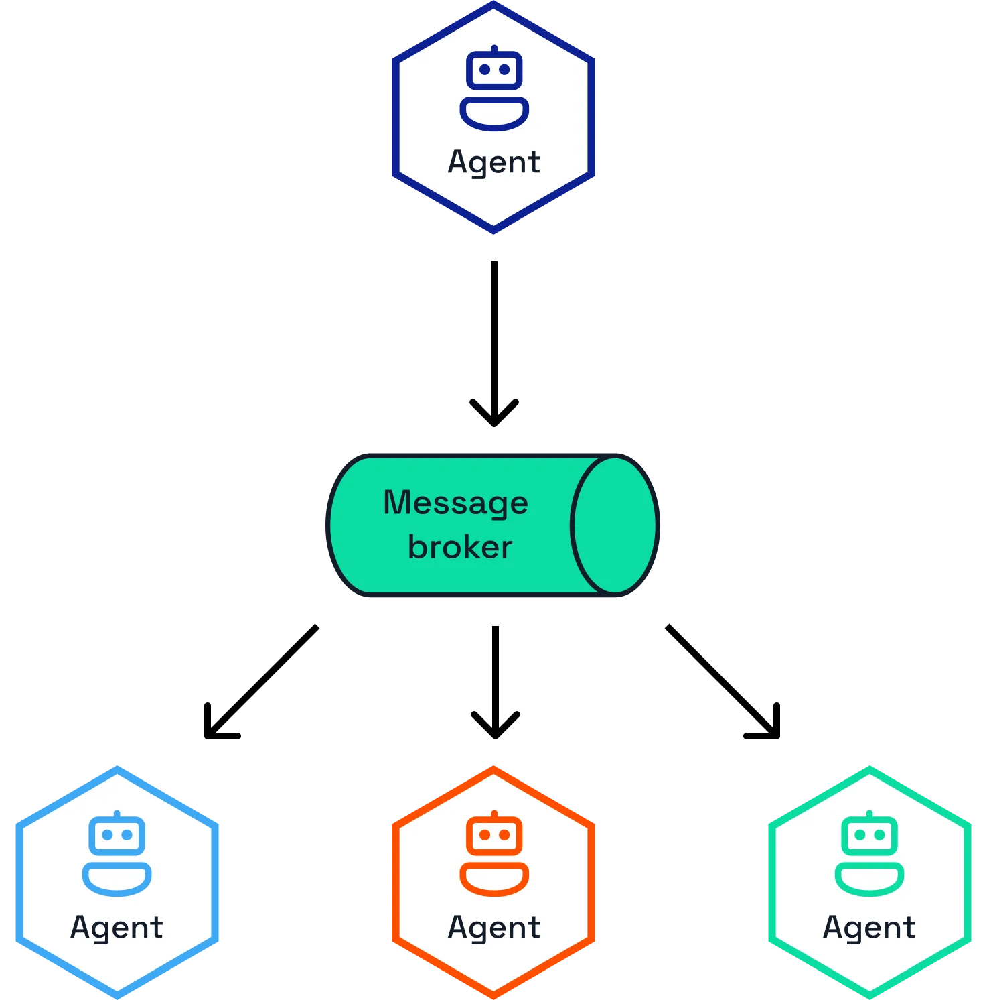
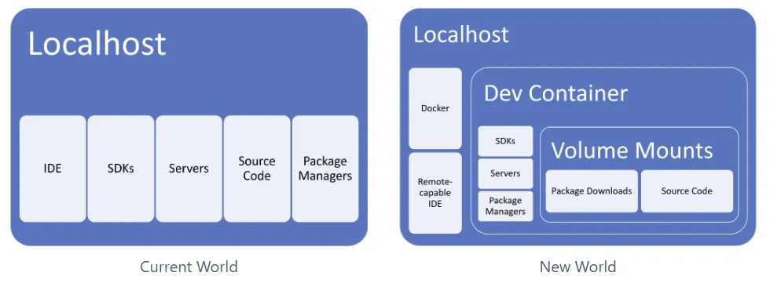
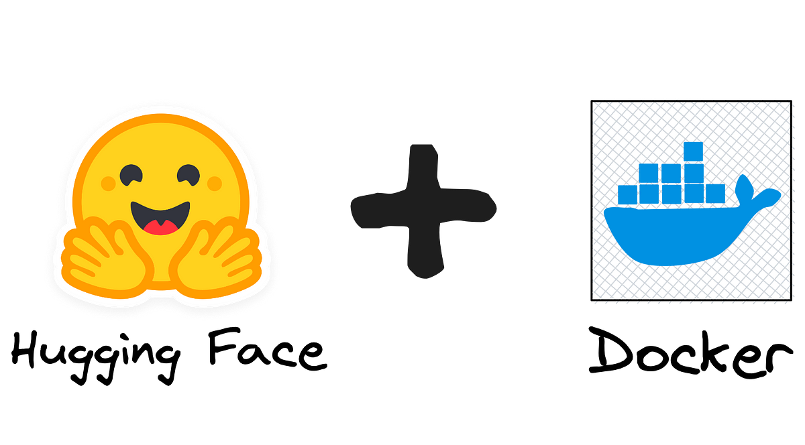
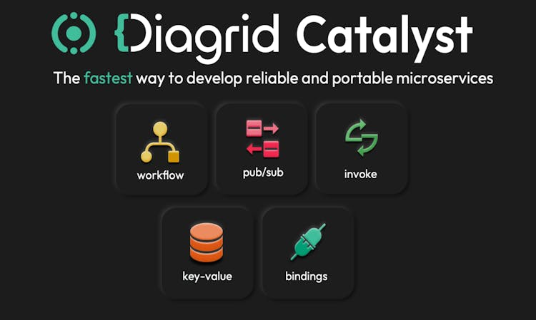
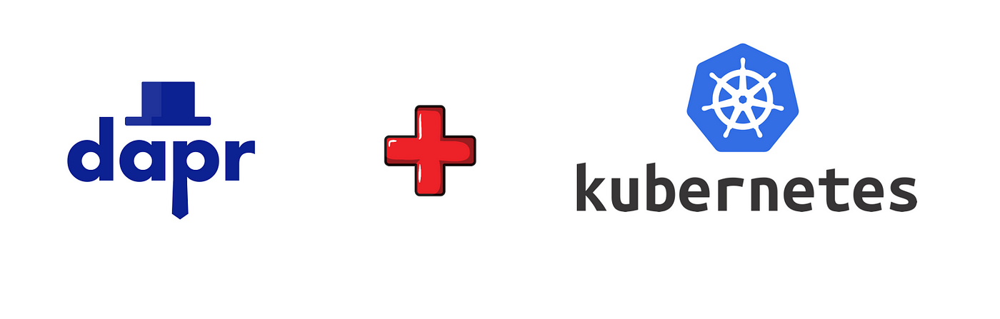
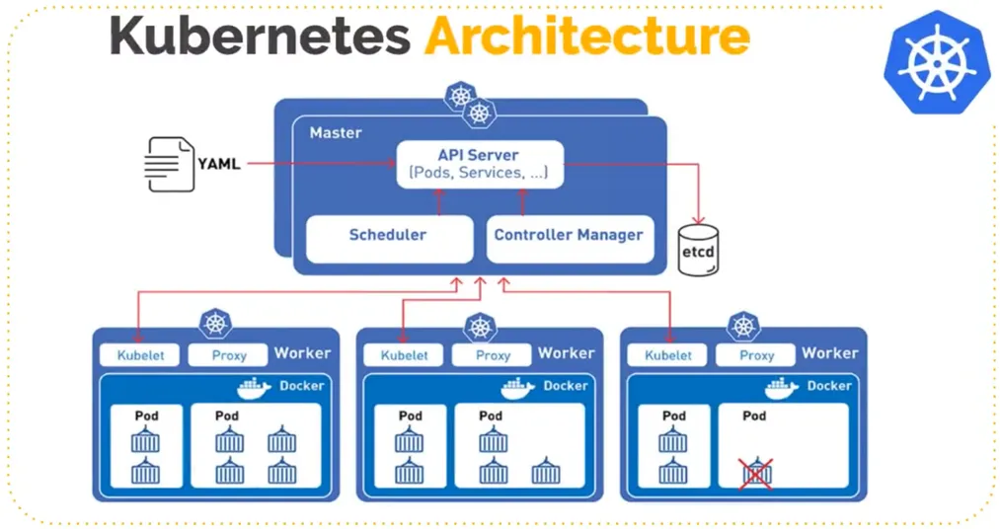

# Comprehensive Guide to Dapr Agentic Cloud Ascent (DACA) Design Pattern - Addresses 10 Million Concurrent Agents Challenge 

<p align="center">

</p>

For those new to agentic AI, start with [The Rise of the AI Agents Presentation](https://docs.google.com/presentation/d/1VNFGsCYMDT1VTe8W1wxFbmAwYsJ1I0Y-6CnTvuCEn98/edit?usp=sharing) for foundational context.

This DACA Design Pattern Tackles the Critical Challenge: 

**“How do we design AI Agents that can handle 10 million concurrent agents without failing?”**

Note: The challenge is intensified as we must guide our students to solve this issue with minimal financial resources available during training.

## Executive Summary: Dapr Agentic Cloud Ascent (DACA)

The Dapr Agentic Cloud Ascent (DACA) guide introduces a strategic design pattern for building and deploying sophisticated, scalable, and resilient agentic AI systems. Addressing the complexities of modern AI development, DACA integrates the OpenAI Agents SDK for core agent logic with the Model Context Protocol (MCP) for standardized tool use and the Agent2Agent (A2A) protocol for seamless inter-agent communication, all underpinned by the distributed capabilities of Dapr. Grounded in AI-first and cloud-first principles, DACA promotes the use of stateless, containerized applications deployed on platforms like Azure Container Apps or Kubernetes, enabling efficient scaling from local development to planetary-scale production, potentially leveraging free-tier cloud services and self-hosted LLMs for cost optimization. The pattern emphasizes modularity, context-awareness, and standardized communication, envisioning an "Agentia World" where diverse AI agents collaborate intelligently. Ultimately, DACA offers a robust, flexible, and cost-effective framework for developers and architects aiming to create complex, cloud-native agentic AI applications that are built for scalability and resilience from the ground up.

## Table of Content

- [Introduction](#introduction)
- [What is DACA?](#what-is-daca)
  - [The Core Ideas of DACA](#the-core-ideas-of-daca)
  - [Core Principles](#core-principles)
- [Our Vision: Agentia World](#our-vision-agentia-world)
  - [DACA with A2A: Implementing Agentia World](#daca-with-a2a-implementing-agentia-world)
- [The Technology Architecture for Agentia World](#the-technology-architecture-for-agentia-world)
  - [Updated Workflow Summary](#updated-workflow-summary)
- [The Indispensable Role of Cloud‑Native Technologies in Agentic AI Development](#the-indispensable-role-of-cloud-native-technologies-in-agentic-ai-development)
  - [Current Cloud Services Limitations for AI Agent Development](#current-cloud-services-limitations-for-ai-agent-development)
  - [AI‑First and Cloud‑First: Foundational Tenets of DACA](#ai-first-and-cloud-first-foundational-tenets-of-daca)
- [Why We Recommend the OpenAI Agents SDK](#why-we-recommend-the-openai-agents-sdk)
  - [Analysis of OpenAI Agents SDK’s Suitability](#analysis-of-openai-agents-sdks-suitability)
  - [Why OpenAI Agents SDK Stands Out](#why-openai-agents-sdk-stands-out)
  - [Potential Drawbacks](#potential-drawbacks)
  - [Comparison to Alternatives](#comparison-to-alternatives)
  - [Conclusion: Why OpenAI Agents SDK Should Be Used](#conclusion-why-openai-agents-sdk-should-be-used)
- [DACA Architecture Overview](#daca-architecture-overview)
  - [Architecture Diagram Breakdown](#architecture-diagram-breakdown)
  - [Key Architectural Components](#key-architectural-components)
- [DACA Framework Constructs](#daca-framework-constructs)
  - [A2A in DACA: Enabling Agentia World](#a2a-in-daca-enabling-agentia-world)
- [DACA Deployment Stages: The Ascent](#daca-deployment-stages-the-ascent)
  - [1. Local Development: Open‑Source Stack](#1-local-development-open-source-stack)
  - [2. Prototyping: Free Deployment](#2-prototyping-free-deployment)
  - [3. Medium Enterprise Scale: Azure Container Apps (ACA)](#3-medium-enterprise-scale-azure-container-apps-aca)
    - [Classification of the Spectrum of Managed Services](#classification-of-the-spectrum-of-managed-services)
    - [Azure Container Apps (ACA)](#azure-container-apps-aca)
  - [4. Planet‑Scale: Kubernetes with Self‑Hosted LLMs](#4-planet-scale-kubernetes-with-self-hosted-llms)
  - [Training Developers for DACA Production Deployment](#training-developers-for-daca-production-deployment)
- [Why DACA Excels for Agentic AI](#why-daca-excels-for-agentic-ai)
  - [Advantages](#advantages)
  - [Potential Downsides](#potential-downsides)
  - [When to Use DACA](#when-to-use-daca)
- [How DACA Addresses Current Cloud Services Limitations for AI Agent Development](#how-daca-addresses-current-cloud-services-limitations-for-ai-agent-development)
- [DACA Real‑World Examples](#daca-real-world-examples)
  - [Example 1: Content Moderation Agent](#example-1-content-moderation-agent)
  - [Example 2: Healthcare Diagnosis Assistant](#example-2-healthcare-diagnosis-assistant)
  - [Example 3: E‑Commerce Recommendation Engine](#example-3-e-commerce-recommendation-engine)
  - [Example 4: IoT Smart Home Automation](#example-4-iot-smart-home-automation)
- [Why These Examples Work with DACA](#why-these-examples-work-with-daca)
- [Conclusion](#conclusion)
- [Appendix I: Handling 10 Million Concurrent Agents?](#appendix-i-handling-10-million-concurrent-agents)
- [Appendix II: Cost Estimates for a Basic Kubernetes Cluster](#appendix-ii-cost-estimates-for-a-basic-kubernetes-cluster)
- [Appendix III: DACA — Design Pattern or Framework?](#appendix-iii-daca-a-design-patter-or-framework)
- [Appendix IV: DACA with OpenAI Agents SDK vs. LangGraph](#appendix-iv-daca-with-openai-agents-sdk-vs-langgraph)
- [Appendix V: A2A vs MCP](#appendix-v-a2a-vs-mcp)
- [Appendix VI: How DACA Supports an Agent-Native Cloud](#appendix-vi-how-daca-supports-an-agent-native-cloud)
- [Appendix VII: Kafka and A2A](#appendix-vii-kafka-and-a2a)
- [Appendix VIII: Applying 12-Factor Agents Principles to the DACA Design Pattern for Reliable LLM-Based Multi-Agent Systems](#appendix-viii-applying-12-factor-agents-principles-to-the-daca-design-pattern-for-reliable-llm-based-multi-agent-systems)
- [Appendix IX: ROS 2 in DACA](#appendix-ix-ros-2-in-daca)


## Introduction

The **Dapr Agentic Cloud Ascent (DACA)** design pattern is a strategic blueprint for creating scalable, resilient, and cost-efficient agentic AI systems, rooted in **AI-first** and **cloud-first** principles. It addresses the critical challenge: “How do we design AI agents that can handle 10 million AI agents without failing?” DACA leverages the OpenAI Agents SDK for intelligent agent logic, the Model Context Protocol (MCP) for standardized tool integration, Google’s Agent2Agent Protocol (A2A) for seamless agent interoperability, and Dapr’s distributed capabilities. Deployed via a cloud-native pipeline using free-tier services and Kubernetes, it achieves global-scale intelligence. Incorporating event-driven architecture (EDA), a three-tier microservices model, stateless computing, scheduled workflows (CronJobs), and human-in-the-loop (HITL) oversight, DACA ensures autonomy, real-time performance, scalability, and complexity management. This guide outlines DACA’s architecture, components, deployment phases, and advantages, emphasizing AI-first, cloud-first, A2A, and MCP as key drivers of the **Agentia World** vision.

---

## What is DACA?

**Dapr Agentic Cloud Ascent (DACA)** is a design pattern for building and scaling agentic AI systems using a minimalist, cloud-first approach. It integrates the OpenAI Agents SDK for agent logic, MCP for tool calling, Dapr for distributed resilience, and a staged deployment pipeline that ascends from local development to planetary-scale production. DACA emphasizes:
- **AI-First Agentic Design**: Autonomous AI agents, powered by the OpenAI Agents SDK, perceive, decide, and act, with **MCP** enabling tool access and **A2A** facilitating intelligent agent-to-agent dialogues.
- **Agent-Native Cloud Scalability**: Stateless containers deploy on cloud platforms (e.g., Azure Container Apps, Kubernetes), leveraging managed services optimized for agent interactions.
- **Stateless Design**: Containers that scale efficiently without retaining state.
- **Dapr Sidecar**: Provides state management, messaging, and workflows.
- **Cloud-Free Tiers**: Leverages free services for cost efficiency.
- **Progressive Scaling**: From local dev to Kubernetes with self-hosted LLMs.

### The Core Ideas of DACA are:

1. **Develop Anywhere**:

- Use containers (Docker/OCI) as the standard for development environments for Agentic AI.
- Ensure consistency across developer machines (macOS, Windows, Linux) and minimize "it works on my machine" issues.
- Leverage tools like VS Code Dev Containers for reproducible, isolated development environments inside containers.
- Use open-source programming languages like Python, libraries such as Dapr, orchestration platforms like Kubernetes, applications like Rancher Desktop,databases like Postgres, and protocols like MCP and A2A.
- The goal is OS-agnostic, location-agnostic, consistent Agentic AI development.

2. **Cloud Anywhere**:
- Use Kubernetes as the standard orchestration layer for AI Agent deployment. This allows agentic applications packaged as containers to run consistently across different cloud providers (AWS, GCP, Azure) or on-premises clusters.
- Use Dapr to simplify building distributed, scalable, and resilient AI Agents and workflows.
- Leverage tools like Helm for packaging and GitOps tools (Argo CD) for deployment automation.
- The goal is deployment portability and avoiding cloud vendor lock-in.

3. **Open Core and Managed Edges**:
- Use open-source technologies like Kubernetes, Dapr, and other cloud-native libraries as the system’s core to ensure flexibility, avoid vendor lock-in, and leverage community-driven innovation.
- Integrate proprietary managed services (e.g., CockroachDB Serverless, Upstash Redis, OpenAI APIs) at the system’s edges to offload operational complexity, enhance scalability, and access advanced capabilities like AI inference or distributed databases.
- The goal is to balance cost, control, and performance by combining the robustness of open-source infrastructure with the efficiency of managed services.


### Core Principles
1. **Simplicity**: Minimize predefined constructs, empowering developers to craft custom workflows with A2A’s flexible communication.
2. **Scalability**: Ascends from single machines to planetary scale using stateless containers, Kubernetes, and MCP and A2A’s interoperability.
3. **Cost Efficiency**: Use free tiers (Hugging Face, Managed Dapr Service Diagrid Catalyst, Azure Container Apps, managed DBs) to delay spending.
4. **Resilience**: Dapr ensures fault tolerance, retries, and state persistence across stages.
5. **Open Core and Managed Edges**: Build the system’s core with open-source, cloud-native technologies like Kubernetes and Dapr for maximum control, portability, and community-driven innovation, while leveraging proprietary managed services (e.g., managed databases, AI APIs, serverless platforms) at the edges for operational efficiency, scalability, and access to advanced features.

---

### Actors and Workflows in DACA

**Dapr Actors** are lightweight, stateful entities based on the Actor Model (Hewitt, 1973), ideal for modeling AI agents in DACA. Each agent, implemented as a Dapr Actor, encapsulates its own state (e.g., task history, user context) and behavior, communicating asynchronously via A2A endpoints or Dapr pub/sub (e.g., RabbitMQ, Kafka). Actors enable concurrent task execution, dynamic agent creation (e.g., spawning child agents for subtasks), and fault isolation, storing state in Dapr-managed stores like Redis or CockroachDB. For example, in a content moderation system, a parent actor delegates post analysis to child actors, each processing a post concurrently and coordinating via A2A messages, ensuring scalability across DACA’s deployment pipeline.

**Dapr Workflows** complement actors by providing stateful orchestration for complex, multi-agent processes. Workflows define sequences or parallel tasks (e.g., task chaining, fan-out/fan-in) as code, managing state durability, retries, and error handling. In DACA, workflows orchestrate actor-based agents, coordinating tasks like data processing, LLM inference, or HITL approvals. For instance, a workflow might chain tasks across actors to extract keywords, generate content, and deliver results to a Next.js UI, resuming from the last completed step after failures. Together, actors provide fine-grained concurrency and state management, while workflows ensure reliable, high-level coordination, advancing DACA’s vision of **Agentia World**.

---

## Our Vision: Agentia World

**Imagine a world where everything is an AI agent**, from your coffee machine to your car, from businesses to entire cities. Picture a world transformed into Agentia—a dynamic, living network of intelligent AI agents seamlessly integrated into our daily lives.  From our homes and offices to entire cities, systems no longer communicate through outdated APIs but through sophisticated, intelligent dialogues driven by state-of-the-art AI frameworks. Agentia scales effortlessly across the globe, thanks to its foundation in cloud-native technologies. Agentia is more than digital—it's also physical, brought to life by robots that serve as embodied agents interacting with and enhancing our physical world.

<p align="center">

</p>


### DACA with A2A, Actors, and Workflows: Implementing Agentia World

DACA, enhanced by A2A, Dapr Actors, and Dapr Workflows, is a comprehensive blueprint for realizing Agentia World. A2A enables agents to collaborate across platforms, organizations, and physical-digital boundaries, while DACA’s progressive deployment strategy—spanning free-tier clouds to Kubernetes—delivers planetary-scale intelligence. Actors provide concurrent, stateful agent interactions, and workflows orchestrate complex tasks, ensuring resilience and scalability. This fusion empowers AI agents to operate seamlessly at vast scale, transforming homes, offices, and cities into an interconnected, intelligent ecosystem.


## The Technology Architecture for Agentia World

<p align="center">

</p>


This diagram represents the technology architecture for an "Agentic Application" in the envisioned "Agentia World":

1. **Agentic Application**: The environment where agents operate, facilitating their interactions and task execution.

2. **Agent**: The central AI or system coordinating activities, interacting with sub-agents and external blackbox agents.

3. **Sub-Agents**: Specialized agents within the Agentic Application, communicating with the main Agent and each other to handle specific tasks, indicating a modular structure.

4. **Agent Framework**: A foundational layer (in yellow) providing the structure and protocols for agent operations, including libraries or rules for cohesive functionality.

5. **LLM (Large Language Model)**: Highlighted in green, the LLM powers the agents' intelligence for natural language processing, decision-making, and task execution. It’s integrated within the Agent Framework.

6. **MCP (Model Context Protocol)**: MCP is a protocol that manages the context and state of the LLM during interactions. It facilitates the exchange of contextual data (e.g., /resources, /tools) between the Agent Framework and external systems, ensuring the LLM maintains relevant context for tasks.

7. **Resources/Tools**: External inputs (e.g., /resources, /tools) accessed via the MCP. These could include databases, APIs, or services that agents use, with the MCP ensuring the LLM understands the context of these resources.

8. **Blackbox Agents (1 and 2)**: External agents interacting with the main Agent using the A2A (Agent-to-Agent) protocol. They likely represent third-party systems collaborating with the main Agent, with interactions like "GET agent card" indicating specific data or capability requests.

9. **A2A Protocol**: The Agent-to-Agent protocol standardizing communication between the main Agent and external blackbox agents for secure and efficient collaboration.

### Workflow Summary:
- The **Agent** delegates tasks to **Sub-Agents** within the **Agentic Application**.
- The **Agent Framework**, powered by the **LLM**, provides the operational structure. For example, OpenAI's Agents SDK, Dapr Agents, LangGraph, AutoGen, ADK, etc.
- The **MCP (Model Context Protocol)** ensures the LLM maintains proper context while accessing external **Resources/Tools**.
- The **Agent** collaborates with **Blackbox Agents** via the **A2A Protocol** for external interactions.

This architecture supports a modular, context-aware system where agents, powered by an LLM, operate cohesively using the MCP and A2A Protocols to manage interactions with external resources and agents in the "Agentia World."

---
## The Indispensable Role of Agent-Native Cloud Technologies

Agent-native cloud technologies are critical for developing AI agents that scale to millions. Containers (Docker), orchestration (Kubernetes), and microservices provide elasticity and resilience, while Dapr’s actor model and workflows manage agent concurrency and coordination. These technologies enable rapid iteration, observability of agent behavior, and integration with managed services, making them essential for professional, scalable agentic systems.

**Developing sophisticated AI agents, especially those intended for production environments and widespread use, is deeply intertwined with cloud-native principles and technologies.** This strong connection stems from the **inherent needs of agentic systems: massive scalability** to handle fluctuating user loads and data volumes, efficient management of intensive computational resources (including GPUs/TPUs often required for complex models), and robust deployment mechanisms. Cloud-native architectures, leveraging containers (like Docker), orchestration platforms (like Kubernetes), serverless computing, and microservices, provide the ideal foundation for building, deploying, and managing these complex agent applications. They enable the elasticity, resource optimization, automated CI/CD pipelines for rapid iteration, resilience, and observability crucial for real-world performance. Furthermore, cloud platforms offer vital managed services for data storage, processing, and AI/ML model lifecycles that streamline agent development. While basic agent experimentation might occur outside a cloud-native context, building professional, scalable, and maintainable AI agents effectively necessitates a strong proficiency in cloud-native practices, making it **a critical, almost essential, complementary skill set for developers in the field**.

Think of it this way: You might be able to design a brilliant engine (the AI agent's core logic), but without understanding the chassis, transmission, and assembly line (cloud-native infrastructure and practices), you can't effectively build, deploy, and run the car (the complete agent application) reliably and at scale. **The two domains are deeply intertwined for practical success**.

---

## Current Cloud Services Limitations for AI Agent Development

### Key Points
- Research suggests current cloud services lack agent-centric logging, integrated architectures, and real-time processing for AI agents.
- It seems likely that scalability, data privacy, and standardized APIs are also missing, essential for autonomous AI agent development.
- The evidence leans toward these gaps causing inefficiencies, as cloud services are designed for human users, not agents.

In a nutshell the current cloud services, primarily built for human users, seem to lack several key functionalities needed for developing AI agents, which are autonomous systems that operate independently. Here’s a breakdown for clarity:

- **Agent-Centric Logging and Observability**: Cloud services offer logs and dashboards for humans, but AI agents need logs they can process directly, like tracking decision paths. For example, an AI customer service bot needs logs in a machine-readable format to improve responses, not just human-readable reports.
- **Integrated Architectures**: Current services provide fragmented AI tools, making it hard for agents to work seamlessly. An AI inventory manager, for instance, needs a unified platform to access data and models without manual stitching.
- **Real-Time, Low-Latency Processing**: AI agents, like self-driving car systems, need quick responses, but cloud services often have delays that can affect performance, similar to lag in fast-paced video games.
- **Advanced Data Management and Privacy**: Handling sensitive data, AI agents need strong privacy controls, but current services may not offer enough, like automatic compliance with laws like GDPR, risking data breaches.
- **Scalability and Cost-Efficiency**: Developing AI agents can require bursts of computing power, but current pricing models might be too expensive, like paying for a large server year-round for occasional holiday traffic.
- **Standardized APIs**: Agents need to interact with various services, but without standard ways, it’s like connecting apps with different languages, requiring custom code and slowing development.
- **Persistent Memory and State Management**: Traditional cloud services are often optimized for stateless operations (each request is treated independently) or short-term memory (like caches). While they offer databases, managing the complex, evolving, long-term state and memory specifically for an agent's "thought process" requires significant custom setup.
- **Long-Running, Always-On Capability (Efficiently)**: Many cost-effective cloud services (like serverless functions) are designed for short bursts of activity in response to specific triggers (like a website click). Keeping a process running 24/7 can become expensive or require managing virtual machines, which adds complexity. There isn't always a simple, cost-effective way to have an agent "simmering" in the background, ready to act.
- **Seamless Agent Collaboration and Orchestration**: While clouds have workflow orchestration tools (like AWS Step Functions or Azure Logic Apps), they are difficult to use. Orchestrating AI agents, which might have unpredictable interactions, use different development frameworks, and need flexible communication, often requires building custom coordination logic.
- **Vendor Lock-in**: While AWS, Azure, and GCP provide powerful building blocks but most AI services will lock lock you in. 

**Why It Matters**
These gaps make it harder to build efficient AI agents, as they need cloud services tailored for their autonomous needs, not human-centric designs. For example, an AI agent managing healthcare data needs seamless, secure, and fast cloud support, which current services may not fully provide.

In essence, while you can build AI agents on today's cloud platforms, it often requires developers to spend a lot of effort building custom plumbing and infrastructure to handle agent memory, persistence, communication, and cost-efficiency – things that aren't core, optimized features of these platforms today. 


**Implications and Future Directions**
These limitations suggest that current cloud services are not fully equipped to support the development of AI agents, which require agent-native functionalities. The gaps in logging, observability, architecture, processing speed, data management, scalability, state and memory management, and APIs create inefficiencies, making it harder to build autonomous systems that can operate effectively. As AI agents become more prevalent, cloud providers will likely need to evolve, offering integrated, agent-centric platforms to meet these needs, similar to how mobile apps evolved to support seamless app interactions.


---

### AI-First and Agent-Native Cloud First: Foundational Tenets of DACA

DACA’s power lies in its dual commitment to AI-first and cloud-first development:

**AI-First Development**:
- **Why It Matters**: AI agents are the system’s brain, driving autonomy, decision-making, and adaptability. By prioritizing AI from the start, DACA ensures systems are inherently intelligent, capable of natural language dialogues, tool integration, and dynamic collaboration.
- **How It’s Implemented**: Uses the OpenAI Agents SDK for agent logic, A2A for agent-to-agent communication, and MCP for tool access, enabling agents to handle complex tasks (e.g., coordinating logistics or automating homes).
- **Agentia Alignment**: Supports a world where every entity is an AI agent, interacting via intelligent dialogues rather than rigid APIs.

**Agent-Native Cloud First Development**:
- **Why It Matters**: Infrastructure optimized for agents provides scalability and programmatic interfaces, unlike human-centric clouds.
- **How It’s Implemented**: Leverages containers (Docker), orchestration (Kubernetes), serverless platforms (Azure Container Apps), and managed services (CockroachDB, Upstash Redis) to deploy and scale agents efficiently.
- **Agentia Alignment**: Enables Agentia’s global reach, ensuring agents can scale from prototypes to millions of agents using cloud resources.

Together, these tenets make DACA a forward-looking framework, blending AI’s intelligence with the agents-native cloud’s scalability to create a cohesive, planet-scale agent ecosystem.

---

### Why We Recommend that OpenAI Agents SDK should be the main framework for agentic development for most use cases in DACA?

**Comparison of Abstraction Levels in AI Agent Frameworks**

| **Framework**         | **Abstraction Level** | **Key Characteristics**                                                                 | **Learning Curve** | **Control Level** | **Simplicity** |
|-----------------------|-----------------------|-----------------------------------------------------------------------------------------|--------------------|-------------------|----------------|
| **OpenAI Agents SDK** | Minimal              | Python-first, core primitives (Agents, Handoffs, Guardrails), direct control           | Low               | High             | High           |
| **CrewAI**            | Moderate             | Role-based agents, crews, tasks, focus on collaboration                                | Low-Medium        | Medium           | Medium         |
| **AutoGen**           | High                 | Conversational agents, flexible conversation patterns, human-in-the-loop support       | Medium            | Medium           | Medium         |
| **Google ADK**        | Moderate             | Multi-agent hierarchies, Google Cloud integration (Gemini, Vertex AI), rich tool ecosystem, bidirectional streaming | Medium            | Medium-High      | Medium         |
| **LangGraph**         | Low-Moderate         | Graph-based workflows, nodes, edges, explicit state management                        | Very High         | Very High        | Low            |
| **Dapr Agents**       | Moderate             | Stateful virtual actors, event-driven multi-agent workflows, Kubernetes integration, 50+ data connectors, built-in resiliency | Medium            | Medium-High      | Medium         |

#### Analysis of OpenAI Agents SDK’s Suitability for Agentic Development

Agentic development involves creating AI agents that can reason, act, and collaborate autonomously or with human input. Key considerations for selecting a framework include ease of use (simplicity, learning curve), flexibility (control level), and how much complexity the framework hides (abstraction level). Let’s break down OpenAI Agents SDK’s strengths based on the table:


#### Why OpenAI Agents SDK Stands Out for Agentic Development
The table highlights OpenAI Agents SDK as the optimal choice for agentic development for the following reasons:
1. **Ease of Use (High Simplicity, Low Learning Curve)**: OpenAI Agents SDK’s high simplicity and low learning curve make it the most accessible framework. This is critical for agentic development, where teams need to quickly prototype, test, and deploy agents. Unlike LangGraph, which demands a “Very High” learning curve and offers “Low” simplicity, OpenAI Agents SDK allows developers to get started fast without a steep onboarding process.
2. **Flexibility (High Control)**: With “High” control, OpenAI Agents SDK provides the flexibility needed to build tailored agents, surpassing CrewAI, AutoGen, Google ADK, and Dapr Agents. While LangGraph offers “Very High” control, its complexity makes it overkill for many projects, whereas OpenAI Agents SDK strikes a balance between power and usability.
3. **Minimal Abstraction**: The “Minimal” abstraction level ensures developers can work directly with agent primitives, avoiding the limitations of higher-abstraction frameworks like AutoGen (“High”) or CrewAI (“Moderate”). This aligns with agentic development’s need for experimentation and customization, as developers can easily adjust agent behavior without fighting the framework’s abstractions.
4. **Practicality for Broad Use Cases**: OpenAI Agents SDK’s combination of simplicity, control, and minimal abstraction makes it versatile for a wide range of agentic development scenarios, from simple single-agent tasks to more complex multi-agent systems. Frameworks like Google ADK and Dapr Agents, while powerful, introduce ecosystem-specific complexities (e.g., Google Cloud, distributed systems) that may not be necessary for all projects [previous analysis].

#### Potential Drawbacks of OpenAI Agents SDK
While the table strongly supports OpenAI Agents SDK, there are potential considerations:
- **Scalability and Ecosystem Features**: Google ADK and Dapr Agents offer advanced features like bidirectional streaming, Kubernetes integration, and 50+ data connectors, which are valuable for enterprise-scale agentic systems. OpenAI Agents SDK, while simpler, may lack such built-in scalability features, requiring more manual effort for large-scale deployments.
- **Maximum Control**: LangGraph’s “Very High” control might be preferable for highly complex, custom workflows where fine-grained control is non-negotiable, despite its complexity.

#### Comparison to Alternatives
- **CrewAI**: Better for collaborative, role-based agent systems but lacks the control and simplicity of OpenAI Agents SDK.
- **AutoGen**: Suited for conversational agents with human-in-the-loop support, but its “High” abstraction reduces control.
- **Google ADK**: Strong for Google Cloud integration and multi-agent systems, but its “Medium” simplicity and learning curve make it less accessible.
- **LangGraph**: Ideal for developers needing maximum control and willing to invest in a steep learning curve, but impractical for most due to “Low” simplicity and “Very High” learning curve.
- **Dapr Agents**: Excellent for distributed, scalable systems, but its distributed system concepts add complexity not present in OpenAI Agents SDK.

### Conclusion: Why OpenAI Agents SDK Should Be Used?
The table clearly identifies why OpenAI Agents SDK should be the main framework for agentic development for most use cases:
- It excels in **simplicity** and **ease of use**, making it the best choice for rapid development and broad accessibility.
- It offers **high control** with **minimal abstraction**, providing the flexibility needed for agentic development without the complexity of frameworks like LangGraph.
- It outperforms most alternatives (CrewAI, AutoGen, Google ADK, Dapr Agents) in balancing usability and power, and while LangGraph offers more control, its complexity makes it less practical for general use.

If your priority is ease of use, flexibility, and quick iteration in agentic development, OpenAI Agents SDK is the clear winner based on the table. However, if your project requires enterprise-scale features (e.g., Dapr Agents) or maximum control for complex workflows (e.g., LangGraph), you might consider those alternatives despite their added complexity. 

---

## DACA Architecture Overview

The DACA architecture is a layered, event-driven, stateless system that integrates human-in-the-loop (HITL) capabilities. It’s built on a **three-tier microservices architecture**, enhanced by Dapr, and supports both real-time and scheduled agentic workflows.

### Architecture Diagram Breakdown
<p align="center">

</p>

The provided architecture diagram illustrates the DACA framework:
- **Presentation Layer**: Next.js, Streamlit, or Chainlit for user interaction.
- **Business Logic Layer**:
  - **Containerized AI Agent**: OpenAI Agents SDK in stateless Docker containers, using FastAPI for RESTful interfaces and A2A for agent-to-agent communication.
  - **Containerized MCP Servers**: MCP Servers running in a stateless Docker containers being called by AI Agents via tool calling.
  - **Dapr Sidecar Container**: Handles state, messaging, and workflows.
  - **A2A Integration**: Agents expose capabilities via A2A Agent Cards and communicate via A2A endpoints.
- **Infrastructure Layer**:
  - **Deployment Platforms**: Kubernetes or Azure Container Apps (ACA) for scaling.
  - **Messaging**: Kafka, RabbitMQ, Redis for asynchronous events, with A2A for direct agent dialogues.
  - **Databases**: Postgres (Relational), Pinecone (Vector DB), Neo4j (Graph DB) for data persistence.

### Key Architectural Components
1. **Event-Driven Architecture (EDA)**:
   - **Purpose**: Drives real-time agent behavior through events (e.g., "UserInputReceived," "TaskCompleted").
   - **Implementation**: Producers (agents) emit events to an event bus (Kafka, RabbitMQ, Redis); consumers (other agents, HITL services) react asynchronously. A2A enhances EDA with direct, secure agent dialogues.
   - **Why It Fits**: Enables reactive, loosely coupled agent interactions—ideal for autonomy and scalability.

2. **Three-Tier Microservices Architecture**:
   - **Presentation Tier**: User interfaces (Next.js, Streamlit, Chainlit) for interacting with agents or HITL dashboards.
   - **Application Tier**: Stateless FastAPI services with OpenAI Agents SDK and A2A endpoints, supported by Dapr sidecars. It also includes stateless MCP Servers. 
   - **Data Tier**: Managed databases (CockroachDB, Upstash Redis) and specialized stores (Pinecone, Neo4j) for state and knowledge.

3. **Stateless Computing**:
   - **Purpose**: Containers (agents, APIs, MCP and A2A servers) are stateless, scaling horizontally without session data.
   - **Implementation**: State is offloaded to Dapr-managed stores (e.g., Redis, CockroachDB).
   - **Why It Fits**: Enhances scalability—any container instance can handle any request, simplifying load balancing.

4. **Scheduled Computing (CronJobs)**:
   - **Purpose**: Handles periodic tasks (e.g., model retraining, batch HITL reviews).
   - **Implementation**: Kubernetes CronJobs, cron-job.org (prototyping), or in-process schedulers (APScheduler, python-crontab).
   - **Why It Fits**: Supports proactive agent behaviors alongside reactive EDA.

5. **Human-in-the-Loop (HITL)**:
   - **Purpose**: Integrates human oversight for critical decisions, edge cases, or learning.
   - **Implementation**:
     - Agents emit HITL events (e.g., "HumanReviewRequired") when confidence is low.
     - Stateless HITL workers route tasks to a dashboard (presentation layer).
     - Humans approve/reject via UI, triggering "HumanDecisionMade" events to resume workflows.
     - CronJobs aggregate feedback for batch reviews or model updates.
   - **Why It Fits**: Ensures accountability while maintaining autonomy.

6. **Dapr Actors and Workflows**:
  - **Purpose**: Actors provide concurrent, stateful agent execution; workflows orchestrate complex, durable tasks.
  - **Implementation**: Actors manage agent state and communication; workflows define task sequences or parallel executions, leveraging Dapr’s state management and retry policies.
  - **Why It Fits**: Actors enable scalable agent interactions, while workflows ensure reliable coordination, critical for multi-agent systems.

  7. **Open Core and Managed Edges**:
  - **Purpose**: Combines the flexibility of open-source technologies with the efficiency of managed services to create a robust, scalable architecture.
  - **Implementation**: The core of the system—container orchestration (Kubernetes), distributed runtime (Dapr), and agent logic (OpenAI Agents SDK)—is built on open-source technologies, ensuring portability and community-driven enhancements. At the edges, managed services like CockroachDB Serverless (distributed SQL), Upstash Redis (in-memory store), and OpenAI APIs (AI inference) handle specialized tasks, reducing operational overhead and leveraging provider-optimized performance.
  - **Why It Fits**: This approach maximizes control over the system’s core while outsourcing complex, resource-intensive tasks to managed services, enabling rapid scaling and cost efficiency in agentic AI systems.

---

## DACA Framework Constructs
DACA’s minimalist stack balances simplicity and power, enabling any agentic workflow. Here are the core components:

1. **LLM APIs**:
   - **Choice**: OpenAI Chat Completion (industry standard), Responses API. Prototyping can use Google Gemini (free tier).
   - **Purpose**: Powers agent reasoning and task execution with robust, agent-friendly features (e.g., function calling).

2. **Lightweight Agents and MCP Servers**:

   - **Choice**: OpenAI Agents SDK for modular, task-specific agents with guardrails, tool integration, and handoffs. MCP Servers for standardized Tool calling.
   - **Purpose**: Minimizes resource use while enabling scalable, collaborative workflows.

<p align="center">

</p>

3. **REST APIs**:
   - **Choice**: FastAPI for high-performance, asynchronous communication.
   - **Purpose**: Facilitates stateless, real-time interactions between users, agents, and crews.

4. **Stateless Serverless Docker Containers**:
   - **Choice**: Docker for packaging agents, APIs, and MCP servers.
   - **Purpose**: Ensures portability, scalability, and efficient resource use across environments.

5. **Asynchronous Message Passing**:

   - **Choice**: RabbitMQ (prototyping, free tier via CloudAMQP), Kafka (production on Kubernetes).
   - **Purpose**: Decouples components and agents for resilience and event-driven workflows.

<p align="center">

</p>

6. **Scheduled Container Invocation**:
   - **Choice**:
     - Local: python-crontab (Linux/Mac), APScheduler (Windows), Schedule (in-process).
     - Prototyping: cron-job.org (free).
     - Production: Kubernetes CronJobs.
   - **Purpose**: Supports batch processing and periodic tasks (e.g., pulling messages, retraining models).

7. **Relational Managed Database Services**:
   - **Choice**: CockroachDB Serverless (free tier, distributed SQL), Postgres (production on Kubernetes).
   - **Purpose**: Stores agent states, user data, and logs with ACID compliance. SQLModel (ORM) abstracts provider switches.

8. **In-Memory Data Store**:
   - **Choice**: Upstash Redis (free tier, serverless).
   - **Purpose**: High-performance caching, session storage, and message brokering.

9. **A2A Protocol**: Standardizes agent-to-agent communication with Agent Cards and HTTP endpoints.

10. **Distributed Application Runtime (Dapr)**:

    - **Purpose**: Simplifies distributed systems with standardized building blocks (state, pub/sub, workflows).
    - **Implementation**: Runs as a sidecar container, managing state (Redis, CockroachDB), messaging (RabbitMQ, Kafka), and workflows.
    - **Optional**: Dapr Agents and Dapr Workflows for advanced orchestration.
    - **Why It Matters**: Ensures resilience, abstracts infra complexity, and future-proofs the system.


<p align="center">

</p>

---
### A2A in DACA: Enabling Agentia World
A2A, launched by Google with over 50 partners, is integral to DACA. It uses HTTP, SSE, and JSON-RPC to enable secure, modality-agnostic (text, audio, video) agent communication. Key A2A features in DACA include:

- **Agent Cards**: JSON files (/.well-known/agent.json) advertise capabilities, enabling discovery.
- **Task Management**: Agents initiate and process tasks with real-time feedback via A2A endpoints.
- **Interoperability**: Connects agents across platforms, supporting Agentia’s vision of a global network.
- **Security**: Enterprise-grade authentication ensures trust in cross-domain dialogues.

<p align="center">

</p>

A2A enables interaction between a "client" agent and a "remote" agent. The client agent creates and sends tasks, while the remote agent executes them to deliver accurate information or perform the appropriate action. This process relies on several essential features:

- **Capability discovery**: Agents can share their skills through a JSON-based “Agent Card,” enabling the client agent to select the most suitable remote agent for a task and connect via A2A.
- **Task management**: The client and remote agents focus on completing tasks to meet user needs. Tasks, defined by the protocol, follow a lifecycle—some are finished quickly, while others, especially prolonged ones, require ongoing communication to keep both agents aligned on progress. The result of a task is called an “artifact.”
- **Collaboration**: Agents exchange messages to share context, responses, artifacts, or user guidance.
- **User experience negotiation**: Messages contain “parts,” fully developed content pieces like generated images, each with a defined content type. This allows the agents to agree on the proper format and adapt to the user’s interface preferences, such as support for iframes, videos, web forms, and other elements.

---

## DACA Deployment Stages: The Ascent

DACA’s “ascent” refers to its progressive deployment pipeline, scaling from local development to planetary-scale production while optimizing cost and complexity.


### 1. Local Development: Open-Source Stack

<p align="center">

</p>

- **Goal**: Rapid iteration with production-like features.
- **Setup**:
  - **Rancher Desktop with Lens**: Runs the agent app, Dapr sidecar, A2A endpoints and local services on local Kubernetes.
  - **LLM APIs**: OpenAI Chat Completion, Google Gemini (free tier).
  - **Agents and MCP Servers**: OpenAI Agents SDK as Dapr Actors with MCP Servers and with A2A integration.
  - **REST APIs**: FastAPI.
  - **Messaging**: Local RabbitMQ container.
  - **Scheduling**: python-crontab, APScheduler, or Schedule or Dapr Scheduler.
  - **Database**: Local Postgres container, SQLModel ORM.
  - **In-Memory Store**: Local Redis container, redis-py or Redis OM Python.
  - **Dev Tools**: VS Code Dev Containers for containerized development.
  - **Open Core and Managed Edges**: Uses open-source Kubernetes (Rancher Desktop) and Dapr for the core, with local open-source services (Postgres, Redis) to simulate production. Managed services like OpenAI APIs are used at the edges for prototyping LLM inference.
- **Scalability**: Single machine (1-10 req/s with OpenAI).
- **Cost**: Free, using open-source tools.

### 2. Prototyping: Free Deployment

<p align="center">

</p>
<p align="center">

</p>

- **Goal**: Test and validate with minimal cost.
- **Setup**:
  - **Containers**: Deploy to Hugging Face Docker Spaces (free hosting, CI/CD). Both FastAPI, MCP Server, and A2A endpoints in containers.
  - **LLM APIs**: Google Gemini (free tier), Responses API.
  - **Messaging**: CloudAMQP RabbitMQ (free tier: 1M messages/month, 20 connections).
  - **Scheduling**: cron-job.org (free online scheduler).
  - **Database**: CockroachDB Serverless (free tier: 10 GiB, 50M RU/month).
  - **In-Memory Store**: Upstash Redis (free tier: 10,000 commands/day, 256 MB).
  - **Dapr**: Use [Managed Dapr Service Catalyst by Diagrid](https://www.diagrid.io/catalyst) free-tier.
- **Scalability**: Limited by free tiers (10s-100s of users, 5-20 req/s).
- **Cost**: Fully free, but watch free tier limits (e.g., Upstash’s 7 req/min cap).

### 3. Medium Enterprise Scale: Azure Container Apps (ACA)

#### Classification of the Spectrum of Managed Services


1. **Fully Managed Services**:
   - **Google Cloud Run**: Provides the highest level of abstraction and management, completely handling infrastructure for stateless containers.
   - **Azure Container Apps**: Offers serverless scaling and deep integration with Azure, simplifying container management.
   - **GKE Autopilot**: Automates most of the Kubernetes management tasks, focusing on application deployment and scalability.

2. **Semi-Managed Services**:
   - **AWS Karpenter**: While it automates scaling and integrates with AWS services, it still requires some management and configuration of the Kubernetes environment.

3. **Self-Managed Services**:
   - **Native Kubernetes**: Provides full control and flexibility, but requires significant management effort, including setup, scaling, updates, and maintenance.

Choosing the right Kubernetes-powered platform depends on your needs for management and control. Fully managed services like Google Cloud Run, Azure Container Apps (ACA), and GKE Autopilot offer ease of use and scalability, ideal for teams focusing on application development without worrying about infrastructure. Semi-managed services like AWS Karpenter offer a balance, with some automation while allowing for more customization. Native Kubernetes provides maximum control and customization at the cost of increased management overhead. We have chossen Azure Container Apps (AKA) because it offers a perfect balance, with native Dapr support.

#### Azure Container Apps (ACA)

<p align="center">

</p>

- **Goal**: Scale to thousands of users with cost efficiency.
- **Setup**:
  - **Containers**: Deploy containers (FastAPI and MCP Servers) to ACA with Dapr support (via KEDA).
    ```yaml
    apiVersion: containerapps.azure.com/v1
    kind: ContainerApp
    metadata:
      name: agent-app
    spec:
      containers:
        - name: agent-app
          image: your-registry/agent-app:latest
          env:
            - name: OPENAI_API_KEY
              value: "sk-..."
      dapr:
        enabled: true
        appId: agent-app
        appPort: 8080
    ```
  - **Scaling**: ACA’s free tier (180,000 vCPU-s, 360,000 GiB-s/month) supports ~1-2 always-on containers, auto-scales on HTTP traffic or KEDA triggers.
  - **LLM APIs**: OpenAI Chat Completion, Responses API.
  - **Messaging**: CloudAMQP RabbitMQ (paid tier if needed).
  - **Scheduling**: ACA Jobs for scheduled tasks.
  - **Database**: CockroachDB Serverless (scale to paid tier if needed).
  - **In-Memory Store**: Upstash Redis (scale to paid tier if needed).
- **Scalability**: Thousands of users (e.g., 10,000 req/min), capped by OpenAI API limits (10,000 RPM = 166 req/s). Using Google Gemini will more economical. 
- **Cost**: Free tier covers light traffic; paid tier ~$0.02/vCPU-s beyond that.

### 4. Planet-Scale: Kubernetes with Self-Hosted LLMs

<p align="center">

</p>
<p align="center">

</p>

- **Goal**: Achieve planetary scale with no API limits.
- **Setup**:
  - **Containers**: Kubernetes cluster (e.g., on Oracle Cloud’s free VMs: 2 AMD VMs or 4 Arm VMs). Both FastAPIs and MCP containers.
  - **LLM APIs**: Self-hosted LLMs (e.g., LLaMA, Mistral) with OpenAI-compatible APIs (via vLLM or llama.cpp).
  - **Messaging**: Kafka on Kubernetes (high-throughput, multi-broker).
  - **Scheduling**: Kubernetes CronJobs.
  - **Database**: Postgres on Kubernetes.
  - **In-Memory Store**: Redis on Kubernetes.
  - **Dapr**: Deployed on Kubernetes for cluster-wide resilience.
- **Training**: Use Oracle Cloud’s free tier to train devs on Kubernetes DevOps, ensuring skills for any cloud (AWS, GCP, Azure).
- **Scalability**: Millions of users (e.g., 10,000 req/s on 10 nodes with GPUs), limited by cluster size.
- **Cost**: Compute-focused ($1-2/hour/node), no API fees.

### Training Developers for DACA Production Deployment

To equip developers with Kubernetes DevOps skills for production deployment, we may leverage **Oracle Cloud Infrastructure (OCI)**, which offers a "free forever" tier which Offers 2 AMD VMs (1/8 OCPU, 1 GB RAM each) or up to 4 Arm-based VMs (24 GB RAM total). [These VMs are used to deploy our own Kubernetes cluster](https://github.com/nce/oci-free-cloud-k8s), providing a hands-on environment to learn cluster management, scaling, and deployment. Once developers master these skills, they can confidently deploy our agentic workflows to any cloud Kubernetes platform (e.g., AWS, GCP, Azure), ensuring portability and flexibility. This training bridges the gap between prototyping and production, empowering developers to handle real-world deployments.

References:

https://www.ronilsonalves.com/articles/how-to-deploy-a-free-kubernetes-cluster-with-oracle-cloud-always-free-tier 

https://medium.com/@Phoenixforge/a-weekend-project-with-k3s-and-oracle-cloud-free-tier-99eda1aa49a0

---

## Why DACA Excels for Agentic AI
DACA’s combination of EDA, three-tier microservices, stateless computing, scheduled computing, and HITL makes it ideal for agentic AI systems:

### Advantages
1. **Scalability**:
   - Stateless containers, actors, and workflows enable horizontal scaling from 1 to millions of requests.
   - ACA and Kubernetes handle medium-to-planetary scale with ease.Advantages

2. **Resilience**:
   - Dapr ensures retries, state persistence, and fault tolerance.
   - HITL adds human oversight for critical decisions.
3. **Cost Efficiency**:
   - Free tiers (HF Spaces, ACA, CockroachDB, Upstash, CloudAMQP) delay spending.
   - Local LLMs in production eliminate API costs.
4. **Flexibility**:
   - EDA and CronJobs support both reactive and proactive agent behaviors.
   - Three-tier structure separates concerns, easing maintenance.
5. **Consistency**:
   - Unified stack across local, prototype, and production—only deployment changes.
6. **Interoperability**: A2A connects agents across Agentia World.

### Potential Downsides
1. **Complexity**:
   - Dapr, EDA, A2A, and Kubernetes add learning curves—overkill for simple agents.
   - Transition from OpenAI to local LLMs requires testing.
2. **Free Tier Limits**:
   - Prototyping caps (e.g., Upstash’s 10,000 commands/day) may force early scaling to paid tiers.
3. **Latency**:
   - Managed services add 20-100ms latency vs. local containers, impacting tight dev loops.

### When to Use DACA
- **Best For**:
  - Distributed, autonomous multi-agent systems (e.g., robotics, simulations).
  - Scalable AI services (e.g., chatbots, recommendation engines).
  - Workflows needing both real-time (EDA) and scheduled (CronJobs) actions.
- **Not Ideal For**:
  - Simple, single-agent apps where a monolithic setup suffices.
  - Resource-constrained environments unable to handle Dapr’s overhead.

---

## How DACA Addresses Current Cloud Services Limitations for AI Agent Development

In short — DACA closes most of the *technical* gaps that plague today’s “human-first” clouds by baking observability, standardised agent-to-agent APIs, distributed state, and elastic scaling straight into your architecture. What it still **cannot** solve on its own are policy- and business-level issues such as airtight data-privacy compliance, guaranteed sub-millisecond latencies for edge workloads, or the raw economics of keeping millions of agents idling 24 × 7. Below is a limitation-by-limitation appraisal.

---

## Where DACA **does** fill the holes

| Limitation from your list | How DACA addresses it |
| --- | --- |
| **Agent-centric logging & observability** | Dapr sidecars emit OpenTelemetry/Prometheus metrics and traces that track actor calls, A2A round-trips, tool invocations, and reasoning paths — all machine-parsable by other agents  |
| **Integrated architecture** | A three-tier, event-driven micro-services stack (presentation / agent logic / data) plus Dapr workflows gives a single, opinionated blueprint instead of scattered bolt-ons   |
| **Real-time, low-latency processing** | Stateless containers talk over Kafka/RabbitMQ with back-pressure and retries; Dapr pub/sub keeps message hops inside the node when possible   |
| **Scalability & cost efficiency** | Horizontal scaling on Kubernetes or Azure Container Apps; pay-as-you-go state stores like CockroachDB Serverless keep idle costs near zero  |
| **Standardised APIs** | A2A exposes capability cards and task endpoints; MCP normalises tool/function calling, so every agent and tool speaks the same dialect  |
| **Persistent memory & state management** | Dapr Actors wrap each agent in a lightweight stateful object with automatic reminders, timers, and pluggable state stores (Redis, Cockroach, etc.)   |
| **Seamless agent collaboration & orchestration** | A2A for cross-domain chatter + Dapr Workflows for long-running, fan-out/fan-in orchestrations   |
| **Vendor lock-in mitigation** | “Open-core / managed-edges” mantra: Kubernetes + Dapr at the core, swap-in managed DBs or LLM APIs at the rim   |

---

## Where DACA only *partly* helps or leaves a gap

| Limitation not fully solved | Why it remains | Notes / potential work-arounds |
| --- | --- | --- |
| **Advanced data-privacy & regulatory compliance** | DACA prescribes tech (Cockroach, Postgres, Redis) but not automatic GDPR/PCI/HIPAA controls or cross-region data-sovereignty guarantees. You must layer policy-as-code tools (OPA, Kyverno), DLP gateways, and audit pipelines yourself. |
| **24 × 7 “always-on” agents without paying VM prices** | Stateless pods can scale to zero, but long-lived actors still need a warm host. ACA/Kubernetes HPA can down-scale to one replica, not zero, and serverless containers charge for idle storage time. Innovative “activated-on-message” patterns or edge-cache co-location are still research areas. |
| **Extreme edge-latency (sub-10 ms)** | DACA’s event bus improves intra-cluster latency, yet physics on WAN hops still dominate. True autonomy for self-driving cars, robotic swarms, etc., requires edge-deployed mini-clusters or on-device inferencing. |
| **Built-in data-lifecycle tooling (retention, PII redaction)** | Dapr exposes state APIs but does not enforce retention windows or schema-based PII detection. External retention managers or database-native features must be configured. |
| **Cost transparency across clouds** | Free-tiers help prototypes, but once you burst onto GPUs or vector DBs, billing is opaque. FinOps dashboards or K8s cost-allocation operators (e.g., Kubecost) are still needed. |
| **Security hardening & zero-trust posture** | A2A/MCP inherit HTTP(S) and token auth, but DACA does not prescribe mTLS, workload identity federation, or policy-based admission. Those must be added via Istio, OPA, SPIRE, etc. |
| **Inter-vendor workflow portability** | While open protocols reduce lock-in, managed LLM APIs (OpenAI, Gemini) still differ in pricing, rate limits, and capability sets; re-testing and fallback routing remain your burden. |

---

## Take-aways for your architecture

1. **Use DACA for the plumbing you used to write by hand.** You get distributed state, pub/sub, standardised function calls, and cross-agent chat out-of-the-box, which eliminates most of the “custom glue”.  
2. **Budget time for compliance & security.** Map your regulatory obligations early and embed policy engines and audit sinks alongside Dapr sidecars.  
3. **Plan an edge tier if latency is existential.** DACA scales to many nodes, but you may still need micro-clusters or WebAssembly-based inferencing in the device.  
4. **Adopt FinOps tooling.** Free tiers are great for class projects; enterprise roll-outs need continuous cost observability.  
5. **Keep your protocols vanilla.** Sticking to A2A and MCP where possible cushions you from future cloud churn.

With these additions, DACA becomes not just a clever pattern but the *launchpad* for a genuinely agent-native cloud stack.

---

## DACA Real-World Examples

DACA’s flexibility makes it applicable to a wide range of agentic AI systems, from content moderation to healthcare, e-commerce, and IoT. Below are four examples showcasing how DACA can be implemented across different domains, following its progressive deployment stages (local → prototyping → medium scale → planet-scale) and leveraging its core components (EDA, three-tier architecture, stateless computing, CronJobs, HITL).

### Example 1: Content Moderation Agent
**Scenario**: A social media platform needs an agentic AI system to moderate user-generated content (e.g., posts, comments) for inappropriate material.

- **Local Development**:
  - Build the moderation agent using the OpenAI Agents SDK in a Docker container, with a Dapr sidecar for state management (local Redis) and messaging (local RabbitMQ).
  - Test the agent locally with Rancher Desktop, simulating posts and flagging content based on predefined rules (e.g., profanity detection).
  - Use FastAPI to expose a REST endpoint for submitting posts and retrieving moderation results.
- **Prototyping**:
  - Deploy to Hugging Face Docker Spaces (free tier) for public testing.
  - Use CloudAMQP (RabbitMQ free tier) for event-driven flagging (e.g., "PostFlagged" events) and Upstash Redis for caching moderation rules.
  - Schedule nightly rule updates with cron-job.org to fetch new keywords from a mock external source.
  - Use Dapr Managed Services from Diagrid (Free tier) 
- **Medium Scale (ACA)**:
  - Move to Azure Container Apps (ACA) to handle thousands of posts/hour.
  - Store moderation logs in CockroachDB Serverless, scaling to paid tier if needed.
  - Use HITL: Low-confidence flags (e.g., <90% confidence) trigger "HumanReviewRequired" events, routed to a Chainlit dashboard for moderators to approve/reject.
- **Planet-Scale (Kubernetes)**:
  - Deploy on Kubernetes with a self-hosted LLM (e.g., Mistral via vLLM or Meta Llama 3) to process millions of posts/day, avoiding OpenAI API limits.
  - Use Kafka for high-throughput messaging and Kubernetes CronJobs for nightly model retraining with human feedback.
  - HITL feedback improves the agent over time, reducing false positives.
- **DACA Benefits**:
  - EDA ensures real-time flagging, stateless containers scale with traffic, and HITL maintains accuracy.

### Example 2: Healthcare Diagnosis Assistant
**Scenario**: A telemedicine platform uses an agentic AI system to assist doctors by providing preliminary diagnoses based on patient symptoms, with human oversight for final decisions.

- **Local Development**:
  - Develop the diagnosis agent with OpenAI Agents SDK, running in a Docker container with a Dapr sidecar.
  - Use a local Postgres container to store patient data (symptoms, history) and Redis for caching medical knowledge graphs.
  - Test locally with Rancher Desktop, simulating patient inputs (e.g., "fever, cough") and generating diagnosis suggestions (e.g., "Possible flu, 80% confidence").
- **Prototyping**:
  - Deploy to Hugging Face Docker Spaces for free testing with a small user base (e.g., 100 patients/day).
  - Use CockroachDB Serverless (free tier) for patient data persistence and Upstash Redis for caching.
  - Emit "DiagnosisGenerated" events via CloudAMQP RabbitMQ, triggering notifications to doctors for review.
  - Managed Dapr Service Diagrid Catalyst (Free-Tier)
- **Medium Scale (ACA)**:
  - Scale to ACA to handle thousands of patients/day, auto-scaling on HTTP traffic.
  - Use HITL: Diagnoses with <90% confidence trigger "HumanReviewRequired" events, sent to a Streamlit dashboard where doctors confirm or adjust the diagnosis.
  - Store doctor feedback in CockroachDB to track accuracy and improve the agent.
- **Planet-Scale (Kubernetes)**:
  - Deploy on Kubernetes with a self-hosted LLM (e.g., Google Gemma, or OpenAI upcoming Open Source Model) to process millions of diagnoses/day.
  - Use Kafka for event streaming (e.g., "DiagnosisGenerated," "DoctorFeedbackReceived") and Neo4j (Graph DB) to store medical knowledge graphs for faster inference.
  - Kubernetes CronJobs run weekly to retrain the LLM with doctor feedback, improving diagnostic accuracy.
- **DACA Benefits**:
  - HITL ensures patient safety, EDA enables real-time doctor notifications, and stateless containers scale with patient volume.

### Example 3: E-Commerce Recommendation Engine
**Scenario**: An e-commerce platform employs an agentic AI system to recommend products to users based on browsing history, with scheduled updates to recommendation models.

- **Local Development**:
  - Build the recommendation agent using OpenAI Agents SDK in a Docker container, with Dapr for state (Redis) and messaging (RabbitMQ).
  - Use a local Postgres container to store user browsing history and product catalogs.
  - Test with Rancher Desktop, simulating user actions (e.g., "viewed electronics") and generating recommendations (e.g., "suggest laptops").
- **Prototyping**:
  - Deploy to Hugging Face Docker Spaces for free testing with early users.
  - Use CockroachDB Serverless to store user data and Upstash Redis to cache recommendations for low-latency access.
  - Emit "UserAction" events (e.g., "ProductViewed") via CloudAMQP RabbitMQ, triggering the agent to update recommendations in real-time.
  - Managed Dapr Service Diagrid Catalyst (Free-Tier)
- **Medium Scale (ACA)**:
  - Scale to ACA to handle thousands of users/hour, auto-scaling on user traffic.
  - Use Pinecone (Vector DB) to store product embeddings for faster similarity searches in recommendations.
  - Schedule daily model updates with ACA Jobs, pulling user behavior data to refine recommendations.
- **Planet-Scale (Kubernetes)**:
  - Deploy on Kubernetes with a self-hosted LLM to process millions of users/day.
  - Use Kafka for high-throughput event streaming (e.g., "UserAction," "RecommendationGenerated") and Redis on Kubernetes for caching.
  - Kubernetes CronJobs run nightly to retrain the recommendation model with user feedback, ensuring relevance.
- **DACA Benefits**:
  - EDA drives real-time recommendations, CronJobs keep models fresh, and stateless containers handle peak shopping traffic (e.g., Black Friday).

### Example 4: IoT Smart Home Automation
**Scenario**: A smart home system uses agentic AI to automate devices (e.g., lights, thermostat) based on sensor data, with human overrides for critical actions.

- **Local Development**:
  - Develop the automation agent with OpenAI Agents SDK in a Docker container, using Dapr for state (Redis) and messaging (RabbitMQ).
  - Simulate sensor data (e.g., "temperature 28°C") in a local Postgres container, testing actions like "turn on AC."
  - Use FastAPI to expose endpoints for manual overrides (e.g., "turn off lights").
- **Prototyping**:
  - Deploy to Hugging Face Docker Spaces for free testing with a small number of homes.
  - Use CockroachDB Serverless to store device states and Upstash Redis to cache sensor readings.
  - Emit "SensorTriggered" events (e.g., "MotionDetected") via CloudAMQP RabbitMQ, prompting the agent to act (e.g., "turn on lights").
  - Managed Dapr Service Diagrid Catalyst (Free-Tier)
- **Medium Scale (ACA)**:
  - Scale to ACA to manage thousands of homes, auto-scaling on sensor event volume.
  - Use HITL: High-impact actions (e.g., "unlock door") trigger "HumanApprovalRequired" events, sent to a Next.js dashboard for homeowner approval.
  - Store event logs in CockroachDB for auditing.
- **Planet-Scale (Kubernetes)**:
  - Deploy on Kubernetes with a self-hosted LLM to handle millions of homes/day.
  - Use Kafka for event streaming (e.g., "SensorTriggered," "ActionTaken") and Neo4j to store device relationships (e.g., "thermostat controls bedroom").
  - Kubernetes CronJobs run hourly to analyze usage patterns and optimize automation rules (e.g., "turn off lights if no motion for 30 minutes").
- **DACA Benefits**:
  - EDA ensures real-time device control, HITL adds safety for critical actions, and stateless containers scale with IoT device growth.

---

## Why These Examples Work with DACA
Each example leverages DACA’s core strengths:
- **Event-Driven Architecture (EDA)**: Enables real-time reactivity (e.g., flagging posts, responding to sensor data, updating recommendations).
- **Three-Tier Microservices**: Separates concerns (UI for users/doctors, agent logic, data storage), easing maintenance and scaling.
- **Stateless Computing**: Allows agents to scale horizontally (e.g., handling millions of users or devices).
- **Scheduled Computing (CronJobs)**: Supports proactive tasks (e.g., retraining models, optimizing rules).
- **Human-in-the-Loop (HITL)**: Ensures accountability in critical scenarios (e.g., medical diagnoses, door unlocks).
- **Progressive Scaling**: Ascends from local testing to planet-scale deployment, using free tiers to minimize early costs.

---

### Summary of the Dapr Agentic Cloud Ascent (DACA) architecture:

The Dapr Agentic Cloud Ascent (DACA) architecture aims to build a planet-scale, multi-AI agent system foundationally leveraging Kubernetes for orchestration and Dapr for distributed application capabilities. Core AI agents, developed using OpenAI or Google SDKs, are encapsulated as stateful Dapr Actors ("Agentic Actors"), simplifying state management and concurrency for individual agents. Similarly, user sessions are managed as stateful entities by Dapr Actors, interacting with the User Interface via FastAPI-based REST APIs, while internal communication between agents relies on Dapr's publish/subscribe mechanism for loose coupling and scalability.

For interactions beyond the organizational boundary, designated agents implement a specified A2A (Agent-to-Agent) protocol, enabling standardized external communication. Tool usage across agents is standardized via a defined MCP protocol. To address the challenge of long-running tasks that could block the single-threaded actors, the architecture incorporates Dapr Workflows; actors delegate these lengthy processes to the workflow engine, ensuring the actors remain responsive while the workflows manage the complex, potentially multi-step tasks durably and asynchronously.
___

## Conclusion
DACA, built on AI-first and agent-native cloud principles, is a transformative design pattern for Agentia World. By centering AI agents with OpenAI’s SDK, enabling dialogues via A2A, integrating tools with MCP, and scaling through Dapr and Kubernetes, DACA creates a global, intelligent network of millions of agents, redefining digital and physical interactions.

---

## Appendix I: Handling 10 Million Concurrent Agents?

Handling 10 million concurrent agents in an agentic AI system using Kubernetes with Dapr is a complex challenge that depends on system architecture, hardware resources, and optimization strategies. Below, we evaluate the feasibility based on Kubernetes and Dapr capabilities, focusing on agent-specific demands.

### Key Considerations
1. **What "Concurrent Agents" Means**:
   - 10 million concurrent agents implies 10 million stateful, autonomous entities (Dapr Actors) executing tasks, communicating via A2A, and accessing tools via MCP. Each agent may generate multiple events, LLM inferences, or state updates.
2. **Kubernetes Scalability**:
   - Supports thousands of nodes and millions of pods, suitable for distributing agent actors.
   - Bottlenecks include API server load, networking, and scheduling overhead.
3. **Dapr’s Role in Scalability**:
   - **Dapr Actors**: Lightweight, stateful entities that scale to millions with low latency.
   - **Workflows**: Orchestrate complex agent tasks durably.
   - **Observability**: Tracks A2A message latency, actor state transitions, and MCP tool usage.
   - **Event-Driven**: Pub/sub reduces contention for agent coordination.
4. **Agentic AI System Demands**:
   - **Compute Intensity**: LLM inference for 10 million agents requires massive GPU capacity.
   - **State Management**: Dapr’s key-value store handles millions of state operations.
   - **Latency**: A2A and MCP interactions demand millisecond responses.
   - **Observability**: Agent-specific metrics (e.g., reasoning paths, tool success rates) are critical.

### Can Kubernetes with Dapr Handle 10 Million Concurrent Agents?
**Short Answer**: Yes, it’s theoretically possible with significant engineering and resources.

**Detailed Analysis**:
- **Scalability Potential**:
  - Dapr Actors can run thousands per core, distributing 10 million agents across a large Kubernetes cluster.
  - A2A and MCP enable efficient agent communication and tool access.
- **Challenges**:
  - **Networking**: Kubernetes’ CNI may struggle with millions of A2A messages.
  - **LLM Inference**: Billions of tokens/second require thousands of GPUs.
  - **State Management**: Redis/CockroachDB must handle millions of operations/second.
- **Required Optimizations**:
  - Large Kubernetes cluster (5,000–10,000 nodes with GPUs).
  - High-performance CNI (e.g., Cilium), sharded state stores, and optimized LLM serving (vLLM).
  - Agent-native observability to monitor A2A, MCP, and actor performance.

**Conclusion**: Kubernetes with Dapr can handle 10 million concurrent agents with a well-tuned, large-scale cluster, but it requires significant resources and expertise. A phased approach (e.g., 1 million agents initially) is advisable.


---

## Appendix II: Cost Estimates for a Basic Kubernetes Cluster:

https://grok.com/share/bGVnYWN5_1bb223b7-26d5-4e9e-bdbc-4aab3b78d1c3

Civo Kubernetes is the best option, they also give $250 credit for signup (Free 1-2 months of service):

2 “Small” nodes ($20/month) + $10 Load Balancer = $30/month.

https://www.civo.com/pricing


To determine which Kubernetes service provides the **longest duration of validity for free credits**, We’ll evaluate the major managed Kubernetes providers based on their free credit offerings for new users, focusing on the duration of credit validity. The providers considered are **Civo**, **DigitalOcean Kubernetes (DOKS)**, **Google Kubernetes Engine (GKE)**, **Azure Kubernetes Service (AKS)**, **Amazon Elastic Kubernetes Service (EKS)**, and others. The analysis prioritizes the expiration period of promotional credits, as requested, and uses data from your previous questions and relevant web results.

Note: **The Student must have a credit card.**

### Free Credit Validity by Kubernetes Provider
1. **Google Kubernetes Engine (GKE)**:
   - **Credit Amount**: $300 for new users.
   - **Validity**: 90 days (3 months) from account creation.
   - **Details**: The $300 credit can be used across GCP services, including GKE. GKE also offers a free tier with $74.40/month credit for one zonal or Autopilot cluster, which doesn’t expire but is limited to control plane costs. The $300 credit is more flexible for covering nodes, storage, and egress.[](https://github.com/learnk8s/free-kubernetes)[](https://cloud.google.com/kubernetes-engine/pricing)
   - **Cost Context**: A minimum cluster (1 node, 2 vCPUs, 4 GB RAM, 10 GB storage) costs ~$25.69/month with the free tier or ~$98.69/month without (from previous response). The $300 credit covers ~3 months of a minimum cluster without the free tier.

2. **Microsoft Azure Kubernetes Service (AKS)**:
   - **Credit Amount**: $200 for new users.
   - **Validity**: 30 days from account creation.
   - **Details**: The $200 credit applies to all Azure services, including AKS, which has a free control plane. AKS also offers “always free” resources for AI/ML workloads, but this is workload-specific and not broadly applicable to Kubernetes clusters.[](https://github.com/learnk8s/free-kubernetes)[](https://medium.com/techprimers/free-tiers-in-different-cloud-platforms-for-trying-out-kubernetes-2ccda3f296dc)
   - **Cost Context**: A minimum cluster costs ~$32.04/month (previous response). The $200 credit covers ~6 months if used sparingly within 30 days, but the short validity limits its utility.

3. **Amazon Elastic Kubernetes Service (EKS)**:
   - **Credit Amount**: $200 for new users (varies by promotion; some sources mention up to $1,000 for specific AWS programs, but $200 is standard).
   - **Validity**: 30 days from account creation.
   - **Details**: The $200 credit applies to AWS services, including EKS. EKS has no free tier for the control plane ($73/month), making it costlier.[](https://github.com/learnk8s/free-kubernetes)[](https://www.webasha.com/blog/free-cloud-credits-to-learn-cloud-Kubernetes-and-host-your-website)
   - **Cost Context**: A minimum cluster costs ~$105.07/month (previous response). The $200 credit covers ~1.9 months but must be used within 30 days.

4. **DigitalOcean Kubernetes (DOKS)**:
   - **Credit Amount**: $200 for new users (previously $100, updated per recent promotions).
   - **Validity**: 60 days from account creation.
   - **Details**: The $200 credit applies to all DigitalOcean services, including DOKS, which has a free control plane. A referral may be required for the full amount, but the standard offer is now $200.[](https://www.digitalocean.com/pricing/kubernetes)[](https://blog.guybarrette.com/learn-kubernetes-free-cloud-credits)
   - **Cost Context**: A minimum cluster costs ~$25.00/month (previous response). The $200 credit covers ~8 months if used within 60 days, but you’d consume ~$50 for a minimum cluster over 2 months.

5. **Civo Kubernetes**:
   - **Credit Amount**: $250 for new users.
   - **Validity**: Until the end of the following month after claiming (e.g., claim on April 22, 2025, expires May 31, 2025, roughly 30-60 days depending on claim date).
   - **Details**: The $250 credit applies to Civo’s Kubernetes and other services, with a free control plane. The validity is shorter if claimed late in a month (e.g., April 29 to May 31 is ~33 days).[](https://github.com/learnk8s/free-kubernetes)[](https://x.com/CivoCloud/status/1410179516752752647)
   - **Cost Context**: A minimum cluster costs ~$21.00/month (previous response). The $250 credit covers ~11 months but must be used within ~30-60 days.

6. **Linode Kubernetes Engine (LKE)**:
   - **Credit Amount**: $100 for new users.
   - **Validity**: 60 days from account creation.
   - **Details**: The $100 credit applies to Linode services, including LKE.[](https://github.com/learnk8s/free-kubernetes)
   - **Cost Context**: A minimum cluster (1 node, 2 vCPUs, 4 GB RAM) costs ~$24-$30/month (based on Linode’s node pricing, similar to DOKS). The $100 credit covers ~3-4 months within 60 days.

7. **IBM Cloud Kubernetes Service**:
   - **Credit Amount**: $200 (standard), up to $1,000 for specific services (e.g., VPC-based services for 180 days).
   - **Validity**: 30 days for the $200 credit; 180 days (6 months) for the $1,000 VPC credit.
   - **Details**: The $200 credit applies to all IBM Cloud services, including Kubernetes, but expires quickly. The $1,000 credit for Virtual Server for VPC, Block Storage, and Image Service is valid for 180 days, the longest duration found, but it’s unclear if it fully applies to Kubernetes clusters (likely partial coverage for nodes/storage). A single-node cluster is free for 30 days, but this is a trial, not a credit.[](https://www.ibm.com/cloud/free/kubernetes)
   - **Cost Context**: A minimum cluster cost is ~$25-$35/month (estimated, similar to AKS/DOKS). The $200 credit covers ~6-8 months within 30 days; the $1,000 VPC credit could cover ~2-3 years if applicable, but likely less for Kubernetes-specific costs.

8. **Alibaba Cloud Container Service for Kubernetes**:
   - **Credit Amount**: $300 for new users.
   - **Validity**: 12 months (1 year).
   - **Details**: The $300 credit applies to Alibaba Cloud services, including Kubernetes, and is noted for its long validity. Kubernetes is also in their “always free” resource list for limited workloads.[](https://medium.com/techprimers/free-tiers-in-different-cloud-platforms-for-trying-out-kubernetes-2ccda3f296dc)
   - **Cost Context**: A minimum cluster cost is ~$25-$40/month (estimated, based on similar providers). The $300 credit covers ~7-12 months over a full year.

### Ranking by Credit Validity Duration
| Provider | Credit Amount | Validity Duration | Approx. Coverage for Minimum Cluster ($/month) |
|----------|---------------|-------------------|-----------------------------------------------|
| **Alibaba Cloud** | $300 | **12 months** | ~7-12 months ($25-$40/month) |
| **IBM Cloud** | $1,000 (VPC) | **180 days** | ~2-3 years (if applicable, ~$25-$35/month) |
| **GKE** | $300 | **90 days** | ~3 months ($98.69/month w/o free tier) |
| **DOKS** | $200 | **60 days** | ~8 months ($25/month, ~$50 in 60 days) |
| **Linode (LKE)** | $100 | **60 days** | ~3-4 months ($24-$30/month) |
| **Civo** | $250 | **~30-60 days** | ~11 months ($21/month, within ~30-60 days) |
| **AKS** | $200 | **30 days** | ~6 months ($32.04/month, within 30 days) |
| **EKS** | $200 | **30 days** | ~1.9 months ($105.07/month, within 30 days) |

### Longest Duration of Validity
- **Alibaba Cloud** offers the **longest validity** at **12 months** for its $300 credit, allowing you to spread usage over a full year. This is ideal for a minimum Dapr-enabled cluster (~$25-$40/month), covering ~7-12 months depending on configuration.[](https://medium.com/techprimers/free-tiers-in-different-cloud-platforms-for-trying-out-kubernetes-2ccda3f296dc)
- **IBM Cloud** follows with **180 days** (6 months) for its $1,000 VPC credit, potentially covering ~2-3 years of a minimum cluster if fully applicable to Kubernetes costs (though likely partial). The $200 standard credit is less competitive at 30 days.[](https://www.ibm.com/cloud/free/kubernetes)
- **GKE** ranks third with **90 days** for $300, covering ~3 months of a minimum cluster without the free tier.[](https://github.com/learnk8s/free-kubernetes)

### Recommendation
For the **longest duration of free credit validity**, choose **Alibaba Cloud** with its **12-month $300 credit**, which supports a minimum Kubernetes cluster (~$25-$40/month) for ~7-12 months. Sign up at alibabacloud.com/campaign to claim the credit, and verify eligibility for Kubernetes usage. If Alibaba’s ecosystem is unfamiliar, **IBM Cloud’s 180-day $1,000 VPC credit** is a strong alternative, though confirm its applicability to Kubernetes nodes/storage. For providers you’ve previously asked about:
- **DOKS**: 60 days ($200) is decent but shorter than Alibaba/IBM.[](https://www.digitalocean.com/pricing/kubernetes)
- **Civo**: ~30-60 days ($250) is the shortest among competitive options.[](https://x.com/CivoCloud/status/1410179516752752647)

### Notes
- **Credit Usage**: Delete clusters when not in use to maximize credit longevity, as 24/7 clusters (e.g., $21-$105/month) consume credits quickly. Use automation (e.g., Terraform) to spin up/down clusters.
- **Eligibility**: All providers require a credit card for signup, but you’re not charged until credits are exhausted.[](https://github.com/learnk8s/free-kubernetes)
- **Verification**: Check credit terms on provider websites (e.g., alibabacloud.com, ibm.com/cloud) or billing dashboards post-signup, as promotions may vary by region or date.
- **Critical Note**: Some sources (e.g.,) are outdated (2020) or inconsistent (e.g., Azure’s 12-month claim vs. 30-day standard). I prioritized recent data and cross-checked with provider sites where possible. Alibaba’s 12-month validity is well-documented, but always confirm terms at signup.[](https://medium.com/techprimers/free-tiers-in-different-cloud-platforms-for-trying-out-kubernetes-2ccda3f296dc)


---

## Appendix III: DACA a Design Patter or Framework?

The **Dapr Agentic Cloud Ascent (DACA)** is best classified as a **design pattern**, though it has elements that might make it feel framework-like in certain contexts. Let’s break this down to clarify its nature and why it fits the design pattern label, while also addressing the nuances that might lead to confusion.

---

### DACA as a Design Pattern
A **design pattern** is a reusable solution to a commonly occurring problem in software design. It provides a high-level blueprint or strategy for structuring systems, without dictating specific implementations or tools. DACA fits this definition perfectly:

1. **Problem It Solves**:
   - DACA addresses the challenge of building and scaling **agentic AI systems**—autonomous, goal-driven AI agents that need to operate at varying scales (from local development to planetary-scale production) while remaining cost-efficient, resilient, and maintainable.
   - It tackles specific sub-problems: managing state in a stateless system, enabling real-time and scheduled agent behaviors, integrating human oversight (HITL), and progressively scaling across deployment environments.

2. **High-Level Blueprint**:
   - DACA outlines a **strategy** for structuring agentic AI systems using:
     - **Event-Driven Architecture (EDA)** for real-time reactivity.
     - **Three-Tier Microservices Architecture** for modularity.
     - **Stateless Computing** for scalability.
     - **Scheduled Computing (CronJobs)** for proactive tasks.
     - **Dapr Sidecar** for distributed resilience (state, messaging, workflows).
     - **Progressive Deployment** (local → prototyping → medium scale → planet-scale).
   - It doesn’t mandate specific tools but suggests a stack (e.g., OpenAI Agents SDK, FastAPI, Dapr, CockroachDB) as a reference implementation.

3. **Reusability Across Contexts**:
   - DACA is abstract enough to apply to various agentic AI use cases—content moderation, customer support, robotics, etc.—as long as the system needs autonomy, scalability, and distributed coordination.
   - You can adapt DACA’s principles to different tech stacks (e.g., swap OpenAI for a local LLM, RabbitMQ for Kafka, ACA for AWS Fargate) while preserving its core structure.

4. **Focus on Structure, Not Code**:
   - DACA describes *how* to architect the system (e.g., stateless containers with Dapr sidecars, event-driven workflows, HITL integration) rather than providing a library or runtime environment. It’s a pattern for organizing components, not a pre-built solution.

---

### Why DACA Might Feel Like a Framework
A **framework** is a more concrete, reusable set of libraries, tools, or runtime environments that provides a scaffold for building applications. It often includes pre-built components, APIs, and conventions that developers must follow. DACA has some framework-like traits, which might cause confusion:

1. **Specific Tool Recommendations**:
   - DACA suggests a detailed stack: OpenAI Agents SDK, Dapr, FastAPI, CockroachDB, Upstash Redis, CloudAMQP, Kubernetes, etc. This specificity can make it feel like a framework, as it provides a ready-to-use toolkit.
   - However, these tools are *recommendations*, not requirements. You can swap them out (e.g., use AWS Lambda instead of ACA, Postgres instead of CockroachDB) while still following the DACA pattern.

2. **Dapr’s Role**:
   - Dapr itself is a runtime framework that provides building blocks (state management, pub/sub, workflows) for distributed systems. Since DACA heavily relies on Dapr, it inherits some framework-like characteristics—e.g., Dapr’s sidecar container, component configurations, and APIs.
   - But DACA isn’t Dapr—it uses Dapr as a component within its broader design pattern. DACA’s scope extends beyond Dapr to include the entire architecture (EDA, three-tier, statelessness, deployment stages).

3. **Unified Stack Across Stages**:
   - DACA’s consistent stack (same tools from local to production, differing only in deployment) feels framework-like, as it provides a cohesive development experience. For example, the use of Rancher Desktop locally, Hugging Face Spaces/Diagrid Catalyst, and ACA/Kubernetes for production follows a structured pipeline.
   - However, this is a *strategy* for deployment, not a framework’s runtime enforcement. You could deploy DACA on entirely different platforms (e.g., GCP Cloud Run) and still adhere to the pattern.

---

### Key Differences: Design Pattern vs. Framework
To solidify DACA’s classification, let’s compare the two concepts directly:

| **Aspect**            | **Design Pattern (DACA)**                              | **Framework**                                      |
|-----------------------|-------------------------------------------------------|---------------------------------------------------|
| **Level of Abstraction** | High-level blueprint—describes *how* to structure a system. | Concrete implementation—provides *what* to use (libraries, APIs). |
| **Flexibility**       | Tool-agnostic; you can swap components (e.g., Kafka for RabbitMQ). | Often tied to specific tools or conventions (e.g., Django’s ORM). |
| **Scope**             | Focuses on architecture and strategy (e.g., EDA, statelessness). | Provides runtime environment and pre-built components. |
| **Usage**             | Guides design decisions; you implement the details.   | Scaffolds your app; you fill in the gaps within its structure. |
| **Examples**          | MVC, Singleton, DACA.                                 | Django, Spring, Dapr (as a runtime).             |

- **DACA as a Pattern**: It’s a high-level strategy for agentic AI systems, focusing on architecture (three-tier, EDA), principles (statelessness, HITL), and deployment stages (local to planet-scale). It doesn’t provide a runtime or library—you build the system following its guidance.
- **Not a Framework**: DACA doesn’t offer a pre-built runtime, APIs, or enforced conventions. While it suggests tools (e.g., Dapr, FastAPI), these are optional, and the pattern’s core is about *how* to structure the system, not *what* to use.

---

### Comparison to Other Patterns/Frameworks
To further clarify:

- **Comparison to MVC (Design Pattern)**:
  - Like DACA, MVC (Model-View-Controller) is a design pattern—it describes how to separate concerns in an app (data, UI, logic) but doesn’t dictate tools. DACA similarly separates concerns (presentation, business logic, data) while adding agentic AI-specific elements (EDA, HITL, Dapr).
  - DACA is more specialized, focusing on agentic AI and distributed systems, but it shares the same high-level, tool-agnostic nature.

- **Comparison to Dapr (Framework)**:
  - Dapr is a runtime framework—it provides concrete building blocks (e.g., state management APIs, pub/sub components) that you integrate into your app.
  - DACA uses Dapr as a component but goes beyond it, defining the overall architecture, deployment strategy, and agentic AI principles. DACA could theoretically use another distributed runtime (e.g., Akka) and still be DACA.

- **Comparison to LangGraph (Framework with Pattern Elements)**:
  - LangGraph (from LangChain) is a framework—it provides a library (`langgraph`) for building stateful agent workflows, with APIs for defining graphs, nodes, and edges.
  - LangGraph also embodies a design pattern (stateful graph-based orchestration), but its primary role is as a framework with a concrete implementation.
  - DACA, in contrast, doesn’t provide a library or runtime—it’s purely a pattern, though it suggests frameworks like Dapr and OpenAI Agents SDK as part of its reference implementation.

---

### Why DACA Feels Framework-Like in Practice
In your specific implementation, DACA might feel like a framework because:
- **Detailed Reference Stack**: The comprehensive stack (OpenAI Agents SDK, Dapr, FastAPI, CockroachDB, etc.) and deployment pipeline (Rancher Desktop → HF Spaces → ACA → Kubernetes) provide a ready-to-use blueprint, much like a framework’s scaffold.
- **Dapr’s Framework Nature**: Dapr’s sidecar and components (e.g., `state.redis`, `pubsub.rabbitmq`) give a framework-like experience within DACA’s architecture.
- **Unified Workflow**: The consistent tooling across stages (local, prototype, production) mimics a framework’s cohesive development experience.

However, these are implementation details of the pattern, not the pattern itself. DACA’s core is the *strategy*—the combination of EDA, three-tier architecture, statelessness, scheduled computing, HITL, and progressive scaling—not the specific tools or runtime.

---

### Final Classification
**DACA is a design pattern**, not a framework. It’s a reusable, high-level strategy for building and scaling agentic AI systems, focusing on architecture, principles, and deployment stages. While it suggests a specific stack and leverages frameworks like Dapr, it remains tool-agnostic at its core—you can adapt it to different technologies while preserving its essence.

### Why It Matters
Classifying DACA as a design pattern highlights its flexibility and reusability:
- You can apply DACA to new projects, swapping out components (e.g., using AWS Lambda instead of ACA, or LangGraph instead of OpenAI Agents SDK) while following the same architectural principles.
- It positions DACA as a conceptual tool for the broader AI community, not a rigid framework tied to specific libraries or runtimes.

---

## Appendix IV: DACA with OpenAI Agents SDK vs. LangGraph

Original Blog:

https://blog.langchain.dev/how-to-think-about-agent-frameworks/

Discussion with AI:

https://grok.com/share/bGVnYWN5_a2a48f5e-c255-4503-8f62-325ea819f353

---

## Appendix V: A2A vs MCP?

https://www.linkedin.com/posts/avi-chawla_agent2agent-protocol-by-google-explained-activity-7316034375899402241-5A3o/

---

## Appendix VI: How DACA Supports an Agent-Native Cloud

["An Agent-Native Cloud Does Not Mean a Faster Horse" (Agentuity, April 15, 2025)](https://agentuity.com/blog/agent-native)

This Agentuity article argues that current cloud infrastructure, designed for human operators and user-centric applications, is ill-suited for the emerging workforce of autonomous AI agents. Unlike human-centric systems optimized for visual interfaces (e.g., dashboards, UIs) and manual interactions, AI agents require programmatic, scalable, and resilient environments to perceive, reason, and act efficiently. The article identifies key mismatches in traditional cloud components:

- **Logging**: Human-focused logging prioritizes searchable text and visualizations, but agents need systems that leverage their ability to process unstructured data, correlate events, and track internal reasoning for self-improvement.
- **Observability**: Traditional observability focuses on system health (e.g., CPU, latency) for human debugging, but agent observability must track non-deterministic behaviors, model performance, tool interactions, and reasoning paths to answer "Why did the agent do that?"
- **Dashboards**: Designed for human visual processing, dashboards are unnecessary for agents, which can process raw data directly and derive insights without simplified visuals.

The article critiques "bolt-on" AI solutions from major cloud providers (AWS, Azure, GCP), which add agent features to human-centric platforms without addressing architectural mismatches. This approach, driven by the innovator’s dilemma, prioritizes existing customers over disruptive innovation. Agentuity proposes an **agent-native cloud**, built from the ground up for agents as primary actors, with:

- **Agent-First Design**: Infrastructure engineered for programmatic agent interactions.
- **Built-in Observability**: Tracks agent reasoning, model performance, and tool usage.
- **Agent-Driven Control Plane**: Uses agent communication for system management.
- **Automated Governance**: Enforces policies for resource usage and security.
- **Action and Learning Environment**: Provides feedback loops and tools for agent adaptation.

### How DACA Supports an Agent-Native Cloud

As discussed, the article underscores the need for infrastructure designed specifically for AI agents as the primary actors, rather than humans or user-centric applications. This perspective is consistent with DACA’s vision of “Agentia World,” where agents are the core entities driving interactions, and it strengthens the pattern’s relevance in an agent-driven future.

The Dapr Agentic Cloud Ascent (DACA) design pattern is uniquely positioned to realize the agent-native cloud vision articulated by Agentuity. By integrating AI-first principles, agent-centric technologies, and a progressive deployment pipeline, DACA addresses the architectural mismatches of human-centric clouds and provides a blueprint for building scalable, resilient, and autonomous agent networks. Below are the key ways DACA aligns with and supports the creation of an agent-native cloud:

1. **Agent-First Design**:
   - **DACA’s Approach**: DACA centers AI agents as the primary actors, using the OpenAI Agents SDK for reasoning and decision-making, the Agent2Agent (A2A) protocol for standardized inter-agent communication, and the Model Context Protocol (MCP) for tool integration. This ensures agents operate programmatically, without reliance on human-centric interfaces like UIs or dashboards.
   - **Agent-Native Alignment**: By prioritizing agent autonomy and programmatic interactions, DACA eliminates the need for visual intermediaries, aligning with Agentuity’s call for infrastructure engineered for agents.

2. **Built-in Agent Observability**:
   - **DACA’s Approach**: DACA leverages Dapr’s observability features (e.g., OpenTelemetry, Prometheus metrics) to track agent-specific metrics, such as A2A message latency, MCP tool invocation success rates, actor state transitions, and reasoning paths. This enables debugging and optimization of non-deterministic agent behaviors, a critical need highlighted by Agentuity.
   - **Agent-Native Alignment**: DACA’s focus on agent-native observability answers “Why did the agent do that?” by providing visibility into agent interactions, tool usage, and internal state, moving beyond traditional system health metrics.

3. **Agent-Driven Control Plane**:
   - **DACA’s Approach**: DACA uses Dapr Actors to model agents as lightweight, stateful entities that communicate via A2A endpoints or Dapr’s pub/sub (e.g., RabbitMQ, Kafka). This creates a decentralized control plane where agents manage tasks, coordinate workflows, and interact with the infrastructure programmatically.
   - **Agent-Native Alignment**: By enabling agents to serve as the control plane for task orchestration and system management, DACA supports Agentuity’s vision of agent-driven infrastructure, reducing human intervention.

4. **Automated Management and Governance**:
   - **DACA’s Approach**: DACA employs Dapr’s resilience policies (e.g., retries, circuit breakers) and Kubernetes’ orchestration to automate agent scaling, fault tolerance, and resource allocation. Human-in-the-loop (HITL) oversight is integrated for critical decisions, ensuring governance without compromising autonomy.
   - **Agent-Native Alignment**: DACA’s automated management and HITL governance align with Agentuity’s requirement for platforms that enforce policies programmatically, enabling agents to self-manage within defined constraints.

5. **Environment for Action and Learning**:
   - **DACA’s Approach**: DACA’s event-driven architecture (EDA) and Dapr Workflows provide real-time feedback loops for agent actions, while scheduled computing (CronJobs) supports periodic tasks like model retraining. Managed databases (e.g., CockroachDB, Pinecone) and in-memory stores (e.g., Upstash Redis) enable agents to access structured and unstructured data for decision-making and adaptation.
   - **Agent-Native Alignment**: DACA creates an environment where agents can perceive (via EDA), act (via A2A and MCP), and learn (via feedback loops and retraining), fulfilling Agentuity’s vision of a cloud that supports agent evolution.

6. **Scalability for Millions of Agents**:
   - **DACA’s Approach**: DACA’s stateless containers, Dapr Actors, and Kubernetes orchestration enable horizontal scaling to handle millions of concurrent agents. The progressive deployment pipeline (local → prototyping → Azure Container Apps → planet-scale Kubernetes) ensures scalability from single agents to global networks, leveraging free-tier services to minimize costs.
   - **Agent-Native Alignment**: By addressing the challenge of 10 million concurrent agents, DACA tackles the volume and complexity of agent interactions, ensuring the infrastructure can support Agentuity’s vision of a pervasive agent-driven ecosystem.

7. **Avoiding Bolt-On Solutions**:
   - **DACA’s Approach**: DACA is not a bolt-on addition to human-centric clouds but a holistic design pattern that reimagines infrastructure for agents. It uses open-source technologies (e.g., Dapr, Kubernetes) at the core and managed services (e.g., OpenAI APIs, CockroachDB) at the edges, avoiding the fragmented toolchains of traditional clouds.
   - **Agent-Native Alignment**: DACA’s ground-up approach counters the innovator’s dilemma, providing a cohesive agent-native framework that integrates observability, communication, and orchestration, unlike incremental AI features from major cloud providers.


By integrating these elements, DACA not only supports but actively advances the agent-native cloud vision, enabling developers to build scalable, autonomous agent networks that redefine digital and physical interactions in Agentia World.

---

## Appendix VII: Kafka and A2A

[A2A, MCP, Kafka and Flink: The New Stack for AI Agents](https://thenewstack.io/a2a-mcp-kafka-and-flink-the-new-stack-for-ai-agents/)

[Why Google’s Agent2Agent Protocol Needs Apache Kafka](https://www.confluent.io/blog/google-agent2agent-protocol-needs-kafka/)

The **Agent2Agent (A2A)** protocol, developed by Google, is an open standard designed to enable interoperable communication between AI agents, allowing them to discover, coordinate, and exchange information securely across different frameworks and vendors. While A2A provides a structured messaging framework using web-based technologies like HTTP, JSON-RPC, and Server-Sent Events (SSE), it relies on traditional point-to-point communication patterns, which can become limiting as agent ecosystems scale. This is where **Apache Kafka** comes in, providing a robust, event-driven communication backbone to address scalability, reliability, and coordination challenges in complex, multi-agent systems. Below, I explain why A2A needs Kafka, based on the provided sources and technical reasoning.

---

### Why A2A Needs Apache Kafka

1. **Scalability for Many-to-Many Collaboration**:
   - **A2A's Limitation**: A2A, as currently designed, uses HTTP-based point-to-point communication, which works well for simple, direct interactions between agents. However, as the number of agents grows in enterprise environments (e.g., dozens or hundreds of agents handling tasks like data analysis, customer service, or workflow automation), direct connections become inefficient, leading to bottlenecks and complex integration logic.[](https://www.confluent.io/blog/google-agent2agent-protocol-needs-kafka/)[](https://thenewstack.io/a2a-mcp-kafka-and-flink-the-new-stack-for-ai-agents/)
   - **Kafka's Role**: Kafka is a distributed event streaming platform that supports a publish/subscribe model, enabling decoupled, many-to-many communication. Instead of agents directly calling each other via HTTP, an A2A client can publish a task request as an event to a Kafka topic. The receiving agent (A2A server) subscribes to that topic, processes the request, and publishes results to a reply topic. Other systems or agents can also subscribe to these topics, allowing seamless scaling without requiring agents to know each other’s endpoints or availability. This decoupled architecture supports dynamic, enterprise-scale agent ecosystems.[](https://www.confluent.io/blog/google-agent2agent-protocol-needs-kafka/)[](https://www.confluent.io/de-de/blog/google-agent2agent-protocol-needs-kafka/)[](https://thenewstack.io/a2a-mcp-kafka-and-flink-the-new-stack-for-ai-agents/)

2. **Real-Time Coordination and Orchestration**:
   - **A2A's Limitation**: A2A’s reliance on synchronous HTTP or SSE limits real-time coordination, as agents must wait for responses or maintain open connections, which can introduce latency or fail under high load.[](https://www.confluent.io/blog/google-agent2agent-protocol-needs-kafka/)
   - **Kafka’s Role**: Kafka enables real-time event streaming, allowing agents to react instantly to upstream outputs. For example, when one agent completes a task (e.g., sourcing job candidates), it publishes an event to a Kafka topic, and downstream agents (e.g., for scheduling interviews or background checks) can immediately act on it. This event-driven approach ensures low-latency, asynchronous coordination, critical for dynamic workflows like hiring automation or news pipelines.[](https://www.confluent.io/blog/google-agent2agent-protocol-needs-kafka/)[](https://thenewstack.io/a2a-mcp-kafka-and-flink-the-new-stack-for-ai-agents/)[](https://learnopencv.com/googles-a2a-protocol-heres-what-you-need-to-know/)

3. **Decoupled Communication for Flexibility**:
   - **A2A's Limitation**: In A2A’s point-to-point model, agents need to know each other’s endpoints, which can lead to tightly coupled systems. Adding or upgrading agents requires reconfiguring connections, making the system less adaptable.[](https://www.confluent.io/blog/google-agent2agent-protocol-needs-kafka/)
   - **Kafka’s Role**: Kafka’s topic-based architecture decouples producers (agents publishing events) from consumers (agents subscribing to events). Agents only need to know the relevant Kafka topics, not each other’s locations or states. This loose coupling simplifies adding new agents or modifying existing ones, enabling self-driven or dynamic agent topologies. For example, a new fact-checking agent can subscribe to a topic without requiring changes to existing agents.[](https://www.confluent.io/blog/google-agent2agent-protocol-needs-kafka/)[](https://www.confluent.io/de-de/blog/google-agent2agent-protocol-needs-kafka/)[](https://solace.com/blog/why-googles-agent2agent-needs-an-event-mesh/)

4. **Durability and Auditability**:
   - **A2A's Limitation**: HTTP-based interactions in A2A are ephemeral, meaning task requests and responses are not inherently stored. This makes auditing, debugging, or replaying agent interactions difficult, which is critical for enterprise systems requiring traceability.[](https://www.confluent.io/blog/google-agent2agent-protocol-needs-kafka/)
   - **Kafka’s Role**: Kafka provides durable storage of events in its commit log, allowing agent interactions to be recorded persistently. This enables auditing (e.g., tracking which agent performed what task), tracing (e.g., debugging a failed workflow), and replaying events (e.g., reprocessing a task for error recovery). For instance, in a hiring scenario, Kafka can store all agent interactions (candidate sourcing, interview scheduling, etc.) for compliance or analysis.[](https://www.confluent.io/blog/google-agent2agent-protocol-needs-kafka/)[](https://www.confluent.io/de-de/blog/google-agent2agent-protocol-needs-kafka/)[](https://thenewstack.io/a2a-mcp-kafka-and-flink-the-new-stack-for-ai-agents/)

5. **Event Fan-Out for Multi-Consumer Scenarios**:
   - **A2A's Limitation**: In A2A’s point-to-point model, a task response is sent only to the requesting agent. If multiple systems (e.g., monitoring tools, data warehouses, or other agents) need the same data, additional integrations are required, increasing complexity.[](https://www.confluent.io/blog/google-agent2agent-protocol-needs-kafka/)
   - **Kafka’s Role**: Kafka’s topic-based fan-out allows multiple consumers to subscribe to the same event. For example, when an agent publishes a task result to a Kafka topic, not only the requesting agent but also monitoring tools, analytics systems, or other agents can consume the event. This reduces redundant integrations and supports composable, shareable workflows across an enterprise.[](https://www.confluent.io/blog/google-agent2agent-protocol-needs-kafka/)[](https://www.confluent.io/de-de/blog/google-agent2agent-protocol-needs-kafka/)

6. **Handling Complexity in Enterprise Workflows**:
   - **A2A's Limitation**: A2A provides a standardized protocol for agent communication but lacks a robust mechanism to manage the complexity of enterprise workflows involving numerous agents, data sources, and tools. Point-to-point communication struggles with orchestration and context sharing in such scenarios.[](https://thenewstack.io/a2a-mcp-kafka-and-flink-the-new-stack-for-ai-agents/)
   - **Kafka’s Role**: Kafka acts as a central nervous system, enabling event-driven architectures (EDA) that integrate A2A with other components like the **Model Context Protocol (MCP)** for tool access and **Apache Flink** for real-time stream processing. For example, in a news pipeline, Kafka streams data to agents that summarize content (using A2A for communication), while Flink enriches or monitors the stream, and MCP provides access to external tools. This stack (A2A, MCP, Kafka, Flink) creates a scalable, context-aware, and collaborative AI ecosystem.[](https://thenewstack.io/a2a-mcp-kafka-and-flink-the-new-stack-for-ai-agents/)

---

### How Kafka Enhances A2A: A Practical Example
Consider a hiring automation workflow where A2A agents collaborate to source job candidates, schedule interviews, and perform background checks:
- **Without Kafka**: An A2A client (e.g., a hiring manager’s agent) sends an HTTP request to a candidate-sourcing agent, waits for a response, then sends another request to an interview-scheduling agent, and so on. Each step requires direct connections, and there’s no easy way to audit or share results with other systems (e.g., HR analytics).
- **With Kafka**: The hiring manager’s agent publishes a “find candidates” request to a Kafka topic. The candidate-sourcing agent subscribes, processes the request, and publishes results to a reply topic. The interview-scheduling agent subscribes to this topic and acts immediately, while a monitoring tool and HR analytics system also subscribe to track progress. Kafka ensures real-time coordination, durable storage of interactions, and scalability as more agents (e.g., background check agent) are added.[](https://www.confluent.io/blog/google-agent2agent-protocol-needs-kafka/)[](https://developers.googleblog.com/en/a2a-a-new-era-of-agent-interoperability/)

---

### Counterpoints and Alternatives
While Kafka significantly enhances A2A, it’s not strictly required for all use cases:
- **Simple Scenarios**: For small-scale or toy applications with few agents, A2A’s HTTP-based communication may suffice, as the overhead of setting up Kafka might outweigh the benefits.[](https://thenewstack.io/a2a-mcp-kafka-and-flink-the-new-stack-for-ai-agents/)
- **Alternative Solutions**: Some argue that an **event mesh** (e.g., Solace’s platform) could serve as an alternative to Kafka, offering a lighter, more flexible topic structure without Kafka’s operational complexity. An event mesh uses hierarchical topics and avoids pre-configured topic setups, potentially simplifying agent discovery and communication. However, Kafka’s widespread adoption, durability, and integration with tools like Flink make it a stronger choice for enterprise-grade systems.[](https://solace.com/blog/why-googles-agent2agent-needs-an-event-mesh/)
- **Skepticism on Necessity**: As noted in an X post, Kafka may not be a strict “need” for A2A but rather an optional enhancement. A2A can function without Kafka for point-to-point calls, but it sacrifices scalability and resilience in complex environments.

Despite these counterpoints, Kafka’s ability to handle high-throughput, real-time, and decoupled communication makes it a critical component for scaling A2A in production-grade, enterprise AI systems.

---

### Conclusion
The A2A protocol needs Apache Kafka to address the limitations of its point-to-point communication model and enable scalable, reliable, and real-time agent collaboration in complex enterprise environments. Kafka provides:
- Scalability through many-to-many, decoupled communication.
- Real-time coordination via event streaming.
- Durability for auditing and debugging.
- Event fan-out for multi-consumer scenarios.
- Integration with complementary technologies like MCP and Flink for a robust AI stack.

By combining A2A’s standardized protocol with Kafka’s event-driven backbone, enterprises can shift from brittle, direct integrations to a dynamic, interoperable agent ecosystem capable of automating sophisticated workflows. For organizations deploying dozens of AI agents, Kafka transforms A2A from a promising protocol into a production-ready solution.[](https://www.confluent.io/blog/google-agent2agent-protocol-needs-kafka/)[](https://www.confluent.io/de-de/blog/google-agent2agent-protocol-needs-kafka/)[](https://thenewstack.io/a2a-mcp-kafka-and-flink-the-new-stack-for-ai-agents/)

Apache Kafka can be used for **both intra-organizational and inter-organizational Agent-to-Agent (A2A)** communication, but the suitability and implementation differ based on the context, security requirements, and infrastructure. Below, I explain how Kafka applies to both scenarios, addressing the specific question about inter-organizational use and drawing on the provided sources and technical considerations.

---

### **Kafka for Intra-Organizational A2A Communication**
Intra-organizational A2A communication involves AI agents within the same organization (e.g., different departments or teams). Kafka is well-suited for this due to:
- **Centralized Control**: The organization manages the Kafka cluster, ensuring uniform security policies, access controls, and monitoring.
- **Scalability and Decoupling**: As described in the sources, Kafka’s publish/subscribe model enables many-to-many communication, decoupling agents and allowing seamless scaling within the organization’s ecosystem. For example, in a hiring workflow, a candidate-sourcing agent can publish to a Kafka topic, and interview-scheduling or HR analytics agents can subscribe, all within the same Kafka cluster.
- **Low Latency**: Kafka’s high-throughput, real-time streaming supports fast coordination within the organization’s private network.
- **Ease of Integration**: Intra-organizational systems (e.g., databases, tools via MCP, or stream processing with Flink) can integrate with Kafka using internal APIs and private networks, simplifying setup.

**Example**: A company uses Kafka to coordinate A2A agents for automating customer support, where one agent handles ticket creation, another escalates issues, and a third logs interactions—all within the company’s Kafka cluster.

---

### **Kafka for Inter-Organizational A2A Communication**
Inter-organizational A2A communication involves agents across different organizations (e.g., a retailer’s agent coordinating with a supplier’s agent). Using Kafka for this is **feasible but more complex** due to security, governance, and infrastructure challenges. Here’s how Kafka can be applied and the considerations involved:

1. **Feasibility with Kafka**:
   - **Shared Kafka Clusters or Federated Topics**: Organizations can set up a shared Kafka cluster hosted by a neutral third party (e.g., a cloud provider like Confluent Cloud) or use federated Kafka topics where each organization maintains its own cluster but replicates specific topics across organizations using tools like Kafka’s **MirrorMaker** or Confluent’s **Cluster Linking**. For A2A, an agent in Organization A publishes task requests to a shared topic, and an agent in Organization B subscribes to process and respond.
   - **Event-Driven Interoperability**: Kafka’s decoupled, topic-based model aligns with A2A’s goal of interoperable agent communication. The A2A protocol’s JSON-RPC or HTTP payloads can be serialized into Kafka events, allowing cross-organizational agents to exchange tasks without direct HTTP calls. For example, a retailer’s agent can publish a “restock inventory” request to a Kafka topic, and a supplier’s agent can subscribe to fulfill it.
   - **Standardized Messaging**: The A2A protocol provides a standardized format for agent discovery and communication. Kafka complements this by providing a scalable transport layer, ensuring that A2A messages are delivered reliably across organizations.

2. **Advantages of Kafka for Inter-Organizational A2A**:
   - **Scalability**: Kafka handles high-volume interactions across organizations, such as supply chain coordination or cross-vendor workflows, without requiring point-to-point integrations.
   - **Durability and Auditability**: Kafka’s persistent event log ensures that inter-organizational interactions (e.g., order requests, confirmations) are recorded, supporting auditing and compliance across organizational boundaries.
   - **Asynchronous Communication**: Kafka enables asynchronous, event-driven workflows, which are critical when organizations operate in different time zones or have varying system availability.
   - **Fan-Out**: Multiple organizations can subscribe to the same Kafka topic, enabling collaborative ecosystems (e.g., a logistics provider, retailer, and manufacturer all consuming shipment updates).

3. **Challenges and Considerations**:
   - **Security and Access Control**:
     - **Challenge**: Exposing Kafka topics to external organizations risks unauthorized access or data breaches. Kafka’s default security model (SSL/TLS, SASL, ACLs) must be rigorously configured to restrict topic access to specific organizations or agents.
     - **Solution**: Use fine-grained **Access Control Lists (ACLs)** to limit which organizations can produce or consume from specific topics. Implement **mutual TLS (mTLS)** for secure authentication and encryption. Hosted solutions like Confluent Cloud offer managed security features to simplify this.
   - **Governance and Trust**:
     - **Challenge**: Organizations must agree on topic schemas, data formats, and governance policies (e.g., who owns the shared cluster, how are disputes resolved?). Lack of trust can hinder adoption.
     - **Solution**: Use **Schema Registry** (e.g., Confluent’s) to enforce standardized A2A message formats. Establish clear service-level agreements (SLAs) and governance frameworks for shared Kafka infrastructure.
   - **Infrastructure Complexity**:
     - **Challenge**: Setting up and maintaining a shared Kafka cluster or federated topics requires coordination, especially if organizations use different cloud providers or on-premises systems.
     - **Solution**: Leverage cloud-hosted Kafka services (e.g., AWS MSK, Azure Event Hubs for Kafka, or Confluent Cloud) to reduce infrastructure burden. These platforms support cross-organization connectivity via VPC peering or public internet with secure configurations.
   - **Latency and Network Issues**:
     - **Challenge**: Cross-organizational communication over the public internet may introduce latency or reliability issues compared to intra-organizational private networks.
     - **Solution**: Optimize Kafka configurations (e.g., replication factors, partition counts) and use edge caching or content delivery networks (CDNs) to minimize latency. Ensure robust error handling in A2A agents to retry failed deliveries.

4. **Practical Example**:
   - **Scenario**: A retailer (Organization A) and a logistics provider (Organization B) use A2A agents to coordinate shipments. They agree to use a shared Kafka cluster hosted on Confluent Cloud.
   - **Implementation**: The retailer’s A2A agent publishes a “shipment request” to a Kafka topic (e.g., `a2a.shipment.requests`). The logistics provider’s A2A agent subscribes, processes the request, and publishes a “shipment confirmation” to a reply topic (e.g., `a2a.shipment.responses`). Both organizations use ACLs to restrict access and mTLS for secure communication. A third party (e.g., a customs agent) can also subscribe to the same topic for real-time updates, demonstrating Kafka’s fan-out capability.
   - **Outcome**: Kafka enables scalable, auditable, and decoupled communication, while A2A ensures standardized agent interactions across organizations.

---

### **Limitations and Alternatives for Inter-Organizational A2A**
While Kafka is viable for inter-organizational A2A, there are limitations and alternatives to consider:
- **Limitations**:
  - **Complexity**: Setting up secure, cross-organizational Kafka infrastructure requires significant coordination and expertise, which may be overkill for simple workflows.
  - **Cost**: Shared or cloud-hosted Kafka clusters incur costs, especially for high-throughput or cross-region replication.
  - **Adoption Barriers**: Organizations must agree to use Kafka, which may not be feasible if one party prefers a different technology (e.g., REST APIs or message queues like RabbitMQ).
- **Alternatives**:
  - **Direct A2A over HTTP**: For low-volume or simple inter-organizational interactions, A2A’s native HTTP-based communication (using JSON-RPC or SSE) may suffice, avoiding Kafka’s complexity. However, this lacks scalability and durability for complex ecosystems.
  - **Event Mesh**: Platforms like Solace or PubSub+ provide a lighter, more flexible alternative to Kafka for inter-organizational eventing. An event mesh uses dynamic, hierarchical topics and supports web-based protocols, potentially aligning better with A2A’s web-centric design. However, it may lack Kafka’s robust ecosystem and durability.
  - **Message Queues**: Systems like RabbitMQ or AWS SQS can handle inter-organizational messaging but are less suited for high-throughput streaming or fan-out compared to Kafka.
  - **Blockchain or Distributed Ledgers**: For highly sensitive or trust-critical scenarios (e.g., financial transactions), a blockchain-based messaging system could provide immutable, auditable communication, though it’s slower and more resource-intensive than Kafka.

---

### **Conclusion**
Kafka is not limited to intra-organizational A2A communication—it can effectively support **inter-organizational A2A** by providing a scalable, event-driven backbone for agent coordination across organizations. Its strengths in decoupling, durability, and real-time streaming make it ideal for complex, cross-organizational workflows, such as supply chain automation or multi-vendor ecosystems. However, inter-organizational use requires careful attention to **security (ACLs, mTLS)**, **governance (schemas, SLAs)**, and **infrastructure (shared clusters or federation)**, which introduce complexity compared to intra-organizational setups.

For simple inter-organizational interactions, A2A’s native HTTP-based protocol or lighter alternatives like an event mesh may be sufficient. Still, for enterprise-grade, scalable, and auditable agent communication across organizations, Kafka is a powerful enabler, as highlighted in the sources’ emphasis on its role in scaling A2A ecosystems.


### **Integration of Kafka and A2A with DACA**

1. **A2A Protocol in DACA**:
   - **Role**: The A2A protocol, developed by Google, is a core component of DACA for enabling **seamless inter-agent communication**. It provides a standardized, web-based (HTTP, JSON-RPC, Server-Sent Events) framework for agents to discover, coordinate, and exchange tasks securely across platforms and organizations.
   - **Integration**:
     - **Agent Collaboration**: In DACA, A2A allows agents to communicate in a vendor-agnostic manner, supporting both intra- and inter-organizational workflows. For example, an agent in a retailer’s system can use A2A to request inventory updates from a supplier’s agent.
     - **Multi-Agent Hierarchies**: DACA leverages A2A to build hierarchical or collaborative agent systems, where agents delegate tasks or share results. The document highlights multi-agent hierarchies as a key feature, enabled by A2A’s standardized messaging.
     - **Physical-Digital Integration**: A2A supports DACA’s vision of Agentia World by enabling communication between digital agents and physical agents (e.g., robots), as noted in the document’s emphasis on robotic AI.
   - **DACA-Specific Enhancements**:
     - DACA integrates A2A with **Dapr’s pub/sub and service invocation** capabilities to abstract communication complexities. For instance, Dapr’s sidecar can handle A2A message routing, reducing the need for agents to manage HTTP endpoints directly.
     - The document emphasizes A2A’s role in enabling agents to “collaborate across platforms, organizations, and physical-digital boundaries,” aligning with DACA’s goal of planet-scale systems.

2. **Apache Kafka in DACA**:
   - **Role**: Kafka serves as the **event-driven backbone** for DACA, addressing the scalability and reliability limitations of A2A’s point-to-point communication model, as discussed in prior responses.
   - **Integration**:
     - **Scalable Communication**: Kafka’s publish/subscribe model is integrated into DACA to enable **many-to-many, decoupled communication** among agents. Instead of direct A2A HTTP calls, agents publish events (e.g., task requests, results) to Kafka topics, and other agents or systems subscribe to process them. This is critical for DACA’s goal of handling “10 million concurrent users” (as noted in the document).
     - **Real-Time Coordination**: Kafka supports DACA’s event-driven architecture (EDA), allowing agents to react instantly to events like user commands or state changes. For example, in a DACA-based hiring workflow, a candidate-sourcing agent publishes results to a Kafka topic, triggering immediate action by an interview-scheduling agent.
     - **Durability and Auditability**: Kafka’s persistent event log aligns with DACA’s need for auditable, traceable interactions, especially in enterprise or inter-organizational scenarios. The document highlights “built-in resiliency” and “event-driven multi-agent workflows,” which Kafka enables.
     - **Inter-Organizational Use**: While not explicitly detailed in the document, Kafka’s role in DACA extends to inter-organizational communication (as discussed in the previous response). DACA’s cloud-native focus suggests the use of shared or federated Kafka clusters (e.g., via Confluent Cloud) to connect agents across organizations, with A2A messages serialized as Kafka events.
   - **DACA-Specific Enhancements**:
     - **Dapr Integration**: DACA integrates Kafka with Dapr’s pub/sub component (e.g., using `pubsub.kafka` or `pubsub.rabbitmq` as alternatives). Dapr abstracts Kafka’s complexity, allowing agents to publish/subscribe via simple APIs while Dapr handles message delivery and retries.
     - **Event-Driven Architecture (EDA)**: The document notes that DACA combines EDA with three-tier microservices and stateless computing. Kafka is central to this, enabling asynchronous, reactive workflows that support DACA’s scalability and real-time requirements.

3. **Synergy of A2A and Kafka in DACA**:
   - **Complementary Roles**: A2A provides the **standardized message format** for agent communication, while Kafka provides the **scalable transport layer**. For example, an A2A task request (formatted as JSON-RPC) is published to a Kafka topic, allowing multiple agents or systems to consume it without direct connections.
   - **Decoupled Ecosystem**: Together, A2A and Kafka enable DACA’s vision of a decoupled, interoperable agent ecosystem. Agents only need to know Kafka topics and A2A message schemas, not each other’s endpoints, supporting dynamic scaling and cross-organizational collaboration.
   - **Example Workflow** (from the document’s context):
     - In a DACA-based multi-agent system, an OpenAI Agents SDK-based agent uses A2A to format a task request (e.g., “analyze market trends”). This request is published to a Kafka topic via Dapr’s pub/sub API. A second agent, running on Kubernetes, subscribes to the topic, processes the request using MCP to access external data (e.g., market APIs), and publishes results back to a reply topic. Monitoring systems and other agents can also subscribe to audit or act on the results, showcasing DACA’s scalability and modularity.


### **How These Concepts Support DACA’s Goals**

1. **Scalability**:
   - Kafka’s event-driven model and Kubernetes’ orchestration enable DACA to handle massive concurrency (e.g., 10 million agents), as highlighted in the document.
   - A2A and MCP ensure standardized, scalable communication and tool access, while Dapr abstracts infrastructure complexities.

2. **Resilience**:
   - Kafka’s durability and Dapr’s retry logic ensure reliable message delivery and state management.
   - DACA’s stateless, containerized architecture (via Kubernetes) supports fault tolerance and dynamic scaling.

3. **Interoperability**:
   - A2A and MCP enable vendor-agnostic agent and tool interactions, supporting DACA’s vision of cross-platform and cross-organizational collaboration.
   - Kafka’s fan-out and Dapr’s pub/sub facilitate integration with diverse systems (e.g., Google Cloud’s Gemini, Vertex AI).

4. **Cost-Efficiency**:
   - DACA’s progressive deployment (local → free-tier clouds → Kubernetes) and use of self-hosted LLMs reduce costs, as emphasized in the document’s focus on minimal financial resources.

5. **Agentia World**:
   - The integration of A2A, Kafka, MCP, and Dapr enables a dynamic, interconnected ecosystem of digital and physical agents, as envisioned in the document’s Agentia World concept.

---

### **Inter- vs. Intra-Organizational Use in DACA**
- **Intra-Organizational**:
  - DACA’s Kafka and A2A integration is optimized for internal workflows, with a single Kafka cluster managed by the organization. For example, a company’s hiring agents use Kafka topics for real-time coordination and A2A for standardized messaging, all running on an internal Kubernetes cluster.
  - Dapr simplifies intra-organizational communication by handling pub/sub and state management within a secure network.
- **Inter-Organizational**:
  - DACA supports inter-organizational A2A communication by leveraging Kafka’s federated or shared clusters (e.g., Confluent Cloud), as discussed in the previous response. A2A ensures standardized messaging across organizations, while Kafka provides scalable, auditable event streaming.
  - Security is critical, with DACA recommending **mTLS**, **ACLs**, and **Schema Registry** (via Dapr or Confluent) to secure cross-organizational Kafka topics, aligning with the document’s emphasis on enterprise-grade systems.
  - Example: A retailer and supplier use DACA to coordinate inventory via A2A messages published to a shared Kafka topic, with Dapr handling authentication and routing.

---

### **Practical Example in DACA Context**
Consider a DACA-based supply chain automation system:
- **Agent Logic**: An OpenAI Agents SDK-based agent analyzes demand forecasts, maintaining context in Dapr’s state store (Redis).
- **Tool Access**: The agent uses MCP to query a Knowledge Graph for supplier data and external APIs for market trends.
- **Inter-Agent Communication**: The agent formats a “restock inventory” request using A2A and publishes it to a Kafka topic via Dapr’s pub/sub.
- **Cross-Organizational Coordination**: A supplier’s agent, running on a separate Kubernetes cluster, subscribes to the Kafka topic, processes the request, and publishes a confirmation back via A2A.
- **Scalability and Resilience**: Kubernetes auto-scales the agents, Kafka ensures durable event storage, and Dapr handles retries and state persistence.
- **Auditability**: All interactions are logged in Kafka and CockroachDB, supporting compliance and debugging.

This example showcases how DACA integrates A2A, Kafka, MCP, Dapr, and Kubernetes to create a scalable, interoperable, and resilient multi-agent system, applicable to both intra- and inter-organizational scenarios.

---

### **Limitations and Considerations**
- **Complexity**: Integrating Kafka, A2A, Dapr, and MCP in DACA requires expertise, especially for inter-organizational setups with security and governance needs.
- **Kafka Overhead**: For small-scale or intra-organizational systems, Kafka’s infrastructure may be overkill, and A2A’s HTTP-based model might suffice.
- **Learning Curve**: The document acknowledges DACA’s comprehensive stack (OpenAI Agents SDK, Dapr, FastAPI, etc.) can feel framework-like, potentially overwhelming for beginners.
- **Inter-Organizational Challenges**: As noted in the previous response, shared Kafka clusters require robust security (mTLS, ACLs) and governance (SLAs, schemas), which DACA addresses via Dapr and cloud-native tools but still demands coordination.

---

### **Conclusion**
The DACA design pattern integrates **A2A** and **Kafka** as core components to enable scalable, interoperable, and event-driven multi-agent AI systems. A2A provides standardized inter-agent communication, while Kafka ensures decoupled, real-time, and auditable event streaming, supporting both **intra- and inter-organizational** workflows. These are complemented by:
- **OpenAI Agents SDK** for agent logic and memory.
- **MCP** for standardized tool access.
- **Dapr** for distributed system capabilities (pub/sub, state, workflows).
- **Kubernetes** for containerized deployment.
- **Knowledge Graphs** for structured reasoning.

This integration aligns with DACA’s goals of modularity, scalability, resilience, and cost-efficiency, as outlined in the GitHub documentation. For inter-organizational use, DACA leverages shared or federated Kafka clusters with A2A’s standardized messaging, secured by Dapr and cloud-native tools. For intra-organizational use, it optimizes internal workflows with a single Kafka cluster and Dapr’s abstractions.


## Appendix VIII: Applying 12-Factor Agents Principles to the DACA Design Pattern for Reliable LLM-Based Multi-Agent Systems

[Applying 12-Factor Agents Principles to the DACA Design Pattern for Reliable LLM-Based Multi-Agent Systems](https://github.com/humanlayer/12-factor-agents/blob/main/README.md)


**In a nutshell:** DACA already “speaks” the 12-Factor Agents language. Its MCP-based tool calls, Dapr-centred state model, event-driven APIs, and human-in-the-loop hooks line up almost one-for-one with the twelve prescriptions, while its Kubernetes/Docker foundation embodies the original 12-Factor App ideals. The table and notes below show exactly where each factor shows up in the DACA guide—and where you may still need to add glue or guard-rails.

---

## Mapping cheat-sheet

| #      | 12-Factor Agent principle             | Where DACA realises it                                                                                                                 | Notes / gaps                                                                                        |
| ------ | ------------------------------------- | -------------------------------------------------------------------------------------------------------------------------------------- | --------------------------------------------------------------------------------------------------- |
| **1**  | **Natural-language → tool calls**     | Agents invoke **MCP servers** as first-class tools; A2A messages can carry tool schemas                                                | Make sure every MCP server publishes a JSON schema so A2A peers can validate calls.                 |
| **2**  | **Own your prompts**                  | OpenAI Agents SDK sits in the *business-logic container*; prompts live in your repo and image layers                                   | Keep versioned prompt files in the same Git tag that builds each Docker image.                      |
| **3**  | **Own your context window**           | DACA’s advice to off-load long-term state to Cockroach/Redis via Dapr lets you send *only* the current slice of context to the LLM     | Add a summariser step in the Dapr Workflow to keep tokens in check.                                 |
| **4**  | **Tools are just structured outputs** | MCP responses are JSON payloads; agents treat them exactly like any other actor message ([github.com][1])                              | Feed those payloads straight back into the event bus—no string parsing.                             |
| **5**  | **Unify execution & business state**  | **Dapr Actors** store the thread plus business data in a single Redis/Cockroach key                                                    | Use the actor ID as your “conversation ID” so replay is trivial.                                    |
| **6**  | **Launch / pause / resume via API**   | FastAPI endpoints (`/agents`, `/events`, `/cancel`) wrap every container; Dapr pub/sub lets a paused agent resume on the next message  | Expose those endpoints through ACA/Kubernetes Ingress so external systems can trigger them.         |
| **7**  | **Contact humans with tool calls**    | HITL flow: agent emits `HumanReviewRequired` → event bus → Chainlit/Streamlit UI → human decision → `HumanDecisionMade` event          | Treat the human gateway itself as an MCP tool so the LLM always emits JSON.                         |
| **8**  | **Own your control flow**             | **Dapr Workflows** express fan-out, retries, and branching, keeping logic in code not prompt spaghetti                                 | Keep the workflow YAML/Python in the same repo as the prompt for traceability.                      |
| **9**  | **Compact errors into context**       | Dapr sidecar auto-retries and raises concise fault events that you can summarise and append to the thread                              | Write a small actor method that trims stack traces to one-liners before feeding them back.          |
| **10** | **Small, focused agents**             | DACA champions *lightweight task-specific containers* and multi-agent collaboration via A2A                                            | Use separate ACA revisions per agent type to scale hot paths independently.                         |
| **11** | **Trigger from anywhere**             | Prototyping stage uses cron-job.org; production uses **Kubernetes CronJobs**, HTTP, or message topics—pick one, same contract          | Keep triggers idempotent: the first event in the Redis stream decides if work is already in flight. |
| **12** | **Stateless reducer design**          | Every agent container is stateless; all persistence lives in Dapr state stores—so `agent(events) → new_event` is a pure function       | Unit-test that reducer locally with an in-mem store to guarantee purity.                            |

---

## Three key observations

### 1. Dapr is the glue that fulfils Factors 5, 6, 8, 9

By co-locating a Dapr sidecar with every agent, you inherit retries, state APIs, pub/sub, and workflow primitives. That collapses four factors into infrastructure rather than bespoke code .

### 2. A2A + MCP nail Factors 1 & 4 across organisational boundaries

Because both protocols push **JSON+HTTP** as the lingua franca, an agent inside Azure Container Apps can call a remote agent running on Hugging Face Spaces exactly the same way it calls its local MCP tool server ([github.com][2]).

### 3. “Open Core, Managed Edges” keeps Factor 12 honest

Kubernetes+Docker give you deterministic, stateless images; managed services take the heavy state. That separation makes it easy to prove your reducer is pure and swap edges without touching the core .

---

## Where you still need elbow-grease

* **Prompt & context evaluation pipelines** – DACA tells you to version prompts but not *how* to run automatic regression tests. Borrow a lightweight eval harness (e.g., zeno-eval) and run it in CI.
* **Observability** – Factor 9 assumes error summaries, but you’ll want full OpenTelemetry traces across actor calls. Add a side-car collector and push to Grafana.
* **Security & policy** – A2A/MCP give you message integrity, not zero-trust. Layer Istio mTLS, OPA policies, and secret rotation to stay enterprise-ready.
* **Cost transparency** – DACA’s free-tier focus hides Factor 11’s need for FinOps. Install Kubecost early so scale-up surprises don’t hit your CFO later.

---

### Next steps

1. **Create a repo structure**: `/prompts`, `/workflows`, `/tests`, `/charts`.
2. **Wrap the human dashboard as a formal MCP tool** so the LLM always outputs a consistent schema.
3. **Automate replay-from-events** in unit tests to prove your reducer purity (Factor 12).
4. **Turn on distributed tracing** in Dapr with `--enable-metrics --enable-tracing` flags and export to Tempo or Jaeger.

Following these tweaks, DACA doesn’t just *align* with 12-Factor Agents—it becomes a production-grade, planet-scale implementation of them. 🚀

[1]: https://github.com/humanlayer/12-factor-agents/blob/main/content/factor-1-natural-language-to-tool-calls.md "factor-1-natural-language-to-tool-calls.md - GitHub"
[2]: https://github.com/humanlayer/12-factor-agents "12-Factor Agents - Principles for building reliable LLM applications"


## Appendix IX: ROS 2 in DACA

This Appendix adds support for ROS 2 to enhance the DACA framework for robotics and physical AI applications. It introduces **ROS 2 (Robot Operating System 2)** to the DACA framework, extending its applicability to robotics and physical AI systems, such as autonomous robots, humanoid robotics, and multi-robot coordination, aligning with Panaversity’s focus on agentic and robotic AI engineering.

### ROS 2
**ROS 2** is a robust, open-source framework for building robotics applications, offering improved performance, security, and distributed system support over its predecessor, ROS 1. It is particularly suited for developing AI agents that operate in physical environments, such as autonomous vehicles, drones, or humanoid robots. In the DACA framework, ROS 2 enhances the development and deployment of **physical AI agents**—AI systems capable of perception, reasoning, and action in the physical world.

#### Key Features of ROS 2 for DACA
- **Node-Based Architecture**: ROS 2 organizes software into nodes that communicate via topics, services, or actions, aligning with DACA’s modular, agent-centric design.
- **Real-Time Communication**: Built on **Data Distribution Service (DDS)**, ROS 2 supports low-latency, reliable messaging, critical for real-time robotic control and agent coordination.
- **Distributed Systems**: ROS 2’s support for distributed nodes complements Dapr’s distributed runtime and Kubernetes’ orchestration, enabling multi-robot systems.
- **Sensor and Actuator Integration**: ROS 2 abstracts hardware (e.g., LIDAR, cameras, motors), simplifying the development of AI agents that process sensor data or control physical devices.
- **Simulation Support**: Integration with tools like **Gazebo** allows testing of AI agents in virtual environments, reducing development costs.
- **Ecosystem**: ROS 2’s libraries (e.g., MoveIt for motion planning, Navigation2 for autonomous navigation) provide pre-built components for AI-driven robotics tasks.

#### Integration with DACA Components
ROS 2 integrates seamlessly with DACA’s existing technologies to create a cohesive framework for agentic AI in robotics:

- **With Dapr**:
  - **Pub/Sub**: ROS 2’s topic-based communication is extended by Dapr’s pub/sub API, enabling agents to publish events (e.g., obstacle detection) to cloud-native message brokers (e.g., Kafka, Redis) for fleet-wide coordination.
  - **State Management**: Dapr’s state management API stores ROS 2 agent states (e.g., navigation history, sensor data) in distributed stores like Redis, ensuring persistence across pod restarts or robot reboots.
  - **Actors**: Dapr’s actor model represents each robot’s AI agent as a lightweight, stateful entity, scaling efficiently for multi-robot systems. For example, a robot’s navigation agent could be a Dapr Actor that maintains its path state.
  - **Sidecar**: ROS 2 nodes run in containers with a Dapr sidecar, which handles distributed communication (e.g., invoking an LLM for reasoning) while ROS 2 manages local robot control.
- **With Kubernetes**:
  - **Containerization**: ROS 2 nodes are packaged into Docker containers, orchestrated by Kubernetes for deployment across edge devices (e.g., robots) or cloud clusters.
  - **Scaling**: Kubernetes scales ROS 2-based AI agents dynamically, adding pods for new robots or simulation instances.
  - **Networking**: Kubernetes’ CNI plugins (e.g., Calico) support ROS 2’s DDS-based networking, ensuring reliable communication between distributed nodes.
- **With OpenAI Agents SDK and MCP**:
  - ROS 2 nodes can leverage the OpenAI Agents SDK to implement intelligent decision-making (e.g., path planning using LLMs) and MCP to integrate external tools (e.g., real-time traffic APIs for navigation).
  - Example: A ROS 2 node processes LIDAR data, uses MCP to query a weather API via Dapr, and employs an OpenAI agent to adjust navigation based on weather conditions.
- **With A2A Protocol**:
  - The A2A protocol enables ROS 2-based agents to collaborate with non-ROS agents (e.g., cloud-based analytics agents) via standardized messaging, facilitating hybrid robotics-cloud systems.

#### Example Workflow
Consider a fleet of delivery robots in a warehouse:
1. **Development**:
   - ROS 2 nodes handle perception (e.g., object detection with a CNN), navigation (e.g., Navigation2 stack), and control (e.g., motor commands).
   - An OpenAI Agents SDK-based node uses an LLM to interpret human instructions (e.g., “Deliver package to Zone A”).
   - MCP integrates external tools (e.g., inventory APIs) for task planning.
2. **Containerization**:
   - Each ROS 2 node is containerized with Docker, including a Dapr sidecar for distributed communication.
   - A `Dockerfile` sets up ROS 2 (e.g., Humble), AI dependencies (e.g., PyTorch), and Dapr components.
3. **Deployment**:
   - Kubernetes deploys containers to edge devices (robots) and a cloud cluster for coordination.
   - Dapr’s pub/sub enables robots to share obstacle data, while state management persists navigation states.
   - Kubernetes scales pods for additional robots, and Dapr Actors represent each robot’s AI agent.
4. **Operation**:
   - ROS 2 ensures real-time control, Dapr facilitates cloud-robot communication, and Kubernetes monitors pod health.
   - Observability via Dapr’s OpenTelemetry tracks agent performance (e.g., navigation latency).

## Use Cases
The inclusion of ROS 2 expands DACA’s applicability to physical AI and robotics scenarios:
- **Autonomous Vehicles**: ROS 2-based AI agents handle perception (e.g., LIDAR processing), navigation, and vehicle-to-vehicle coordination, with Dapr enabling cloud-based traffic analysis and Kubernetes scaling for fleet management.
- **Humanoid Robotics**: ROS 2 supports natural interactions (e.g., gesture recognition, motion planning), while Dapr’s LLM integration via OpenAI Agents SDK processes human speech, and Kubernetes deploys agents across robots.
- **Warehouse Automation**: Multi-robot systems use ROS 2 for local navigation, Dapr for task coordination (e.g., pub/sub for order updates), and Kubernetes for dynamic scaling during peak demand.
- **Research and Simulation**: ROS 2 with Gazebo simulates AI agents, Dapr manages distributed simulation data, and Kubernetes runs parallel simulations for rapid prototyping.

## Deployment Considerations
When integrating ROS 2 into DACA, consider the following:
- **Real-Time Performance**: ROS 2’s DDS ensures low-latency communication, but Dapr and Kubernetes may introduce overhead. Use lightweight Kubernetes distributions (e.g., K3s) and optimize Dapr’s networking for edge deployments.
- **Networking**: Configure Kubernetes to support ROS 2’s DDS multicast (e.g., via host networking) and Dapr’s mDNS for service discovery.
- **Resource Constraints**: Robots often have limited CPU/memory. Optimize Docker images (e.g., use multi-stage builds) and leverage Dapr’s actor model for efficient resource usage.
- **Simulation-to-Production**: Use ROS 2’s Gazebo for local testing, then deploy the same containers to production with Kubernetes, ensuring consistency.
- **Observability**: Combine ROS 2’s debugging tools (e.g., rqt, rviz) with Dapr’s OpenTelemetry for end-to-end monitoring of agent performance.


## Conclusion
The integration of ROS 2 into the DACA design pattern enhances its capability to support physical AI and robotics applications. ROS 2’s real-time communication, sensor integration, and simulation tools complement Dapr’s distributed runtime, Kubernetes’ orchestration, and the OpenAI Agents SDK’s intelligent reasoning. This combination enables developers to build scalable, resilient, and cost-efficient AI agents for robotics, from single-robot prototypes to planetary-scale multi-robot systems. By leveraging ROS 2, DACA aligns with Panaversity’s mission to advance agentic and robotic AI engineering, preparing developers for the $100 trillion AI industry.


